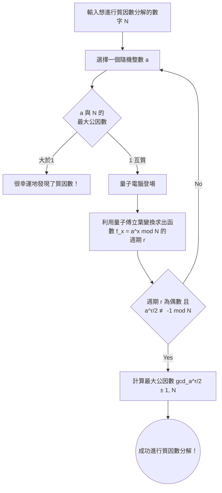

## 前言：密碼技術與量子電腦的交會點

在現代網路社會中，保護通訊機密的基礎是「公開金鑰加密」。其中最具代表性的，是1977年由Ron Rivest、Adi Shamir和Leonard Adleman三位所開發的「RSA加密」。從我們每天使用的線上購物支付、網站瀏覽（HTTPS）到郵件收發，RSA加密一直扮演著網際網路基礎設施心臟的角色。

然而，隨著「量子電腦」的出現，有人指出這種安全性可能會從根本上被顛覆。媒體上偶爾會出現「只要量子電腦完成，全世界的密碼和加密都會在幾秒鐘內被破解」這樣聳動的標題。究竟這是不是真的呢？

本文將深入探討傳統的密碼破解手法GNFS（普通數體篩法）以及使用量子電腦破解密碼的決定性演算法「Shor演算法（Shor's Algorithm）」的運作原理。我們將用淺顯易懂的方式解說量子傅立葉變換與尋找週期等進階概念，並詳細驗證目前在NISQ（Noisy Intermediate-Scale Quantum）時代量子硬體的現狀，以及實際要破解RSA-2048所需克服的障礙。

---

## RSA加密的根基：質因數分解的困難度

RSA加密的安全性取決於數學中極度簡單的不對稱性。那就是「將兩個巨大的質數相乘很簡單，但要從相乘的結果（合成數）中找出原本的兩個質數（進行質因數分解）卻極其困難」的事實。

舉例來說，假設有 $ p = 61 $、$ q = 53 $ 兩個質數。要計算這個乘法 $ N = p \times q = 3233 $ 只需要一瞬間。但是，如果只給你「3233」這個數字，要你解出「這是哪兩個質數相乘的結果？」，數字越大，計算量就會呈爆炸性增長。

在目前主流的RSA-2048中，使用了長度為2048位元，換算成十進位約為617位數的巨大合成數 $ N $。只要能將這個 $ N $ 進行質因數分解，加密就等同於被破解了。

### 傳統電腦的挑戰：GNFS（普通數體篩法）

為了從根本解決質因數分解問題，數學家和密碼學家長年來開發了各種演算法。其中，目前在傳統電腦上被認為最快的方法是 **普通數體篩法（GNFS: General Number Field Sieve）** 。

GNFS為了將巨大的數字 $ N $ 進行質因數分解，會將整數環的計算擴展到更抽象的代數體（Number Field）來進行解析。大致的流程如下：

1. **選擇多項式** ：尋找一個以 $ N $ 為根，且具有適當次數和係數的多項式 $ f(x) $。
2. **收集資料（篩選）** ：在有理數體及代數體上，尋找大量可以分解成小質數（平滑數，Smooth numbers）的數字對。這個過程被稱為「篩選」，也是最耗時的部分。
3. **矩陣生成與簡約** ：根據收集到的關係式生成巨大的稀疏矩陣（大部分元素為0的矩陣），並使用線性代數的手法（如區塊Lanczos法等）來求出解。
4. **計算平方根** ：最後在代數體上計算平方根，推導出 $ N $ 的因數（質因數）。

GNFS的計算量非漸近地被評估為 $ O(\exp((\sqrt[3]{\frac{64}{9}} + o(1)) (\log N)^{\frac{1}{3}} (\log \log N)^{\frac{2}{3}})) $。這被稱為「次指數時間（Sub-exponential）」的計算量。雖然比指數時間快，但比多項式時間（Polynomial time）要慢得多。

實際上，2020年有一個國際研究團隊使用GNFS成功將RSA-250（829位元，250位數的合成數）進行了質因數分解。這項計算動用了全世界的運算資源，耗費了約2700 CPU核心年的龐大計算時間。然而，如果是2048位元，所需的計算量據說會膨脹到宇宙壽命的數兆倍，無論讓現在的超級電腦如何平行運作，都無法在現實時間內用傳統手法破解。

---

## 量子電腦的王牌：Shor演算法

這時候登場的，是1994年由Peter Shor發表的「Shor演算法」。這個演算法劃時代地證明了質因數分解問題可以在量子電腦上以 **多項式時間** （ $ O((\log N)^3) $ ）被解開。次指數時間和多項式時間的差距是決定性的，這意味著在理論上，只要使用量子電腦，RSA加密就會被徹底破壞。

### Shor演算法的整體流程

Shor演算法並非直接解開質因數分解的問題，而是運用數論定理將其轉換為另一個問題——「尋找週期問題（Period Finding Problem）」，並利用量子電腦的特性來高速解開它。

### 步驟1：從質因數分解轉換為尋找週期問題（傳統處理）

演算法的第一個步驟在傳統電腦上進行。
針對想要進行質因數分解的數字 $ N $，選擇一個與 $ N $ 互質（最大公因數為1）的隨機整數 $ a $（ $ 1 < a < N $ ）。如果剛好最大公因數不是1，那麼當時發現的公因數就是 $ N $ 的質因數，破解也就完成了，但這個機率極低。

接著，我們考慮以下的同餘方程式列：
$ f(x) = a^x \pmod N $

若將 $ x = 1, 2, 3, \dots $ 代入這個函數 $ f(x) $ 中，數值看起來似乎是隨機的，但因為是在有限範圍內計算，所以必定會在某個地方回到原來的值，重複同樣的數列。我們將這個重複的週期稱為 $ r $。也就是說，
要找到符合 $ a^r \equiv 1 \pmod N $ 的最小正整數 $ r $ 的問題，這就是「尋找週期問題」。

如果能找到這個週期 $ r $，且 $ r $ 為偶數，則 $ a^r - 1 \equiv 0 \pmod N $，利用因式分解的公式可以變形成為
$ (a^{r/2} - 1)(a^{r/2} + 1) \equiv 0 \pmod N $。
從這裡，利用歐幾里得演算法計算 $ N $ 和 $ a^{r/2} \pm 1 $ 的最大公因數，就有極高的機率能得到 $ N $ 的質因數。

為了用傳統電腦找到週期 $ r $，說到底還是需要指數級的步驟，無法加速。但是，量子電腦卻能在一瞬間（以多項式時間）找到這個週期 $ r $。

### 步驟2：準備量子狀態並使其疊加

從這裡開始就是量子電腦發揮作用的地方了。
量子電腦使用的是能同時擁有「0」和「1」狀態的「量子位元（Qubit）」。在Shor演算法中，我們準備了兩個暫存器：一個用來儲存輸入（第一暫存器），另一個用來儲存計算結果（第二暫存器）。

首先，我們將被稱為阿達瑪閘（Hadamard gate）的量子閘操作應用到第一暫存器的所有量子位元上。藉此，第一暫存器會處於所有可能的 $ x $ 值（從 $ 0 $ 到 $ 2^n-1 $。$ n $ 是一個夠大的位元數）的 **均勻疊加狀態** 。

換句話說，在量子電腦的內部，創造出了一個同時並存著 $ x=0, 1, 2, 3, \dots $ 等無數輸入值的狀態。

### 步驟3：量子模冪運算（Quantum Modular Exponentiation）

接著，以第一暫存器的疊加狀態為輸入，計算 $ f(x) = a^x \pmod N $，並將結果儲存到第二暫存器中。
由於這項計算是作為量子電路上的么正變換（Unitary transformation）來執行的，所以在保持疊加的狀態下，會「同時平行地（量子平行性）」進行對所有 $ x $ 的 $ f(x) $ 計算。

此時，整個量子系統的空間處於
$ |x, a^x \bmod N\rangle $
這種狀態的龐大疊加。

然而，如果在這裡單純地去測量（觀測）第二暫存器，就會隨機且機率性地選出一個 $ a^x \bmod N $ 的值，第一暫存器的 $ x $ 也會連帶地確定為單一一個值。這樣一來，就和用傳統電腦計算一次沒什麼兩樣，無法找到週期 $ r $。

在量子力學的規則下，我們無法直接窺視疊加狀態的內容。那麼，我們該如何萃取出整體的「週期」這項全域資訊呢？

### 步驟4：量子傅立葉變換（QFT: Quantum Fourier Transform）

突破這道難關，正是Shor演算法的精髓所在，也就是對第一暫存器應用 **量子傅立葉變換（QFT）** 。

在進行測量之前，我們先分析函數 $ f(x) $ 的波動性質。假設我們觀測了第二暫存器，並得到某個值 $ y $。於是，第一暫存器的狀態會坍縮為「能讓 $ a^x \pmod N = y $ 成立的所有 $ x $ 的疊加」。
這個 $ x $ 的值會呈現 $ x_0, x_0 + r, x_0 + 2r, x_0 + 3r, \dots $ 這種以週期 $ r $ 為間隔離散排列的狀態（一種梳狀的機率振幅分佈）。

我們對這個狀態應用量子傅立葉變換（QFT）。就像傳統的離散傅立葉變換將時間域的訊號轉換到頻率域一樣，QFT會讓量子狀態的機率振幅產生干涉。

套用QFT後，藉由量子干涉效應，不與週期 $ r $ 產生共鳴（相位不一致）的錯誤答案，其機率會互相抵消而趨近於零（破壞性干涉），只有帶有週期 $ r $ 資訊的正確答案，其機率會被放大（建設性干涉）。

### 步驟5：測量與連分數展開（傳統後處理）

應用QFT後，若是測量第一暫存器，會有極高的機率得到一個接近 $ c \approx \frac{j \cdot 2^n}{r} $ 形式的整數 $ c $（ $ j $ 為未知整數，$ 2^n $ 為暫存器的大小）。

將這個測量結果 $ c $ 送回傳統電腦，製造出 $ \frac{c}{2^n} \approx \frac{j}{r} $ 這個分數。然後，利用被稱為「連分數展開（Continued fraction expansion）」的數學方法來計算近似值，就能漂亮地找出作為分母的週期 $ r $。

只要知道了 $ r $，接下來就能利用步驟1的公式計算出 $ N $ 的質因數，RSA加密也就被完全破解了。

---

## 現今量子電腦（NISQ）的實力與課題

雖然在理論上是完美的Shor演算法，但如果被問到「明天RSA加密就會被破解嗎？」，答案明確是「不會」。其原因在於目前量子電腦硬體技術的限制。

### NISQ（Noisy Intermediate-Scale Quantum）時代

我們現在所處的是被稱為「NISQ」的時代。NISQ設備雖然擁有數十到數百個實體量子位元，但對雜訊卻極為脆弱。

量子位元很容易受到熱或電磁波等外部環境的影響，導致量子狀態被破壞的「去相干（decoherence，失去量子糾纏）」或是操作量子閘時的「閘錯誤」頻繁發生。如果試圖執行像Shor演算法這樣非常深（運算步驟數極度龐大）的量子電路，錯誤就會在計算過程中不斷累積，最終的輸出結果將變成毫無意義的純雜訊。

### 實體量子位元與邏輯量子位元

為了解決這個錯誤問題，不可或缺的就是「量子錯誤更正（Quantum Error Correction）」。
雖然傳統電腦也有使用錯誤更正碼，但因為有禁止複製量子狀態的「量子不可複製定理」，使得量子錯誤更正變得非常複雜。

在量子錯誤更正中，會使用「表面碼（Surface Code）」等技術，將許多充滿雜訊的「實體量子位元」組合起來，創造出一個沒有錯誤的完美「邏輯量子位元」。

以目前的錯誤率為前提，據估算要製造出1個邏輯量子位元，大約需要1,000到10,000個實體量子位元。這被稱為「錯誤更正的經常性負擔（overhead）」。

### 破壞RSA-2048需要多少資源？

那麼，為了解碼RSA-2048而實際去跑Shor演算法，究竟需要多少資源呢？

根據Craig Gidney（Google）和Martin Ekerå在2021年發表的論文中劃時代的資源估算，若使用最佳化過的Shor演算法並利用表面碼進行錯誤更正，將需要以下資源：

* **邏輯量子位元數** ：約 4,096 個
* **實體量子位元數** ： **約 2000萬個** （假設錯誤率在 $10^{-3}$ 左右）
* **計算時間** ：約 8小時（需要數百萬到數十億次的實體閘操作）

相對應地，目前量子硬體的發展階段又是如何呢？
IBM在2023年底發表的超導量子處理器「Condor」為 1,121 個量子位元。此外，雖然也有關於生成邏輯量子位元的突破性研究發表（例如哈佛大學和QuEra公司等利用中性原子量子電腦成功生成了48個邏輯量子位元），但目前仍未達到能長時間連續執行「無雜訊完美運算」的階段。

從數千個實體量子位元擴展到 **2000萬個** 實用的實體量子位元（並且必須相互連接、在極低溫下穩定運作、還能以超高速處理控制訊號的系統），在工程上存在著難以跨越的障礙（配線問題、冷卻能力的極限、控制電子設備的肥大化）。許多專家預測，要實現能破解RSA-2048的「容錯量子電腦（FTQC）」，至少還需要10年到30年，甚至更長的時間。

---

## 悄悄逼近的「Store Now, Decrypt Later」威脅與PQC的黎明

如果認為「還要等10年以上，所以可以放心」，那就太早下定論了。目前存在著許多必須確保未來數十年機密性的資料，例如國家機密資訊、醫療資料以及長期的基礎設施設計等。

這裡令人擔憂的是被稱為 **「Store Now, Decrypt Later（現在儲存，稍後解碼）」** 的攻擊手法。充滿惡意的國家或組織會攔截目前用RSA或ECC（橢圓曲線密碼學）加密的所有通訊資料，並儲存到硬碟裡。然後在10年、20年後，當強大的量子電腦完成的瞬間，利用Shor演算法解開過去所有的資料並將機密曝光。

為了對抗這種時間差帶來的威脅，以NIST（美國國家標準暨技術研究院）為中心，正急起直追地推動 **「後量子密碼學（PQC: Post-Quantum Cryptography）」** 的標準化流程。

PQC是一種基於即使用量子電腦也難以解開（也就是無法應用Shor演算法）的數學問題所建立的新型加密演算法。主要的方法有以下幾種：

* **晶格密碼學（Lattice-based cryptography）** ：以LWE（Learning with Errors）問題等為基礎。在NIST的標準化中為主流（Kyber、Dilithium等）。
* **編碼型密碼學（Code-based cryptography）** ：取決於解碼錯誤更正碼問題的困難度。
* **多變量多項式密碼學（Multivariate cryptography）** ：取決於解開多變數聯立二次方程式的困難度。
* **雜湊型數位簽章（Hash-based signatures）** ：僅依賴於雜湊函數安全性的數位簽章。

目前，包括Google Chrome和Apple的iMessage等主要軟體和平台，都已經開始進行PQC的導入測試和混合實作了。

## 結語

量子電腦正從科幻世界的夢想，轉變為現實工程上的挑戰。Shor演算法是數學與量子力學融合的人類偉大智慧結晶，但同時也蘊含著動搖我們數位社會基礎的「破壞性力量」。

RSA加密並不會明天馬上就無法使用。然而，考量到量子技術的進化以及「Store Now, Decrypt Later」的風險，轉向PQC這場將在密碼史留下紀錄的大規模轉移，已經悄悄開始了。我們現在正目睹資訊安全典範轉移的最前線。
