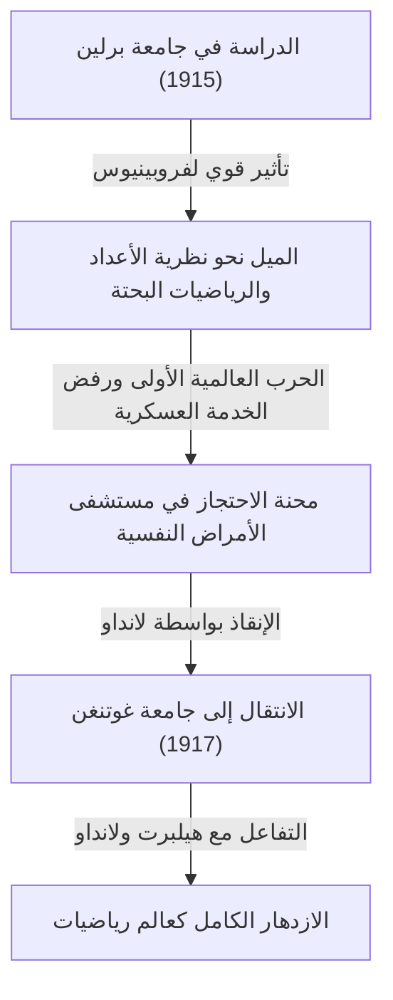

## 1. مقدمة: من هو [كارل لودفيغ سيغل](https://kenji.blog/p/siegel/)؟

كان [كارل لودفيغ سيغل](https://kenji.blog/p/siegel/) (31 ديسمبر 1896 - 4 أبريل 1981) أحد أبرز علماء الرياضيات الألمان في القرن العشرين، حيث ترك إرثًا هائلاً في عالم الرياضيات. تركزت أبحاثه بشكل أساسي على نظرية الأعداد (النظرية التحليلية والجبرية للأعداد)، المعادلات الديوفانتية، التقريبات الديوفانتية، والميكانيكا السماوية (الأنظمة الديناميكية المعقدة). ولا تزال إنجازاته تحتل مكانة بالغة الأهمية في الرياضيات الحديثة.

اشتهر سيغل ببراعته الحسابية المذهلة، وبصيرته العميقة، وقدرته على التعامل ببراعة مع التقنيات التحليلية المعقدة. وفي مشهد رياضي في القرن العشرين يتجه بسرعة نحو التجريد والبديهيات، كان يقدّر قبل كل شيء حل المشكلات الملموسة وتحسين الأساليب الكلاسيكية، محافظًا على أسلوب مستقل بشراسة. كما اشتهر بانتقاده الشديد للتجريد المفرط الذي روجت له مجموعة الرياضيات الفرنسية "بورباكي". يتعمق هذا المقال في إنجازاته الرياضية الاستثنائية جنبًا إلى جنب مع حلقات من حياته المضطربة.

## 2. حياة سيغل: عالم رياضيات في أوقات مضطربة

### 2.1 الحياة المبكرة والصحوة الأكاديمية

ولد سيغل عام 1896 في برلين، الإمبراطورية الألمانية. أظهر موهبة استثنائية في الرياضيات والعلوم منذ صغره، ودخل جامعة هومبولت في برلين (جامعة برلين) في عام 1915. هناك، كان من حسن حظه أن يتعلم من بعض أعظم علماء ذلك العصر، بمن فيهم الفيزيائي ماكس بلانك وأستاذ الجبر ونظرية الزمر، فرديناند جورج فروبينيوس. في البداية، كان سيغل مهتمًا أيضًا بعلم الفلك والفيزياء، لكن محاضرات فروبينيوس العاطفية أثارت اهتمامًا عميقًا لديه بنظرية الأعداد، مما أصبح الحافز الحاسم له لمتابعة مسار في الرياضيات.

ومع ذلك، أجبر اندلاع الحرب العالمية الأولى على الانقطاع عن دراسته. في عام 1917، تم تجنيد سيغل في الخدمة العسكرية، لكنه رفض الخدمة بسبب مشاعره القوية المناهضة للحرب وقناعاته الشخصية. في ذلك الوقت، كان رفض الخدمة العسكرية جريمة خطيرة في ألمانيا، وتحمل المحنة القاسية المتمثلة في احتجازه في مستشفى للأمراض النفسية. تم إنقاذه من هذا الوضع اليائس من قبل عالم الرياضيات البارز إدموند لانداو. بعد تحريره بفضل جهود لانداو، انتقل سيغل إلى جامعة غوتنغن في عام 1917. كانت غوتنغن حينها مكة العالمية للرياضيات، وموطنًا لعمالقة مثل [ديفيد هيلبرت](https://kenji.blog/p/hilbert/) وفيليكس كلاين. في هذه البيئة، ازدهر سيغل وترك مواهبه تتفتح حقًا.

### 2.2 حقبة فرانكفورت وصعود النازيين

بعد حصوله على درجة الدكتوراه من جامعة غوتنغن في عام 1920 تحت إشراف لانداو، كتب سيغل أوراقًا بحثية مهمة حول التقريبات الديوفانتية. في عام 1922، وفي سن مبكرة، عُين أستاذًا متفرغًا في جامعة فرانكفورت، حيث قضى السنوات الـ 16 التالية. كانت حقبة فرانكفورت واحدة من أكثر الفترات إنتاجية وتألقًا في مسيرته البحثية، حيث نشر خلالها العديد من الأوراق البحثية الرائدة. هناك أيضًا عمّق صداقاته وانخرط في تبادل أكاديمي حيوي مع العديد من علماء الرياضيات الممتازين، مثل هيرمان فايل وبول إبشتاين.

ومع ذلك، مع بداية الثلاثينيات، صعد النازيون (حزب العمال القومي الاشتراكي الألماني) إلى السلطة في ألمانيا، مما أدى إلى وضع مأساوي حيث تم طرد الزملاء اليهود بشكل منهجي من المناصب العامة. على الرغم من أن سيغل نفسه لم يكن يهوديًا، فقد كان يحمل اشمئزازًا قويًا ومعارضة للسياسات النازية المعادية للسامية والفاشية، واستمر علنًا في حماية أصدقائه وزملائه اليهود المضطهدين. رفض بشدة أن يصبح أداة أكاديمية للنازيين وسعى جاهداً للدفاع عن الحرية الأكاديمية دون الانحناء للضغوط السياسية.

### 2.3 المنفى وحياة البحث في الولايات المتحدة

نظرًا لتدهور بيئة البحث والحياة في ألمانيا في ظل النظام النازي بشكل جذري، ومع تعرض سلامته الشخصية للخطر، اتخذ سيغل أخيرًا قرار مغادرة وطنه. في عام 1940، بعد وقت قصير من اندلاع الحرب العالمية الثانية، تمكن من الهروب إلى الولايات المتحدة عبر طريق خطير عبر الدنمارك والنرويج.

في الولايات المتحدة، تم الترحيب به في معهد الدراسات المتقدمة (IAS) في برينستون، نيو جيرسي. في ذلك الوقت، كان معهد الدراسات المتقدمة قد أصبح ملاذًا لأعظم العقول الفارة من الحرب في أوروبا، وتمتع سيغل بحياة بحثية مرضية جنبًا إلى جنب مع شخصيات مثل ألبرت أينشتاين، جون فون نيومان، وهيرمان فايل. خلال سنواته في أمريكا، امتدت أبحاث سيغل إلى ما هو أبعد من نظرية الأعداد؛ فقد أنتج تباعًا نتائج في غاية الأهمية في مجالات الميكانيكا السماوية ونظرية الدوال التحليلية.

### 2.4 العودة إلى غوتنغن والسنوات الأخيرة

بعد نهاية الحرب العالمية الثانية، اختار سيغل عدم الإقامة بشكل دائم في الولايات المتحدة، متخذًا القرار المهم بالعودة إلى وطنه، ألمانيا، في عام 1951. عاد كأستاذ إلى جامعة غوتنغن، حيث درس ذات يوم، وكرس نفسه لإعادة بناء مجتمع الرياضيات الألماني الذي دمرته الحرب. واصل أنشطته البحثية القوية ودرب العديد من الخلفاء البارزين. كانت محاضراته صارمة وواضحة، مما أكسبه احترامًا عميقًا من طلابه.

في عام 1978، تقديرًا لإنجازاته الاستثنائية مدى الحياة، حصل بالاشتراك مع إسرائيل غيلفاند على أول جائزة وولف في الرياضيات، وهي واحدة من أعلى درجات التكريم في عالم الرياضيات. في 4 أبريل 1981، توفي [كارل لودفيغ سيغل](https://kenji.blog/p/siegel/) في غوتنغن، مختتمًا حياته الحافلة بالأحداث التي استمرت 84 عامًا.

## 3. إنجازات رياضية عظيمة

تتنوع إنجازات سيغل الرياضية بشكل مذهل، إلا أنه ترك نتائج حاسمة في كل مجال. وتتمثل السمة الكبرى لأبحاثه في استخدامه لتقنيات تحليلية معقدة ومبتكرة للغاية لاشتقاق نتائج عميقة وملموسة في نظرية الأعداد. وفيما يلي شرح مفصل لبعض أشهر إنجازاته.

### 3.1 المعادلات الديوفانتية ومبرهنة سيغل

لقد خلدت ورقته البحثية عام 1929 "حول النقاط الصحيحة للمنحنيات الجبرية" اسمه وفتحت الباب أمام المجال الجديد للهندسة الديوفانتية. تُعرف هذه المبرهنة اليوم باسم **مبرهنة سيغل** (مبرهنة سيغل حول النقاط الصحيحة).

هذه المبرهنة هي تأكيد قوي وجميل للغاية ينص على أن "المنحنى الجبري $C$ ذو الجنس $g \ge 1$ يحتوي فقط على عدد محدود من النقاط الصحيحة". وبشكل أكثر صرامة، بالنسبة لحقل أعداد جبرية $K$ وحلقة الأعداد الصحيحة الخاصة به $\mathcal{O}_K$، يتم التعبير عنها على النحو التالي:

$$
\text{إذا كان } g(C) \ge 1 \text{، فإن } |C(\mathcal{O}_K)| < \infty
$$

على سبيل المثال، في حين أنه قد يكون هناك عدد لا نهائي من الحلول الحقيقية أو النسبية لمنحنى إهليلجي (الجنس $g=1$) مثل $x^3 + y^3 = c$ (حيث $c$ عدد صحيح غير صفري)، تضمن هذه المبرهنة أنه إذا اقتصرنا على **الحلول الصحيحة**، فسيكون هناك دائمًا عدد محدود فقط.

كانت هذه النتيجة رائدة فيما يتعلق بمحدودية حلول المعادلات الديوفانتية وأصبحت خطوة تاريخية حاسمة مهدت الطريق للإثبات اللاحق لمبرهنة مورديل-فايل (محدودية النقاط النسبية على المنحنيات ذات الجنس 2 أو أعلى) من قبل جيرد فالتينغز. استنتج سيغل هذه النتيجة المذهلة من خلال توسيع مبرهنة أكسل ثو حول التقريبات الديوفانتية بشكل كبير ودمجها مع نظرية اليعقوبيات على المتنوعات الأبيلية.

### 3.2 صفر سيغل

في النظرية التحليلية للأعداد، يعتبر توزيع أصفار دالة L لدركليه $L(s, \chi)$ في غاية الأهمية للامتدادات الطبيعية لمبرهنة الأعداد الأولية والمبرهنة حول المتتاليات الحسابية. وفقًا لفرضية ريمان المعممة (GRH)، يفترض أن تقع جميع الأصفار في الشريط الحرج مع جزء حقيقي بين $0$ و $1$ على الخط حيث يكون الجزء الحقيقي $1/2$.

ومع ذلك، بالنسبة لطابع حقيقي (لحقل تربيعي حقيقي) $\chi$، فإن احتمال وجود صفر حقيقي مع جزء حقيقي قريب جدًا من $1$ لم تستبعده الرياضيات الحالية. يُطلق على مثل هذا الصفر المضاد الافتراضي اسم **صفر سيغل** (Siegel zero) أو الصفر الاستثنائي.

في عام 1935، قدم سيغل تقييمًا قويًا للحد الأعلى (حد أدنى للمسافة من $1$) لموقع هذا الصفر المشؤوم، حتى لو كان موجودًا. على وجه التحديد، أثبت أنه لأي $\epsilon > 0$، يوجد ثابت $C(\epsilon) > 0$ بحيث بالنسبة للمعامل $q$ لطابع حقيقي $\chi$، فإن قيمة الدالة عند $s=1$ تلبي ما يلي:

$$
L(1, \chi) > C(\epsilon) q^{-\epsilon}
$$

أصبح هذا التقييم أداة لا غنى عنها لاستنتاج نتائج عميقة تتعلق بمسألة رقم الصنف (خاصة تحديد الحالات التي يكون فيها رقم الصنف لحقل تربيعي تخيلي هو $1$) وتوزيع الأعداد الأولية في المتتاليات الحسابية. ومع ذلك، فإن هذه المبرهنة لها سمة رئيسية: الثابت $C(\epsilon)$ يتميز بكونه "غير فعال" (ineffective). هذا يعني أنه في حين أن المبرهنة تضمن وجود الثابت، فإنها لا توفر طريقة لاشتقاق قيمته العددية المحددة. يعد عدم الفعالية هذا أحد أعظم الألغاز الحديثة في النظرية التحليلية للأعداد، ويواصل العديد من علماء الرياضيات البحث بهدف إثبات عدم الوجود (أو إيجاد حد قابل للحساب) لصفر سيغل.

### 3.3 النماذج المعيارية لسيغل والأشكال التربيعية

أسس سيغل نظرية الأشكال التلقائية متعددة المتغيرات، وخاصة النظرية المعروفة اليوم باسم **النماذج المعيارية لسيغل**. كان هذا امتدادًا جريئًا وطبيعيًا للنماذج المعيارية الإهليلجية ذات المتغير الواحد، التي خضعت للدراسة منذ القرن التاسع عشر، لتشمل إطار نظرية الدوال متعددة المتغيرات.

يتم تعريف نصف الفضاء العلوي لسيغل $\mathcal{H}_g$ على النحو التالي:

$$
\mathcal{H}_g = \left\{ Z \in M_g(\mathbb{C}) \mid Z^T = Z, \text{ Im}(Z) \text{ محدد موجب} \right\}
$$

هنا، عندما $g=1$، يتطابق هذا الفضاء تمامًا مع نصف المستوى العلوي المعتاد لبوانكاريه. قدم سيغل هذا الفضاء عالي الأبعاد أثناء عملية تعميق النظرية التحليلية للأشكال التربيعية، وأظهر أن الأشكال التلقائية المحددة في هذا الفضاء مرتبطة بعمق بعدد تمثيلات الأعداد الصحيحة بواسطة الأشكال التربيعية.

علاوة على ذلك، أرسى الأساس لـ **صيغة سيغل-فايل** ضمن النظرية التحليلية للأشكال التربيعية. هذه صيغة رائعة تصف عدد التمثيلات بالأشكال التربيعية مثل معاملات فورييه لسلسلة آيزنشتاين، ويمكن القول إنها تعبير تحليلي للمبدأ المحلي-العالمي (مبدأ هاس). هذه النظريات هي مفاهيم لا غنى عنها تشكل الأساس لنظرية التمثيلات التلقائية اللاحقة وبرنامج لانغلاندز.

### 3.4 توطئة سيغل ونظرية التسامي

في مجال نظرية الأعداد المتسامية أيضًا، أثبت مبرهنة قوية للغاية تسمى **توطئة سيغل** (Siegel's lemma). في حين أن هذه التوطئة قد تبدو للوهلة الأولى مجرد نتيجة أولية للجبر الخطي، إلا أن نطاق تطبيقها لا يقاس.

يقول تأكيد المبرهنة ما يلي: "في نظام المعادلات الخطية المتزامنة حيث تكون المعاملات أعدادًا صحيحة، إذا كان عدد المجاهيل $N$ أكبر بما يكفي من عدد المعادلات $M$ ( $N > M$ )، فإنه يوجد دائمًا حل صحيح غير تافه حيث تكون القيمة المطلقة لكل مكون صغيرة نسبيًا (يحدها من الأعلى بشكل مناسب وفقًا لحجم المعاملات)."

تتمتع هذه التوطئة بإثبات أنيق باستخدام مبدأ برج الحمام (مبدأ صندوق دركليه)، وتُستخدم كثيرًا كأداة أساسية لا غنى عنها في نظرية التسامي الحديثة، كما هو الحال في بناء الأعداد المتسامية، والتقريبات الديوفانتية، وفي وقت لاحق في نظرية [آلان بيكر](https://kenji.blog/p/baker/) للنماذج الخطية في اللوغاريتمات.

### 3.5 الميكانيكا السماوية ومسألة القواسم الصغيرة

لم يقتصر سيغل على الرياضيات البحتة؛ بل كان شغوفًا بشكل غير عادي بالميكانيكا السماوية، وخاصة مسألة الأجسام الثلاثة، التي تصف حركة أنظمة متعددة الأجسام. طور دراسة الأنظمة الديناميكية التي رائدها [هنري بوانكاريه](https://kenji.blog/p/poincare/) وترك نتائج رائدة فيما يتعلق باستقرار حلول المعادلات التفاضلية.

في عام 1941، أثبت "مبرهنة مركز سيغل" في الميكانيكا التحليلية والأنظمة الديناميكية المعقدة. وقد أدى هذا إلى حل مسألة متى تكون الدالة الهولومورفية قابلة للتخطيط في محيط النقطة الثابتة الخاصة بها في المستوى المركب. في مفكوك تايلور للدالة، إذا كانت $\lambda$ تمثل قيمة المشتق، فعندما تأخذ $\lambda$ قيمة قريبة من جذر الوحدة، تظهر قيم صغيرة جدًا في المقام، مما يتسبب في تباعد السلسلة - وهي ظاهرة تُعرف باسم "مسألة القاسم الصغير" (small divisor problem).

باستخدام تقنيات متقدمة من التقريب الديوفانتي، أثبت سيغل بدقة أنه إذا استوفت $\lambda$ نوعًا معينًا من شروط اللاعقلانية (شرط ديوفانتي)، فسيتم تجنب التباعد الناتج عن المقامات الصغيرة، وتتقارب السلسلة، مما يجعلها قابلة للتخطيط تحليليًا.

$$
\left| \lambda^n - 1 \right| > \frac{C}{n^\nu} \quad (\forall n \ge 1)
$$

كانت هذه النتيجة أول مثال ناجح على التغلب ببراعة على مشكلة القواسم الصغيرة في الأنظمة الديناميكية، وهي إنجاز تاريخي وحاسم كان بمثابة سلف مباشر لـ **نظرية KAM** (مبرهنة KAM) التي طورها لاحقًا أندريه كولموغوروف، وفلاديمير أرنولد، ويورغن موزر.

## 4. فلسفة سيغل الفريدة ورؤيته للرياضيات

كانت رؤية سيغل للرياضيات ملفتة للنظر بقدر الإنجازات التي تركها وراءه، وكانت في بعض الأحيان موضوعًا للجدل. كان مقتنعًا بأن الرياضيات يجب أن ترتبط دائمًا ارتباطًا وثيقًا بمشاكل ملموسة، وأن الدفع نحو تجريد غير ضروري يسلب الرياضيات حيويتها الأصلية.

في منتصف القرن العشرين، كان الأسلوب المجرد الذي دافعت عنه مجموعة الرياضيات الفرنسية الشابة، مجموعة بورباكي - والتي حاولت إعادة بناء جميع الرياضيات من نظرية المجموعات والأنظمة البديهية - يجتاح العالم. ومع ذلك، وجه سيغل انتقادات شديدة لهذا الاتجاه. ووصف أسلوب بورباكي بأنه "شكلية فارغة" وترك ملاحظات بالمعنى التالي:

> "لقد انحدر التجريد المفرط للرياضيات الحديثة إلى شكلية فارغة ولا ينتج عنه أي نتائج ذات مغزى. يجب أن نعود إلى مشاكل ملموسة غنية بالمحتوى الحقيقي، وهو نوع المشاكل التي تصدى لها غاوس وأويلر وريمان وياكوبي."

بسبب هذه القناعة القوية، من المفيد جدًا قراءة أوراقه البحثية؛ ومن ناحية أخرى، بالنسبة للقراء المعاصرين، تظهر العمليات الحسابية الطويلة والتقنية للغاية في كل مكان، وغالبًا ما تتطلب جهدًا هائلاً لفك تشفيرها. لم يتنازل قط طوال حياته عن فلسفته القائلة بأن "المفاهيم والأطر المجردة هي مجرد وسيلة واحدة لحل المشاكل الملموسة والصعبة". هذا الموقف المنعزل جعله شخصية مميزة بعض الشيء بين زملائه من علماء الرياضيات.

## 5. الخاتمة وإرث سيغل

من خلال موهبته التحليلية التي لا مثيل لها واحترامه العميق للرياضيات الكلاسيكية، ترك [كارل لودفيغ سيغل](https://kenji.blog/p/siegel/) إنجازات حاسمة ومهمة في نظرية الأعداد، والهندسة الديوفانتية، والميكانيكا السماوية.

أصبحت المفاهيم والمبرهنات العديدة التي تحمل اسمه، مثل صفر سيغل، ومبرهنة سيغل، والنماذج المعيارية لسيغل، وتوطئة سيغل، لغات مشتركة يستخدمها علماء الرياضيات المعاصرون يوميًا، وتعمل كأسس لا غنى عنها حتى في الأبحاث المتطورة الجارية.

تُظهر لنا حياته الصورة الحقيقية لعالم تمسك بقناعاته السياسية وموقفه الصادق تجاه الأوساط الأكاديمية، حتى في الأوقات الصعبة للحربين العالميتين. في مقاومته بمفرده لموجة التجريد المفرط، واكتشافه للحقائق العالمية والجميلة وسط الملموسية المعقدة، ستستمر رياضيات سيغل بلا شك في التألق ببراعة عبر الأجيال.
