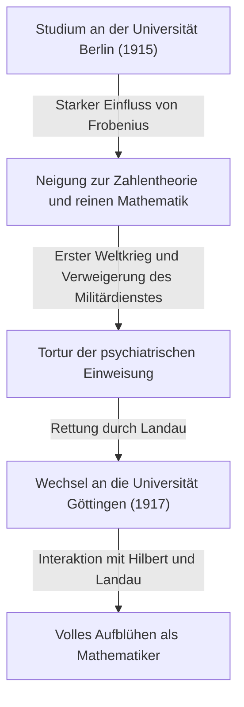

## 1. Einleitung: Wer ist [Carl Ludwig Siegel](https://kenji.blog/de/p/siegel/)?

[Carl Ludwig Siegel](https://kenji.blog/de/p/siegel/) (31. Dezember 1896 – 4. April 1981) war einer der herausragendsten deutschen Mathematiker des 20. Jahrhunderts und hinterließ ein gewaltiges Vermächtnis in der mathematischen Welt. Seine Forschung konzentrierte sich hauptsächlich auf die Zahlentheorie (analytische und algebraische Zahlentheorie), diophantische Gleichungen, diophantische Approximationen und die Himmelsmechanik (komplexe dynamische Systeme). Seine Errungenschaften nehmen auch in der modernen Mathematik weiterhin eine äußerst wichtige Stellung ein.

Siegel war bekannt für seine erstaunliche Rechenleistung, seine tiefe Einsicht und seine Fähigkeit, komplexe analytische Techniken meisterhaft zu handhaben. In einer mathematischen Landschaft des 20. Jahrhunderts, die sich rasch in Richtung Abstraktion und Axiomatisierung bewegte, legte er vor allem Wert auf konkretes Problemlösen und die Verfeinerung klassischer Methoden und bewahrte sich einen entschieden unabhängigen Stil. Er ist auch berühmt für seine starke Kritik an der extremen Abstraktion, die von der französischen Mathematikergruppe Bourbaki gefördert wurde. Dieser Artikel befasst sich eingehend mit seinen außergewöhnlichen mathematischen Leistungen neben Episoden aus seinem turbulenten Leben.

## 2. Siegels Leben: Ein Mathematiker in turbulenten Zeiten

### 2.1 Frühes Leben und akademisches Erwachen

Siegel wurde 1896 in Berlin im Deutschen Kaiserreich geboren. Schon früh zeigte er außergewöhnliches Talent in Mathematik und Naturwissenschaften und trat 1915 in die Humboldt-Universität zu Berlin (Berliner Universität) ein. Dort hatte er das Glück, bei einigen der größten Gelehrten dieser Zeit zu lernen, darunter der Physiker Max Planck und der Meister der Algebra und Gruppentheorie, Ferdinand Georg Frobenius. Zunächst interessierte sich Siegel auch für Astronomie und Physik, doch Frobenius' leidenschaftliche Vorlesungen weckten ein tiefes Interesse an der Zahlentheorie und wurden zum entscheidenden Auslöser für ihn, einen Weg in der Mathematik einzuschlagen.

Der Ausbruch des Ersten Weltkriegs erzwang jedoch eine Unterbrechung seines Studiums. 1917 wurde Siegel zum Militärdienst eingezogen, den er jedoch aufgrund seiner starken Antikriegsgesinnung und seiner persönlichen Überzeugung verweigerte. Damals war die Verweigerung des Militärdienstes in Deutschland ein schweres Verbrechen, und er musste die harte Tortur der Einweisung in eine psychiatrische Klinik ertragen. Aus dieser verzweifelten Situation wurde er durch den bedeutenden Mathematiker Edmund Landau gerettet. Durch Landaus Bemühungen befreit, wechselte Siegel 1917 an die Universität Göttingen. Göttingen war damals ein weltweites Mekka der Mathematik und die Heimat von Giganten wie [David Hilbert](https://kenji.blog/de/p/hilbert/) und Felix Klein. In diesem Umfeld florierte Siegel und ließ seine Talente wahrhaft aufblühen.

### 2.2 Die Frankfurter Ära und der Aufstieg der Nationalsozialisten

Nach seiner Promotion an der Universität Göttingen im Jahr 1920 unter Landaus Betreuung verfasste Siegel wichtige Arbeiten zu diophantischen Approximationen. 1922 wurde er in jungen Jahren zum ordentlichen Professor an der Universität Frankfurt ernannt, wo er die nächsten 16 Jahre verbringen sollte. Die Frankfurter Ära war eine der produktivsten und brillantesten Phasen seiner Forschungslaufbahn, in der er viele bahnbrechende Arbeiten veröffentlichte. Er vertiefte dort auch seine Freundschaften und führte einen lebhaften akademischen Austausch mit vielen hervorragenden Mathematikern wie Hermann Weyl und Paul Epstein.

Zu Beginn der 1930er Jahre kamen jedoch in Deutschland die Nationalsozialisten (NSDAP) an die Macht, was zu einer tragischen Situation führte, in der jüdische Kollegen systematisch aus dem öffentlichen Dienst entlassen wurden. Obwohl Siegel selbst nicht jüdisch war, hegte er eine starke Abneigung und Opposition gegen die antisemitische Politik der Nazis und den Faschismus und beschützte weiterhin offen seine verfolgten jüdischen Freunde und Kollegen. Er weigerte sich entschieden, ein akademisches Werkzeug der Nazis zu werden, und bemühte sich, die akademische Freiheit zu verteidigen, ohne sich politischem Druck zu beugen.

### 2.3 Exil und Forschungsleben in den Vereinigten Staaten

Da sich die Forschungs- und Lebensbedingungen in Deutschland unter dem Nazi-Regime drastisch verschlechterten und seine eigene persönliche Sicherheit gefährdet war, traf Siegel schließlich die Entscheidung, seine Heimat zu verlassen. Im Jahr 1940, kurz nach Ausbruch des Zweiten Weltkriegs, gelang ihm über eine gefährliche Route durch Dänemark und Norwegen die Flucht in die Vereinigten Staaten.

In den USA wurde er am Institute for Advanced Study (IAS) in Princeton, New Jersey, aufgenommen. Damals war das IAS zu einem Zufluchtsort für die größten Köpfe geworden, die vor dem Krieg in Europa flohen, und Siegel genoss ein erfülltes Forschungsleben an der Seite von Größen wie Albert Einstein, John von Neumann und Hermann Weyl. Während seiner Jahre in Amerika erstreckte sich Siegels Forschung über die Zahlentheorie hinaus; er erzielte nacheinander äußerst wichtige Ergebnisse in den Bereichen der Himmelsmechanik und der Theorie analytischer Funktionen.

### 2.4 Rückkehr nach Göttingen und späte Jahre

Nach dem Ende des Zweiten Weltkriegs entschied sich Siegel, nicht dauerhaft in den USA zu bleiben, und traf 1951 die wichtige Entscheidung, in seine Heimat Deutschland zurückzukehren. Er kehrte als Professor an die Universität Göttingen zurück, an der er einst studiert hatte, und widmete sich dem Wiederaufbau der deutschen Mathematikergemeinschaft, die durch den Krieg zerstört worden war. Er setzte seine energischen Forschungsaktivitäten fort und bildete viele herausragende Nachfolger aus. Seine Vorlesungen waren rigoros und klar, was ihm den tiefen Respekt seiner Studenten einbrachte.

In Anerkennung seiner außergewöhnlichen Lebensleistungen wurde ihm 1978 gemeinsam mit Israel Gelfand der erste Wolf-Preis für Mathematik verliehen, eine der höchsten Auszeichnungen der mathematischen Welt. Am 4. April 1981 verstarb [Carl Ludwig Siegel](https://kenji.blog/de/p/siegel/) in Göttingen und beendete damit sein ereignisreiches 84-jähriges Leben.

## 3. Große mathematische Errungenschaften

Siegels mathematische Errungenschaften sind erstaunlich vielfältig, doch hinterließ er in jedem Bereich entscheidende Ergebnisse. Das größte Merkmal seiner Forschung ist seine Verwendung hochkomplexer und genialer analytischer Techniken, um tiefe, konkrete Ergebnisse in der Zahlentheorie abzuleiten. Nachfolgend finden Sie eine detaillierte Erklärung einiger seiner berühmtesten Leistungen.

### 3.1 Diophantische Gleichungen und der Satz von Siegel

Seine Arbeit aus dem Jahr 1929 "Über einige Anwendungen diophantischer Approximationen" (insbesondere die ganzzahligen Punkte auf algebraischen Kurven) machte seinen Namen unsterblich und öffnete die Tür zum neuen Gebiet der diophantischen Geometrie. Dieser Satz ist heute als **Satz von Siegel** (Siegelscher Satz über ganzzahlige Punkte) bekannt.

Dieser Satz ist eine sehr mächtige und schöne Aussage, dass "eine algebraische Kurve $C$ vom Geschlecht $g \ge 1$ nur endlich viele ganzzahlige Punkte hat". Strenger formuliert, für einen algebraischen Zahlkörper $K$ und seinen Ganzheitsring $\mathcal{O}_K$ wird es wie folgt formuliert:

$$
\text{Wenn } g(C) \ge 1 \text{, dann } |C(\mathcal{O}_K)| < \infty
$$

Während es beispielsweise unendlich viele reelle oder rationale Lösungen für eine elliptische Kurve (Geschlecht $g=1$) wie $x^3 + y^3 = c$ (wobei $c$ eine von Null verschiedene ganze Zahl ist) geben kann, garantiert dieser Satz, dass es bei Beschränkung auf **ganzzahlige Lösungen** immer nur endlich viele geben wird.

Dieses Ergebnis war bahnbrechend hinsichtlich der Endlichkeit von Lösungen diophantischer Gleichungen und wurde zu einem entscheidenden historischen Schritt, der den Weg für den späteren Beweis des Satzes von Mordell-Weil (die Endlichkeit rationaler Punkte auf Kurven des Geschlechts 2 oder höher) durch [Gerd Faltings](https://kenji.blog/de/p/faltings/) ebnete. Siegel leitete dieses erstaunliche Ergebnis ab, indem er Axel Thues Satz über diophantische Approximationen erheblich erweiterte und ihn mit der Theorie der [Jacobi](https://kenji.blog/de/p/jacobi/)varietäten über abelschen Varietäten kombinierte.

### 3.2 Siegel-Nullstelle

In der analytischen Zahlentheorie ist die Verteilung der Nullstellen der Dirichletschen $L$-Funktion $L(s, \chi)$ von extremer Bedeutung für natürliche Erweiterungen des Primzahlsatzes und des Satzes über arithmetische Progressionen. Gemäß der verallgemeinerten [Riemann](https://kenji.blog/de/p/riemann/)schen Vermutung (GRH) sollen alle Nullstellen im kritischen Streifen mit einem Realteil zwischen $0$ und $1$ auf der Geraden liegen, auf der der Realteil $1/2$ ist.

Für einen reellen Charakter (eines reell-quadratischen Zahlkörpers) $\chi$ wurde jedoch die Möglichkeit, dass eine reelle Nullstelle mit einem Realteil sehr nahe bei $1$ existiert, durch die aktuelle Mathematik nicht ausgeschlossen. Eine solche hypothetische Gegenbeispiel-Nullstelle wird als **Siegel-Nullstelle** (Siegel zero) oder Ausnahme-Nullstelle bezeichnet.

Im Jahr 1935 lieferte Siegel eine starke obere Schranke (eine untere Schranke für den Abstand zu $1$) für die Position dieser ominösen Nullstelle, selbst wenn sie existieren sollte. Konkret bewies er, dass für jedes $\epsilon > 0$ eine Konstante $C(\epsilon) > 0$ existiert, sodass für den Modul $q$ eines reellen Charakters $\chi$ der Wert der Funktion bei $s=1$ Folgendes erfüllt:

$$
L(1, \chi) > C(\epsilon) q^{-\epsilon}
$$

Diese Abschätzung ist zu einem unverzichtbaren Werkzeug geworden, um tiefe Ergebnisse bezüglich des Klassenzahlproblems (insbesondere der Bestimmung der Fälle, in denen die Klassenzahl eines imaginär-quadratischen Körpers $1$ ist) und der Verteilung von Primzahlen in arithmetischen Progressionen abzuleiten. Dieser Satz hat jedoch eine große Besonderheit: Die Konstante $C(\epsilon)$ hat die Eigenschaft, "ineffektiv" (ineffective) zu sein. Das bedeutet, dass der Satz zwar die Existenz der Konstante garantiert, aber keine Methode zur Ableitung ihres spezifischen numerischen Wertes liefert. Diese Ineffektivität ist eines der größten modernen Rätsel in der analytischen Zahlentheorie, und viele Mathematiker forschen weiterhin mit dem Ziel, die Nichtexistenz (oder das Finden einer berechenbaren Schranke) der Siegel-Nullstelle zu beweisen.

### 3.3 Siegelsche Modulformen und quadratische Formen

Siegel begründete die Theorie der multivariablen automorphen Formen, insbesondere die Theorie, die heute als **Siegelsche Modulformen** bekannt ist. Dies war eine kühne und natürliche Erweiterung der seit dem 19. Jahrhundert untersuchten elliptischen Modulformen einer Variablen auf den Rahmen der multivariablen Funktionentheorie.

Der Siegelsche Halbraum $\mathcal{H}_g$ ist wie folgt definiert:

$$
\mathcal{H}_g = \left\{ Z \in M_g(\mathbb{C}) \mid Z^T = Z, \text{ Im}(Z) \text{ ist positiv definit} \right\}
$$

Hierbei stimmt dieser Raum für $g=1$ perfekt mit der üblichen [Poincaré](https://kenji.blog/de/p/poincare/)schen Halbebene überein. Siegel führte diesen höherdimensionalen Raum im Zuge der Vertiefung der analytischen Theorie quadratischer Formen ein und zeigte, dass auf diesem Raum definierte automorphe Formen tief mit der Anzahl der Darstellungen ganzer Zahlen durch quadratische Formen verbunden sind.

Darüber hinaus legte er den Grundstein für die **Siegel-Weil-Formel** innerhalb der analytischen Theorie quadratischer Formen. Dies ist eine wunderbare Formel, die die Anzahl der Darstellungen durch quadratische Formen als Fourier-Koeffizienten von Eisensteinreihen beschreibt, und sie kann als analytischer Ausdruck des Lokal-Global-Prinzips (Hasse-Prinzip) angesehen werden. Diese Theorien sind unverzichtbare Konzepte, die die Basis für die spätere Theorie der automorphen Darstellungen und das Langlands-Programm bilden.

### 3.4 Siegelsches Lemma und Transzendenztheorie

Auch auf dem Gebiet der transzendenten Zahlentheorie bewies er einen extrem starken Satz, das sogenannte **Siegelsche Lemma** (Siegel's lemma). Während dieses Lemma auf den ersten Blick wie ein bloßes elementares Ergebnis der linearen Algebra aussehen mag, ist sein Anwendungsbereich unermesslich.

Die Aussage des Satzes lautet wie folgt: "In einem System simultaner linearer Gleichungen, bei denen die Koeffizienten ganze Zahlen sind, existiert immer eine nichttriviale ganzzahlige Lösung, bei der der Absolutwert jeder Komponente relativ klein ist (entsprechend der Größe der Koeffizienten nach oben beschränkt), wenn die Anzahl der Unbekannten $N$ ausreichend größer ist als die Anzahl der Gleichungen $M$ ( $N > M$ )."

Mit einem eleganten Beweis unter Verwendung des Schubfachprinzips (Dirichletsches Boxprinzip) wird dieses Lemma häufig als unverzichtbares Grundwerkzeug in der modernen Transzendenztheorie verwendet, wie zum Beispiel bei der Konstruktion transzendenter Zahlen, diophantischen Approximationen und später in [Alan Baker](https://kenji.blog/de/p/baker/)s Theorie der Linearformen in Logarithmen.

### 3.5 Himmelsmechanik und das Problem der kleinen Nenner

Siegel beschränkte sich nicht auf die reine Mathematik; er brannte mit einer außergewöhnlichen Besessenheit für die Himmelsmechanik, insbesondere für das Dreikörperproblem, das die Bewegung von Vielteilchensystemen beschreibt. Er entwickelte das von [Henri Poincaré](https://kenji.blog/de/p/poincare/) pionierhaft begonnene Studium dynamischer Systeme weiter und hinterließ bahnbrechende Ergebnisse bezüglich der Stabilität von Lösungen von Differentialgleichungen.

1941 bewies er das "Siegelsche Zentrumstheorem" in der analytischen Mechanik und in komplexen dynamischen Systemen. Dies löste die Frage, wann eine holomorphe Funktion in der Umgebung ihres Fixpunktes in der komplexen Ebene linearisierbar ist. In der Taylor-Entwicklung der Funktion tauchen, wenn $\lambda$ den Wert der Ableitung darstellt und $\lambda$ einen Wert nahe einer Einheitswurzel annimmt, sehr kleine Werte im Nenner auf, was zur Divergenz der Reihe führt – ein Phänomen, das als das Problem der "kleinen Nenner" (small divisor problem) bekannt ist.

Mit fortgeschrittenen Techniken aus der diophantischen Approximation bewies Siegel streng, dass die durch kleine Nenner verursachte Divergenz vermieden wird und die Reihe konvergiert, wodurch sie analytisch linearisierbar wird, wenn $\lambda$ eine bestimmte Art von Irrationalitätsbedingung (eine diophantische Bedingung) erfüllt.

$$
\left| \lambda^n - 1 \right| > \frac{C}{n^\nu} \quad (\forall n \ge 1)
$$

Dieses Ergebnis war das erste erfolgreiche Beispiel für die brillante Überwindung des Problems der kleinen Nenner in dynamischen Systemen und ist eine entscheidende, historische Errungenschaft, die als direkter Vorläufer der **KAM-Theorie** (KAM-Theorem) diente, die später von Andrei Kolmogorow, Wladimir Arnold und Jürgen Moser entwickelt wurde.

## 4. Siegels einzigartige Philosophie und Sicht der Mathematik

Siegels Sicht auf die Mathematik war ebenso bemerkenswert wie die Errungenschaften, die er hinterließ, und zeitweise war sie Gegenstand von Kontroversen. Er war davon überzeugt, dass die Mathematik immer eng mit konkreten Problemen verbunden sein sollte und dass das Drängen auf unnötige Abstraktion der Mathematik ihre ursprüngliche Vitalität raubte.

Mitte des 20. Jahrhunderts überschwemmte ein abstrakter Stil, der vom jungen französischen Mathematiker-Kollektiv, der Bourbaki-Gruppe, verfochten wurde – die versuchte, die gesamte Mathematik aus der Mengenlehre und axiomatischen Systemen neu aufzubauen – die Welt. Siegel übte jedoch scharfe Kritik an diesem Trend. Er tat den Bourbaki-Stil als "leeren Formalismus" ab und hinterließ Bemerkungen mit folgendem Tenor:

> "Die exzessive Abstraktion der neueren Mathematik ist in einen leeren Formalismus verfallen und liefert keine bedeutsamen Ergebnisse. Wir sollten zu konkreten, an wahrem Inhalt reichen Problemen zurückkehren, wie sie Gauß, Euler, [Riemann](https://kenji.blog/de/p/riemann/) und [Jacobi](https://kenji.blog/de/p/jacobi/) in Angriff genommen haben."

Aufgrund dieser starken Überzeugung ist das Lesen seiner Arbeiten sehr lohnend; andererseits tauchen für moderne Leser überall hochtechnische und langwierige Berechnungen auf, die oft immense Anstrengungen erfordern, um sie zu entschlüsseln. Er ging sein Leben lang keine Kompromisse bei seiner Philosophie ein, dass "abstrakte Konzepte und Rahmenwerke lediglich ein Mittel sind, um konkrete, schwierige Probleme zu lösen". Diese distanzierte Haltung machte ihn zu einer etwas eigenwilligen Figur unter seinen zeitgenössischen Mathematikern.

## 5. Fazit und Siegels Vermächtnis

Durch sein beispielloses analytisches Talent und seine tiefe Ehrfurcht vor der klassischen Mathematik hinterließ [Carl Ludwig Siegel](https://kenji.blog/de/p/siegel/) entscheidende, epochemachende Errungenschaften in der Zahlentheorie, der diophantischen Geometrie und der Himmelsmechanik.

Die zahlreichen Konzepte und Sätze, die seinen Namen tragen, wie die Siegel-Nullstelle, der Satz von Siegel, Siegelsche Modulformen und das Siegelsche Lemma, sind zu einer gemeinsamen Sprache geworden, die von modernen Mathematikern täglich verwendet wird, und dienen als unverzichtbare Grundlagen auch in der laufenden, hochmodernen Forschung.

Sein Leben zeigt uns das wahre Gesicht eines Gelehrten, der selbst in den schwierigen Zeiten zweier Weltkriege an seinen politischen Überzeugungen und seiner aufrichtigen Haltung zur Wissenschaft festhielt. Indem er der Welle der exzessiven Abstraktion allein widerstand und universelle, schöne Wahrheiten inmitten komplexer Konkretheit entdeckte, wird seine Mathematik zweifellos weiterhin über Generationen hinweg hell erstrahlen.
