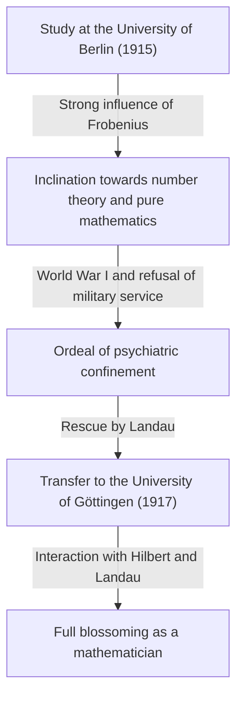

## 1. Introduction: Who is [Carl Ludwig Siegel](https://kenji.blog/en/p/siegel/)?

[Carl Ludwig Siegel](https://kenji.blog/en/p/siegel/) (December 31, 1896 – April 4, 1981) was one of the most outstanding German mathematicians of the 20th century, leaving a massive legacy in the mathematical world. His research primarily focused on number theory (analytic and algebraic number theory), Diophantine equations, Diophantine approximations, and celestial mechanics (complex dynamical systems). His achievements continue to occupy a highly crucial position in modern mathematics.

Siegel was renowned for his astonishing computational prowess, deep insight, and ability to masterfully handle complex analytic techniques. In a 20th-century mathematical landscape rapidly moving toward abstraction and axiomatization, he valued concrete problem-solving and the refinement of classical methods above all else, maintaining a fiercely independent style. He is also famous for his strong criticism of the extreme abstraction promoted by the French mathematical group Bourbaki. This article delves deeply into his extraordinary mathematical achievements alongside episodes from his turbulent life.

## 2. Siegel's Life: A Mathematician in Tumultuous Times

### 2.1 Early Life and Academic Awakening

Siegel was born in 1896 in Berlin, German Empire. Displaying exceptional talent in mathematics and science from a young age, he entered Humboldt University of Berlin (University of Berlin) in 1915. There, he had the good fortune to learn from some of the greatest scholars of the era, including the physicist Max Planck and the master of algebra and group theory, Ferdinand Georg Frobenius. Initially, Siegel was also interested in astronomy and physics, but Frobenius's passionate lectures sparked a profound interest in number theory, becoming the decisive catalyst for him to pursue a path in mathematics.

However, the outbreak of World War I forced an interruption to his studies. In 1917, Siegel was drafted into military service, but he refused to serve due to his strong anti-war sentiments and personal convictions. At the time, refusing military service was a severe crime in Germany, and he endured the harsh ordeal of being confined to a psychiatric hospital. He was rescued from this desperate situation by the eminent mathematician Edmund Landau. Freed through Landau's efforts, Siegel transferred to the University of Göttingen in 1917. Göttingen was then a global mecca for mathematics, home to giants like [David Hilbert](https://kenji.blog/en/p/hilbert/) and Felix Klein. In this environment, Siegel flourished and let his talents truly blossom.

### 2.2 The Frankfurt Era and the Rise of the Nazis

After obtaining his doctorate from the University of Göttingen in 1920 under Landau's supervision, Siegel wrote important papers on Diophantine approximations. In 1922, at a young age, he was appointed as a full professor at the University of Frankfurt, where he would spend the next 16 years. The Frankfurt era was one of the most productive and brilliant periods of his research career, during which he published many groundbreaking papers. He also deepened his friendships and engaged in lively academic exchange with many excellent mathematicians there, such as Hermann Weyl and Paul Epstein.

However, as the 1930s began, the Nazis (National Socialist German Workers' Party) rose to power in Germany, leading to a tragic situation where Jewish colleagues were systematically expelled from public office. Although Siegel himself was not Jewish, he held a strong revulsion and opposition to Nazi anti-Semitic policies and fascism, openly continuing to protect his persecuted Jewish friends and colleagues. He firmly refused to become an academic tool for the Nazis and strove to defend academic freedom without bowing to political pressure.

### 2.3 Exile and Research Life in the United States

As the research and living environment in Germany under the Nazi regime deteriorated drastically, and with his own personal safety at risk, Siegel finally made the decision to leave his homeland. In 1940, shortly after the outbreak of World War II, he managed to escape to the United States via a dangerous route through Denmark and Norway.

In the United States, he was welcomed at the Institute for Advanced Study (IAS) in Princeton, New Jersey. At the time, the IAS had become a sanctuary for the greatest minds fleeing the war in Europe, and Siegel enjoyed a fulfilling research life alongside the likes of Albert Einstein, John von Neumann, and Hermann Weyl. During his American years, Siegel's research extended beyond number theory; he successively produced extremely important results in the fields of celestial mechanics and analytic function theory.

### 2.4 Return to Göttingen and Later Years

After the end of World War II, Siegel chose not to reside permanently in the United States, making the important decision to return to his homeland, Germany, in 1951. He returned as a professor at the University of Göttingen, where he had once studied, and dedicated himself to rebuilding the German mathematical community, which had been devastated by the war. He continued his vigorous research activities and trained many outstanding successors. His lectures were rigorous and lucid, earning him the deep respect of his students.

In 1978, in recognition of his extraordinary lifetime achievements, he was jointly awarded the first Wolf Prize in Mathematics, one of the highest honors in the mathematical world, along with Israel Gelfand. On April 4, 1981, [Carl Ludwig Siegel](https://kenji.blog/en/p/siegel/) passed away in Göttingen, closing his eventful 84-year life.

## 3. Great Mathematical Achievements

Siegel's mathematical achievements are astonishingly diverse, yet he left decisive results in each field. The greatest characteristic of his research is his use of highly complex and ingenious analytic techniques to derive deep, concrete results in number theory. Below is a detailed explanation of some of his most famous accomplishments.

### 3.1 Diophantine Equations and Siegel's Theorem

His 1929 paper "On the integral points of algebraic curves" immortalized his name and opened the door to the new field of Diophantine geometry. This theorem is now known as **Siegel's theorem** (Siegel's theorem on integral points).

This theorem is a highly powerful and beautiful assertion that "an algebraic curve $C$ of genus $g \ge 1$ has only finitely many integral points." More strictly, for an algebraic number field $K$ and its ring of integers $\mathcal{O}_K$, it is stated as follows:

$$
\text{If } g(C) \ge 1 \text{, then } |C(\mathcal{O}_K)| < \infty
$$

For example, while there may be infinitely many real or rational solutions for an elliptic curve (genus $g=1$) like $x^3 + y^3 = c$ (where $c$ is a non-zero integer), this theorem guarantees that if restricted to **integral solutions**, there will always be only finitely many.

This result was groundbreaking regarding the finiteness of solutions to Diophantine equations and became a crucial historical step paving the way for the later proof of the Mordell-Weil theorem (the finiteness of rational points on curves of genus 2 or higher) by [Gerd Faltings](https://kenji.blog/en/p/faltings/). Siegel derived this astonishing result by significantly extending Axel Thue's theorem on Diophantine approximations and combining it with the theory of [Jacobi](https://kenji.blog/en/p/jacobi/)ans on [Abel](https://kenji.blog/en/p/abel/)ian varieties.

### 3.2 Siegel Zero

In analytic number theory, the distribution of zeros of Dirichlet's $L$-function $L(s, \chi)$ is extremely important for natural extensions of the prime number theorem and the theorem on arithmetic progressions. According to the Generalized [Riemann](https://kenji.blog/en/p/riemann/) Hypothesis (GRH), all zeros in the critical strip with a real part between $0$ and $1$ are supposed to lie on the line where the real part is $1/2$.

However, for a real character (of a real quadratic field) $\chi$, the possibility that there exists a real zero with a real part very close to $1$ has not been ruled out by current mathematics. Such a hypothetical counterexample zero is called a **Siegel zero** or an exceptional zero.

In 1935, Siegel provided a strong upper bound evaluation (a lower bound on the distance from $1$) for the position of this ominous zero, even if it did exist. Specifically, he proved that for any $\epsilon > 0$, there exists a constant $C(\epsilon) > 0$ such that for the modulus $q$ of a real character $\chi$, the value of the function at $s=1$ satisfies the following:

$$
L(1, \chi) > C(\epsilon) q^{-\epsilon}
$$

This evaluation has become an indispensable tool for deriving deep results concerning the class number problem (especially determining the cases where the class number of an imaginary quadratic field is $1$) and the distribution of primes in arithmetic progressions. However, this theorem has a major quirk: the constant $C(\epsilon)$ has the property of being "ineffective." This means that while the theorem guarantees the existence of the constant, it does not provide a method for deriving its specific numerical value. This ineffectiveness is one of the greatest modern mysteries in analytic number theory, and many mathematicians continue to research with the goal of proving the non-existence (or finding a computable bound) of the Siegel zero.

### 3.3 Siegel Modular Forms and Quadratic Forms

Siegel founded the theory of multivariate automorphic forms, particularly the theory known today as **Siegel modular forms**. This was a bold and natural extension of the single-variable elliptic modular forms, studied since the 19th century, into the framework of multivariate function theory.

The Siegel upper half-space $\mathcal{H}_g$ is defined as follows:

$$
\mathcal{H}_g = \left\{ Z \in M_g(\mathbb{C}) \mid Z^T = Z, \text{ Im}(Z) \text{ is positive definite} \right\}
$$

Here, when $g=1$, this space perfectly matches the usual [Poincaré](https://kenji.blog/en/p/poincare/) upper half-plane. Siegel introduced this higher-dimensional space during the process of deepening the analytic theory of quadratic forms, and he showed that automorphic forms defined on this space are deeply connected to the number of representations of integers by quadratic forms.

Furthermore, he laid the foundation for the **Siegel-Weil formula** within the analytic theory of quadratic forms. This is a marvelous formula that describes the number of representations by quadratic forms as the Fourier coefficients of Eisenstein series, and it can be said to be an analytic expression of the local-global principle (Hasse principle). These theories are indispensable concepts that form the basis for the later theory of automorphic representations and the Langlands program.

### 3.4 Siegel's Lemma and Transcendence Theory

In the field of transcendental number theory as well, he proved an extremely powerful theorem called **Siegel's lemma**. While at first glance this lemma may look like a mere elementary result of linear algebra, its range of application is immeasurable.

The assertion of the theorem is as follows: "In a system of simultaneous linear equations where the coefficients are integers, if the number of unknowns $N$ is sufficiently larger than the number of equations $M$ ( $N > M$ ), there always exists a non-trivial integer solution where the absolute value of each component is relatively small (appropriately bounded from above according to the size of the coefficients)."

Having an elegant proof using the pigeonhole principle (Dirichlet's box principle), this lemma is frequently used as an indispensable basic tool in modern transcendence theory, such as in the construction of transcendental numbers, Diophantine approximations, and later in [Alan Baker](https://kenji.blog/en/p/baker/)'s theory of linear forms in logarithms.

### 3.5 Celestial Mechanics and the Small Divisor Problem

Siegel did not limit himself to pure mathematics; he burned with an extraordinary obsession for celestial mechanics, especially the three-body problem, which describes the motion of many-body systems. He developed the study of dynamical systems pioneered by [Henri Poincaré](https://kenji.blog/en/p/poincare/) and left groundbreaking results regarding the stability of solutions to differential equations.

In 1941, he proved the "Siegel center theorem" in analytic mechanics and complex dynamical systems. This resolved the question of when a holomorphic function is linearizable in the neighborhood of its fixed point in the complex plane. In the Taylor expansion of the function, if $\lambda$ represents the value of the derivative, when $\lambda$ takes a value close to a root of unity, very small values appear in the denominator, causing the series to diverge—a phenomenon known as the "small divisor problem."

Using advanced techniques from Diophantine approximation, Siegel rigorously proved that if $\lambda$ satisfies a certain type of irrationality condition (a Diophantine condition), the divergence caused by small denominators is avoided, and the series converges, making it analytically linearizable.

$$
\left| \lambda^n - 1 \right| > \frac{C}{n^\nu} \quad (\forall n \ge 1)
$$

This result was the first successful example of brilliantly overcoming the small divisor problem in dynamical systems, and it is a decisive, historical achievement that served as a direct forerunner to the **KAM theory** (KAM theorem) later developed by Andrey Kolmogorov, Vladimir Arnold, and Jürgen Moser.

## 4. Siegel's Unique Philosophy and View of Mathematics

Siegel's view of mathematics was as striking as the achievements he left behind, and at times it was the subject of controversy. He was convinced that mathematics should always be closely tied to concrete problems, and that pushing for unnecessary abstraction robbed mathematics of its original vitality.

In the mid-20th century, an abstract style advocated by the young French mathematical collective, the Bourbaki group—which attempted to rebuild all of mathematics from set theory and axiomatic systems—was sweeping the globe. However, Siegel leveled severe criticism against this trend. He dismissed the Bourbaki style as "empty formalism" and left remarks to the following effect:

> "The excessive abstraction of recent mathematics has fallen into empty formalism and produces no meaningful results. We should return to concrete problems rich in true content, the kind that Gauss, Euler, [Riemann](https://kenji.blog/en/p/riemann/), and [Jacobi](https://kenji.blog/en/p/jacobi/) tackled."

Because of this strong conviction, his papers are very rewarding to read; on the other hand, for modern readers, highly technical and lengthy calculations appear everywhere, often requiring immense effort to decipher. He never compromised on his philosophy throughout his life that "abstract concepts and frameworks are merely one means to solve concrete, difficult problems." That aloof stance made him a somewhat distinct figure among his contemporary mathematicians.

## 5. Conclusion and Siegel's Legacy

Through his unparalleled analytical talent and deep reverence for classical mathematics, [Carl Ludwig Siegel](https://kenji.blog/en/p/siegel/) left decisive, epoch-making achievements in number theory, Diophantine geometry, and celestial mechanics.

The numerous concepts and theorems bearing his name, such as the Siegel zero, Siegel's theorem, Siegel modular forms, and Siegel's lemma, have become common languages used daily by modern mathematicians, serving as indispensable foundations even in ongoing, cutting-edge research.

His life shows us the true figure of a scholar who stuck to his political convictions and sincere attitude toward academia, even through the difficult times of two World Wars. Resisting the wave of excessive abstraction alone, and discovering universal, beautiful truths amidst complex concreteness, his mathematics will undoubtedly continue to shine brilliantly across generations.
