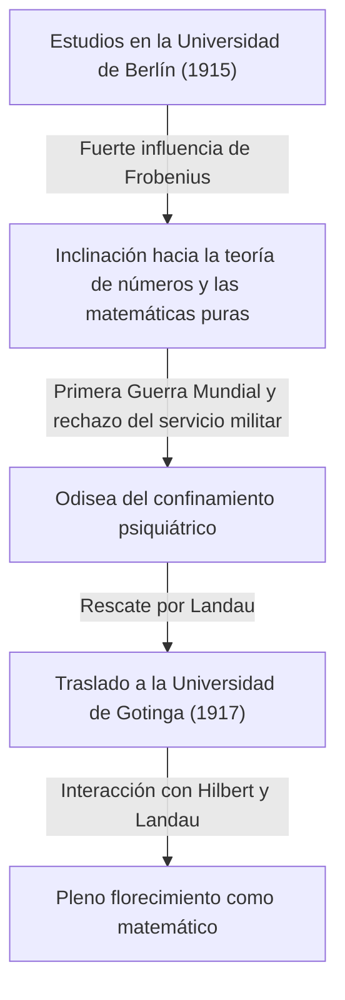

## 1. Introducción: ¿Quién es [Carl Ludwig Siegel](https://kenji.blog/es/p/siegel/)?

[Carl Ludwig Siegel](https://kenji.blog/es/p/siegel/) (31 de diciembre de 1896 – 4 de abril de 1981) fue uno de los matemáticos alemanes más destacados del siglo XX, dejando un legado masivo en el mundo matemático. Su investigación se centró principalmente en la teoría de números (teoría analítica y algebraica de números), ecuaciones diofánticas, aproximaciones diofánticas y mecánica celeste (sistemas dinámicos complejos). Sus logros continúan ocupando una posición extremadamente crucial en las matemáticas modernas.

Siegel era famoso por su asombrosa destreza computacional, su profunda perspicacia y su capacidad para manejar magistralmente técnicas analíticas complejas. En un panorama matemático del siglo XX que avanzaba rápidamente hacia la abstracción y la axiomatización, valoró por encima de todo la resolución de problemas concretos y el refinamiento de los métodos clásicos, manteniendo un estilo ferozmente independiente. También es famoso por su fuerte crítica a la abstracción extrema promovida por el grupo matemático francés Bourbaki. Este artículo profundiza en sus extraordinarios logros matemáticos junto con episodios de su turbulenta vida.

## 2. La vida de Siegel: Un matemático en tiempos turbulentos

### 2.1 Primeros años y despertar académico

Siegel nació en 1896 en Berlín, Imperio Alemán. Mostrando un talento excepcional en matemáticas y ciencias desde una edad temprana, ingresó a la Universidad Humboldt de Berlín (Universidad de Berlín) en 1915. Allí, tuvo la buena fortuna de aprender de algunos de los más grandes eruditos de la época, incluido el físico Max Planck y el maestro del álgebra y la teoría de grupos, Ferdinand Georg Frobenius. Inicialmente, Siegel también estaba interesado en la astronomía y la física, pero las apasionadas conferencias de Frobenius despertaron un profundo interés en la teoría de números, convirtiéndose en el catalizador decisivo para que él siguiera un camino en las matemáticas.

Sin embargo, el estallido de la Primera Guerra Mundial obligó a interrumpir sus estudios. En 1917, Siegel fue reclutado para el servicio militar, pero se negó a servir debido a sus fuertes sentimientos contra la guerra y sus convicciones personales. En ese momento, rechazar el servicio militar era un delito grave en Alemania, y soportó la dura prueba de ser confinado en un hospital psiquiátrico. Fue rescatado de esta situación desesperada por el eminente matemático Edmund Landau. Liberado gracias a los esfuerzos de Landau, Siegel se trasladó a la Universidad de Gotinga en 1917. Gotinga era entonces una meca mundial de las matemáticas, hogar de gigantes como [David Hilbert](https://kenji.blog/es/p/hilbert/) y Felix Klein. En este entorno, Siegel prosperó y dejó que sus talentos florecieran de verdad.

### 2.2 La era de Frankfurt y el ascenso de los nazis

Después de obtener su doctorado en la Universidad de Gotinga en 1920 bajo la supervisión de Landau, Siegel escribió importantes artículos sobre aproximaciones diofánticas. En 1922, a una edad temprana, fue nombrado profesor titular en la Universidad de Frankfurt, donde pasaría los siguientes 16 años. La era de Frankfurt fue uno de los períodos más productivos y brillantes de su carrera investigadora, durante el cual publicó muchos artículos innovadores. Allí también profundizó sus amistades y se involucró en un animado intercambio académico con muchos matemáticos excelentes, como Hermann Weyl y Paul Epstein.

Sin embargo, al comenzar la década de 1930, los nazis (Partido Nacionalsocialista Obrero Alemán) llegaron al poder en Alemania, lo que llevó a una trágica situación en la que los colegas judíos fueron expulsados sistemáticamente de los cargos públicos. Aunque el propio Siegel no era judío, sentía una fuerte repulsión y oposición hacia las políticas antisemitas nazis y el fascismo, continuando abiertamente con la protección de sus amigos y colegas judíos perseguidos. Se negó firmemente a convertirse en una herramienta académica para los nazis y se esforzó por defender la libertad académica sin doblegarse ante la presión política.

### 2.3 Exilio y vida de investigación en los Estados Unidos

Como el entorno de investigación y de vida en Alemania bajo el régimen nazi se deterioró drásticamente, y con su propia seguridad personal en riesgo, Siegel finalmente tomó la decisión de abandonar su tierra natal. En 1940, poco después del estallido de la Segunda Guerra Mundial, logró escapar a los Estados Unidos a través de una ruta peligrosa por Dinamarca y Noruega.

En los Estados Unidos, fue bienvenido en el Instituto de Estudios Avanzados (IAS) en Princeton, Nueva Jersey. En ese momento, el IAS se había convertido en un santuario para las mentes más brillantes que huían de la guerra en Europa, y Siegel disfrutó de una vida de investigación plena junto a figuras como Albert Einstein, John von Neumann y Hermann Weyl. Durante sus años en América, la investigación de Siegel se extendió más allá de la teoría de números; produjo sucesivamente resultados extremadamente importantes en los campos de la mecánica celeste y la teoría de funciones analíticas.

### 2.4 Regreso a Gotinga y últimos años

Tras el final de la Segunda Guerra Mundial, Siegel optó por no residir de forma permanente en los Estados Unidos, tomando la importante decisión de regresar a su tierra natal, Alemania, en 1951. Regresó como profesor a la Universidad de Gotinga, donde alguna vez había estudiado, y se dedicó a reconstruir la comunidad matemática alemana, que había sido devastada por la guerra. Continuó sus vigorosas actividades de investigación y formó a muchos sucesores destacados. Sus conferencias eran rigurosas y lúcidas, lo que le valió el profundo respeto de sus estudiantes.

En 1978, en reconocimiento a los extraordinarios logros de su vida, fue galardonado conjuntamente con el primer Premio Wolf de Matemáticas, uno de los más altos honores en el mundo matemático, junto con Israel Gelfand. El 4 de abril de 1981, [Carl Ludwig Siegel](https://kenji.blog/es/p/siegel/) falleció en Gotinga, cerrando su turbulenta vida de 84 años.

## 3. Grandes logros matemáticos

Los logros matemáticos de Siegel son asombrosamente diversos, pero dejó resultados decisivos en cada campo. La mayor característica de su investigación es el uso de técnicas analíticas altamente complejas e ingeniosas para derivar resultados profundos y concretos en la teoría de números. A continuación, se presenta una explicación detallada de algunos de sus logros más famosos.

### 3.1 Ecuaciones diofánticas y el teorema de Siegel

Su artículo de 1929 "Sobre los puntos enteros de curvas algebraicas" inmortalizó su nombre y abrió la puerta al nuevo campo de la geometría diofántica. Este teorema se conoce hoy como el **teorema de Siegel** (teorema de Siegel sobre puntos enteros).

Este teorema es una afirmación muy poderosa y hermosa de que "una curva algebraica $C$ de género $g \ge 1$ tiene solo un número finito de puntos enteros". Estrictamente, para un cuerpo de números algebraicos $K$ y su anillo de enteros $\mathcal{O}_K$, se enuncia de la siguiente manera:

$$
\text{Si } g(C) \ge 1 \text{, entonces } |C(\mathcal{O}_K)| < \infty
$$

Por ejemplo, si bien puede haber infinitas soluciones reales o racionales para una curva elíptica (género $g=1$) como $x^3 + y^3 = c$ (donde $c$ es un entero no nulo), este teorema garantiza que si se restringe a **soluciones enteras**, siempre habrá solo un número finito.

Este resultado fue innovador en cuanto a la finitud de las soluciones de las ecuaciones diofánticas y se convirtió en un paso histórico crucial que allanó el camino para la posterior demostración del teorema de Mordell-Weil (la finitud de los puntos racionales en curvas de género 2 o superior) por [Gerd Faltings](https://kenji.blog/es/p/faltings/). Siegel derivó este asombroso resultado ampliando significativamente el teorema de Axel Thue sobre aproximaciones diofánticas y combinándolo con la teoría de jacobianos sobre variedades abelianas.

### 3.2 Cero de Siegel

En la teoría analítica de números, la distribución de los ceros de la función $L$ de Dirichlet $L(s, \chi)$ es de extrema importancia para extensiones naturales del teorema de los números primos y el teorema sobre progresiones aritméticas. Según la Hipótesis Generalizada de [Riemann](https://kenji.blog/es/p/riemann/) (GRH), todos los ceros en la banda crítica con una parte real entre $0$ y $1$ deberían encontrarse en la recta donde la parte real es $1/2$.

Sin embargo, para un carácter real (de un cuerpo cuadrático real) $\chi$, las matemáticas actuales no han descartado la posibilidad de que exista un cero real con una parte real muy cercana a $1$. A tal hipotético cero contraejemplo se le llama un **cero de Siegel** (Siegel zero) o cero excepcional.

En 1935, Siegel proporcionó una fuerte evaluación del límite superior (un límite inferior en la distancia a $1$) para la posición de este siniestro cero, incluso si existiera. Específicamente, demostró que para cualquier $\epsilon > 0$, existe una constante $C(\epsilon) > 0$ tal que para el módulo $q$ de un carácter real $\chi$, el valor de la función en $s=1$ satisface lo siguiente:

$$
L(1, \chi) > C(\epsilon) q^{-\epsilon}
$$

Esta evaluación se ha convertido en una herramienta indispensable para derivar resultados profundos relacionados con el problema del número de clases (especialmente para determinar los casos donde el número de clases de un cuerpo cuadrático imaginario es $1$) y la distribución de los números primos en progresiones aritméticas. Sin embargo, este teorema tiene una peculiaridad importante: la constante $C(\epsilon)$ tiene la propiedad de ser "inefectiva". Esto significa que si bien el teorema garantiza la existencia de la constante, no proporciona un método para derivar su valor numérico específico. Esta inefectividad es uno de los mayores misterios modernos en la teoría analítica de números, y muchos matemáticos continúan investigando con el objetivo de probar la no existencia (o encontrar un límite computable) del cero de Siegel.

### 3.3 Formas modulares de Siegel y formas cuadráticas

Siegel fundó la teoría de las formas automorfas multivariables, en particular la teoría conocida hoy como **formas modulares de Siegel**. Esta fue una extensión audaz y natural de las formas modulares elípticas de una variable, estudiadas desde el siglo XIX, hacia el marco de la teoría de funciones multivariables.

El semiespacio superior de Siegel $\mathcal{H}_g$ se define de la siguiente manera:

$$
\mathcal{H}_g = \left\{ Z \in M_g(\mathbb{C}) \mid Z^T = Z, \text{ Im}(Z) \text{ es definida positiva} \right\}
$$

Aquí, cuando $g=1$, este espacio coincide perfectamente con el semiplano superior de [Poincaré](https://kenji.blog/es/p/poincare/) habitual. Siegel introdujo este espacio de dimensiones superiores durante el proceso de profundizar en la teoría analítica de las formas cuadráticas, y demostró que las formas automorfas definidas en este espacio están profundamente conectadas con el número de representaciones de los enteros mediante formas cuadráticas.

Además, sentó las bases de la **fórmula de Siegel-Weil** dentro de la teoría analítica de las formas cuadráticas. Se trata de una fórmula maravillosa que describe el número de representaciones por formas cuadráticas como los coeficientes de Fourier de las series de Eisenstein, y se puede decir que es una expresión analítica del principio local-global (principio de Hasse). Estas teorías son conceptos indispensables que forman la base de la teoría posterior de representaciones automorfas y el programa de Langlands.

### 3.4 Lema de Siegel y teoría de la trascendencia

También en el campo de la teoría de números trascendentes, demostró un teorema extremadamente poderoso llamado el **lema de Siegel** (Siegel's lemma). Aunque a primera vista este lema puede parecer un mero resultado elemental del álgebra lineal, su rango de aplicación es inconmensurable.

La afirmación del teorema es la siguiente: "En un sistema de ecuaciones lineales simultáneas donde los coeficientes son enteros, si el número de incógnitas $N$ es suficientemente mayor que el número de ecuaciones $M$ ( $N > M$ ), siempre existe una solución entera no trivial donde el valor absoluto de cada componente es relativamente pequeño (acotado superiormente de forma adecuada según el tamaño de los coeficientes)."

Con una demostración elegante que utiliza el principio del palomar (principio de las cajas de Dirichlet), este lema se utiliza con frecuencia como una herramienta básica indispensable en la teoría moderna de la trascendencia, como en la construcción de números trascendentes, aproximaciones diofánticas y, más tarde, en la teoría de [Alan Baker](https://kenji.blog/es/p/baker/) de formas lineales de logaritmos.

### 3.5 Mecánica celeste y el problema de los divisores pequeños

Siegel no se limitó a las matemáticas puras; ardía con una obsesión extraordinaria por la mecánica celeste, en especial por el problema de los tres cuerpos, que describe el movimiento de los sistemas de muchos cuerpos. Desarrolló el estudio de los sistemas dinámicos impulsado por [Henri Poincaré](https://kenji.blog/es/p/poincare/) y dejó resultados innovadores sobre la estabilidad de las soluciones de ecuaciones diferenciales.

En 1941, demostró el "teorema del centro de Siegel" en mecánica analítica y sistemas dinámicos complejos. Esto resolvió la cuestión de cuándo una función holomorfa es linealizable en la vecindad de su punto fijo en el plano complejo. En el desarrollo de Taylor de la función, si $\lambda$ representa el valor de la derivada, cuando $\lambda$ toma un valor cercano a una raíz de la unidad, aparecen valores muy pequeños en el denominador, provocando que la serie diverja: un fenómeno conocido como el "problema de los divisores pequeños" (small divisor problem).

Utilizando técnicas avanzadas de aproximación diofántica, Siegel demostró rigurosamente que si $\lambda$ satisface un cierto tipo de condición de irracionalidad (una condición diofántica), se evita la divergencia causada por los denominadores pequeños y la serie converge, haciéndola analíticamente linealizable.

$$
\left| \lambda^n - 1 \right| > \frac{C}{n^\nu} \quad (\forall n \ge 1)
$$

Este resultado fue el primer ejemplo exitoso de superación brillante del problema de los divisores pequeños en sistemas dinámicos, y es un logro decisivo e histórico que sirvió como precursor directo de la **teoría KAM** (teorema KAM) desarrollada más tarde por Andréi Kolmogórov, Vladímir Arnold y Jürgen Moser.

## 4. La filosofía única de Siegel y su visión de las matemáticas

La visión de Siegel de las matemáticas fue tan sorprendente como los logros que dejó atrás, y en ocasiones fue objeto de controversia. Estaba convencido de que las matemáticas siempre debían estar estrechamente ligadas a problemas concretos, y que impulsar una abstracción innecesaria robaba a las matemáticas de su vitalidad original.

A mediados del siglo XX, un estilo abstracto defendido por el joven colectivo matemático francés, el grupo Bourbaki —que intentaba reconstruir todas las matemáticas a partir de la teoría de conjuntos y los sistemas axiomáticos— estaba barriendo el mundo. Sin embargo, Siegel lanzó severas críticas contra esta tendencia. Desestimó el estilo Bourbaki como "formalismo vacío" y dejó comentarios del siguiente tenor:

> "La excesiva abstracción de las matemáticas recientes ha caído en un formalismo vacío y no produce resultados significativos. Debemos regresar a problemas concretos ricos en contenido real, el tipo de problemas que abordaron Gauss, Euler, [Riemann](https://kenji.blog/es/p/riemann/) y [Jacobi](https://kenji.blog/es/p/jacobi/)."

Debido a esta fuerte convicción, sus artículos son muy gratificantes de leer; por otro lado, para los lectores modernos, los cálculos larguísimos y altamente técnicos aparecen por todas partes, requiriendo a menudo un esfuerzo inmenso para descifrarlos. Nunca transigió a lo largo de su vida con su filosofía de que "los conceptos y marcos abstractos son solo un medio para resolver problemas concretos y difíciles". Esa postura distante lo convirtió en una figura un tanto peculiar entre sus matemáticos contemporáneos.

## 5. Conclusión y legado de Siegel

A través de su talento analítico sin igual y su profunda reverencia por las matemáticas clásicas, [Carl Ludwig Siegel](https://kenji.blog/es/p/siegel/) dejó logros decisivos y trascendentales en la teoría de números, la geometría diofántica y la mecánica celeste.

Los numerosos conceptos y teoremas que llevan su nombre, como el cero de Siegel, el teorema de Siegel, las formas modulares de Siegel y el lema de Siegel, se han convertido en lenguajes comunes utilizados a diario por los matemáticos modernos, sirviendo como bases indispensables incluso en las investigaciones de vanguardia en curso.

Su vida nos muestra la verdadera figura de un erudito que se aferró a sus convicciones políticas y a su actitud sincera hacia el mundo académico, incluso durante los tiempos difíciles de las dos Guerras Mundiales. Resistiendo en solitario a la ola de abstracción excesiva y descubriendo verdades universales y hermosas en medio de la complejidad concreta, sus matemáticas sin duda seguirán brillando intensamente a lo largo de las generaciones.
