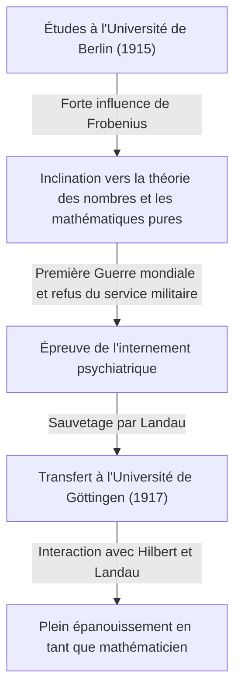

## 1. Introduction : Qui est [Carl Ludwig Siegel](https://kenji.blog/fr/p/siegel/) ?

[Carl Ludwig Siegel](https://kenji.blog/fr/p/siegel/) (31 décembre 1896 – 4 avril 1981) fut l'un des mathématiciens allemands les plus exceptionnels du 20e siècle, laissant un héritage colossal dans le monde mathématique. Ses recherches se sont principalement concentrées sur la théorie des nombres (théorie analytique et algébrique des nombres), les équations diophantiennes, les approximations diophantiennes et la mécanique céleste (systèmes dynamiques complexes). Ses réalisations continuent d'occuper une position extrêmement cruciale dans les mathématiques modernes.

Siegel était réputé pour ses prouesses de calcul étonnantes, sa perspicacité profonde et sa capacité à manier avec brio des techniques analytiques complexes. Dans un paysage mathématique du 20e siècle s'orientant rapidement vers l'abstraction et l'axiomatisation, il privilégiait par-dessus tout la résolution de problèmes concrets et le raffinement des méthodes classiques, conservant un style farouchement indépendant. Il est également célèbre pour sa forte critique de l'abstraction extrême promue par le groupe mathématique français Bourbaki. Cet article plonge au cœur de ses réalisations mathématiques extraordinaires, aux côtés d'épisodes de sa vie tumultueuse.

## 2. La vie de Siegel : Un mathématicien dans des temps tumultueux

### 2.1 Jeunesse et éveil académique

Siegel est né en 1896 à Berlin, dans l'Empire allemand. Faisant preuve d'un talent exceptionnel en mathématiques et en sciences dès son plus jeune âge, il est entré à l'Université Humboldt de Berlin (Université de Berlin) en 1915. Là, il eut la chance d'apprendre auprès de certains des plus grands érudits de l'époque, dont le physicien Max Planck et le maître de l'algèbre et de la théorie des groupes, Ferdinand Georg Frobenius. Initialement, Siegel s'intéressait également à l'astronomie et à la physique, mais les conférences passionnées de Frobenius ont suscité un profond intérêt pour la théorie des nombres, devenant le catalyseur décisif qui l'a poussé à poursuivre une voie en mathématiques.

Cependant, le déclenchement de la Première Guerre mondiale l'a contraint à interrompre ses études. En 1917, Siegel fut enrôlé pour le service militaire, mais il refusa de servir en raison de ses forts sentiments anti-guerre et de ses convictions personnelles. À l'époque, le refus du service militaire était un crime grave en Allemagne, et il a enduré la dure épreuve d'être confiné dans un hôpital psychiatrique. Il a été sauvé de cette situation désespérée par l'éminent mathématicien Edmund Landau. Libéré grâce aux efforts de Landau, Siegel a été transféré à l'Université de Göttingen en 1917. Göttingen était alors la Mecque mondiale des mathématiques, abritant des géants tels que [David Hilbert](https://kenji.blog/fr/p/hilbert/) et Felix Klein. Dans cet environnement, Siegel s'est épanoui et a laissé ses talents véritablement éclore.

### 2.2 L'ère de Francfort et la montée des nazis

Après avoir obtenu son doctorat de l'Université de Göttingen en 1920 sous la direction de Landau, Siegel a écrit d'importants articles sur les approximations diophantiennes. En 1922, à un jeune âge, il est nommé professeur titulaire à l'Université de Francfort, où il passera les 16 années suivantes. L'ère de Francfort a été l'une des périodes les plus productives et brillantes de sa carrière de chercheur, au cours de laquelle il a publié de nombreux articles novateurs. Il y a également approfondi ses amitiés et s'est engagé dans des échanges académiques animés avec de nombreux excellents mathématiciens, tels que Hermann Weyl et Paul Epstein.

Cependant, au début des années 1930, les nazis (Parti national-socialiste des travailleurs allemands) sont arrivés au pouvoir en Allemagne, conduisant à une situation tragique où des collègues juifs étaient systématiquement expulsés de la fonction publique. Bien que Siegel lui-même ne fût pas juif, il ressentait une forte répulsion et une forte opposition à l'égard de la politique antisémite nazie et du fascisme, continuant ouvertement à protéger ses amis et collègues juifs persécutés. Il refusa fermement de devenir un outil académique pour les nazis et s'efforça de défendre la liberté académique sans se plier aux pressions politiques.

### 2.3 Exil et vie de recherche aux États-Unis

L'environnement de recherche et de vie en Allemagne sous le régime nazi s'étant considérablement détérioré, et sa sécurité personnelle étant menacée, Siegel a finalement pris la décision de quitter son pays natal. En 1940, peu de temps après le déclenchement de la Seconde Guerre mondiale, il réussit à s'enfuir aux États-Unis en empruntant un itinéraire dangereux passant par le Danemark et la Norvège.

Aux États-Unis, il est accueilli à l'Institute for Advanced Study (IAS) de Princeton, dans le New Jersey. À l'époque, l'IAS était devenu un sanctuaire pour les plus grands esprits fuyant la guerre en Europe, et Siegel a profité d'une vie de recherche épanouissante aux côtés de figures telles qu'Albert Einstein, John von Neumann et Hermann Weyl. Au cours de ses années américaines, les recherches de Siegel se sont étendues au-delà de la théorie des nombres ; il a successivement produit des résultats extrêmement importants dans les domaines de la mécanique céleste et de la théorie des fonctions analytiques.

### 2.4 Retour à Göttingen et dernières années

Après la fin de la Seconde Guerre mondiale, Siegel a choisi de ne pas résider de façon permanente aux États-Unis, prenant la décision importante de retourner dans son pays natal, l'Allemagne, en 1951. Il est revenu en tant que professeur à l'Université de Göttingen, où il avait autrefois étudié, et s'est consacré à la reconstruction de la communauté mathématique allemande, dévastée par la guerre. Il a poursuivi ses vigoureuses activités de recherche et a formé de nombreux successeurs exceptionnels. Ses cours étaient rigoureux et lucides, ce qui lui a valu le profond respect de ses étudiants.

En 1978, en reconnaissance des réalisations extraordinaires de toute une vie, il a reçu conjointement le premier prix Wolf de mathématiques, l'une des plus hautes distinctions du monde mathématique, avec Israel Gelfand. Le 4 avril 1981, [Carl Ludwig Siegel](https://kenji.blog/fr/p/siegel/) s'est éteint à Göttingen, clôturant sa vie mouvementée de 84 ans.

## 3. Grandes réalisations mathématiques

Les réalisations mathématiques de Siegel sont d'une diversité étonnante, et il a laissé des résultats décisifs dans chaque domaine. La plus grande caractéristique de ses recherches est son utilisation de techniques analytiques hautement complexes et ingénieuses pour dériver des résultats profonds et concrets en théorie des nombres. Vous trouverez ci-dessous une explication détaillée de certaines de ses réalisations les plus célèbres.

### 3.1 Équations diophantiennes et le théorème de Siegel

Son article de 1929 "Sur les points entiers des courbes algébriques" a immortalisé son nom et a ouvert la porte au nouveau domaine de la géométrie diophantienne. Ce théorème est aujourd'hui connu sous le nom de **théorème de Siegel** (théorème de Siegel sur les points entiers).

Ce théorème est une assertion très puissante et magnifique selon laquelle "une courbe algébrique $C$ de genre $g \ge 1$ n'a qu'un nombre fini de points entiers". Plus strictement, pour un corps de nombres algébriques $K$ et son anneau d'entiers $\mathcal{O}_K$, cela s'énonce comme suit :

$$
\text{Si } g(C) \ge 1 \text{, alors } |C(\mathcal{O}_K)| < \infty
$$

Par exemple, alors qu'il peut y avoir une infinité de solutions réelles ou rationnelles pour une courbe elliptique (genre $g=1$) comme $x^3 + y^3 = c$ (où $c$ est un entier non nul), ce théorème garantit que si on se limite aux **solutions entières**, il y en aura toujours seulement un nombre fini.

Ce résultat a été révolutionnaire concernant la finitude des solutions des équations diophantiennes et est devenu une étape historique cruciale ouvrant la voie à la preuve ultérieure du théorème de Mordell-Weil (la finitude des points rationnels sur les courbes de genre 2 ou plus) par [Gerd Faltings](https://kenji.blog/fr/p/faltings/). Siegel a dérivé ce résultat étonnant en étendant considérablement le théorème d'Axel Thue sur les approximations diophantiennes et en le combinant avec la théorie des jacobiennes sur les variétés abéliennes.

### 3.2 Zéro de Siegel

En théorie analytique des nombres, la distribution des zéros de la fonction $L$ de Dirichlet $L(s, \chi)$ est extrêmement importante pour les extensions naturelles du théorème des nombres premiers et du théorème sur les progressions arithmétiques. Selon l'hypothèse de [Riemann](https://kenji.blog/fr/p/riemann/) généralisée (GRH), tous les zéros de la bande critique dont la partie réelle est comprise entre $0$ et $1$ sont censés se trouver sur la droite où la partie réelle est de $1/2$.

Cependant, pour un caractère réel (d'un corps quadratique réel) $\chi$, la possibilité qu'il existe un zéro réel avec une partie réelle très proche de $1$ n'a pas été exclue par les mathématiques actuelles. Un tel zéro contre-exemple hypothétique est appelé un **zéro de Siegel** (Siegel zero) ou zéro exceptionnel.

En 1935, Siegel a fourni une évaluation forte de la borne supérieure (une borne inférieure sur la distance à $1$) pour la position de ce zéro inquiétant, même s'il devait exister. Plus précisément, il a prouvé que pour tout $\epsilon > 0$, il existe une constante $C(\epsilon) > 0$ telle que pour le module $q$ d'un caractère réel $\chi$, la valeur de la fonction en $s=1$ satisfait ce qui suit :

$$
L(1, \chi) > C(\epsilon) q^{-\epsilon}
$$

Cette évaluation est devenue un outil indispensable pour déduire des résultats profonds concernant le problème du nombre de classes (notamment pour déterminer les cas où le nombre de classes d'un corps quadratique imaginaire est $1$) et la distribution des nombres premiers dans les progressions arithmétiques. Cependant, ce théorème a une grande particularité : la constante $C(\epsilon)$ a la propriété d'être "ineffective". Cela signifie que si le théorème garantit l'existence de la constante, il ne fournit pas de méthode pour dériver sa valeur numérique spécifique. Cette inefficacité est l'un des plus grands mystères modernes de la théorie analytique des nombres, et de nombreux mathématiciens continuent à faire des recherches dans le but de prouver la non-existence (ou de trouver une borne calculable) du zéro de Siegel.

### 3.3 Formes modulaires de Siegel et formes quadratiques

Siegel a fondé la théorie des formes automorphes multivariables, en particulier la théorie connue aujourd'hui sous le nom de **formes modulaires de Siegel**. C'était une extension audacieuse et naturelle des formes modulaires elliptiques à une variable, étudiées depuis le 19e siècle, dans le cadre de la théorie des fonctions multivariables.

Le demi-espace supérieur de Siegel $\mathcal{H}_g$ est défini comme suit :

$$
\mathcal{H}_g = \left\{ Z \in M_g(\mathbb{C}) \mid Z^T = Z, \text{ Im}(Z) \text{ est définie positive} \right\}
$$

Ici, lorsque $g=1$, cet espace correspond parfaitement au demi-plan supérieur de [Poincaré](https://kenji.blog/fr/p/poincare/) habituel. Siegel a introduit cet espace de dimension supérieure au cours du processus d'approfondissement de la théorie analytique des formes quadratiques, et il a montré que les formes automorphes définies sur cet espace sont profondément liées au nombre de représentations des entiers par des formes quadratiques.

De plus, il a jeté les bases de la **formule de Siegel-Weil** dans la théorie analytique des formes quadratiques. C'est une formule merveilleuse qui décrit le nombre de représentations par des formes quadratiques comme les coefficients de Fourier des séries d'Eisenstein, et on peut dire que c'est une expression analytique du principe local-global (principe de Hasse). Ces théories sont des concepts indispensables qui forment la base de la théorie ultérieure des représentations automorphes et du programme de Langlands.

### 3.4 Lemme de Siegel et théorie de la transcendance

Dans le domaine de la théorie des nombres transcendants également, il a prouvé un théorème extrêmement puissant appelé **lemme de Siegel** (Siegel's lemma). Bien qu'à première vue ce lemme puisse ressembler à un simple résultat élémentaire d'algèbre linéaire, son champ d'application est incommensurable.

L'assertion du théorème est la suivante : "Dans un système d'équations linéaires simultanées où les coefficients sont des entiers, si le nombre d'inconnues $N$ est suffisamment supérieur au nombre d'équations $M$ ( $N > M$ ), il existe toujours une solution entière non triviale où la valeur absolue de chaque composante est relativement petite (de manière appropriée majorée selon la taille des coefficients)."

Ayant une preuve élégante utilisant le principe des tiroirs (principe de la boîte de Dirichlet), ce lemme est fréquemment utilisé comme un outil de base indispensable dans la théorie moderne de la transcendance, par exemple dans la construction de nombres transcendants, les approximations diophantiennes, et plus tard dans la théorie d'[Alan Baker](https://kenji.blog/fr/p/baker/) sur les formes linéaires de logarithmes.

### 3.5 Mécanique céleste et problème des petits diviseurs

Siegel ne s'est pas limité aux mathématiques pures ; il brûlait d'une obsession extraordinaire pour la mécanique céleste, en particulier le problème des trois corps, qui décrit le mouvement des systèmes à plusieurs corps. Il a développé l'étude des systèmes dynamiques initiée par [Henri Poincaré](https://kenji.blog/fr/p/poincare/) et a laissé des résultats révolutionnaires concernant la stabilité des solutions aux équations différentielles.

En 1941, il prouve le "théorème du centre de Siegel" en mécanique analytique et en systèmes dynamiques complexes. Cela a résolu la question de savoir quand une fonction holomorphe est linéarisable au voisinage de son point fixe dans le plan complexe. Dans le développement de Taylor de la fonction, si $\lambda$ représente la valeur de la dérivée, lorsque $\lambda$ prend une valeur proche d'une racine de l'unité, de très petites valeurs apparaissent au dénominateur, ce qui fait diverger la série—un phénomène connu sous le nom de "problème des petits diviseurs" (small divisor problem).

Utilisant des techniques avancées d'approximation diophantienne, Siegel a rigoureusement prouvé que si $\lambda$ satisfait un certain type de condition d'irrationalité (une condition diophantienne), la divergence causée par les petits dénominateurs est évitée et la série converge, la rendant analytiquement linéarisable.

$$
\left| \lambda^n - 1 \right| > \frac{C}{n^\nu} \quad (\forall n \ge 1)
$$

Ce résultat a été le premier exemple réussi de surmonter brillamment le problème des petits diviseurs dans les systèmes dynamiques, et c'est une réalisation historique décisive qui a servi de précurseur direct à la **théorie KAM** (théorème KAM) développée plus tard par Andreï Kolmogorov, Vladimir Arnold et Jürgen Moser.

## 4. Philosophie unique de Siegel et vision des mathématiques

La vision des mathématiques de Siegel était aussi frappante que les réalisations qu'il a laissées derrière lui, et elle a parfois fait l'objet de controverses. Il était convaincu que les mathématiques devaient toujours être étroitement liées à des problèmes concrets, et que pousser vers une abstraction inutile privait les mathématiques de leur vitalité originelle.

Au milieu du 20e siècle, un style abstrait prôné par le jeune collectif mathématique français, le groupe Bourbaki—qui tentait de reconstruire toutes les mathématiques à partir de la théorie des ensembles et des systèmes axiomatiques—balayait le monde. Cependant, Siegel a adressé de sévères critiques à cette tendance. Il a rejeté le style Bourbaki comme un "formalisme vide" et a laissé des remarques de cet ordre :

> "L'abstraction excessive des mathématiques récentes est tombée dans un formalisme vide et ne produit aucun résultat significatif. Nous devrions revenir à des problèmes concrets riches en contenu véritable, le genre de problèmes abordés par Gauss, Euler, [Riemann](https://kenji.blog/fr/p/riemann/) et [Jacobi](https://kenji.blog/fr/p/jacobi/)."

En raison de cette forte conviction, ses articles sont très gratifiants à lire ; d'un autre côté, pour les lecteurs modernes, des calculs hautement techniques et longs apparaissent partout, nécessitant souvent des efforts immenses à déchiffrer. Il n'a jamais fait de compromis sur sa philosophie tout au long de sa vie, selon laquelle "les concepts et cadres abstraits ne sont qu'un moyen pour résoudre des problèmes concrets et difficiles". Cette attitude distante a fait de lui une figure un peu à part parmi ses mathématiciens contemporains.

## 5. Conclusion et héritage de Siegel

Grâce à son talent analytique sans précédent et à son profond respect pour les mathématiques classiques, [Carl Ludwig Siegel](https://kenji.blog/fr/p/siegel/) a laissé des réalisations décisives et marquantes en théorie des nombres, en géométrie diophantienne et en mécanique céleste.

Les nombreux concepts et théorèmes portant son nom, tels que le zéro de Siegel, le théorème de Siegel, les formes modulaires de Siegel et le lemme de Siegel, sont devenus des langages communs utilisés quotidiennement par les mathématiciens modernes, servant de fondements indispensables même dans les recherches de pointe en cours.

Sa vie nous montre la vraie figure d'un érudit qui est resté fidèle à ses convictions politiques et à son attitude sincère envers le milieu universitaire, même à travers les temps difficiles des deux guerres mondiales. Résistant seul à la vague de l'abstraction excessive, et découvrant des vérités universelles et magnifiques au milieu d'une complexité concrète, ses mathématiques continueront sans aucun doute à briller de mille feux à travers les générations.
