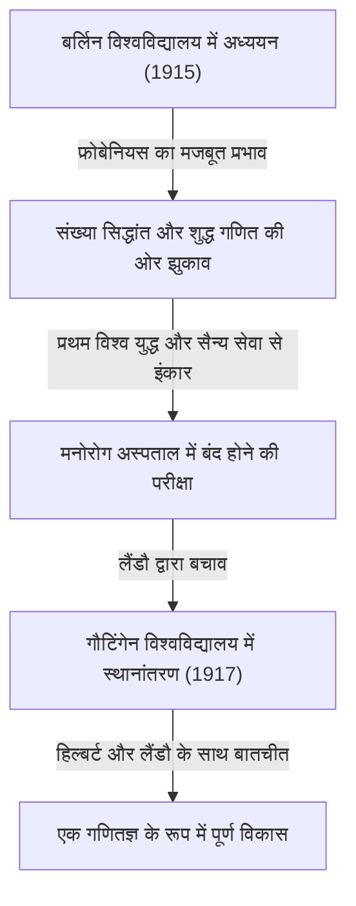

## 1. परिचय: [कार्ल लुडविग सीगल](https://kenji.blog/p/siegel/) कौन हैं?

[कार्ल लुडविग सीगल](https://kenji.blog/p/siegel/) (31 दिसंबर 1896 – 4 अप्रैल 1981) 20वीं सदी के सबसे उत्कृष्ट जर्मन गणितज्ञों में से एक थे, जिन्होंने गणितीय दुनिया में एक विशाल विरासत छोड़ी। उनका शोध मुख्य रूप से संख्या सिद्धांत (विश्लेषणात्मक और बीजगणितीय संख्या सिद्धांत), डायोफैंटाइन समीकरण, डायोफैंटाइन सन्निकटन, और खगोलीय यांत्रिकी (जटिल गतिशील प्रणालियां) पर केंद्रित था। उनकी उपलब्धियां आधुनिक गणित में एक अत्यंत महत्वपूर्ण स्थान रखती हैं।

सीगल अपनी आश्चर्यजनक गणना क्षमता, गहरी अंतर्दृष्टि और जटिल विश्लेषणात्मक तकनीकों को कुशलता से संभालने की क्षमता के लिए प्रसिद्ध थे। 20वीं सदी के गणितीय परिदृश्य में, जो तेजी से अमूर्तता और स्वयंसिद्धिकरण की ओर बढ़ रहा था, उन्होंने ठोस समस्या-समाधान और शास्त्रीय विधियों के परिष्करण को सबसे अधिक महत्व दिया, और अपनी एक अत्यंत स्वतंत्र शैली बनाए रखी। वे फ्रांसीसी गणितीय समूह बोरबाकी द्वारा प्रचारित अत्यधिक अमूर्तता की कड़ी आलोचना के लिए भी प्रसिद्ध हैं। यह लेख उनके अशांत जीवन के प्रसंगों के साथ-साथ उनकी असाधारण गणितीय उपलब्धियों की गहराई से पड़ताल करता है।

## 2. सीगल का जीवन: उथल-पुथल वाले समय में एक गणितज्ञ

### 2.1 प्रारंभिक जीवन और शैक्षणिक जागृति

सीगल का जन्म 1896 में जर्मन साम्राज्य के बर्लिन में हुआ था। कम उम्र से ही गणित और विज्ञान में असाधारण प्रतिभा दिखाते हुए, उन्होंने 1915 में बर्लिन के हम्बोल्ट विश्वविद्यालय (बर्लिन विश्वविद्यालय) में प्रवेश लिया। वहां, उन्हें उस युग के कुछ सबसे महान विद्वानों से सीखने का सौभाग्य मिला, जिनमें भौतिक विज्ञानी मैक्स प्लैंक और बीजगणित तथा समूह सिद्धांत के उस्ताद फर्डिनेंड जॉर्ज फ्रोबेनियस शामिल थे। प्रारंभ में, सीगल की रुचि खगोल विज्ञान और भौतिकी में भी थी, लेकिन फ्रोबेनियस के जोशीले व्याख्यानों ने उनमें संख्या सिद्धांत के प्रति गहरी रुचि जगाई, जो उनके लिए गणित में अपना रास्ता चुनने का एक निर्णायक उत्प्रेरक बन गया।

हालाँकि, प्रथम विश्व युद्ध के छिड़ने से उन्हें अपनी पढ़ाई बीच में ही रोकनी पड़ी। 1917 में, सीगल को सैन्य सेवा के लिए बुलाया गया, लेकिन उन्होंने अपनी मजबूत युद्ध-विरोधी भावनाओं और व्यक्तिगत विश्वासों के कारण सेवा करने से इंकार कर दिया। उस समय, जर्मनी में सैन्य सेवा से इंकार करना एक गंभीर अपराध था, और उन्हें एक मनोरोग अस्पताल में बंद होने की कठोर परीक्षा से गुजरना पड़ा। उन्हें इस हताश स्थिति से प्रख्यात गणितज्ञ एडमंड लैंडौ ने बचाया। लैंडौ के प्रयासों से मुक्त होकर, सीगल 1917 में गौटिंगेन विश्वविद्यालय चले गए। उस समय गौटिंगेन दुनिया भर में गणित का मक्का था, जहाँ [डेविड हिल्बर्ट](https://kenji.blog/p/hilbert/) और फेलिक्स क्लेन जैसे दिग्गज मौजूद थे। इस माहौल में, सीगल ने बहुत तरक्की की और अपनी प्रतिभा को पूरी तरह से निखरने दिया।

### 2.2 फ्रैंकफर्ट युग और नाजियों का उदय

1920 में लैंडौ की देखरेख में गौटिंगेन विश्वविद्यालय से अपनी डॉक्टरेट की उपाधि प्राप्त करने के बाद, सीगल ने डायोफैंटाइन सन्निकटन पर महत्वपूर्ण शोध पत्र लिखे। 1922 में, कम उम्र में ही, उन्हें फ्रैंकफर्ट विश्वविद्यालय में एक पूर्ण प्रोफेसर के रूप में नियुक्त किया गया, जहाँ उन्होंने अगले 16 वर्ष बिताए। फ्रैंकफर्ट युग उनके शोध करियर के सबसे उत्पादक और शानदार दौरों में से एक था, जिसके दौरान उन्होंने कई अभूतपूर्व शोध पत्र प्रकाशित किए। उन्होंने वहां अपनी दोस्ती भी गहरी की और हरमन वेइल और पॉल एपस्टीन जैसे कई उत्कृष्ट गणितज्ञों के साथ जीवंत शैक्षणिक आदान-प्रदान में संलग्न रहे।

हालाँकि, 1930 के दशक की शुरुआत में, जर्मनी में नाजी (नेशनल सोशलिस्ट जर्मन वर्कर्स पार्टी) सत्ता में आए, जिससे एक दुखद स्थिति पैदा हो गई जहाँ यहूदी सहयोगियों को सार्वजनिक कार्यालयों से व्यवस्थित रूप से निष्कासित कर दिया गया। हालांकि सीगल स्वयं यहूदी नहीं थे, लेकिन उनमें नाजी यहूदी-विरोधी नीतियों और फासीवाद के प्रति एक मजबूत घृणा और विरोध था, और उन्होंने खुले तौर पर अपने सताए गए यहूदी दोस्तों और सहयोगियों की रक्षा करना जारी रखा। उन्होंने नाज़ियों के लिए एक शैक्षणिक उपकरण बनने से दृढ़ता से इनकार कर दिया और राजनीतिक दबाव के आगे झुके बिना शैक्षणिक स्वतंत्रता की रक्षा करने का प्रयास किया।

### 2.3 निर्वासन और संयुक्त राज्य अमेरिका में शोध जीवन

नाजी शासन के तहत जर्मनी में शोध और रहने का माहौल काफी बिगड़ गया, और उनकी अपनी व्यक्तिगत सुरक्षा को भी खतरा था, इसलिए सीगल ने अंततः अपनी मातृभूमि को छोड़ने का फैसला किया। 1940 में, द्वितीय विश्व युद्ध के छिड़ने के कुछ ही समय बाद, वह डेनमार्क और नॉर्वे के खतरनाक मार्ग से होते हुए संयुक्त राज्य अमेरिका भागने में सफल रहे।

संयुक्त राज्य अमेरिका में, न्यू जर्सी के प्रिंसटन में इंस्टीट्यूट फॉर एडवांस्ड स्टडी (IAS) में उनका स्वागत किया गया। उस समय, IAS यूरोप में युद्ध से भाग रहे सबसे महान दिमागों के लिए एक अभयारण्य बन गया था, और सीगल ने अल्बर्ट आइंस्टीन, जॉन वॉन न्यूमैन और हरमन वेइल जैसी हस्तियों के साथ एक पूर्ण शोध जीवन का आनंद लिया। अमेरिका में अपने वर्षों के दौरान, सीगल का शोध संख्या सिद्धांत से आगे बढ़ गया; उन्होंने खगोलीय यांत्रिकी और विश्लेषणात्मक कार्य सिद्धांत (analytic function theory) के क्षेत्रों में भी एक के बाद एक अत्यंत महत्वपूर्ण परिणाम दिए।

### 2.4 गौटिंगेन में वापसी और अंतिम वर्ष

द्वितीय विश्व युद्ध के अंत के बाद, सीगल ने संयुक्त राज्य अमेरिका में स्थायी रूप से न रहने का विकल्प चुना, और 1951 में अपनी मातृभूमि जर्मनी लौटने का महत्वपूर्ण निर्णय लिया। वह गौटिंगेन विश्वविद्यालय में एक प्रोफेसर के रूप में लौटे, जहां उन्होंने कभी अध्ययन किया था, और युद्ध से तबाह हुए जर्मन गणितीय समुदाय के पुनर्निर्माण के लिए खुद को समर्पित कर दिया। उन्होंने अपनी जोरदार शोध गतिविधियाँ जारी रखीं और कई उत्कृष्ट उत्तराधिकारियों को प्रशिक्षित किया। उनके व्याख्यान कठोर और स्पष्ट थे, जिससे उन्हें अपने छात्रों का गहरा सम्मान मिला।

1978 में, उनकी असाधारण आजीवन उपलब्धियों की मान्यता में, उन्हें इज़राइल गेलफैंड के साथ संयुक्त रूप से गणित में पहला वुल्फ पुरस्कार प्रदान किया गया, जो गणितीय दुनिया के सर्वोच्च सम्मानों में से एक है। 4 अप्रैल 1981 को, [कार्ल लुडविग सीगल](https://kenji.blog/p/siegel/) का गौटिंगेन में निधन हो गया, और इस तरह उनके 84 साल के घटनापूर्ण जीवन का अंत हो गया।

## 3. महान गणितीय उपलब्धियां

सीगल की गणितीय उपलब्धियां आश्चर्यजनक रूप से विविध हैं, लेकिन उन्होंने हर क्षेत्र में निर्णायक परिणाम छोड़े। उनके शोध की सबसे बड़ी विशेषता संख्या सिद्धांत में गहरे, ठोस परिणाम प्राप्त करने के लिए अत्यधिक जटिल और सरल विश्लेषणात्मक तकनीकों का उपयोग है। नीचे उनकी कुछ सबसे प्रसिद्ध उपलब्धियों का विस्तृत विवरण दिया गया है।

### 3.1 डायोफैंटाइन समीकरण और सीगल की प्रमेय

उनके 1929 के शोध पत्र "बीजगणितीय वक्रों के अभिन्न बिंदुओं पर" ने उनके नाम को अमर कर दिया और डायोफैंटाइन ज्यामिति के नए क्षेत्र के द्वार खोल दिए। इस प्रमेय को अब **सीगल की प्रमेय** (Siegel's theorem on integral points) के रूप में जाना जाता है।

यह प्रमेय एक बहुत शक्तिशाली और सुंदर दावा है कि "जीनस $g \ge 1$ के एक बीजगणितीय वक्र $C$ में केवल परिमित संख्या में अभिन्न बिंदु (integral points) होते हैं।" अधिक सख्ती से कहें तो, एक बीजगणितीय संख्या क्षेत्र $K$ और उसके पूर्णांकों के वलय (ring of integers) $\mathcal{O}_K$ के लिए, इसे इस प्रकार बताया गया है:

$$
\text{यदि } g(C) \ge 1 \text{, तो } |C(\mathcal{O}_K)| < \infty
$$

उदाहरण के लिए, जबकि एक अण्डाकार वक्र (जीनस $g=1$) जैसे $x^3 + y^3 = c$ (जहाँ $c$ एक गैर-शून्य पूर्णांक है) के लिए असीम रूप से कई वास्तविक या तर्कसंगत समाधान हो सकते हैं, यह प्रमेय गारंटी देता है कि यदि **अभिन्न समाधानों** तक सीमित रखा जाए, तो हमेशा केवल एक परिमित संख्या होगी।

यह परिणाम डायोफैंटाइन समीकरणों के समाधानों की परिमितता के संबंध में अभूतपूर्व था और यह एक महत्वपूर्ण ऐतिहासिक कदम बन गया जिसने गेर्ड फाल्टिंग्स द्वारा मॉर्डेल-वील प्रमेय (जीनस 2 या उससे अधिक के वक्रों पर तर्कसंगत बिंदुओं की परिमितता) के बाद के प्रमाण का मार्ग प्रशस्त किया। सीगल ने एक्सल थ्यू के डायोफैंटाइन सन्निकटन के प्रमेय का काफी विस्तार करके और इसे एबेलियन किस्मों (Abelian varieties) पर जैकोबियन के सिद्धांत के साथ जोड़कर यह आश्चर्यजनक परिणाम प्राप्त किया।

### 3.2 सीगल ज़ीरो (Siegel Zero)

विश्लेषणात्मक संख्या सिद्धांत में, डिरिचलेट के $L$-फ़ंक्शन $L(s, \chi)$ के शून्यों (zeros) का वितरण अभाज्य संख्या प्रमेय (prime number theorem) और अंकगणितीय प्रगति पर प्रमेय के प्राकृतिक विस्तार के लिए अत्यंत महत्वपूर्ण है। जनरलाइज्ड रीमैन हाइपोथिसिस (GRH) के अनुसार, $0$ और $1$ के बीच वास्तविक भाग वाली क्रिटिकल स्ट्रिप में सभी शून्य उस रेखा पर स्थित होने चाहिए जहाँ वास्तविक भाग $1/2$ है।

हालाँकि, एक वास्तविक चरित्र (वास्तविक द्विघात क्षेत्र का) $\chi$ के लिए, वर्तमान गणित द्वारा यह संभावना खारिज नहीं की गई है कि $1$ के बहुत करीब एक वास्तविक भाग के साथ एक वास्तविक शून्य मौजूद है। इस तरह के एक काल्पनिक प्रति-उदाहरण शून्य को **सीगल ज़ीरो** (Siegel zero) या असाधारण शून्य कहा जाता है।

1935 में, सीगल ने इस अशुभ शून्य की स्थिति के लिए, भले ही वह मौजूद हो, एक मजबूत ऊपरी सीमा ( $1$ से दूरी पर एक निचली सीमा) मूल्यांकन प्रदान किया। विशेष रूप से, उन्होंने सिद्ध किया कि किसी भी $\epsilon > 0$ के लिए, एक स्थिरांक $C(\epsilon) > 0$ मौजूद है, जिससे वास्तविक चरित्र $\chi$ के मापांक (modulus) $q$ के लिए, $s=1$ पर फ़ंक्शन का मान निम्नलिखित को पूरा करता है:

$$
L(1, \chi) > C(\epsilon) q^{-\epsilon}
$$

यह मूल्यांकन वर्ग संख्या समस्या (class number problem) (विशेषकर उन मामलों को निर्धारित करने के लिए जहां एक काल्पनिक द्विघात क्षेत्र की वर्ग संख्या $1$ है) और अंकगणितीय प्रगति में अभाज्य संख्याओं के वितरण के संबंध में गहरे परिणाम प्राप्त करने के लिए एक अपरिहार्य उपकरण बन गया है। हालाँकि, इस प्रमेय की एक बड़ी विशेषता है: स्थिरांक $C(\epsilon)$ में "अप्रभावी" (ineffective) होने का गुण है। इसका अर्थ यह है कि यद्यपि प्रमेय स्थिरांक के अस्तित्व की गारंटी देता है, यह इसके विशिष्ट संख्यात्मक मूल्य को प्राप्त करने के लिए कोई विधि प्रदान नहीं करता है। यह अप्रभावीता विश्लेषणात्मक संख्या सिद्धांत में सबसे बड़े आधुनिक रहस्यों में से एक है, और कई गणितज्ञ सीगल ज़ीरो के गैर-अस्तित्व को साबित करने (या एक गणना योग्य सीमा खोजने) के लक्ष्य के साथ शोध जारी रखे हुए हैं।

### 3.3 सीगल मॉड्यूलर फॉर्म और द्विघात फॉर्म

सीगल ने बहुभिन्नरूपी ऑटॉमॉर्फिक रूपों (multivariate automorphic forms) के सिद्धांत की स्थापना की, विशेष रूप से उस सिद्धांत की जिसे आज **सीगल मॉड्यूलर फॉर्म** (Siegel modular forms) के रूप में जाना जाता है। यह 19वीं शताब्दी से अध्ययन किए जा रहे एकल-चर अण्डाकार मॉड्यूलर रूपों का, बहुभिन्नरूपी कार्य सिद्धांत के ढांचे में एक साहसिक और स्वाभाविक विस्तार था।

सीगल ऊपरी आधा स्थान (Siegel upper half-space) $\mathcal{H}_g$ को इस प्रकार परिभाषित किया गया है:

$$
\mathcal{H}_g = \left\{ Z \in M_g(\mathbb{C}) \mid Z^T = Z, \text{ Im}(Z) \text{ पॉजिटिव डेफिनिट है} \right\}
$$

यहाँ, जब $g=1$, तो यह स्थान सामान्य पोंकारे ऊपरी आधे-विमान से पूरी तरह मेल खाता है। सीगल ने द्विघात रूपों (quadratic forms) के विश्लेषणात्मक सिद्धांत को गहरा करने की प्रक्रिया के दौरान इस उच्च-आयामी स्थान को पेश किया, और उन्होंने दिखाया कि इस स्थान पर परिभाषित ऑटॉमॉर्फिक रूप, द्विघात रूपों द्वारा पूर्णांकों के प्रतिनिधित्व की संख्या से गहराई से जुड़े हुए हैं।

इसके अलावा, उन्होंने द्विघात रूपों के विश्लेषणात्मक सिद्धांत के भीतर **सीगल-वेइल सूत्र** (Siegel-Weil formula) की नींव रखी। यह एक अद्भुत सूत्र है जो आइजनस्टीन श्रृंखला के फूरियर गुणांक के रूप में द्विघात रूपों द्वारा अभ्यावेदन की संख्या का वर्णन करता है, और इसे स्थानीय-वैश्विक सिद्धांत (हासे सिद्धांत) की विश्लेषणात्मक अभिव्यक्ति कहा जा सकता है। ये सिद्धांत अपरिहार्य अवधारणाएं हैं जो बाद के ऑटॉमॉर्फिक प्रतिनिधित्व सिद्धांत और लैंग्लैंड्स कार्यक्रम (Langlands program) के आधार का निर्माण करती हैं।

### 3.4 सीगल की लेम्मा और पारलौकिक सिद्धांत (Transcendence Theory)

पारलौकिक संख्या सिद्धांत (transcendental number theory) के क्षेत्र में भी, उन्होंने एक अत्यंत शक्तिशाली प्रमेय सिद्ध किया जिसे **सीगल की लेम्मा** (Siegel's lemma) कहा जाता है। हालांकि पहली नज़र में यह लेम्मा रैखिक बीजगणित का एक प्रारंभिक परिणाम लग सकता है, लेकिन इसके अनुप्रयोग की सीमा अथाह है।

प्रमेय का दावा इस प्रकार है: "एक साथ रैखिक समीकरणों की एक प्रणाली में जहां गुणांक पूर्णांक हैं, यदि अज्ञात $N$ की संख्या समीकरणों $M$ ( $N > M$ ) की संख्या से काफी बड़ी है, तो हमेशा एक गैर-तुच्छ पूर्णांक समाधान मौजूद होता है जहां प्रत्येक घटक का पूर्ण मूल्य अपेक्षाकृत छोटा होता है (गुणांक के आकार के अनुसार उचित रूप से ऊपर की ओर बंधा हुआ)।"

कबूतर-छेद सिद्धांत (डिरिचलेट का बॉक्स सिद्धांत) का उपयोग करते हुए एक सुरुचिपूर्ण प्रमाण होने के कारण, यह लेम्मा आधुनिक पारलौकिक सिद्धांत में एक अनिवार्य मूल उपकरण के रूप में अक्सर उपयोग किया जाता है, जैसे कि पारलौकिक संख्याओं के निर्माण में, डायोफैंटाइन सन्निकटन में, और बाद में लॉगरिदम में रैखिक रूपों के [एलन बेकर](https://kenji.blog/p/baker/) के सिद्धांत में।

### 3.5 खगोलीय यांत्रिकी और लघु भाजक समस्या (Small Divisor Problem)

सीगल ने खुद को केवल शुद्ध गणित तक सीमित नहीं रखा; वह खगोलीय यांत्रिकी, विशेष रूप से तीन-निकाय समस्या, जो कई-निकाय प्रणालियों की गति का वर्णन करती है, के लिए एक असाधारण जुनून के साथ जलते रहे। उन्होंने हेनरी पोंकारे द्वारा शुरू किए गए गतिशील प्रणालियों के अध्ययन को विकसित किया और अंतर समीकरणों के समाधान की स्थिरता के संबंध में अभूतपूर्व परिणाम छोड़े।

1941 में, उन्होंने विश्लेषणात्मक यांत्रिकी और जटिल गतिशील प्रणालियों में "सीगल केंद्र प्रमेय" साबित किया। इसने इस सवाल को हल कर दिया कि जटिल तल में अपने निश्चित बिंदु के पड़ोस में एक होलोमोर्फिक फ़ंक्शन कब रेखीय हो सकता है। फ़ंक्शन के टेलर विस्तार में, यदि $\lambda$ व्युत्पन्न के मूल्य का प्रतिनिधित्व करता है, जब $\lambda$ एकता की जड़ के करीब एक मूल्य लेता है, तो बहुत छोटे मान भाजक में दिखाई देते हैं, जिससे श्रृंखला अलग हो जाती है—एक घटना जिसे "लघु भाजक समस्या" (small divisor problem) के रूप में जाना जाता है।

डायोफैंटाइन सन्निकटन की उन्नत तकनीकों का उपयोग करते हुए, सीगल ने कड़ाई से साबित किया कि यदि $\lambda$ एक विशिष्ट प्रकार की अपरिमेयता स्थिति (डायोफैंटाइन स्थिति) को पूरा करता है, तो छोटे भाजक के कारण होने वाले विचलन से बचा जा सकता है, और श्रृंखला अभिसरण करती है, जिससे यह विश्लेषणात्मक रूप से रेखीय हो जाती है।

$$
\left| \lambda^n - 1 \right| > \frac{C}{n^\nu} \quad (\forall n \ge 1)
$$

यह परिणाम गतिशील प्रणालियों में छोटे भाजक की समस्या को शानदार ढंग से दूर करने वाला पहला सफल उदाहरण था, और यह एक निर्णायक, ऐतिहासिक उपलब्धि है जिसने **KAM सिद्धांत** (KAM theorem) के सीधे अग्रदूत के रूप में कार्य किया, जिसे बाद में एंड्री कोलमोगोरोव, व्लादिमीर अर्नोल्ड और जर्गेन मोजर द्वारा विकसित किया गया था।

## 4. सीगल का अनूठा दर्शन और गणित का दृष्टिकोण

गणित के प्रति सीगल का दृष्टिकोण उतना ही प्रभावशाली था जितनी उन्होंने उपलब्धियां छोड़ीं, और कई बार यह विवाद का विषय भी रहा। उन्हें यकीन था कि गणित हमेशा ठोस समस्याओं से निकटता से जुड़ा होना चाहिए, और अनावश्यक अमूर्तता पर जोर देने से गणित की मूल जीवन शक्ति छिन जाती है।

20वीं सदी के मध्य में, युवा फ्रांसीसी गणितीय समूह, बोरबाकी समूह—जिसने सेट थ्योरी और स्वयंसिद्ध प्रणालियों से सभी गणित को फिर से बनाने का प्रयास किया—द्वारा समर्थित एक अमूर्त शैली दुनिया में छा रही थी। हालाँकि, सीगल ने इस प्रवृत्ति की कड़ी आलोचना की। उन्होंने बोरबाकी शैली को "खाली औपचारिकता" के रूप में खारिज कर दिया और निम्नलिखित प्रभाव वाली टिप्पणियां छोड़ीं:

> "हालिया गणित की अत्यधिक अमूर्तता एक खाली औपचारिकता में गिर गई है और कोई सार्थक परिणाम नहीं देती है। हमें वास्तविक सामग्री से समृद्ध ठोस समस्याओं पर वापस लौटना चाहिए, जिस तरह की समस्याओं से गॉस, यूलर, रीमैन और जैकोबी निपटे थे।"

इस मजबूत दृढ़ विश्वास के कारण, उनके शोध पत्रों को पढ़ना बहुत फायदेमंद है; दूसरी ओर, आधुनिक पाठकों के लिए, अत्यधिक तकनीकी और लंबी गणनाएं हर जगह दिखाई देती हैं, जिन्हें समझने के लिए अक्सर अत्यधिक प्रयास की आवश्यकता होती है। उन्होंने जीवन भर अपने इस दर्शन से कभी समझौता नहीं किया कि "अमूर्त अवधारणाएं और ढांचे ठोस, कठिन समस्याओं को हल करने का केवल एक साधन हैं।" उस अलग-थलग रुख ने उन्हें अपने समकालीन गणितज्ञों के बीच कुछ हद तक एक विशिष्ट व्यक्ति बना दिया।

## 5. निष्कर्ष और सीगल की विरासत

अपनी अद्वितीय विश्लेषणात्मक प्रतिभा और शास्त्रीय गणित के प्रति गहरी श्रद्धा के माध्यम से, [कार्ल लुडविग सीगल](https://kenji.blog/p/siegel/) ने संख्या सिद्धांत, डायोफैंटाइन ज्यामिति और खगोलीय यांत्रिकी में निर्णायक, युग-निर्माण उपलब्धियां छोड़ीं।

उनके नाम वाली कई अवधारणाएं और प्रमेय, जैसे कि सीगल ज़ीरो, सीगल की प्रमेय, सीगल मॉड्यूलर फॉर्म, और सीगल की लेम्मा, आधुनिक गणितज्ञों द्वारा प्रतिदिन उपयोग की जाने वाली सामान्य भाषाएं बन गई हैं, जो चल रहे, अत्याधुनिक शोध में भी एक अनिवार्य नींव के रूप में काम कर रही हैं।

उनका जीवन हमें एक ऐसे विद्वान का असली रूप दिखाता है जो दो विश्व युद्धों के कठिन समय में भी अपने राजनीतिक विश्वासों और शिक्षाविदों के प्रति ईमानदार रवैये पर कायम रहे। अत्यधिक अमूर्तता की लहर का अकेले विरोध करते हुए, और जटिल यथार्थ के बीच सार्वभौमिक, सुंदर सच्चाइयों की खोज करते हुए, उनका गणित निस्संदेह पीढ़ियों तक चमकता रहेगा।
