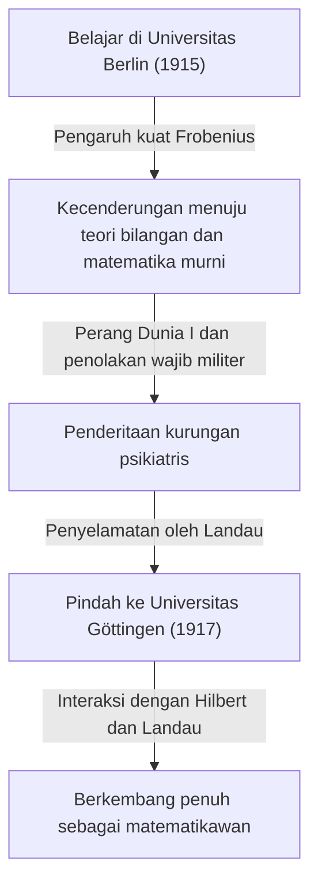

## 1. Pendahuluan: Siapakah [Carl Ludwig Siegel](https://kenji.blog/p/siegel/)?

[Carl Ludwig Siegel](https://kenji.blog/p/siegel/) (31 Desember 1896 – 4 April 1981) adalah salah satu matematikawan Jerman paling menonjol pada abad ke-20, yang meninggalkan warisan luar biasa di dunia matematika. Penelitiannya terutama difokuskan pada teori bilangan (teori bilangan analitik dan aljabar), persamaan Diophantine, aproksimasi Diophantine, dan mekanika benda langit (sistem dinamis kompleks). Pencapaiannya terus menempati posisi yang sangat penting dalam matematika modern.

Siegel terkenal karena kemampuan komputasinya yang menakjubkan, wawasannya yang mendalam, dan kemampuannya untuk menguasai teknik analitik kompleks dengan luar biasa. Dalam lanskap matematika abad ke-20 yang bergerak cepat menuju abstraksi dan aksiomatisasi, ia sangat menghargai pemecahan masalah konkret dan penyempurnaan metode klasik di atas segalanya, dengan mempertahankan gaya yang sangat independen. Ia juga terkenal karena kritik tajamnya terhadap abstraksi ekstrem yang dipromosikan oleh kelompok matematika Prancis, Bourbaki. Artikel ini menggali secara mendalam pencapaian matematikanya yang luar biasa bersama dengan episode-episode dari kehidupannya yang penuh gejolak.

## 2. Kehidupan Siegel: Seorang Matematikawan di Masa Penuh Gejolak

### 2.1 Kehidupan Awal dan Kebangkitan Akademik

Siegel lahir pada tahun 1896 di Berlin, Kekaisaran Jerman. Menunjukkan bakat luar biasa dalam matematika dan sains sejak usia muda, ia masuk ke Universitas Humboldt Berlin (Universitas Berlin) pada tahun 1915. Di sana, ia beruntung dapat belajar dari beberapa cendekiawan terbesar pada era tersebut, termasuk fisikawan Max Planck dan pakar aljabar serta teori grup, Ferdinand Georg Frobenius. Awalnya, Siegel juga tertarik pada astronomi dan fisika, namun kuliah-kuliah Frobenius yang penuh semangat memicu ketertarikan mendalam pada teori bilangan, yang menjadi katalisator penentu baginya untuk meniti jalan di bidang matematika.

Namun, pecahnya Perang Dunia I memaksanya untuk menghentikan studinya. Pada tahun 1917, Siegel wajib militer, namun ia menolak untuk bertugas karena sentimen anti-perangnya yang kuat dan keyakinan pribadinya. Pada saat itu, menolak wajib militer adalah kejahatan serius di Jerman, dan ia menanggung penderitaan berat dengan dikurung di rumah sakit jiwa. Ia diselamatkan dari situasi putus asa ini oleh matematikawan terkemuka Edmund Landau. Dibebaskan berkat upaya Landau, Siegel pindah ke Universitas Göttingen pada tahun 1917. Göttingen pada saat itu adalah kiblat matematika global, rumah bagi raksasa seperti [David Hilbert](https://kenji.blog/p/hilbert/) dan Felix Klein. Di lingkungan ini, Siegel berkembang dan membiarkan bakat-bakatnya benar-benar mekar.

### 2.2 Era Frankfurt dan Bangkitnya Nazi

Setelah meraih gelar doktor dari Universitas Göttingen pada tahun 1920 di bawah bimbingan Landau, Siegel menulis makalah penting tentang aproksimasi Diophantine. Pada tahun 1922, di usia muda, ia diangkat sebagai profesor penuh di Universitas Frankfurt, di mana ia akan menghabiskan 16 tahun berikutnya. Era Frankfurt adalah salah satu periode paling produktif dan cemerlang dalam karier penelitiannya, di mana ia menerbitkan banyak makalah terobosan. Ia juga memperdalam persahabatannya dan terlibat dalam pertukaran akademik yang dinamis dengan banyak matematikawan hebat di sana, seperti Hermann Weyl dan Paul Epstein.

Namun, saat memasuki tahun 1930-an, Nazi (Partai Pekerja Sosialis Nasional Jerman) berkuasa di Jerman, yang mengarah pada situasi tragis di mana rekan-rekan Yahudi secara sistematis dikeluarkan dari jabatan publik. Meskipun Siegel sendiri bukan seorang Yahudi, ia memiliki rasa jijik dan penolakan yang kuat terhadap kebijakan anti-Semit Nazi dan fasisme, secara terbuka terus melindungi teman-teman dan rekan-rekannya dari Yahudi yang dianiaya. Ia menolak keras untuk menjadi alat akademik bagi Nazi dan berjuang untuk mempertahankan kebebasan akademik tanpa tunduk pada tekanan politik.

### 2.3 Pengasingan dan Kehidupan Penelitian di Amerika Serikat

Ketika lingkungan penelitian dan kehidupan di Jerman di bawah rezim Nazi memburuk secara drastis, dan dengan keamanan pribadinya sendiri yang berisiko, Siegel akhirnya membuat keputusan untuk meninggalkan tanah airnya. Pada tahun 1940, tak lama setelah pecahnya Perang Dunia II, ia berhasil melarikan diri ke Amerika Serikat melalui rute berbahaya melewati Denmark dan Norwegia.

Di Amerika Serikat, ia disambut di Institute for Advanced Study (IAS) di Princeton, New Jersey. Pada saat itu, IAS telah menjadi tempat perlindungan bagi pemikir-pemikir hebat yang melarikan diri dari perang di Eropa, dan Siegel menikmati kehidupan penelitian yang memuaskan bersama tokoh-tokoh seperti Albert Einstein, John von Neumann, dan Hermann Weyl. Selama tahun-tahunnya di Amerika, penelitian Siegel meluas melampaui teori bilangan; ia secara berturut-turut menghasilkan hasil yang sangat penting di bidang mekanika benda langit dan teori fungsi analitik.

### 2.4 Kembali ke Göttingen dan Tahun-tahun Terakhir

Setelah berakhirnya Perang Dunia II, Siegel memilih untuk tidak menetap secara permanen di Amerika Serikat, dan mengambil keputusan penting untuk kembali ke tanah airnya, Jerman, pada tahun 1951. Ia kembali sebagai profesor ke Universitas Göttingen, tempat ia pernah belajar, dan mendedikasikan dirinya untuk membangun kembali komunitas matematika Jerman yang telah hancur oleh perang. Ia melanjutkan aktivitas penelitiannya yang penuh semangat dan melatih banyak penerus yang luar biasa. Kuliahnya ketat dan jernih, yang membuatnya mendapatkan rasa hormat yang mendalam dari murid-muridnya.

Pada tahun 1978, sebagai pengakuan atas pencapaian seumur hidupnya yang luar biasa, ia secara bersama-sama dianugerahi Penghargaan Wolf dalam Matematika yang pertama, salah satu penghargaan tertinggi di dunia matematika, bersama dengan Israel Gelfand. Pada 4 April 1981, [Carl Ludwig Siegel](https://kenji.blog/p/siegel/) wafat di Göttingen, menutup kehidupannya yang penuh peristiwa selama 84 tahun.

## 3. Pencapaian Matematika yang Luar Biasa

Pencapaian matematika Siegel sangat beragam, namun ia meninggalkan hasil yang menentukan di setiap bidang. Karakteristik terbesar dari penelitiannya adalah penggunaannya pada teknik analitik yang sangat kompleks dan cerdas untuk menurunkan hasil konkret yang mendalam dalam teori bilangan. Berikut ini adalah penjelasan rinci tentang beberapa pencapaiannya yang paling terkenal.

### 3.1 Persamaan Diophantine dan Teorema Siegel

Makalahnya pada tahun 1929 "Tentang titik-titik integral dari kurva aljabar" mengabadikan namanya dan membuka pintu ke bidang baru geometri Diophantine. Teorema ini sekarang dikenal sebagai **teorema Siegel** (teorema Siegel tentang titik integral).

Teorema ini adalah penegasan yang sangat kuat dan indah bahwa "sebuah kurva aljabar $C$ dari genus $g \ge 1$ hanya memiliki sejumlah titik integral yang berhingga". Lebih ketatnya, untuk suatu lapangan bilangan aljabar $K$ dan cincin bilangan bulatnya $\mathcal{O}_K$, hal ini dinyatakan sebagai berikut:

$$
\text{Jika } g(C) \ge 1 \text{, maka } |C(\mathcal{O}_K)| < \infty
$$

Sebagai contoh, meskipun mungkin terdapat tak terhingga banyak solusi real atau rasional untuk kurva eliptik (genus $g=1$) seperti $x^3 + y^3 = c$ (di mana $c$ adalah bilangan bulat bukan nol), teorema ini menjamin bahwa jika dibatasi pada **solusi integral**, maka akan selalu ada jumlah yang berhingga.

Hasil ini merupakan terobosan mengenai keterhinggaan solusi persamaan Diophantine dan menjadi langkah sejarah yang krusial yang membuka jalan bagi pembuktian selanjutnya dari teorema Mordell-Weil (keterhinggaan titik-titik rasional pada kurva dengan genus 2 atau lebih tinggi) oleh [Gerd Faltings](https://kenji.blog/p/faltings/). Siegel menurunkan hasil yang mencengangkan ini dengan memperluas secara signifikan teorema Axel Thue tentang aproksimasi Diophantine dan menggabungkannya dengan teori Jacobian pada varietas Abelian.

### 3.2 Nol Siegel (Siegel Zero)

Dalam teori bilangan analitik, distribusi nol dari fungsi $L$ Dirichlet $L(s, \chi)$ sangat penting untuk ekstensi alami dari teorema bilangan prima dan teorema tentang barisan aritmatika. Menurut Hipotesis Riemann yang Diperumum (GRH), semua nol pada pita kritis dengan bagian real antara $0$ dan $1$ seharusnya terletak pada garis di mana bagian realnya adalah $1/2$.

Namun, untuk karakter real (dari suatu lapangan kuadratik real) $\chi$, kemungkinan adanya nol real dengan bagian real yang sangat dekat ke $1$ belum dapat disingkirkan oleh matematika saat ini. Nol pengecualian hipotetis semacam itu disebut **nol Siegel** (Siegel zero) atau nol eksepsional.

Pada tahun 1935, Siegel memberikan evaluasi batas atas yang kuat (batas bawah pada jarak dari $1$) untuk posisi nol yang tidak menyenangkan ini, bahkan jika itu ada. Secara spesifik, ia membuktikan bahwa untuk setiap $\epsilon > 0$, ada konstanta $C(\epsilon) > 0$ sedemikian rupa sehingga untuk modulus $q$ dari karakter real $\chi$, nilai fungsi pada $s=1$ memenuhi kondisi berikut:

$$
L(1, \chi) > C(\epsilon) q^{-\epsilon}
$$

Evaluasi ini telah menjadi alat yang sangat penting untuk menurunkan hasil mendalam terkait masalah bilangan kelas (terutama penentuan kasus di mana bilangan kelas dari suatu lapangan kuadratik imajiner adalah $1$) dan distribusi bilangan prima dalam barisan aritmatika. Namun, teorema ini memiliki kekhasan besar: konstanta $C(\epsilon)$ memiliki sifat "tidak efektif" (ineffective). Ini berarti meskipun teorema menjamin keberadaan konstanta tersebut, ia tidak menyediakan metode untuk menurunkan nilai numerik spesifiknya. Ketidakefektifan ini adalah salah satu misteri modern terbesar dalam teori bilangan analitik, dan banyak matematikawan terus melakukan penelitian dengan tujuan membuktikan ketiadaan (atau menemukan batas yang dapat dihitung) dari nol Siegel.

### 3.3 Bentuk Modular Siegel dan Bentuk Kuadratik

Siegel mendirikan teori bentuk automorfik multivariabel, khususnya teori yang dikenal hari ini sebagai **bentuk modular Siegel** (Siegel modular forms). Ini adalah perpanjangan yang berani dan alami dari bentuk modular eliptik variabel tunggal, yang telah dipelajari sejak abad ke-19, ke dalam kerangka teori fungsi multivariabel.

Ruang setengah atas Siegel $\mathcal{H}_g$ didefinisikan sebagai berikut:

$$
\mathcal{H}_g = \left\{ Z \in M_g(\mathbb{C}) \mid Z^T = Z, \text{ Im}(Z) \text{ adalah definit positif} \right\}
$$

Di sini, ketika $g=1$, ruang ini sangat cocok dengan bidang setengah atas Poincaré yang biasa. Siegel memperkenalkan ruang berdimensi tinggi ini selama proses pendalaman teori analitik bentuk kuadratik, dan ia menunjukkan bahwa bentuk automorfik yang didefinisikan pada ruang ini sangat terhubung dengan jumlah representasi bilangan bulat oleh bentuk kuadratik.

Lebih jauh lagi, ia meletakkan dasar untuk **rumus Siegel-Weil** di dalam teori analitik bentuk kuadratik. Ini adalah rumus yang menakjubkan yang mendeskripsikan jumlah representasi oleh bentuk kuadratik sebagai koefisien Fourier dari deret Eisenstein, dan ini dapat dikatakan sebagai ekspresi analitik dari prinsip lokal-global (prinsip Hasse). Teori-teori ini adalah konsep yang sangat diperlukan yang membentuk dasar untuk teori representasi automorfik berikutnya dan program Langlands.

### 3.4 Lema Siegel dan Teori Transendensi

Di bidang teori bilangan transenden juga, ia membuktikan teorema yang sangat kuat yang disebut **lema Siegel** (Siegel's lemma). Meskipun sekilas lema ini mungkin terlihat seperti sekadar hasil elementer dari aljabar linear, rentang aplikasinya tidak terukur.

Penegasan dari teorema ini adalah sebagai berikut: "Dalam sistem persamaan linear simultan di mana koefisiennya adalah bilangan bulat, jika jumlah variabel yang tidak diketahui $N$ cukup lebih besar dari jumlah persamaan $M$ ( $N > M$ ), maka selalu ada solusi bilangan bulat tak-trivial di mana nilai absolut dari setiap komponen relatif kecil (dibatasi di atas secara tepat sesuai dengan ukuran koefisiennya)."

Memiliki pembuktian elegan dengan menggunakan prinsip sarang burung merpati (prinsip kotak Dirichlet), lema ini sering digunakan sebagai alat dasar yang sangat diperlukan dalam teori transendensi modern, seperti dalam konstruksi bilangan transenden, aproksimasi Diophantine, dan kemudian dalam teori [Alan Baker](https://kenji.blog/p/baker/) mengenai bentuk linear dalam logaritma.

### 3.5 Mekanika Benda Langit dan Masalah Pembagi Kecil

Siegel tidak membatasi dirinya pada matematika murni; ia menyala dengan obsesi yang luar biasa terhadap mekanika benda langit, terutama masalah tiga benda, yang menggambarkan gerak sistem banyak benda. Ia mengembangkan studi sistem dinamis yang dirintis oleh [Henri Poincaré](https://kenji.blog/p/poincare/) dan meninggalkan hasil terobosan mengenai stabilitas solusi persamaan diferensial.

Pada tahun 1941, ia membuktikan "teorema pusat Siegel" dalam mekanika analitik dan sistem dinamis kompleks. Hal ini memecahkan pertanyaan kapan fungsi holomorfik dapat dilinearisasi di sekitar titik tetapnya di bidang kompleks. Dalam ekspansi Taylor dari fungsi tersebut, jika $\lambda$ mewakili nilai turunan, ketika $\lambda$ mengambil nilai yang mendekati akar persatuan, nilai yang sangat kecil muncul di penyebut, yang menyebabkan deret menjadi divergen—sebuah fenomena yang dikenal sebagai "masalah pembagi kecil" (small divisor problem).

Menggunakan teknik lanjutan dari aproksimasi Diophantine, Siegel membuktikan secara ketat bahwa jika $\lambda$ memenuhi suatu jenis kondisi irasionalitas tertentu (kondisi Diophantine), divergensi yang disebabkan oleh penyebut kecil dapat dihindari, dan deret tersebut konvergen, membuatnya secara analitis dapat dilinearisasi.

$$
\left| \lambda^n - 1 \right| > \frac{C}{n^\nu} \quad (\forall n \ge 1)
$$

Hasil ini adalah contoh sukses pertama yang secara brilian mengatasi masalah pembagi kecil dalam sistem dinamis, dan ini adalah pencapaian sejarah yang menentukan yang berfungsi sebagai pelopor langsung bagi **teori KAM** (teorema KAM) yang kemudian dikembangkan oleh Andrey Kolmogorov, Vladimir Arnold, dan Jürgen Moser.

## 4. Filosofi Unik dan Pandangan Siegel tentang Matematika

Pandangan Siegel terhadap matematika sama mencoloknya dengan pencapaian yang ditinggalkannya, dan terkadang hal itu menjadi subjek kontroversi. Ia yakin bahwa matematika harus selalu terikat erat dengan masalah konkret, dan bahwa memaksakan abstraksi yang tidak perlu merampas vitalitas asli matematika.

Pada pertengahan abad ke-20, gaya abstrak yang dianjurkan oleh kelompok matematika Prancis muda, kelompok Bourbaki—yang mencoba membangun kembali seluruh matematika dari teori himpunan dan sistem aksiomatik—menyapu dunia. Namun, Siegel melontarkan kritik keras terhadap tren ini. Ia mengabaikan gaya Bourbaki sebagai "formalisme kosong" dan meninggalkan komentar dengan nada berikut:

> "Abstraksi berlebihan pada matematika akhir-akhir ini telah jatuh ke dalam formalisme kosong dan tidak menghasilkan hasil yang bermakna. Kita harus kembali ke masalah-masalah konkret yang kaya akan konten sejati, jenis masalah yang dihadapi oleh Gauss, Euler, Riemann, dan Jacobi."

Karena keyakinan yang kuat ini, makalah-makalahnya sangat berharga untuk dibaca; di sisi lain, bagi pembaca modern, perhitungan yang sangat teknis dan panjang muncul di mana-mana, yang sering kali membutuhkan usaha keras untuk menguraikannya. Ia tidak pernah mengkompromikan filosofinya sepanjang hidupnya bahwa "konsep dan kerangka abstrak hanyalah sebuah cara untuk memecahkan masalah konkret yang sulit". Sikapnya yang menyendiri itu menjadikannya sosok yang agak berbeda di antara matematikawan pada masanya.

## 5. Kesimpulan dan Warisan Siegel

Melalui bakat analitiknya yang tak tertandingi dan rasa hormat yang mendalam terhadap matematika klasik, [Carl Ludwig Siegel](https://kenji.blog/p/siegel/) meninggalkan pencapaian yang menentukan dan mengubah zaman dalam teori bilangan, geometri Diophantine, dan mekanika benda langit.

Berbagai konsep dan teorema yang menyandang namanya, seperti nol Siegel, teorema Siegel, bentuk modular Siegel, dan lema Siegel, telah menjadi bahasa umum yang digunakan setiap hari oleh matematikawan modern, berfungsi sebagai landasan yang sangat diperlukan bahkan dalam penelitian mutakhir yang sedang berlangsung.

Kehidupannya menunjukkan kepada kita sosok sejati dari seorang sarjana yang berpegang teguh pada keyakinan politiknya dan sikap tulusnya terhadap dunia akademik, bahkan melalui masa-masa sulit dari dua Perang Dunia. Dengan melawan gelombang abstraksi berlebihan seorang diri, dan menemukan kebenaran yang universal dan indah di tengah kompleksitas konkret, matematikanya niscaya akan terus bersinar cemerlang melintasi generasi.
