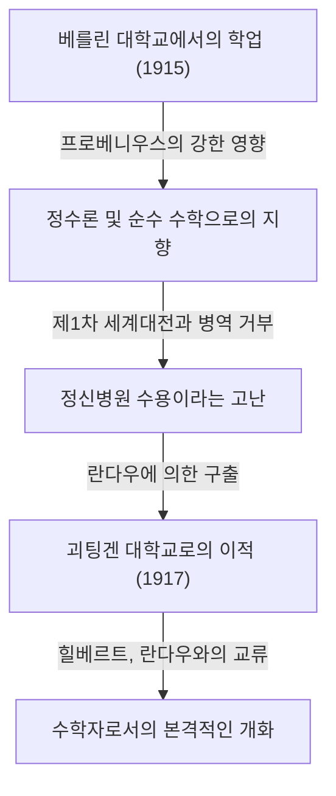

## 1. 서론: [카를 루트비히 지겔](https://kenji.blog/ko/p/siegel/)이란 누구인가?

[카를 루트비히 지겔](https://kenji.blog/ko/p/siegel/)([Carl Ludwig Siegel](https://kenji.blog/ko/p/siegel/), 1896년 12월 31일 - 1981년 4월 4일)은 20세기 수학계에서 가장 뛰어나고 거대한 발자취를 남긴 독일의 수학자 중 한 명입니다. 그의 연구는 주로 정수론(해석적 정수론 및 대수적 정수론), [디오판토스](https://kenji.blog/ko/p/diophantus/) 방정식, [디오판토스](https://kenji.blog/ko/p/diophantus/) 근사, 그리고 천체역학(복소역학계) 분야에 집중되어 있으며, 그의 업적은 현대 수학에서도 극히 중요한 위치를 차지하고 있습니다.

지겔은 경이로운 계산 능력과 깊은 통찰력, 그리고 복잡한 해석적 기법을 능숙하게 다루는 능력으로 알려져 있었습니다. 추상화와 공리화가 급격하게 진행되던 20세기 수학계에서 그는 구체적인 문제 해결과 고전적 기법의 세련미를 무엇보다 중시하며 독자적인 스타일을 고수했습니다. 프랑스의 수학자 집단인 부르바키가 추진한 극단적인 추상화에 비판적이었던 것으로도 유명합니다. 이 글에서는 지겔의 파란만장한 생애의 에피소드와 함께 그의 탁월한 수학적 업적에 대해 깊이 있게 파헤쳐 보겠습니다.

## 2. 지겔의 생애: 격동의 시대를 산 수학자

### 2.1 어린 시절과 학문적 각성

지겔은 1896년 독일 제국의 베를린에서 태어났습니다. 어릴 적부터 수학과 과학에 특이한 재능을 보인 그는 1915년 베를린 훔볼트 대학교(베를린 대학교)에 입학했습니다. 그곳에서 그는 물리학자인 막스 플랑크나 대수학 및 군론의 대가인 페르디난트 게오르크 프로베니우스와 같은 당대 최고의 학자들로부터 배우는 행운을 얻었습니다. 처음에는 천문학과 물리학에도 관심을 가졌던 지겔이었지만, 특히 프로베니우스의 열정적인 강의는 그에게 정수론에 대한 강한 관심을 불러일으켰고, 수학의 길을 걷게 하는 결정적인 계기가 되었습니다.

그러나 제1차 세계대전의 발발로 그의 학업은 중단될 수밖에 없었습니다. 1917년 지겔은 병역에 소집되었으나, 그가 가진 강렬한 반전 사상과 개인적 신념 때문에 병역을 거부했습니다. 당시 독일에서 병역 거부는 중범죄였으며, 그는 정신병원에 수용되는 가혹한 고난을 겪었습니다. 이 절망적인 상황에서 그를 구출한 것은 저명한 수학자 에드문트 란다우였습니다. 란다우의 노력으로 풀려난 지겔은 1917년 괴팅겐 대학교로 이적하게 됩니다. 당시 괴팅겐은 [다비트 힐베르트](https://kenji.blog/ko/p/hilbert/)와 펠릭스 클라인과 같은 거성들이 재직 중이던 세계적인 수학의 메카였습니다. 이 곳에서 지겔은 물 만난 고기처럼 재능을 꽃피웁니다.

### 2.2 프랑크푸르트 시절과 나치의 대두

1920년 괴팅겐 대학교에서 박사 학위를 취득한 지겔은 란다우의 지도 아래 [디오판토스](https://kenji.blog/ko/p/diophantus/) 근사에 관한 중요한 논문을 집필했습니다. 1922년, 그는 젊은 나이에 프랑크푸르트 대학교의 정교수로 취임하여 이후 16년을 프랑크푸르트에서 보내게 됩니다. 프랑크푸르트 시절은 그의 연구 생활에서 가장 생산적이고 빛나는 시기 중 하나였으며, 그는 이곳에서 수많은 획기적인 논문을 발표했습니다. 또한 그는 그곳에서 헤르만 바일이나 파울 엡슈타인과 같은 많은 우수한 수학자들과 친분을 쌓으며 활발한 연구 교류를 했습니다.

그러나 1930년대에 들어서면서 독일 국내에서 나치(국가사회주의 독일 노동자당)가 대두하였고, 유대계 동료들이 차례로 공직에서 추방되는 비극적인 사태가 발생했습니다. 지겔 자신은 유대계가 아니었지만, 나치의 반유대주의 정책이나 파시즘에 강한 반발과 혐오감을 가졌으며, 탄압받는 유대인 친구나 동료들을 공개적으로 계속해서 감싸안았습니다. 그는 나치의 어용 학자가 되는 것을 단호히 거부하고, 정치적 압력에 굴하지 않고 학문의 자유를 지키기 위해 노력했습니다.

### 2.3 망명과 미국에서의 연구 생활

나치 정권하의 독일에서 연구 환경과 생활 환경이 극도로 악화되고, 자신의 신변에도 위험이 닥치자 지겔은 마침내 조국을 떠날 결심을 굳혔습니다. 제2차 세계대전이 발발한 직후인 1940년, 그는 덴마크와 노르웨이를 경유하는 위험한 루트를 거쳐 미국으로 망명하는 데 성공했습니다.

미국에서는 뉴저지주에 있는 프린스턴 고등연구소(Institute for Advanced Study, IAS)로 초빙되었습니다. 당시 IAS는 유럽에서 전화를 피해 도망쳐 온 최고의 두뇌들이 모이는 장소가 되어 있었고, 지겔은 그곳에서 알베르트 아인슈타인, 존 폰 노이만, 헤르만 바일 등과 함께 충실한 연구 생활을 보냈습니다. 미국 시절의 지겔은 정수론 연구에 머물지 않고 천체역학이나 해석함수론 분야에서도 극히 중요한 성과를 차례차례 낳았습니다.

### 2.4 괴팅겐으로의 귀환과 말년

제2차 세계대전이 종결된 후, 지겔은 미국에 영주하지 않고 1951년에 조국 독일로 돌아가는 중요한 결단을 내렸습니다. 그는 과거 학창 시절을 보냈던 괴팅겐 대학교의 교수로 복귀하여, 전쟁으로 황폐해진 독일 수학계의 재건에 힘썼습니다. 그는 이후에도 활발한 연구 활동을 계속하며 많은 우수한 후진을 양성했습니다. 그의 강의는 엄격하고 명석하여 학생들로부터 깊은 존경을 받았습니다.

1978년에는 탁월한 생애 업적을 평가받아 수학계 최고의 명예 중 하나인 제1회 울프상 수학 부문을 이스라엘 겔판트와 함께 공동 수상했습니다. 1981년 4월 4일, [카를 루트비히 지겔](https://kenji.blog/ko/p/siegel/)은 괴팅겐에서 84년의 파란만장한 생애를 마감했습니다.

## 3. 위대한 수학적 업적

지겔의 수학적 업적은 놀라울 정도로 다방면에 걸쳐 있으며, 각각의 분야에서 결정적인 결과를 남겼습니다. 그의 연구의 가장 큰 특징은 고도로 복잡하고 교묘한 해석적 기법을 구사하여 정수론의 깊고 구체적인 결과를 도출해 낸 점에 있습니다. 아래에 그의 가장 유명한 업적 몇 가지를 자세히 해설합니다.

### 3.1 [디오판토스](https://kenji.blog/ko/p/diophantus/) 방정식과 지겔의 정리

1929년에 발표된 논문 "대수 곡선의 정수점에 관한 정리"는 그의 이름을 불후의 것으로 만들었고, [디오판토스](https://kenji.blog/ko/p/diophantus/) 기하학이라는 새로운 분야의 문을 열었습니다. 이 정리는 현재 **지겔의 정리** (Siegel's theorem on integral points)로 알려져 있습니다.

이 정리는 "종수(genus)가 $g \ge 1$인 대수 곡선 $C$ 위에는 정수점이 유한 개밖에 존재하지 않는다"는 매우 강력하고 아름다운 주장입니다. 보다 엄밀하게는 대수체 $K$ 와 그 정수환 $\mathcal{O}_K$ 에 대해 다음과 같이 기술됩니다.

$$
\text{만약 } g(C) \ge 1 \text{ 이라면, } |C(\mathcal{O}_K)| < \infty
$$

예를 들어, $x^3 + y^3 = c$ ( $c$ 는 0이 아닌 정수)와 같은 타원 곡선(종수 $g=1$)의 실수해나 유리수해는 무한히 존재할 수 있지만, **정수해** 로 한정하면 반드시 유한 개에 머문다는 것을 이 정리는 보장하고 있습니다.

이 결과는 [디오판토스](https://kenji.blog/ko/p/diophantus/) 방정식의 해의 유한성에 관한 획기적인 것이었으며, 훗날 [게르트 팔팅스](https://kenji.blog/ko/p/faltings/)에 의한 모델-베유 정리의 증명(종수 2 이상인 곡선상의 유리수점의 유한성)으로 향하는 길을 개척한 중요한 역사적 단계가 되었습니다. 지겔은 악셀 투에에 의한 [디오판토스](https://kenji.blog/ko/p/diophantus/) 근사의 정리를 대폭 확장하고, 나아가 아벨 다양체상의 야코비안 이론과 결합시킴으로써 이 놀라운 결과를 도출했습니다.

### 3.2 지겔 제로 (Siegel Zero)

해석적 정수론에서 디리클레의 $L$ -함수 $L(s, \chi)$ 의 영점 분포는 소수 정리의 자연스러운 확장이나 등차수열의 소수 정리에 있어 극히 중요합니다. 일반화된 리만 가설(GRH)에 따르면 실수부가 $0$ 과 $1$ 사이인 임계 대역에 있는 영점은 모두 실수부가 $1/2$ 인 직선 위에 있다고 여겨집니다.

그러나 실이차체의 지표(실지표) $\chi$ 에 대해 실수부가 $1$ 에 매우 가까운 실수 영점이 존재할 가능성이 현재의 수학으로는 배제되지 않고 있습니다. 이와 같은 가상의 반례가 되는 영점을 **지겔 제로** (Siegel zero) 또는 예외 영점이라고 부릅니다.

지겔은 1935년에 이 불길한 영점이 존재한다 하더라도 그 위치에 대해 강한 위로의 평가( $1$ 로부터의 거리의 하한)를 부여했습니다. 구체적으로는 임의의 $\epsilon > 0$ 에 대해 어떤 상수 $C(\epsilon) > 0$ 가 존재하여, 실지표 $\chi$ 의 법 $q$ 에 대해 $s=1$ 에서의 함수값이 다음을 만족한다는 것을 증명했습니다.

$$
L(1, \chi) > C(\epsilon) q^{-\epsilon}
$$

이 평가는 류수 문제(특히 허이차체의 류수가 $1$ 이 되는 경우의 결정)나 등차수열 내 소수의 분포에 관한 깊은 결과를 도출하기 위해 불가결한 도구가 되었습니다. 단, 이 정리에는 큰 특징이 있는데, 상수 $C(\epsilon)$ 은 "계산 불가능(ineffective)"하다는 성질을 가지고 있습니다. 즉, 정리는 상수의 존재를 보장하지만 그 구체적인 수치를 도출하는 방법은 제공하지 않는 것입니다. 이 비유효성은 해석적 정수론에 있어서 현대 최대의 수수께끼 중 하나이며, 현재도 많은 수학자들이 지겔 제로의 비존재(또는 계산 가능한 평가)를 목표로 연구를 계속하고 있습니다.

### 3.3 지겔 모듈러 형식과 이차 형식

지겔은 다변수 보형 형식의 이론, 특히 오늘날 **지겔 모듈러 형식** (Siegel modular forms)으로 불리는 이론을 창시했습니다. 이는 19세기부터 연구되어 온 1변수의 타원 모듈러 형식을 다변수 함수론의 틀로 대담하고 자연스럽게 확장한 것입니다.

지겔 상반 공간 $\mathcal{H}_g$ 는 다음과 같이 정의됩니다:

$$
\mathcal{H}_g = \left\{ Z \in M_g(\mathbb{C}) \mid Z^T = Z, \text{ Im}(Z) \text{ 는 양의 정부호} \right\}
$$

여기서 $g=1$ 일 때 이 공간은 일반적인 푸앵카레 상반 평면과 완전히 일치합니다. 지겔은 이차 형식의 해석적 이론을 깊이 연구하는 과정에서 이 고차원 공간을 도입했고, 이 공간 위에서 정의되는 보형 형식이 이차 형식에 의한 정수의 표현 수와 깊게 결부되어 있음을 보였습니다.

나아가 그는 이차 형식의 해석적 이론에 있어서 **지겔-베유 공식** (Siegel-Weil formula)의 기초를 닦았습니다. 이는 이차 형식에 의한 표현 수를 아이젠슈타인 급수의 푸리에 계수로 기술하는 경이로운 공식으로, 국소-대역 원칙(하세의 원리)의 해석적 표현이라고도 할 수 있습니다. 이들 이론은 훗날 보형 표현론이나 랭글랜즈 프로그램의 기초가 되는 불가결한 개념입니다.

### 3.4 지겔의 보조정리와 초월수론

초월수론 분야에서도 그는 **지겔의 보조정리** (Siegel's lemma)라고 불리는 극히 강력한 정리를 증명했습니다. 이 보조정리는 언뜻 보면 단순한 선형대수의 초등적인 결과처럼 보이지만, 그 응용 범위는 헤아릴 수 없습니다.

정리의 주장은 다음과 같습니다. "계수가 정수인 연립 일차 방정식계에서 방정식의 수 $M$ 보다 미지수의 수 $N$ 이 충분히 많은( $N > M$ ) 경우, 그 자명하지 않은 정수해로 각 성분의 절댓값이 비교적 작은(계수의 크기에 따라 적절히 위로 유계되는) 것이 반드시 존재한다"는 것입니다.

비둘기집 원리(디리클레의 상자 원리)를 이용한 우아한 증명을 가지는 이 보조정리는 초월수의 구성이나 [디오판토스](https://kenji.blog/ko/p/diophantus/) 근사, 나아가 훗날 [앨런 베이커](https://kenji.blog/ko/p/baker/)에 의한 로그의 일차 형식 이론 등 현대 초월수론에서 불가결한 기본 도구로서 빈번히 이용되고 있습니다.

### 3.5 천체역학과 작은 분모 문제

지겔은 순수 수학에 머물지 않고 천체역학, 특히 다체계의 운동을 기술하는 삼체 문제에도 이상할 정도의 집념을 불태웠습니다. 그는 [앙리 푸앵카레](https://kenji.blog/ko/p/poincare/)가 개척한 역학계 연구를 발전시켜 미분 방정식 해의 안정성에 관한 획기적인 결과를 남겼습니다.

1941년, 그는 해석역학 및 복소역학계에서의 "지겔 중심 정리"를 증명했습니다. 이는 복소 평면상의 정칙 함수의 부동점 근방에서 함수가 언제 선형화 가능한가라는 문제를 해결한 것입니다. 함수의 테일러 전개에서 $\lambda$ 를 미분값이라고 할 때, $\lambda$ 가 1의 거듭제곱근에 가까운 값을 취할 경우 분모에 매우 작은 값이 나타나 급수가 발산해버린다는 "작은 분모 문제(small divisor problem)"가 발생합니다.

지겔은 [디오판토스](https://kenji.blog/ko/p/diophantus/) 근사의 고도 기술을 이용하여 $\lambda$ 가 어떤 종류의 무리수 조건([디오판토스](https://kenji.blog/ko/p/diophantus/) 조건)을 만족한다면 작은 분모에 의한 발산을 회피하고 급수가 수렴하여 해석적으로 선형화 가능하다는 것을 엄밀하게 증명했습니다.

$$
\left| \lambda^n - 1 \right| > \frac{C}{n^\nu} \quad (\forall n \ge 1)
$$

이 결과는 역학계에 있어서 작은 분모 문제를 훌륭하게 극복한 최초의 성공 사례이며, 훗날 안드레이 콜모고로프, 블라디미르 아르놀트, 위르겐 모저에 의한 **KAM 이론** (KAM theorem)의 직접적인 선구가 되는 역사적이고 결정적인 업적입니다.

## 4. 지겔의 특이한 사상과 수학관

지겔의 수학관은 그가 남긴 업적만큼이나 두드러졌으며, 때로는 논쟁의 표적이 되기도 했습니다. 그는 수학은 항상 구체적인 문제와 밀접하게 결부되어 있어야 하며, 불필요하게 추상화를 진행하는 것은 수학 본연의 생명력을 앗아가는 것이라고 확신했습니다.

20세기 중반, 프랑스의 젊은 수학자 집단 부르바키 그룹이 제창한, 수학 전체를 집합론과 공리계로부터 재구축하려는 추상적인 스타일이 전 세계를 휩쓸고 있었습니다. 그러나 지겔은 이러한 경향에 대해 통렬한 비판을 퍼부었습니다. 그는 부르바키의 스타일을 "공허한 형식주의"라고 일축하며 다음과 같은 취지의 발언을 남겼습니다.

> "최근 수학의 과도한 추상화는 내용 없는 형식주의에 빠져 의미 있는 결과를 낳지 못하고 있다. 우리는 가우스나 오일러, 리만, 그리고 야코비가 씨름했던 것과 같은, 진정으로 풍부한 내용을 가진 구체적인 문제로 돌아가야 한다."

이러한 강한 신념 때문에 그의 논문은 매우 읽을 가치가 있는 반면, 현대의 독자에게는 기교적이고 장대한 계산이 곳곳에 나타나기 때문에 해독에 다대한 노력이 요구될 때가 있습니다. 그는 "추상적인 개념이나 틀은 구체적이고 곤란한 문제를 풀기 위한 하나의 수단에 불과하다"는 철학을 평생토록 굽히지 않았습니다. 그러한 고고한 자세는 그를 동시대 수학자들 사이에서 조금 눈에 띄는 존재로 만들었습니다.

## 5. 결론과 지겔의 유산

[카를 루트비히 지겔](https://kenji.blog/ko/p/siegel/)은 유례없는 해석적 재능과 고전 수학에 대한 깊은 경의를 통해 정수론, [디오판토스](https://kenji.blog/ko/p/diophantus/) 기하학, 그리고 천체역학에 있어서 시대를 획하는 결정적인 업적을 남겼습니다.

지겔 제로, 지겔의 정리, 지겔 모듈러 형식, 그리고 지겔의 보조정리와 같이 그의 이름을 딴 수많은 개념과 정리들은 현대 수학자들이 날마다 사용하는 공통 언어가 되었으며, 현재 진행형인 최첨단 연구에서도 불가결한 기초가 되고 있습니다.

그의 생애는 두 번의 세계대전이라는 곤란한 시대 속에서도 자신의 정치적 신념과 학문에 대한 진지한 태도를 끝까지 관철한 진정한 학자의 모습을 우리에게 보여줍니다. 과도한 추상화의 물결에 홀로 맞서 복잡한 구상 속에서 보편적이고 아름다운 진리를 찾아낸 그의 수학은 앞으로도 세대를 넘어 찬란히 빛날 것입니다.
