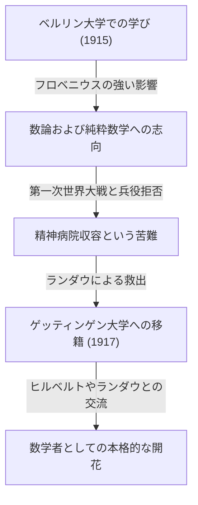

## 1. はじめに：カール・ルートヴィヒ・[ジーゲル](https://kenji.blog/p/siegel/)とは

カール・ルートヴィヒ・[ジーゲル](https://kenji.blog/p/siegel/)（Carl Ludwig Siegel, 1896年12月31日 - 1981年4月4日）は、20世紀の数学界において最も傑出した、そして巨大な足跡を残したドイツの数学者の一人です。彼の研究は主に数論（解析的整数論および代数的整数論）、ディオファントス方程式、ディオファントス近似、そして天体力学（複素力学系）の分野に集中しており、その業績は現代数学においても極めて重要な位置を占めています。

[ジーゲル](https://kenji.blog/p/siegel/)は、その驚異的な計算力と深い洞察力、そして複雑な解析的手法を巧みに操る能力で知られていました。抽象化と公理化が急激に進む20世紀の数学界にあって、彼は具体的な問題解決と古典的な手法の洗練を何よりも重んじ、独自のスタイルを貫き通しました。フランスの数学者集団であるブルバキが推進した極度な抽象化に対しては批判的であったことでも有名です。この記事では、[ジーゲル](https://kenji.blog/p/siegel/)の波乱に満ちた生涯のエピソードとともに、その卓越した数学的業績について深く掘り下げていきます。

## 2. [ジーゲル](https://kenji.blog/p/siegel/)の生涯：激動の時代を生きた数学者

### 2.1 若き日と学問への目覚め

[ジーゲル](https://kenji.blog/p/siegel/)は1896年、ドイツ帝国のベルリンで生まれました。幼い頃から数学と科学に対して特異な才能を示した彼は、1915年にフンボルト大学ベルリン（ベルリン大学）に入学しました。そこで彼は、物理学者のマックス・プランクや、代数学および群論の大家であるフェルディナント・ゲオルク・フロベニウスといった当時の最高峰の学者たちから学ぶという幸運に恵まれました。当初は天文学や物理学にも興味を持っていた[ジーゲル](https://kenji.blog/p/siegel/)でしたが、特にフロベニウスの情熱的な講義は、彼に数論への強い関心を抱かせ、数学の道を歩む決定的な契機となりました。

しかし、第一次世界大戦の勃発により、彼の学業は中断を余儀なくされました。1917年、[ジーゲル](https://kenji.blog/p/siegel/)は兵役に召集されましたが、彼の持つ強烈な反戦思想と個人的な信念から兵役を拒否しました。当時のドイツにおいて兵役拒否は重罪であり、彼は精神病院に収容されるという過酷な苦難を経験しました。この絶望的な状況から彼を救い出したのは、高名な数学者エドムント・ランダウでした。ランダウの尽力により解放された[ジーゲル](https://kenji.blog/p/siegel/)は、1917年にゲッティンゲン大学へと移籍することになります。ゲッティンゲンは当時、ダフィット・ヒルベルトやフェリックス・クラインといった巨星たちが在籍する、世界的な数学のメッカでした。この地で[ジーゲル](https://kenji.blog/p/siegel/)は水を得た魚のように才能を開花させます。

### 2.2 フランクフルト時代とナチスの台頭

1920年にゲッティンゲン大学で博士号を取得した[ジーゲル](https://kenji.blog/p/siegel/)は、ランダウの指導の下でディオファントス近似に関する重要な論文を執筆しました。1922年、彼は若くしてフランクフルト大学の正教授に就任し、そこからの16年間をフランクフルトで過ごすことになります。フランクフルト時代は彼の研究生活において最も生産的で輝かしい時期の一つであり、彼はここで多くの画期的な論文を発表しました。また、彼はそこでヘルマン・ワイルやパウル・エプシュタインのような多くの優れた数学者と親交を深め、活発な研究交流を行いました。

しかし、1930年代に入るとドイツ国内でナチス（国家社会主義ドイツ労働者党）が台頭し、ユダヤ系の同僚たちが次々と公職から追放されるという悲劇的な事態が発生しました。[ジーゲル](https://kenji.blog/p/siegel/)自身はユダヤ系ではありませんでしたが、ナチスの反ユダヤ主義政策やファシズムに対して強い反発と嫌悪感を抱き、弾圧されるユダヤ人の友人や同僚たちを公然と庇い続けました。彼はナチスの御用学者となることを断固として拒否し、政治的圧力に屈することなく学問の自由を守ろうと努めました。

### 2.3 亡命とアメリカでの研究生活

ナチス政権下のドイツにおける研究環境と生活環境が極度に悪化し、自身の身の危険も迫る中、[ジーゲル](https://kenji.blog/p/siegel/)はついに祖国を去る決意を固めました。第二次世界大戦が勃発した直後の1940年、彼はデンマークとノルウェーを経由するという危険なルートを経て、アメリカ合衆国へと亡命を果たしました。

アメリカでは、ニュージャージー州にあるプリンストン高等研究所 (Institute for Advanced Study, IAS) に迎えられました。当時、IASはヨーロッパから戦火を逃れてきた最高の頭脳が集まる場所となっており、[ジーゲル](https://kenji.blog/p/siegel/)はそこでアルベルト・アインシュタイン、[ジョン・フォン・ノイマン](https://kenji.blog/p/von-neumann/)、ヘルマン・ワイルらと共に充実した研究生活を送りました。アメリカ時代の[ジーゲル](https://kenji.blog/p/siegel/)は、数論の研究にとどまらず、天体力学や解析関数論の分野でも極めて重要な成果を次々と生み出しました。

### 2.4 ゲッティンゲンへの帰還と晩年

第二次世界大戦が終結した後、[ジーゲル](https://kenji.blog/p/siegel/)はアメリカに永住することなく、1951年に祖国ドイツへ戻るという重要な決断を下しました。彼はかつて学んだゲッティンゲン大学の教授として復帰し、戦火で荒廃したドイツの数学界の再建に尽力しました。彼はその後も活発な研究活動を続け、多くの優れた後進を育成しました。彼の講義は厳格かつ明晰であり、学生たちから深い尊敬を集めました。

1978年には、その卓越した生涯の業績が評価され、数学界における最高名誉の一つである第1回ウルフ賞数学部門をイズライル・ゲルファントと共に受賞しています。1981年4月4日、カール・ルートヴィヒ・[ジーゲル](https://kenji.blog/p/siegel/)はゲッティンゲンで84年の波乱に満ちた生涯を閉じました。

## 3. 偉大なる数学的業績

[ジーゲル](https://kenji.blog/p/siegel/)の数学的業績は驚くほど多岐にわたり、かつそれぞれの分野で決定的な結果を残しています。彼の研究の最大の特徴は、高度に複雑で巧妙な解析的手法を駆使して、数論の深く具体的な結果を導き出した点にあります。以下に、彼の最も著名な業績をいくつか詳しく解説します。

### 3.1 ディオファントス方程式と[ジーゲル](https://kenji.blog/p/siegel/)の定理

1929年に発表された論文「代数曲線の整数点に関する定理」は、彼の名を不朽のものとし、ディオファントス幾何学という新たな分野の扉を開きました。この定理は現在 **[ジーゲル](https://kenji.blog/p/siegel/)の定理** （Siegel's theorem on integral points）として知られています。

この定理は、「種数（genus）が $g \ge 1$ であるような代数曲線 $C$ 上には、整数点は有限個しか存在しない」という非常に強力で美しい主張です。より厳密には、代数体 $K$ とその整数環 $\mathcal{O}_K$ に対して、次のように記述されます。

$$
\text{もし } g(C) \ge 1 \text{ ならば、 } |C(\mathcal{O}_K)| < \infty
$$

例えば、 $x^3 + y^3 = c$ （ $c$ は0でない整数）のような楕円曲線（種数 $g=1$ ）の実数解や有理数解は無限に存在する可能性がありますが、 **整数解** に限れば必ず有限個にとどまるということをこの定理は保証しています。

この結果は、ディオファントス方程式の解の有限性に関する画期的なものであり、後の[ゲルト・ファルティングス](https://kenji.blog/p/faltings/)によるモデル・[ヴェイユ](https://kenji.blog/p/weil/)の定理の証明（種数2以上の代数曲線の有理数体の点の有限性）への道を切り開く重要な歴史的ステップとなりました。[ジーゲル](https://kenji.blog/p/siegel/)は、アクセル・トゥエによるディオファントス近似の定理を大幅に拡張し、さらにアーベル多様体上のヤコビアンの理論と結びつけることで、この驚くべき結果を導き出しました。

### 3.2 [ジーゲル](https://kenji.blog/p/siegel/)・ゼロ (Siegel Zero)

解析的整数論において、ディリクレの $L$ -関数 $L(s, \chi)$ の零点の分布は、素数定理の自然な拡張や算術級数定理において極めて重要です。一般化された[リーマン予想](https://kenji.blog/p/riemann-hypothesis/)（Generalized Riemann Hypothesis, GRH）によれば、実部が $0$ と $1$ の間にある臨界帯の零点は、すべて実部が $1/2$ の直線上にあるとされています。

しかし、実二次体の指標（実指標） $\chi$ に対して、実部が非常に $1$ に近い実数零点が存在する可能性が現在の数学では排除されていません。このような仮想的な反例となる零点を **[ジーゲル](https://kenji.blog/p/siegel/)・ゼロ** (Siegel zero) または例外零点と呼びます。

[ジーゲル](https://kenji.blog/p/siegel/)は1935年に、この不吉な零点が存在したとしても、その位置について強い上からの評価（ $1$ からの距離の下限）を与えました。具体的には、任意の $\epsilon > 0$ に対して、ある定数 $C(\epsilon) > 0$ が存在し、実指標 $\chi$ のモジュラス $q$ に対して、 $s=1$ における関数の値が次を満たすことを証明しました。

$$
L(1, \chi) > C(\epsilon) q^{-\epsilon}
$$

この評価は、類数問題（特に虚二次体の類数が $1$ になる場合の決定）や算術級数中の素数の分布に関する深い結果を導くために不可欠なツールとなっています。ただし、この定理には大きな特徴があり、定数 $C(\epsilon)$ は「計算不能（ineffective）」であるという性質を持っています。つまり、定理は定数の存在を保証するものの、その具体的な数値を導き出す方法を与えていないのです。この非有効性は、解析的整数論における現代の最大の謎の一つであり、現在も多くの数学者が[ジーゲル](https://kenji.blog/p/siegel/)・ゼロの非存在（あるいは計算可能な評価）を目指して研究を続けています。

### 3.3 [ジーゲル](https://kenji.blog/p/siegel/)・モジュラー形式と二次形式

[ジーゲル](https://kenji.blog/p/siegel/)は、多変数の保型形式の理論、特に今日 **[ジーゲル](https://kenji.blog/p/siegel/)・モジュラー形式** （Siegel modular forms）と呼ばれる理論を創始しました。これは、19世紀から研究されてきた1変数の楕円モジュラー形式を、多変数関数論の枠組みへと大胆かつ自然に拡張したものです。

[ジーゲル](https://kenji.blog/p/siegel/)上半空間 $\mathcal{H}_g$ は、次のように定義されます：

$$
\mathcal{H}_g = \left\{ Z \in M_g(\mathbb{C}) \mid Z^T = Z, \text{ Im}(Z) \text{ は正定値} \right\}
$$

ここで $g=1$ のとき、この空間は通常のポアンカレ上半平面と完全に一致します。[ジーゲル](https://kenji.blog/p/siegel/)は、二次形式の解析的理論を深める過程でこの高次元の空間を導入し、この空間上で定義される保型形式が、二次形式による整数の表現の数と深く結びついていることを示しました。

さらに彼は、二次形式の解析的理論において **[ジーゲル](https://kenji.blog/p/siegel/)・[ヴェイユ](https://kenji.blog/p/weil/)の公式** （Siegel-Weil formula）の基礎を築きました。これは、二次形式による表現の数を、アイゼンシュタイン級数のフーリエ係数として記述する驚異的な公式であり、局所・大域原則（[ハッセ](https://kenji.blog/p/hasse/)の原理）の解析的表現とも言えます。これらの理論は、後の保型表現論やラングランズ・プログラムの基礎となる不可欠な概念です。

### 3.4 [ジーゲル](https://kenji.blog/p/siegel/)の補題と超越数論

超越数論の分野においても、彼は **[ジーゲル](https://kenji.blog/p/siegel/)の補題** （Siegel's lemma）と呼ばれる極めて強力な定理を証明しました。この補題は、一見すると単なる線形代数の初等的な結果のようにも見えますが、その応用範囲は計り知れません。

定理の主張は次のようなものです。「係数が整数であるような連立一次方程式系において、方程式の数 $M$ よりも未知数の数 $N$ の方が十分に多い（ $N > M$ ）場合、その非自明な整数解で、各成分の絶対値が比較的小さい（係数の大きさに応じて適切に上から抑えられる）ものが必ず存在する」というものです。

ピジョンの巣原理（鳩の巣原理）を用いたエレガントな証明を持つこの補題は、超越数の構成やディオファントス近似、さらには後のアラン・ベイカーによる対数の一次形式の理論など、現代の超越数論において不可欠な基本ツールとして頻繁に用いられています。

### 3.5 天体力学とスモール・ディバイザー問題

[ジーゲル](https://kenji.blog/p/siegel/)は純粋数学にとどまらず、天体力学、特に多体系の運動を記述する三体問題にも異常なまでの執念を燃やしました。彼は、アンリ・ポアンカレが切り開いた力学系の研究を発展させ、微分方程式の解の安定性に関する画期的な結果を残しました。

1941年、彼は解析力学および複素力学系における「[ジーゲル](https://kenji.blog/p/siegel/)中心定理」を証明しました。これは、複素平面における正則関数の不動点の近傍で、関数がいつ線形化可能かという問題を解決したものです。関数のテイラー展開において、 $\lambda$ を微分の値としたとき、 $\lambda$ が $1$ の冪根に近い値をとる場合、分母に非常に小さな値が現れて級数が発散してしまうという「小さな分母の問題（small divisor problem）」が発生します。

[ジーゲル](https://kenji.blog/p/siegel/)は、ディオファントス近似の高度な技術を用いて、 $\lambda$ がある種の無理数条件（ディオファントス条件）を満たすならば、小さな分母による発散を回避し、級数が収束して解析的に線形化可能であることを厳密に証明しました。

$$
\left| \lambda^n - 1 \right| > \frac{C}{n^\nu} \quad (\forall n \ge 1)
$$

この結果は、力学系における小さな分母の問題を見事に克服した最初の成功例であり、後のアンドレイ・コルモゴロフ、ウラジーミル・アーノルド、ユルゲン・モーザーによる **KAM理論** （KAM theorem）の直接的な先駆けとなる歴史的かつ決定的な業績です。

## 4. [ジーゲル](https://kenji.blog/p/siegel/)の特異な思想と数学観

[ジーゲル](https://kenji.blog/p/siegel/)の数学観は、彼の残した業績と同じくらい際立っており、時に論争の的となりました。彼は、数学は常に具体的な問題と密接に結びついているべきであり、不必要に抽象化を進めることは数学の本来の生命力を奪うものであると確信していました。

20世紀中頃、フランスの若手数学者集団ブルバキ・グループが提唱した、数学全体を集合論と公理系から再構築しようとする抽象的なスタイルが世界中を席巻していました。しかし[ジーゲル](https://kenji.blog/p/siegel/)は、この傾向に対して痛烈な批判を浴びせました。彼は、ブルバキのスタイルを「空虚な形式主義」と切り捨て、次のような趣旨の発言を残しています。

> 「最近の数学の過度な抽象化は、中身のない形式主義に陥っており、意味のある結果を生み出していない。我々は、[ガウス](https://kenji.blog/p/gauss/)や[オイラー](https://kenji.blog/p/euler/)、リーマン、そしてヤコビが取り組んだような、真に豊かな内容を持つ具体的な問題に立ち返るべきである。」

この強い信念のため、彼の論文は非常に読み応えがある一方で、現代の読者にとっては技巧的で長大な計算が随所に現れるため、解読に多大な労力を要することがあります。彼は「抽象的な概念や枠組みは、具体的な困難な問題を解くための一つの手段に過ぎない」という哲学を生涯にわたって曲げませんでした。その孤高の姿勢は、彼を同時代の数学者たちから少し際立った存在にしていました。

## 5. 結論と[ジーゲル](https://kenji.blog/p/siegel/)の遺産

カール・ルートヴィヒ・[ジーゲル](https://kenji.blog/p/siegel/)は、その比類なき解析的才能と古典的数学への深い敬意によって、数論、ディオファントス幾何学、そして天体力学において時代を画する決定的な業績を残しました。

[ジーゲル](https://kenji.blog/p/siegel/)・ゼロ、[ジーゲル](https://kenji.blog/p/siegel/)の定理、[ジーゲル](https://kenji.blog/p/siegel/)・モジュラー形式、そして[ジーゲル](https://kenji.blog/p/siegel/)の補題といった彼の名前を冠した数々の概念や定理は、現代の数学者たちが日々用いる共通の言語となり、現在進行形の最先端の研究においても不可欠な基礎となっています。

彼の生涯は、二度の世界大戦という困難な時代にあっても、自らの政治的信念と学問への真摯な態度を貫き通した、真の学者の姿を私たちに示しています。過度な抽象化の波に一人抗い、複雑な具象の中に普遍的で美しい真理を見出した彼の数学は、これからも世代を超えて燦然と輝き続けることでしょう。
