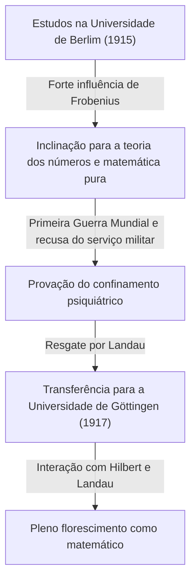

## 1. Introdução: Quem é [Carl Ludwig Siegel](https://kenji.blog/p/siegel/)?

[Carl Ludwig Siegel](https://kenji.blog/p/siegel/) (31 de dezembro de 1896 – 4 de abril de 1981) foi um dos matemáticos alemães mais excepcionais do século XX, deixando um legado maciço no mundo matemático. Sua pesquisa concentrou-se principalmente na teoria dos números (teoria analítica e algébrica dos números), equações diofantinas, aproximações diofantinas e mecânica celeste (sistemas dinâmicos complexos). Suas realizações continuam a ocupar uma posição extremamente crucial na matemática moderna.

Siegel era conhecido por sua impressionante proeza computacional, profundo discernimento e capacidade de lidar com maestria com técnicas analíticas complexas. Em um cenário matemático do século XX que se movia rapidamente em direção à abstração e axiomatização, ele valorizava acima de tudo a resolução de problemas concretos e o refinamento de métodos clássicos, mantendo um estilo ferozmente independente. Ele também é famoso por sua forte crítica à abstração extrema promovida pelo grupo matemático francês Bourbaki. Este artigo investiga profundamente suas extraordinárias realizações matemáticas, juntamente com episódios de sua vida turbulenta.

## 2. A Vida de Siegel: Um Matemático em Tempos Turbulentos

### 2.1 Início de Vida e Despertar Acadêmico

Siegel nasceu em 1896 em Berlim, no Império Alemão. Demonstrando talento excepcional em matemática e ciências desde tenra idade, ele ingressou na Universidade Humboldt de Berlim (Universidade de Berlim) em 1915. Lá, ele teve a sorte de aprender com alguns dos maiores estudiosos da época, incluindo o físico Max Planck e o mestre em álgebra e teoria dos grupos, Ferdinand Georg Frobenius. Inicialmente, Siegel também se interessava por astronomia e física, mas as palestras apaixonadas de Frobenius despertaram um profundo interesse pela teoria dos números, tornando-se o catalisador decisivo para que ele seguisse um caminho na matemática.

No entanto, a eclosão da Primeira Guerra Mundial forçou a interrupção de seus estudos. Em 1917, Siegel foi convocado para o serviço militar, mas recusou-se a servir devido a seus fortes sentimentos antiguerra e convicções pessoais. Naquela época, recusar o serviço militar era um crime grave na Alemanha, e ele suportou a dura provação de ser confinado em um hospital psiquiátrico. Ele foi resgatado dessa situação desesperadora pelo eminente matemático Edmund Landau. Libertado graças aos esforços de Landau, Siegel transferiu-se para a Universidade de Göttingen em 1917. Göttingen era então a meca global da matemática, lar de gigantes como [David Hilbert](https://kenji.blog/p/hilbert/) e Felix Klein. Nesse ambiente, Siegel prosperou e deixou seus talentos florescerem de verdade.

### 2.2 A Era de Frankfurt e a Ascensão dos Nazistas

Após obter seu doutorado na Universidade de Göttingen em 1920, sob a supervisão de Landau, Siegel escreveu artigos importantes sobre aproximações diofantinas. Em 1922, em tenra idade, foi nomeado professor titular na Universidade de Frankfurt, onde passaria os 16 anos seguintes. A era de Frankfurt foi um dos períodos mais produtivos e brilhantes de sua carreira de pesquisador, durante o qual publicou muitos artigos inovadores. Lá ele também aprofundou suas amizades e se envolveu em um animado intercâmbio acadêmico com muitos matemáticos excelentes, como Hermann Weyl e Paul Epstein.

No entanto, com o início da década de 1930, os nazistas (Partido Nacional-Socialista dos Trabalhadores Alemães) chegaram ao poder na Alemanha, levando a uma situação trágica em que colegas judeus foram sistematicamente expulsos de cargos públicos. Embora o próprio Siegel não fosse judeu, ele sentia forte repulsa e oposição às políticas antissemitas nazistas e ao fascismo, continuando abertamente a proteger seus amigos e colegas judeus perseguidos. Ele recusou-se firmemente a se tornar uma ferramenta acadêmica para os nazistas e se esforçou para defender a liberdade acadêmica sem se curvar à pressão política.

### 2.3 Exílio e Vida de Pesquisa nos Estados Unidos

À medida que o ambiente de pesquisa e a vida na Alemanha sob o regime nazista se deterioravam drasticamente, e com sua própria segurança pessoal em risco, Siegel finalmente tomou a decisão de deixar sua terra natal. Em 1940, pouco depois do início da Segunda Guerra Mundial, ele conseguiu escapar para os Estados Unidos através de uma rota perigosa pela Dinamarca e Noruega.

Nos Estados Unidos, foi recebido no Instituto de Estudos Avançados (IAS) em Princeton, Nova Jersey. Naquela época, o IAS havia se tornado um santuário para as maiores mentes que fugiam da guerra na Europa, e Siegel desfrutou de uma vida de pesquisa gratificante ao lado de figuras como Albert Einstein, John von Neumann e Hermann Weyl. Durante seus anos na América, a pesquisa de Siegel estendeu-se além da teoria dos números; ele produziu sucessivamente resultados extremamente importantes nos campos da mecânica celeste e teoria das funções analíticas.

### 2.4 Retorno a Göttingen e Últimos Anos

Após o fim da Segunda Guerra Mundial, Siegel optou por não residir permanentemente nos Estados Unidos, tomando a importante decisão de retornar à sua terra natal, a Alemanha, em 1951. Voltou como professor para a Universidade de Göttingen, onde outrora estudara, e dedicou-se à reconstrução da comunidade matemática alemã, que fora devastada pela guerra. Ele continuou suas vigorosas atividades de pesquisa e formou muitos sucessores de destaque. Suas palestras eram rigorosas e lúcidas, o que lhe rendeu o profundo respeito de seus alunos.

Em 1978, em reconhecimento às extraordinárias realizações de toda a sua vida, foi premiado conjuntamente com o primeiro Prêmio Wolf de Matemática, uma das maiores honrarias no mundo matemático, juntamente com Israel Gelfand. Em 4 de abril de 1981, [Carl Ludwig Siegel](https://kenji.blog/p/siegel/) faleceu em Göttingen, encerrando sua vida agitada de 84 anos.

## 3. Grandes Realizações Matemáticas

As realizações matemáticas de Siegel são incrivelmente diversas, mas ele deixou resultados decisivos em cada campo. A maior característica de sua pesquisa é o uso de técnicas analíticas altamente complexas e engenhosas para derivar resultados profundos e concretos na teoria dos números. Abaixo encontra-se uma explicação detalhada de algumas de suas realizações mais famosas.

### 3.1 Equações Diofantinas e o Teorema de Siegel

Seu artigo de 1929, "Sobre os pontos inteiros de curvas algébricas", imortalizou seu nome e abriu as portas para o novo campo da geometria diofantina. Este teorema é hoje conhecido como o **teorema de Siegel** (teorema de Siegel sobre pontos inteiros).

Este teorema é uma afirmação muito poderosa e bela de que "uma curva algébrica $C$ de gênero $g \ge 1$ tem apenas um número finito de pontos inteiros". Mais estritamente, para um corpo de números algébricos $K$ e seu anel de inteiros $\mathcal{O}_K$, isso é afirmado da seguinte forma:

$$
\text{Se } g(C) \ge 1 \text{, então } |C(\mathcal{O}_K)| < \infty
$$

Por exemplo, embora possa haver infinitas soluções reais ou racionais para uma curva elíptica (gênero $g=1$) como $x^3 + y^3 = c$ (onde $c$ é um inteiro não nulo), este teorema garante que se nos restringirmos a **soluções inteiras**, haverá sempre apenas um número finito.

Este resultado foi inovador em relação à finitude das soluções das equações diofantinas e tornou-se um passo histórico crucial que abriu caminho para a posterior prova do teorema de Mordell-Weil (a finitude dos pontos racionais em curvas de gênero 2 ou superior) por [Gerd Faltings](https://kenji.blog/p/faltings/). Siegel derivou este resultado surpreendente ampliando significativamente o teorema de Axel Thue sobre aproximações diofantinas e combinando-o com a teoria dos jacobianos sobre variedades abelianas.

### 3.2 Zero de Siegel

Na teoria analítica dos números, a distribuição dos zeros da função $L$ de Dirichlet $L(s, \chi)$ é de extrema importância para as extensões naturais do teorema dos números primos e do teorema sobre progressões aritméticas. De acordo com a Hipótese Generalizada de Riemann (GRH), todos os zeros na faixa crítica com uma parte real entre $0$ e $1$ devem situar-se na reta onde a parte real é $1/2$.

No entanto, para um caráter real (de um corpo quadrático real) $\chi$, a matemática atual não excluiu a possibilidade de existir um zero real com uma parte real muito próxima a $1$. Tal hipotético zero de contraexemplo é chamado de **zero de Siegel** (Siegel zero) ou zero excepcional.

Em 1935, Siegel forneceu uma forte avaliação de limite superior (um limite inferior na distância a $1$) para a posição deste sinistro zero, mesmo que existisse. Especificamente, ele provou que para qualquer $\epsilon > 0$, existe uma constante $C(\epsilon) > 0$ tal que, para o módulo $q$ de um caráter real $\chi$, o valor da função em $s=1$ satisfaz o seguinte:

$$
L(1, \chi) > C(\epsilon) q^{-\epsilon}
$$

Esta avaliação tornou-se uma ferramenta indispensável para derivar resultados profundos relacionados ao problema do número de classes (especialmente na determinação dos casos onde o número de classes de um corpo quadrático imaginário é $1$) e à distribuição dos números primos em progressões aritméticas. No entanto, este teorema tem uma particularidade importante: a constante $C(\epsilon)$ tem a propriedade de ser "inefetiva" (ineffective). Isso significa que, embora o teorema garanta a existência da constante, ele não fornece um método para derivar seu valor numérico específico. Essa inefetividade é um dos maiores mistérios modernos na teoria analítica dos números, e muitos matemáticos continuam pesquisando com o objetivo de provar a não existência (ou encontrar um limite computável) do zero de Siegel.

### 3.3 Formas Modulares de Siegel e Formas Quadráticas

Siegel fundou a teoria das formas automorfas multivariáveis, em particular a teoria hoje conhecida como **formas modulares de Siegel**. Foi uma extensão audaciosa e natural das formas modulares elípticas de uma variável, estudadas desde o século XIX, para a estrutura da teoria das funções multivariáveis.

O semiespaço superior de Siegel $\mathcal{H}_g$ é definido da seguinte maneira:

$$
\mathcal{H}_g = \left\{ Z \in M_g(\mathbb{C}) \mid Z^T = Z, \text{ Im}(Z) \text{ é definida positiva} \right\}
$$

Aqui, quando $g=1$, esse espaço coincide perfeitamente com o semiplano superior de Poincaré habitual. Siegel introduziu este espaço de dimensão superior durante o processo de aprofundamento na teoria analítica das formas quadráticas, e mostrou que as formas automorfas definidas neste espaço estão profundamente conectadas ao número de representações de inteiros por formas quadráticas.

Além disso, ele estabeleceu as bases para a **fórmula de Siegel-Weil** dentro da teoria analítica das formas quadráticas. Esta é uma fórmula maravilhosa que descreve o número de representações por formas quadráticas como os coeficientes de Fourier de séries de Eisenstein, e pode ser considerada uma expressão analítica do princípio local-global (princípio de Hasse). Essas teorias são conceitos indispensáveis que formam a base da teoria posterior das representações automorfas e do programa de Langlands.

### 3.4 Lema de Siegel e Teoria da Transcendência

No campo da teoria dos números transcendentes, ele também provou um teorema extremamente poderoso chamado **lema de Siegel** (Siegel's lemma). Embora, à primeira vista, esse lema possa parecer um mero resultado elementar da álgebra linear, seu alcance de aplicação é imensurável.

A afirmação do teorema é a seguinte: "Em um sistema de equações lineares simultâneas onde os coeficientes são inteiros, se o número de incógnitas $N$ é suficientemente maior que o número de equações $M$ ( $N > M$ ), existe sempre uma solução inteira não trivial onde o valor absoluto de cada componente é relativamente pequeno (limitado superiormente de forma apropriada, de acordo com o tamanho dos coeficientes)."

Com uma demonstração elegante usando o princípio da casa dos pombos (princípio das gavetas de Dirichlet), esse lema é usado com frequência como uma ferramenta básica indispensável na moderna teoria da transcendência, como na construção de números transcendentes, aproximações diofantinas e, mais tarde, na teoria de [Alan Baker](https://kenji.blog/p/baker/) das formas lineares em logaritmos.

### 3.5 Mecânica Celeste e o Problema dos Pequenos Divisores

Siegel não se limitou à matemática pura; ele ardia de uma obsessão extraordinária pela mecânica celeste, especialmente pelo problema dos três corpos, que descreve o movimento dos sistemas de muitos corpos. Ele desenvolveu o estudo dos sistemas dinâmicos iniciado por [Henri Poincaré](https://kenji.blog/p/poincare/) e deixou resultados inovadores sobre a estabilidade das soluções de equações diferenciais.

Em 1941, provou o "teorema do centro de Siegel" na mecânica analítica e em sistemas dinâmicos complexos. Isso resolveu a questão de quando uma função holomorfa é linearizável na vizinhança de seu ponto fixo no plano complexo. Na expansão de Taylor da função, se $\lambda$ representa o valor da derivada, quando $\lambda$ assume um valor próximo de uma raiz da unidade, valores muito pequenos aparecem no denominador, causando a divergência da série - um fenômeno conhecido como o "problema dos pequenos divisores" (small divisor problem).

Usando técnicas avançadas de aproximação diofantina, Siegel demonstrou rigorosamente que se $\lambda$ satisfaz um certo tipo de condição de irracionalidade (uma condição diofantina), a divergência causada pelos pequenos denominadores é evitada e a série converge, tornando-a analiticamente linearizável.

$$
\left| \lambda^n - 1 \right| > \frac{C}{n^\nu} \quad (\forall n \ge 1)
$$

Este resultado foi o primeiro exemplo bem-sucedido de superação brilhante do problema dos pequenos divisores em sistemas dinâmicos, e é uma realização histórica e decisiva que serviu como precursor direto à **teoria KAM** (teorema KAM) desenvolvida posteriormente por Andrey Kolmogorov, Vladimir Arnold e Jürgen Moser.

## 4. A Filosofia Única de Siegel e a Visão da Matemática

A visão de Siegel sobre a matemática era tão impressionante quanto as realizações que deixou, e por vezes foi objeto de controvérsia. Ele estava convencido de que a matemática deveria sempre estar intimamente ligada a problemas concretos e que forçar uma abstração desnecessária roubava da matemática sua vitalidade original.

Em meados do século XX, um estilo abstrato defendido pelo jovem coletivo matemático francês, o grupo Bourbaki - que tentava reconstruir toda a matemática a partir da teoria dos conjuntos e sistemas axiomáticos - estava varrendo o mundo. No entanto, Siegel dirigiu severas críticas a essa tendência. Ele rejeitou o estilo Bourbaki como "formalismo vazio" e deixou comentários como:

> "A abstração excessiva da matemática recente caiu num formalismo vazio e não produz resultados significativos. Devemos retornar aos problemas concretos, ricos em conteúdo verdadeiro, do tipo que Gauss, Euler, Riemann e Jacobi enfrentaram."

Devido a essa forte convicção, a leitura de seus artigos é muito recompensadora; por outro lado, para os leitores modernos, os cálculos longos e altamente técnicos aparecem por toda parte, frequentemente exigindo um esforço imenso para serem decifrados. Ele nunca comprometeu a sua filosofia de vida de que "os conceitos e estruturas abstratos são apenas um meio para resolver problemas concretos e difíceis". Essa postura distante o tornou uma figura um tanto peculiar entre os matemáticos de sua época.

## 5. Conclusão e o Legado de Siegel

Através de seu talento analítico inigualável e profunda reverência pela matemática clássica, [Carl Ludwig Siegel](https://kenji.blog/p/siegel/) deixou realizações decisivas e que marcaram época na teoria dos números, geometria diofantina e mecânica celeste.

Os numerosos conceitos e teoremas com seu nome, como o zero de Siegel, o teorema de Siegel, as formas modulares de Siegel e o lema de Siegel, tornaram-se linguagens comuns usadas diariamente pelos matemáticos modernos, servindo como alicerces indispensáveis mesmo nas pesquisas de ponta em andamento.

A sua vida mostra-nos a verdadeira figura de um erudito que se manteve fiel às suas convicções políticas e atitude sincera para com o mundo académico, mesmo durante os tempos difíceis de duas Guerras Mundiais. Resistindo sozinho à onda de excessiva abstração, e descobrindo verdades universais e belas em meio à complexidade concreta, sua matemática continuará, sem dúvida, a brilhar intensamente através das gerações.
