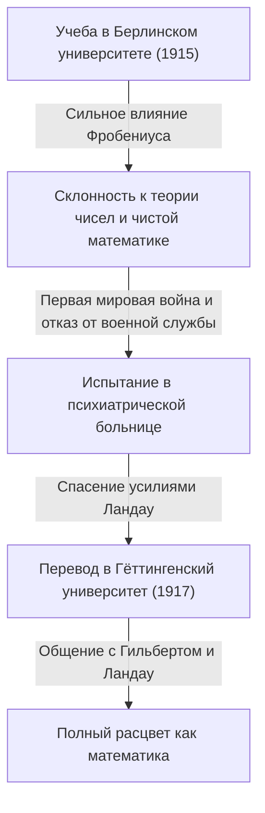

## 1. Введение: Кто такой [Карл Людвиг Зигель](https://kenji.blog/ru/p/siegel/)?

[Карл Людвиг Зигель](https://kenji.blog/ru/p/siegel/) (31 декабря 1896 – 4 апреля 1981) был одним из самых выдающихся немецких математиков 20-го века, оставившим огромное наследие в математическом мире. Его исследования в основном были сосредоточены на теории чисел (аналитической и алгебраической теории чисел), диофантовых уравнениях, диофантовых приближениях и небесной механике (сложных динамических системах). Его достижения продолжают занимать исключительно важное положение в современной математике.

Зигель был известен своим поразительным вычислительным мастерством, глубокой проницательностью и способностью виртуозно владеть сложными аналитическими методами. В математическом ландшафте 20-го века, который стремительно двигался к абстракции и аксиоматизации, он превыше всего ценил решение конкретных задач и совершенствование классических методов, сохраняя при этом бескомпромиссно независимый стиль. Он также известен своей резкой критикой крайнего абстракционизма, продвигаемого французской математической группой Бурбаки. В этой статье подробно рассматриваются его выдающиеся математические достижения наряду с эпизодами из его бурной жизни.

## 2. Жизнь Зигеля: Математик в неспокойные времена

### 2.1 Ранние годы и академическое пробуждение

Зигель родился в 1896 году в Берлине, Германская империя. С ранних лет проявляя исключительные способности к математике и естественным наукам, в 1915 году он поступил в Берлинский университет имени Гумбольдта (Берлинский университет). Там ему посчастливилось учиться у некоторых величайших ученых той эпохи, в том числе у физика Макса Планка и мастера алгебры и теории групп Фердинанда Георга Фробениуса. Изначально Зигель также интересовался астрономией и физикой, но страстные лекции Фробениуса пробудили в нем глубокий интерес к теории чисел, став решающим катализатором, побудившим его выбрать путь математики.

Однако начавшаяся Первая мировая война вынудила прервать учебу. В 1917 году Зигель был призван на военную службу, но отказался служить из-за своих сильных антивоенных убеждений и личных взглядов. В то время отказ от военной службы в Германии считался серьезным преступлением, и ему пришлось пережить тяжелое испытание — заключение в психиатрическую больницу. Из этой отчаянной ситуации его спас выдающийся математик Эдмунд Ландау. Освободившись благодаря усилиям Ландау, Зигель в 1917 году перевелся в Гёттингенский университет. В то время Гёттинген был мировой Меккой математики, домом для таких гигантов, как [Давид Гильберт](https://kenji.blog/ru/p/hilbert/) и Феликс Клейн. В этой среде Зигель преуспел и позволил своим талантам по-настоящему расцвести.

### 2.2 Франкфуртский период и приход нацистов к власти

Получив степень доктора философии в Гёттингенском университете в 1920 году под руководством Ландау, Зигель написал важные работы по диофантовым приближениям. В 1922 году, будучи совсем молодым, он был назначен полным профессором во Франкфуртском университете, где он провел следующие 16 лет. Франкфуртский период стал одним из самых продуктивных и блестящих этапов его исследовательской карьеры, в течение которого он опубликовал множество новаторских работ. Там же он укрепил дружеские связи и активно участвовал в научном обмене со многими выдающимися математиками, такими как Герман Вейль и Пауль Эпштейн.

Однако в начале 1930-х годов к власти в Германии пришли нацисты (Национал-социалистическая немецкая рабочая партия), что привело к трагической ситуации, когда коллег-евреев систематически изгоняли с государственных должностей. Хотя сам Зигель не был евреем, он испытывал сильное отвращение к нацистской антисемитской политике и фашизму, открыто продолжая защищать своих преследуемых друзей и коллег-евреев. Он твердо отказался стать академическим инструментом в руках нацистов и старался защищать академическую свободу, не прогибаясь под политическим давлением.

### 2.3 Изгнание и исследовательская жизнь в США

Поскольку условия для исследований и жизни в Германии при нацистском режиме резко ухудшились, а его личная безопасность оказалась под угрозой, Зигель наконец принял решение покинуть родину. В 1940 году, вскоре после начала Второй мировой войны, ему удалось бежать в Соединенные Штаты по опасному маршруту через Данию и Норвегию.

В Соединенных Штатах его приветствовали в Институте перспективных исследований (IAS) в Принстоне, штат Нью-Джерси. В то время IAS стал убежищем для величайших умов, спасавшихся от войны в Европе, и Зигель наслаждался насыщенной исследовательской жизнью бок о бок с такими фигурами, как Альберт Эйнштейн, Джон фон Нейман и Герман Вейль. В американские годы исследования Зигеля вышли за рамки теории чисел; он последовательно получил исключительно важные результаты в области небесной механики и теории аналитических функций.

### 2.4 Возвращение в Гёттинген и поздние годы

После окончания Второй мировой войны Зигель предпочел не оставаться на постоянное жительство в США, приняв важное решение вернуться на свою родину, в Германию, в 1951 году. Он вернулся в качестве профессора в Гёттингенский университет, где когда-то учился, и посвятил себя восстановлению немецкого математического сообщества, разрушенного войной. Он продолжил свою активную исследовательскую деятельность и воспитал множество выдающихся преемников. Его лекции были строгими и ясными, что снискало ему глубокое уважение студентов.

В 1978 году, в знак признания его выдающихся прижизненных достижений, он был удостоен первой премии Вольфа по математике, одной из самых высоких наград в математическом мире, совместно с Израилем Гельфандом. 4 апреля 1981 года [Карл Людвиг Зигель](https://kenji.blog/ru/p/siegel/) скончался в Гёттингене, завершив свою насыщенную событиями 84-летнюю жизнь.

## 3. Великие математические достижения

Математические достижения Зигеля поразительно разнообразны, но в каждой области он оставил решающие результаты. Главной особенностью его исследований является использование чрезвычайно сложных и хитроумных аналитических методов для получения глубоких, конкретных результатов в теории чисел. Ниже приведено подробное объяснение некоторых из его самых известных достижений.

### 3.1 [Диофант](https://kenji.blog/ru/p/diophantus/)овы уравнения и теорема Зигеля

Его статья 1929 года «О целых точках алгебраических кривых» обессмертила его имя и открыла дверь в новую область диофантовой геометрии. Эта теорема теперь известна как **теорема Зигеля** (Siegel's theorem on integral points).

Эта теорема представляет собой чрезвычайно мощное и красивое утверждение о том, что «алгебраическая кривая $C$ рода $g \ge 1$ имеет лишь конечное число целых точек». Более строго, для поля алгебраических чисел $K$ и его кольца целых $\mathcal{O}_K$, это формулируется следующим образом:

$$
\text{Если } g(C) \ge 1 \text{, то } |C(\mathcal{O}_K)| < \infty
$$

Например, хотя для эллиптической кривой (род $g=1$) вида $x^3 + y^3 = c$ (где $c$ — ненулевое целое число) может существовать бесконечное множество действительных или рациональных решений, эта теорема гарантирует, что если ограничиться **целыми решениями**, их всегда будет конечное число.

Этот результат стал новаторским в вопросе конечности решений диофантовых уравнений и стал важнейшим историческим шагом, проложившим путь к последующему доказательству теоремы Морделла-Вейля (конечность рациональных точек на кривых рода 2 и выше) Гердом Фальтингсом. Зигель получил этот поразительный результат, значительно расширив теорему Акселя Туэ о диофантовых приближениях и объединив её с теорией якобианов на абелевых многообразиях.

### 3.2 Ноль Зигеля

В аналитической теории чисел распределение нулей $L$-функции Дирихле $L(s, \chi)$ имеет огромное значение для естественных расширений теоремы о простых числах и теоремы об арифметических прогрессиях. Согласно Обобщенной гипотезе Римана (GRH), все нули в критической полосе с вещественной частью от $0$ до $1$ должны лежать на прямой, где вещественная часть равна $1/2$.

Однако для вещественного характера (вещественного квадратичного поля) $\chi$, возможность существования вещественного нуля с вещественной частью, очень близкой к $1$, не исключена современной математикой. Такой гипотетический контрпримерный нуль называется **нулем Зигеля** (Siegel zero) или исключительным нулем.

В 1935 году Зигель дал сильную верхнюю оценку (нижнюю границу расстояния до $1$) для положения этого зловещего нуля, даже если он существует. В частности, он доказал, что для любого $\epsilon > 0$ существует константа $C(\epsilon) > 0$ такая, что для модуля $q$ вещественного характера $\chi$, значение функции в точке $s=1$ удовлетворяет следующему условию:

$$
L(1, \chi) > C(\epsilon) q^{-\epsilon}
$$

Эта оценка стала незаменимым инструментом для вывода глубоких результатов, касающихся проблемы числа классов (особенно определения случаев, когда число классов мнимого квадратичного поля равно $1$) и распределения простых чисел в арифметических прогрессиях. Однако у этой теоремы есть важная особенность: константа $C(\epsilon)$ обладает свойством быть «неэффективной» (ineffective). Это означает, что хотя теорема и гарантирует существование константы, она не дает метода для вычисления её конкретного численного значения. Эта неэффективность является одной из величайших современных загадок аналитической теории чисел, и многие математики продолжают исследования с целью доказать отсутствие (или найти вычислимую границу) нуля Зигеля.

### 3.3 Модулярные формы Зигеля и квадратичные формы

Зигель заложил основы теории автоморфных форм от многих переменных, в частности теории, известной сегодня как **модулярные формы Зигеля**. Это было смелое и естественное расширение теории эллиптических модулярных форм от одной переменной, изучавшихся с 19-го века, в рамки теории функций многих переменных.

Верхняя полуплоскость Зигеля $\mathcal{H}_g$ определяется следующим образом:

$$
\mathcal{H}_g = \left\{ Z \in M_g(\mathbb{C}) \mid Z^T = Z, \text{ Im}(Z) \text{ — положительно определена} \right\}
$$

Здесь при $g=1$ это пространство полностью совпадает с обычной верхней полуплоскостью Пуанкаре. Зигель ввел это многомерное пространство в процессе углубления аналитической теории квадратичных форм и показал, что автоморфные формы, определенные на этом пространстве, глубоко связаны с числом представлений целых чисел квадратичными формами.

Более того, он заложил основы для **формулы Зигеля-Вейля** в рамках аналитической теории квадратичных форм. Это чудесная формула, которая описывает число представлений квадратичными формами как коэффициенты Фурье рядов Эйзенштейна, и ее можно назвать аналитическим выражением локально-глобального принципа (принципа Хассе). Эти теории являются незаменимыми концепциями, которые составляют основу более поздней теории автоморфных представлений и программы Ленглендса.

### 3.4 Лемма Зигеля и теория трансцендентности

В области теории трансцендентных чисел он также доказал исключительно мощную теорему, называемую **леммой Зигеля** (Siegel's lemma). Хотя на первый взгляд эта лемма может показаться просто элементарным результатом линейной алгебры, сфера ее применения безмерна.

Утверждение теоремы звучит следующим образом: «В системе линейных алгебраических уравнений, коэффициенты которых являются целыми числами, если число неизвестных $N$ достаточно больше числа уравнений $M$ ( $N > M$ ), всегда существует нетривиальное целочисленное решение, в котором абсолютное значение каждой компоненты относительно невелико (соответствующим образом ограничено сверху в зависимости от размера коэффициентов)».

Имея элегантное доказательство с использованием принципа Дирихле (принципа ящиков Дирихле), эта лемма часто используется в качестве незаменимого базового инструмента в современной теории трансцендентности, например при конструировании трансцендентных чисел, диофантовых приближениях, а затем в теории линейных форм от логарифмов Алана Бейкера.

### 3.5 Небесная механика и проблема малых знаменателей

Зигель не ограничивался чистой математикой; он горел необычайной страстью к небесной механике, особенно к задаче трех тел, описывающей движение систем многих тел. Он развил исследования динамических систем, начатые [Анри Пуанкаре](https://kenji.blog/ru/p/poincare/), и оставил новаторские результаты, касающиеся устойчивости решений дифференциальных уравнений.

В 1941 году он доказал «теорему Зигеля о центре» в аналитической механике и сложных динамических системах. Это решило вопрос о том, когда голоморфная функция линеаризуема в окрестности своей неподвижной точки на комплексной плоскости. В разложении функции в ряд Тейлора, если $\lambda$ обозначает значение производной, то, когда $\lambda$ принимает значение, близкое к корню из единицы, в знаменателе появляются очень малые значения, что приводит к расходимости ряда — явление, известное как «проблема малых знаменателей» (small divisor problem).

Используя передовые методы диофантовых приближений, Зигель строго доказал, что если $\lambda$ удовлетворяет определенному типу условия иррациональности (диофантову условию), то расходимости, вызванной малыми знаменателями, удается избежать, и ряд сходится, делая функцию аналитически линеаризуемой.

$$
\left| \lambda^n - 1 \right| > \frac{C}{n^\nu} \quad (\forall n \ge 1)
$$

Этот результат стал первым успешным примером блестящего преодоления проблемы малых знаменателей в динамических системах, и это решающее историческое достижение, которое послужило прямым предшественником **КАМ-теории** (теоремы КАМ), разработанной позднее Андреем Колмогоровым, Владимиром Арнольдом и Юргеном Мозером.

## 4. Уникальная философия Зигеля и его взгляд на математику

Взгляды Зигеля на математику были столь же поразительными, как и его достижения, и временами становились предметом споров. Он был убежден, что математика всегда должна быть тесно связана с конкретными задачами, и что стремление к ненужной абстракции лишает математику ее первоначальной жизненной силы.

В середине 20-го века абстрактный стиль, пропагандируемый молодым французским математическим коллективом, группой Бурбаки — который пытался перестроить всю математику на основе теории множеств и аксиоматических систем, — охватил весь мир. Однако Зигель подверг эту тенденцию суровой критике. Он назвал стиль Бурбаки «пустым формализмом» и оставил замечания следующего содержания:

> «Чрезмерная абстрактность недавней математики скатилась в пустой формализм и не приносит значимых результатов. Мы должны вернуться к конкретным задачам, богатым истинным содержанием, к таким задачам, над которыми работали Гаусс, Эйлер, Риман и Якоби».

Из-за этой твердой убежденности чтение его статей очень полезно; с другой стороны, для современных читателей вездесущие высокотехничные и длинные вычисления часто требуют огромных усилий для расшифровки. На протяжении всей своей жизни он никогда не шел на компромисс со своей философией, согласно которой «абстрактные концепции и рамки — это лишь средство для решения конкретных, сложных проблем». Эта отстраненная позиция делала его несколько обособленной фигурой среди его современников-математиков.

## 5. Заключение и наследие Зигеля

Благодаря своему непревзойденному аналитическому таланту и глубокому благоговению перед классической математикой [Карл Людвиг Зигель](https://kenji.blog/ru/p/siegel/) оставил решающие, эпохальные достижения в теории чисел, диофантовой геометрии и небесной механике.

Многочисленные концепции и теоремы, носящие его имя, такие как нуль Зигеля, теорема Зигеля, модулярные формы Зигеля и лемма Зигеля, стали общим языком, ежедневно используемым современными математиками, служа незаменимым фундаментом даже в текущих передовых исследованиях.

Его жизнь показывает нам истинный облик ученого, который оставался верен своим политическим убеждениям и искреннему отношению к академическим кругам даже в трудные времена двух мировых войн. В одиночку сопротивляясь волне чрезмерной абстракции и открывая универсальные, прекрасные истины среди сложной конкретности, его математика, несомненно, будет продолжать ярко сиять в грядущих поколениях.
