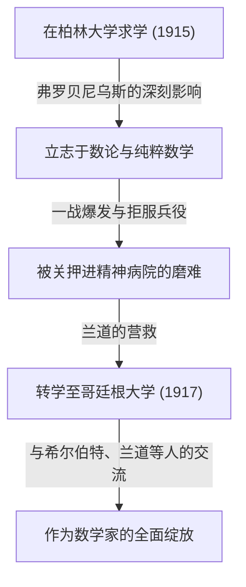

## 1. 引言：谁是[卡尔·路德维希·西格尔](https://kenji.blog/zh-cn/p/siegel/)？

[卡尔·路德维希·西格尔](https://kenji.blog/zh-cn/p/siegel/)（[Carl Ludwig Siegel](https://kenji.blog/zh-cn/p/siegel/), 1896年12月31日 - 1981年4月4日）是20世纪数学界最杰出、留下最巨大足迹的德国数学家之一。他的研究主要集中在数论（解析数论及代数数论）、[丢番图](https://kenji.blog/zh-cn/p/diophantus/)方程、[丢番图](https://kenji.blog/zh-cn/p/diophantus/)逼近以及天体力学（复动力系统）领域，其成就在现代数学中依然占据着极其重要的地位。

西格尔以其惊人的计算能力、深刻的洞察力，以及巧妙驾驭复杂解析手法的能力而闻名。在20世纪数学界急剧走向抽象化和公理化的浪潮中，他始终坚持以解决具体问题和提炼古典方法为重，保持了极其独立的风格。他因对法国数学家集团布尔巴基所推崇的极端抽象化持强烈批判态度而广为人知。本文将结合西格尔波澜壮阔的生平轶事，深入探讨其卓越的数学成就。

## 2. 西格尔的生平：生于动荡时代的数学家

### 2.1 早年生活与学术觉醒

西格尔于1896年出生于德意志帝国的柏林。他从小在数学和科学方面展现出非凡的天赋，并于1915年进入柏林洪堡大学（柏林大学）就读。在那里，他有幸师从当时最顶尖的学者，包括物理学家马克斯·普朗克，以及代数学和群论的大师费迪南德·格奥尔格·弗罗贝尼乌斯。起初西格尔也对天文学和物理学感兴趣，但弗罗贝尼乌斯充满激情的讲义激发了他对数论的浓厚兴趣，这成为他走上数学道路的决定性契机。

然而，第一次世界大战的爆发迫使他中断了学业。1917年，西格尔被征召入伍，但他基于强烈的反战思想和个人信念拒绝服兵役。在当时的德国，拒服兵役是重罪，他因此遭受了被关入精神病院的严酷折磨。将他从这一绝望境地中解救出来的是著名数学家埃德蒙·兰道。在兰道的努力下重获自由的西格尔，于1917年转学至哥廷根大学。当时的哥廷根是世界数学的圣地，[大卫·希尔伯特](https://kenji.blog/zh-cn/p/hilbert/)和费利克斯·克莱因等巨星皆在此任教。在这个环境中，西格尔如鱼得水，才华得到了真正的绽放。

### 2.2 法兰克福时期与纳粹的崛起

1920年，西格尔在哥廷根大学获得博士学位，在兰道的指导下，他撰写了关于[丢番图](https://kenji.blog/zh-cn/p/diophantus/)逼近的重要论文。1922年，年纪轻轻的他被任命为法兰克福大学的正教授，并在那里度过了接下来的16年。法兰克福时期是他研究生涯中最多产、最辉煌的时期之一，他在此发表了大量具有突破性的论文。此外，他还在那里与赫尔曼·外尔、保罗·爱普斯坦等许多优秀的数学家结下深厚友谊，进行了活跃的学术交流。

然而，进入1930年代后，纳粹（国家社会主义德国工人党）在德国国内崛起，导致犹太裔同事接连被逐出公职的悲剧发生。西格尔本人虽然不是犹太裔，但他对纳粹的反犹太主义政策和法西斯主义抱有强烈的反感与厌恶，他公开并持续地保护着受迫害的犹太裔朋友和同事。他坚决拒绝成为纳粹的御用学者，在政治压力下毫不屈服，努力捍卫学术自由。

### 2.3 流亡与美国的学术生活

在纳粹政权下，德国的科研与生活环境极度恶化，他自身的人身安全也受到威胁。面对这一局势，西格尔终于下定决心离开祖国。1940年，就在第二次世界大战爆发后不久，他经由丹麦和挪威的危险路线，成功流亡至美国。

在美国，他受到了位于新泽西州的普林斯顿高等研究院（IAS）的接纳。当时，IAS已成为逃离欧洲战火的顶尖大脑们的避难所，西格尔在那里与阿尔伯特·爱因斯坦、约翰·冯·诺伊曼、赫尔曼·外尔等人一起度过了充实的学术生活。在美国期间，西格尔的研究不再局限于数论，他在天体力学和解析函数论等领域也接连取得了极其重要的成果。

### 2.4 重返哥廷根与晚年

二战结束后，西格尔没有选择永久定居美国，而是在1951年做出了重返祖国德国的重大决定。他回到曾就读的哥廷根大学担任教授，致力于重建被战火摧残的德国数学界。此后他继续保持活跃的研究活动，培养了众多优秀的后继者。他的讲课既严谨又清晰，赢得了学生们的深深敬佩。

1978年，为表彰其卓越的终身成就，他与伊斯雷尔·盖尔范德共同获得了数学界最高荣誉之一的首届沃尔夫数学奖。1981年4月4日，[卡尔·路德维希·西格尔](https://kenji.blog/zh-cn/p/siegel/)在哥廷根走完了他84年波澜壮阔的一生。

## 3. 伟大的数学成就

西格尔的数学成就极其广泛，且在各个领域都留下了决定性的结果。他研究的最大特点在于巧妙运用高度复杂和精妙的解析手法，推导出数论中深刻而具体的结果。以下将详细解读他最著名的一些成就。

### 3.1 [丢番图](https://kenji.blog/zh-cn/p/diophantus/)方程与西格尔定理

1929年发表的论文《关于代数曲线的整数点》使他名垂青史，并打开了[丢番图](https://kenji.blog/zh-cn/p/diophantus/)几何这一新领域的大门。该定理现在被称为 **西格尔定理** （Siegel's theorem on integral points）。

这个定理给出了一个极其强大且优美的断言：“亏格（genus） $g \ge 1$ 的代数曲线 $C$ 上，整数点只有有限个”。更严格地说，对于代数数域 $K$ 及其整数环 $\mathcal{O}_K$ ，可以表述如下：

$$
\text{如果 } g(C) \ge 1 \text{，那么 } |C(\mathcal{O}_K)| < \infty
$$

例如，对于像 $x^3 + y^3 = c$ （ $c$ 为非零整数）这样的椭圆曲线（亏格 $g=1$ ），虽然可能存在无限个实数解或有理数解，但该定理保证，如果限定为 **整数解** ，则必定只有有限个。

这一结果在[丢番图](https://kenji.blog/zh-cn/p/diophantus/)方程解的有限性方面具有划时代意义，成为了后来[格尔德·法尔廷斯](https://kenji.blog/zh-cn/p/faltings/)证明莫德尔-韦伊定理（亏格2以上的曲线上的有理点有限性）的重要历史踏脚石。西格尔通过大幅扩展阿克塞尔·图厄的[丢番图](https://kenji.blog/zh-cn/p/diophantus/)逼近定理，并结合阿贝尔簇上的雅可比簇理论，推导出了这一惊人的结果。

### 3.2 西格尔零点 (Siegel Zero)

在解析数论中，狄利克雷 $L$ -函数 $L(s, \chi)$ 的零点分布，对于素数定理的自然推广及等差数列素数定理极为重要。根据广义黎曼猜想（GRH），实部介于 $0$ 和 $1$ 之间的临界带内的零点，都应位于实部为 $1/2$ 的直线上。

然而，对于实特征（实二次域的特征） $\chi$ ，目前数学界尚未排除存在一个实部非常接近 $1$ 的实数零点的可能性。这个作为假想反例的零点被称为 **西格尔零点** (Siegel zero) 或例外零点。

西格尔在1935年证明，即使这个不详的零点存在，它与 $1$ 的距离也有一个很强的下界估计。具体而言，他对任意 $\epsilon > 0$ 证明了存在一个常数 $C(\epsilon) > 0$ ，使得对于实特征 $\chi$ 的模 $q$ ，该函数在 $s=1$ 处的值满足以下条件：

$$
L(1, \chi) > C(\epsilon) q^{-\epsilon}
$$

这一估计成为推导类数问题（特别是判定虚二次域类数为 $1$ 的情况）及等差数列中素数分布的深刻结果不可或缺的工具。不过，该定理有一个巨大特征：常数 $C(\epsilon)$ 具有“不可计算（ineffective）”的性质。也就是说，定理保证了常数的存在性，但却没有提供求出具体数值的方法。这种非有效性是现代解析数论中最大的谜团之一，目前仍有许多数学家以证明西格尔零点的不存在（或寻找可计算的界限）为目标在继续研究。

### 3.3 西格尔模形式与二次型

西格尔开创了多变量自守形式理论，特别是如今被称为 **西格尔模形式** （Siegel modular forms）的理论。这是将19世纪以来一直被研究的单变量椭圆模形式，大胆而自然地推广到多变量函数论框架中的结果。

西格尔上半空间 $\mathcal{H}_g$ 定义如下：

$$
\mathcal{H}_g = \left\{ Z \in M_g(\mathbb{C}) \mid Z^T = Z, \text{ Im}(Z) \text{ 为正定矩阵} \right\}
$$

当 $g=1$ 时，这个空间与通常的庞加莱上半平面完全一致。西格尔在深化二次型解析理论的过程中引入了这个高维空间，并表明该空间上定义的自守形式与由二次型表示整数的数量有着深刻的联系。

此外，他在二次型的解析理论中奠定了 **西格尔-韦伊公式** （Siegel-Weil formula）的基础。这是一个将二次型表示的数量描述为爱森斯坦级数傅里叶系数的惊人公式，可以说是局部-全局原则（哈塞原理）的解析表现。这些理论是构成后来的自守表示论及朗兰兹纲领基础的不可或缺的概念。

### 3.4 西格尔引理与超越数论

在超越数论领域，他还证明了一个极其强大的定理，被称为 **西格尔引理** （Siegel's lemma）。乍看之下，这个引理只像是线性代数中一个初等的结果，但它的应用范围却不可估量。

该定理的断言如下：“在系数为整数的联立一次方程组中，如果未知数的个数 $N$ 足够大于方程的个数 $M$ （ $N > M$ ），那么必定存在一个非平凡的整数解，其中每个分量的绝对值相对较小（根据系数的大小能被适当地从上方界定）。”

这个引理利用鸽巢原理（狄利克雷抽屉原理）得到了优雅的证明，在超越数的构造、[丢番图](https://kenji.blog/zh-cn/p/diophantus/)逼近，以及后来艾伦·贝克关于对数一次形式理论等现代超越数论中，被作为必不可少的基本工具频繁使用。

### 3.5 天体力学与小分母问题

西格尔不仅局限于纯粹数学，对天体力学，特别是描述多体运动的三体问题也燃起了异乎寻常的执着。他发展了由[亨利·庞加莱](https://kenji.blog/zh-cn/p/poincare/)开创的动力系统研究，在微分方程解的稳定性方面留下了划时代的结果。

1941年，他证明了解析力学及复动力系统中的“西格尔中心定理”。这解决了在复平面上，解析函数在其不动点附近何时可以线性化的问题。在函数的泰勒展开中，若 $\lambda$ 表示导数的值，当 $\lambda$ 接近单位根的值时，分母中会出现非常小的值，从而导致级数发散，这种现象被称为“小分母问题（small divisor problem）”。

西格尔运用[丢番图](https://kenji.blog/zh-cn/p/diophantus/)逼近的高超技巧严格证明了，如果 $\lambda$ 满足某种无理数条件（[丢番图](https://kenji.blog/zh-cn/p/diophantus/)条件），就能避免小分母导致的发散，级数便会收敛从而实现解析线性化。

$$
\left| \lambda^n - 1 \right| > \frac{C}{n^\nu} \quad (\forall n \ge 1)
$$

这一结果是巧妙克服动力系统中无理旋转小分母问题的首个成功范例，也是一项决定性的历史成就，直接促成了后来由安德雷·柯尔莫哥洛夫、弗拉基米尔·阿诺尔德、于尔根·莫泽所建立的 **KAM理论** （KAM theorem）。

## 4. 西格尔独特的思想与数学观

西格尔的数学观与他留下的成就一样引人注目，有时甚至成为争议的焦点。他坚信数学必须始终与具体问题紧密结合，不必要的抽象化只会剥夺数学原本的生命力。

在20世纪中叶，由法国年轻数学家集团布尔巴基所倡导的、试图从集合论和公理系统重新构建整个数学的抽象风格席卷了世界。然而，西格尔对这种趋势提出了严厉的批评。他将布尔巴基的风格斥为“空洞的形式主义”，并留下了大意如下的言论：

> “近期数学的过度抽象化陷入了空洞的形式主义，并没有产生有意义的结果。我们应该回归到高斯、欧拉、黎曼以及雅可比所研究的那种、具有真正丰富内容的具体问题。”

由于这种强烈的信念，他的论文读起来非常有价值；但另一方面，对于现代读者来说，到处充斥着技巧性强、篇幅冗长的计算，往往需要花费极大的精力才能读懂。他终生不渝地坚持“抽象概念和框架仅仅是解决具体难题的一种手段”的哲学。这种孤高的姿态使他在同时代的数学家中显得有些与众不同。

## 5. 结论与西格尔的遗产

凭借无与伦比的解析天赋和对古典数学的深深敬意，[卡尔·路德维希·西格尔](https://kenji.blog/zh-cn/p/siegel/)在数论、[丢番图](https://kenji.blog/zh-cn/p/diophantus/)几何以及天体力学领域留下了划时代的决定性成就。

以他名字命名的众多概念和定理，如西格尔零点、西格尔定理、西格尔模形式和西格尔引理，已经成为现代数学家们每天使用的共同语言，在当下最前沿的研究中依然是不可或缺的基础。

他的一生向我们展示了一个在两次世界大战的艰难岁月里，依然坚守自身政治信念与治学态度的真正学者的光辉形象。独自抵抗过度抽象化的狂潮，在复杂的具象中发现普遍而美丽的真理，他的数学无疑将在世代更迭中继续闪耀光芒。
