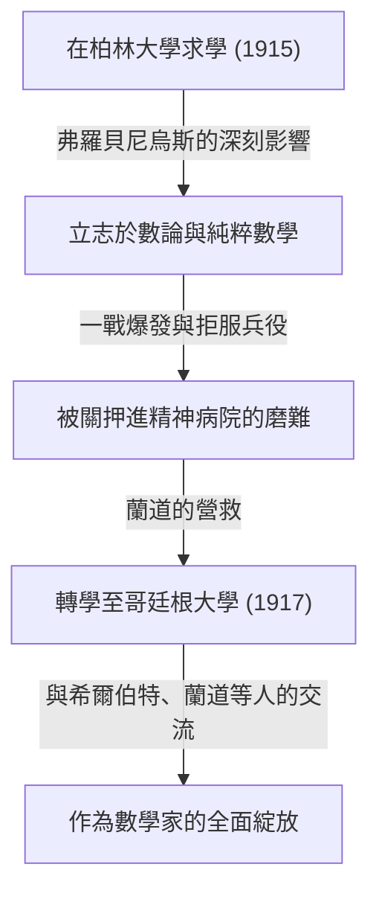

## 1. 引言：誰是[卡爾·路德維希·西格爾](https://kenji.blog/p/siegel/)？

[卡爾·路德維希·西格爾](https://kenji.blog/p/siegel/)（[Carl Ludwig Siegel](https://kenji.blog/p/siegel/), 1896年12月31日 - 1981年4月4日）是20世紀數學界最傑出、留下最巨大足跡的德國數學家之一。他的研究主要集中在數論（解析數論及代數數論）、[丟番圖](https://kenji.blog/p/diophantus/)方程、[丟番圖](https://kenji.blog/p/diophantus/)逼近以及天體力學（複動力系統）領域，其成就在現代數學中依然佔據著極其重要的地位。

西格爾以其驚人的計算能力、深刻的洞察力，以及巧妙駕馭複雜解析手法的能力而聞名。在20世紀數學界急劇走向抽象化和公理化的浪潮中，他始終堅持以解決具體問題和提煉古典方法為重，保持了極其獨立的風格。他因對法國數學家集團布爾巴基所推崇的極端抽象化持強烈批判態度而廣為人知。本文將結合西格爾波瀾壯闊的生平軼事，深入探討其卓越的數學成就。

## 2. 西格爾的生平：生於動盪時代的數學家

### 2.1 早年生活與學術覺醒

西格爾於1896年出生於德意志帝國的柏林。他從小在數學和科學方面展現出非凡的天賦，並於1915年進入柏林洪堡大學（柏林大學）就讀。在那裡，他有幸師從當時最頂尖的學者，包括物理學家馬克斯·普朗克，以及代數學和群論的大師費迪南德·格奧爾格·弗羅貝尼烏斯。起初西格爾也對天文學和物理學感興趣，但弗羅貝尼烏斯充滿激情的講義激發了他對數論的濃厚興趣，這成為他走上數學道路的決定性契機。

然而，第一次世界大戰的爆發迫使他中斷了學業。1917年，西格爾被徵召入伍，但他基於強烈的反戰思想和個人信念拒絕服兵役。在當時的德國，拒服兵役是重罪，他因此遭受了被關入精神病院的嚴酷折磨。將他從這一絕望境地中解救出來的是著名數學家埃德蒙·蘭道。在蘭道的努力下重獲自由的西格爾，於1917年轉學至哥廷根大學。當時的哥廷根是世界數學的聖地，[大衛·希爾伯特](https://kenji.blog/p/hilbert/)和費利克斯·克萊因等巨星皆在此任教。在這個環境中，西格爾如魚得水，才華得到了真正的綻放。

### 2.2 法蘭克福時期與納粹的崛起

1920年，西格爾在哥廷根大學獲得博士學位，在蘭道的指導下，他撰寫了關於[丟番圖](https://kenji.blog/p/diophantus/)逼近的重要論文。1922年，年紀輕輕的他被任命為法蘭克福大學的正教授，並在那裡度過了接下來的16年。法蘭克福時期是他研究生涯中最多產、最輝煌的時期之一，他在此發表了大量具有突破性的論文。此外，他還在那裡與赫爾曼·外爾、保羅·愛普斯坦等許多優秀的數學家結下深厚友誼，進行了活躍的學術交流。

然而，進入1930年代後，納粹（國家社會主義德國工人黨）在德國國內崛起，導致猶太裔同事接連被逐出公職的悲劇發生。西格爾本人雖然不是猶太裔，但他對納粹的反猶太主義政策和法西斯主義抱有強烈的反感與厭惡，他公開並持續地保護著受迫害的猶太裔朋友和同事。他堅決拒絕成為納粹的御用學者，在政治壓力下毫不屈服，努力捍衛學術自由。

### 2.3 流亡與美國的學術生活

在納粹政權下，德國的科研與生活環境極度惡化，他自身的人身安全也受到威脅。面對這一局勢，西格爾終於下定決心離開祖國。1940年，就在第二次世界大戰爆發後不久，他經由丹麥和挪威的危險路線，成功流亡至美國。

在美國，他受到了位於新澤西州的普林斯頓高等研究院（IAS）的接納。當時，IAS已成為逃離歐洲戰火的頂尖大腦們的避難所，西格爾在那裡與阿爾伯特·愛因斯坦、約翰·馮·諾伊曼、赫爾曼·外爾等人一起度過了充實的學術生活。在美國期間，西格爾的研究不再侷限於數論，他在天體力學和解析函數論等領域也接連取得了極其重要的成果。

### 2.4 重返哥廷根與晚年

二戰結束後，西格爾沒有選擇永久定居美國，而是在1951年做出了重返祖國德國的重大決定。他回到曾就讀的哥廷根大學擔任教授，致力於重建被戰火摧殘的德國數學界。此後他繼續保持活躍的研究活動，培養了眾多優秀的後繼者。他的講課既嚴謹又清晰，贏得了學生們的深深敬佩。

1978年，為表彰其卓越的終身成就，他與伊斯雷爾·蓋爾范德共同獲得了數學界最高榮譽之一的首屆沃爾夫數學獎。1981年4月4日，[卡爾·路德維希·西格爾](https://kenji.blog/p/siegel/)在哥廷根走完了他84年波瀾壯闊的一生。

## 3. 偉大的數學成就

西格爾的數學成就極其廣泛，且在各個領域都留下了決定性的結果。他研究的最大特點在於巧妙運用高度複雜和精妙的解析手法，推導出數論中深刻而具體的結果。以下將詳細解讀他最著名的一些成就。

### 3.1 [丟番圖](https://kenji.blog/p/diophantus/)方程與西格爾定理

1929年發表的論文《關於代數曲線的整數點》使他名垂青史，並打開了[丟番圖](https://kenji.blog/p/diophantus/)幾何這一新領域的大門。該定理現在被稱為 **西格爾定理** （Siegel's theorem on integral points）。

這個定理給出了一個極其強大且優美的斷言：「虧格（genus） $g \ge 1$ 的代數曲線 $C$ 上，整數點只有有限個」。更嚴格地說，對於代數數域 $K$ 及其整數環 $\mathcal{O}_K$ ，可以表述如下：

$$
\text{如果 } g(C) \ge 1 \text{，那麼 } |C(\mathcal{O}_K)| < \infty
$$

例如，對於像 $x^3 + y^3 = c$ （ $c$ 為非零整數）這樣的橢圓曲線（虧格 $g=1$ ），雖然可能存在無限個實數解或有理數解，但該定理保證，如果限定為 **整數解** ，則必定只有有限個。

這一結果在[丟番圖](https://kenji.blog/p/diophantus/)方程解的有限性方面具有劃時代意義，成為了後來[格爾德·法爾廷斯](https://kenji.blog/p/faltings/)證明莫德爾-韋伊定理（虧格2以上的曲線上的有理點有限性）的重要歷史踏腳石。西格爾通過大幅擴展阿克塞爾·圖厄的[丟番圖](https://kenji.blog/p/diophantus/)逼近定理，並結合阿貝爾簇上的雅可比簇理論，推導出了這一驚人的結果。

### 3.2 西格爾零點 (Siegel Zero)

在解析數論中，狄利克雷 $L$ -函數 $L(s, \chi)$ 的零點分佈，對於素數定理的自然推廣及等差數列素數定理極為重要。根據廣義黎曼猜想（GRH），實部介於 $0$ 和 $1$ 之間的臨界帶內的零點，都應位於實部為 $1/2$ 的直線上。

然而，對於實特徵（實二次域的特徵） $\chi$ ，目前數學界尚未排除存在一個實部非常接近 $1$ 的實數零點的可能性。這個作為假想反例的零點被稱為 **西格爾零點** (Siegel zero) 或例外零點。

西格爾在1935年證明，即使這個不詳的零點存在，它與 $1$ 的距離也有一個很強的下界估計。具體而言，他對任意 $\epsilon > 0$ 證明了存在一個常數 $C(\epsilon) > 0$ ，使得對於實特徵 $\chi$ 的模 $q$ ，該函數在 $s=1$ 處的值滿足以下條件：

$$
L(1, \chi) > C(\epsilon) q^{-\epsilon}
$$

這一估計成為推導類數問題（特別是判定虛二次域類數為 $1$ 的情況）及等差數列中素數分佈的深刻結果不可或缺的工具。不過，該定理有一個巨大特徵：常數 $C(\epsilon)$ 具有「不可計算（ineffective）」的性質。也就是說，定理保證了常數的存在性，但卻沒有提供求出具體數值的方法。這種非有效性是現代解析數論中最大的謎團之一，目前仍有許多數學家以證明西格爾零點的不存在（或尋找可計算的界限）為目標在繼續研究。

### 3.3 西格爾模形式與二次型

西格爾開創了多變量自守形式理論，特別是如今被稱為 **西格爾模形式** （Siegel modular forms）的理論。這是將19世紀以來一直被研究的單變量橢圓模形式，大膽而自然地推廣到多變量函數論框架中的結果。

西格爾上半空間 $\mathcal{H}_g$ 定義如下：

$$
\mathcal{H}_g = \left\{ Z \in M_g(\mathbb{C}) \mid Z^T = Z, \text{ Im}(Z) \text{ 為正定矩陣} \right\}
$$

當 $g=1$ 時，這個空間與通常的龐加萊上半平面完全一致。西格爾在深化二次型解析理論的過程中引入了這個高維空間，並表明該空間上定義的自守形式與由二次型表示整數的數量有著深刻的聯繫。

此外，他在二次型的解析理論中奠定了 **西格爾-韋伊公式** （Siegel-Weil formula）的基礎。這是一個將二次型表示的數量描述為愛森斯坦級數傅立葉係數的驚人公式，可以說是局部-全局原則（哈塞原理）的解析表現。這些理論是構成後來的自守表示論及朗蘭茲綱領基礎的不可或缺的概念。

### 3.4 西格爾引理與超越數論

在超越數論領域，他還證明了一個極其強大的定理，被稱為 **西格爾引理** （Siegel's lemma）。乍看之下，這個引理只像是線性代數中一個初等的結果，但它的應用範圍卻不可估量。

該定理的斷言如下：「在係數為整數的聯立一次方程組中，如果未知數的個數 $N$ 足夠大於方程的個數 $M$ （ $N > M$ ），那麼必定存在一個非平凡的整數解，其中每個分量的絕對值相對較小（根據係數的大小能被適當地從上方界定）。」

這個引理利用鴿巢原理（狄利克雷抽屜原理）得到了優雅的證明，在超越數的構造、[丟番圖](https://kenji.blog/p/diophantus/)逼近，以及後來艾倫·貝克關於對數一次形式理論等現代超越數論中，被作為必不可少的基本工具頻繁使用。

### 3.5 天體力學與小分母問題

西格爾不僅侷限於純粹數學，對天體力學，特別是描述多體運動的三體問題也燃起了異乎尋常的執著。他發展了由[亨利·龐加萊](https://kenji.blog/p/poincare/)開創的動力系統研究，在微分方程解的穩定性方面留下了劃時代的結果。

1941年，他證明了解析力學及複動力系統中的「西格爾中心定理」。這解決了在複平面上，解析函數在其不動點附近何時可以線性化的問題。在函數的泰勒展開中，若 $\lambda$ 表示導數的值，當 $\lambda$ 接近單位根的值時，分母中會出現非常小的值，從而導致級數發散，這種現象被稱為「小分母問題（small divisor problem）」。

西格爾運用[丟番圖](https://kenji.blog/p/diophantus/)逼近的高超技巧嚴格證明了，如果 $\lambda$ 滿足某種無理數條件（[丟番圖](https://kenji.blog/p/diophantus/)條件），就能避免小分母導致的發散，級數便會收斂從而實現解析線性化。

$$
\left| \lambda^n - 1 \right| > \frac{C}{n^\nu} \quad (\forall n \ge 1)
$$

這一結果是巧妙克服動力系統中無理旋轉小分母問題的首個成功範例，也是一項決定性的歷史成就，直接促成了後來由安德雷·柯爾莫哥洛夫、弗拉基米爾·阿諾爾德、尤爾根·莫澤所建立的 **KAM理論** （KAM theorem）。

## 4. 西格爾獨特的思想與數學觀

西格爾的數學觀與他留下的成就一樣引人注目，有時甚至成為爭議的焦點。他堅信數學必須始終與具體問題緊密結合，不必要的抽象化只會剝奪數學原本的生命力。

在20世紀中葉，由法國年輕數學家集團布爾巴基所倡導的、試圖從集合論和公理系統重新構建整個數學的抽象風格席捲了世界。然而，西格爾對這種趨勢提出了嚴厲的批評。他將布爾巴基的風格斥為「空洞的形式主義」，並留下了大意如下的言論：

> 「近期數學的過度抽象化陷入了空洞的形式主義，並沒有產生有意義的結果。我們應該回歸到高斯、歐拉、黎曼以及雅可比所研究的那種、具有真正豐富內容的具體問題。」

由於這種強烈的信念，他的論文讀起來非常有價值；但另一方面，對於現代讀者來說，到處充斥著技巧性強、篇幅冗長的計算，往往需要花費極大的精力才能讀懂。他終生不渝地堅持「抽象概念和框架僅僅是解決具體難題的一種手段」的哲學。這種孤高的姿態使他在同時代的數學家中顯得有些與眾不同。

## 5. 結論與西格爾的遺產

憑藉無與倫比的解析天賦和對古典數學的深深敬意，[卡爾·路德維希·西格爾](https://kenji.blog/p/siegel/)在數論、[丟番圖](https://kenji.blog/p/diophantus/)幾何以及天體力學領域留下了劃時代的決定性成就。

以他名字命名的眾多概念和定理，如西格爾零點、西格爾定理、西格爾模形式和西格爾引理，已經成為現代數學家們每天使用的共同語言，在當下最前沿的研究中依然是不可或缺的基礎。

他的一生向我們展示了一個在兩次世界大戰的艱難歲月裡，依然堅守自身政治信念與治學態度的真正學者的光輝形象。獨自抵抗過度抽象化的狂潮，在複雜的具象中發現普遍而美麗的真理，他的數學無疑將在世代更迭中繼續閃耀光芒。
