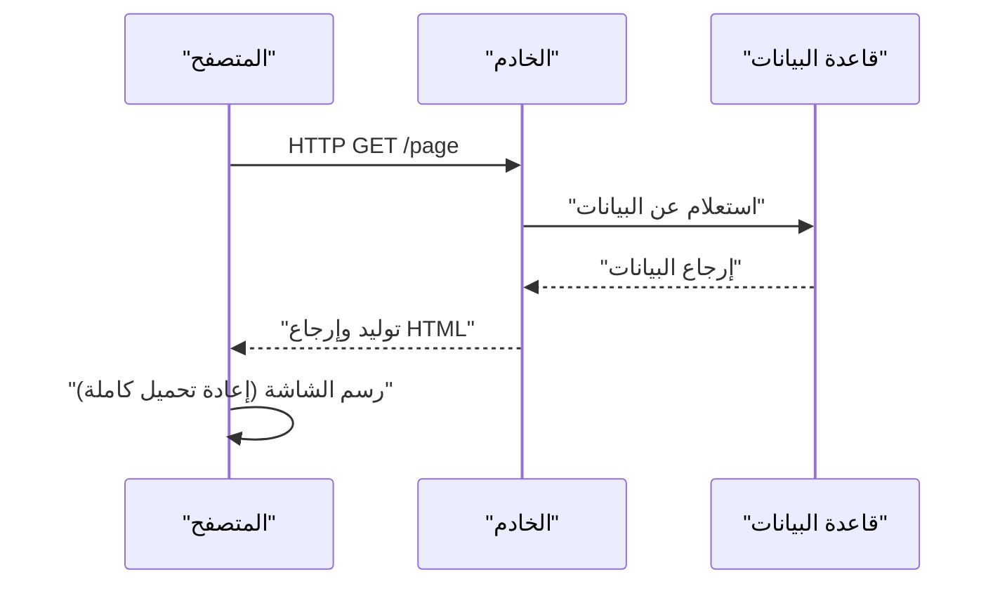
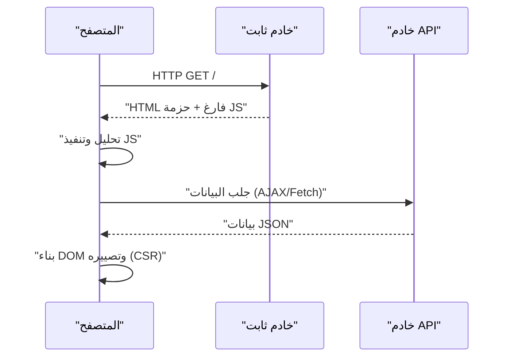
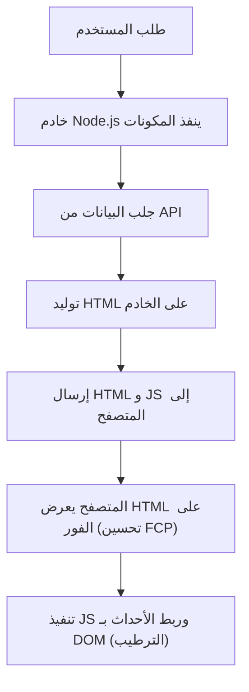
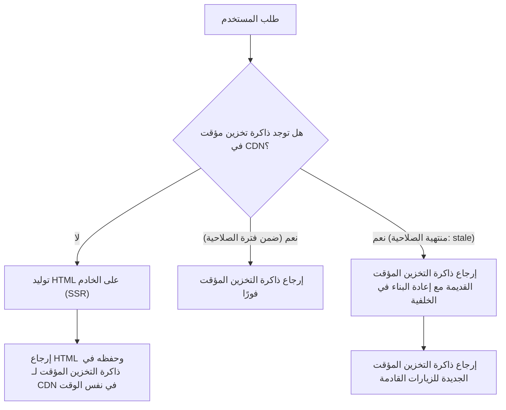

## 1. مقدمة: تطور تصيير الواجهة الأمامية

تاريخ تطوير الويب هو أيضًا تاريخ البندول الذي يتأرجح بين جانب الخادم وجانب العميل حول "أين" يتم تصيير المحتوى. في بدايات الويب، كانت البنية بسيطة حيث يتم توليد HTML على الخادم، ويقوم المتصفح بعرضه فقط. ومع ذلك، مع تزايد المتطلبات لتجربة المستخدم (UX)، أصبحت تطبيقات الصفحة الواحدة (SPA)، التي تستخدم JavaScript لبناء واجهة المستخدم (UI) ديناميكيًا على المتصفح، هي الاتجاه السائد.

واليوم، للتغلب على التحديات التي جلبها SPA، نتطور نحو أساليب جديدة تعتمد مرة أخرى على قوة الخادم، مثل التصيير على جانب الخادم (SSR)، توليد المواقع الثابتة (SSG)، وكذلك التجديد الثابت المتزايد (ISR)، ومكونات خادم React (RSC).

في هذه المقالة، سنتعمق في حتمية تطور تقنية تصيير الواجهة الأمامية، والمشاكل التي صُممت كل تقنية لحلها.

## 2. عصر SSR التقليدي و jQuery

من التسعينيات إلى الألفينيات، كانت صفحات الويب تُولد ديناميكيًا على جانب الخادم باستخدام تقنيات الواجهة الخلفية مثل PHP، Ruby on Rails، Java، و Perl. عندما يزور المستخدم عنوان URL، يجلب الخادم المعلومات من قاعدة البيانات، ويبني HTML كاملًا، ويعيده إلى المتصفح. يقوم المتصفح بتحليل HTML المستلم من أعلى إلى أسفل ويرسمه على الشاشة.

كان هذا النهج قويًا جدًا في تحسين محركات البحث (SEO). لأن زواحف البحث كان بإمكانها قراءة HTML الكامل على الفور. ومع ذلك، حتى عند تحديث جزء بسيط من الصفحة، كان يحدث إعادة تحميل لكامل الشاشة، مما يعني أن تجربة المستخدم لم تكن سلسة أبدًا.

وهنا ظهر **jQuery** و AJAX (Asynchronous JavaScript and XML). سمح ذلك بجلب البيانات بشكل غير متزامن من الخادم باستخدام JavaScript وتعديل جزء من شجرة DOM مباشرة دون الحاجة إلى إعادة تحميل الصفحة بالكامل. ولكن، مع تزايد تعقيد التطبيقات، أدى أسلوب التعديل المباشر لـ DOM إلى انخفاض ملحوظ في قابلية صيانة الكود، وأصبح مرتعًا لـ "شفرات السباغيتي".

## 3. الانتقال إلى جانب العميل: صعود SPA

في العقد الأول من القرن الحادي والعشرين، مع انتشار الهواتف الذكية وارتفاع توقعات المستخدمين، أصبح الويب مطالبًا بتجربة مستخدم سلسة تشبه التطبيقات الأصلية. استجابة لهذا الطلب، ظهر **SPA (تطبيق الصفحة الواحدة)**.

أطر العمل مثل AngularJS، Backbone.js، ولاحقًا React و Vue.js، نقلت منطق تصيير الشاشة بالكامل من الخادم إلى العميل (المتصفح).

في SPA، عند الوصول الأولي، يتم تنزيل "HTML فارغ" و "ملف JavaScript ضخم (حزمة)". بعد ذلك، يتم تنفيذ JavaScript في المتصفح، وجلب البيانات اللازمة من خادم API بشكل غير متزامن، وبناء DOM ديناميكيًا على جانب العميل (التصيير على جانب العميل، CSR).
عند الانتقال بين الصفحات، تتحكم JavaScript في التوجيه وتجلب فقط البيانات اللازمة لتحديث الشاشة، مما يمنع حدوث إعادة تحميل كاملة ويحقق تجربة مستخدم سلسة بشكل مذهل.

## 4. التحديات التي تواجه SPA: وقت التحميل الأولي و SEO

قدم SPA تجربة مستخدم رائعة، لكنه في الوقت نفسه خلق تحديات جديدة.

1. **تأخير وقت التحميل الأولي (تدهور TTFB و FCP)**:
   عندما يصل المستخدم إلى الصفحة لأول مرة، يستغرق الأمر وقتًا طويلاً حتى يظهر محتوى ذو معنى على الشاشة (First Contentful Paint, FCP). هذا لأن المتصفح يجب أن يقوم بتنزيل ملف JavaScript الضخم، وتحليله، وتنفيذه، ثم جلب البيانات من API قبل أن يتمكن أخيرًا من بناء DOM. خاصة في بيئات الأجهزة المحمولة أو الشبكات البطيئة، سيضطر المستخدم للتحديق في شاشة بيضاء فارغة لفترة طويلة.

2. **مشاكل تحسين محركات البحث (SEO) و OGP**:
   يحتوي HTML الأولي الذي يوفره SPA فقط على عناصر فارغة مثل `

`. يمكن لزواحف Google حاليًا تنفيذ JavaScript، ولكن يستغرق الأمر وقتًا للفهرسة، كما أن محركات البحث الأخرى أو زواحف الشبكات الاجتماعية (مثل بطاقات Twitter و Facebook OGP) تقرأ HTML فقط دون تنفيذ JavaScript، مما يسبب مشكلة خطيرة في عدم القدرة على التعرف بشكل صحيح على المحتوى المولد ديناميكيًا.

## 5. SSR الحديث والترطيب (Hydration)

لحل تحديات SPA، قرر مجتمع الواجهة الأمامية الاعتماد مرة أخرى على قوة جانب الخادم. وهذا هو ميلاد **SSR الحديث (التصيير على جانب الخادم)**. أطر العمل الشاملة مثل Next.js و Nuxt.js قادت هذا النهج.

في SSR الحديث، بالنسبة للطلب الأول، يتم تنفيذ مكونات React أو Vue على الخادم (عادةً في بيئة Node.js)، ويتم إنشاء HTML كامل بما في ذلك جلب البيانات وإعادته إلى المتصفح.

نظرًا لأن المتصفح يمكنه تصيير HTML المستلم على الفور، يتحسن FCP بشكل كبير، ويتم حل مشاكل SEO و OGP تمامًا. ومع ذلك، فإن الصفحة المعروضة فورًا لا تزال مجرد "HTML ثابت" ولا تتفاعل مع الإجراءات مثل النقر.
عندما يتم تنزيل JavaScript في الخلفية وتنفيذه، تقوم أطر عمل مثل React بربط مستمعات الأحداث بعناصر DOM الحالية، محولة التطبيق إلى حالة "ديناميكية". تُسمى هذه العملية **الترطيب (Hydration)**.

على الرغم من أن SSR كان قويًا، إلا أنه أدى إلى إنشاء تحدٍ جديد: نظرًا لأن عملية التصيير تتم على الخادم مع كل طلب، فإن الحمل على الخادم يكون مرتفعًا (تأخير TTFB)، وتكون تكلفة ضمان قابلية التوسع باهظة.

## 6. توليد المواقع الثابتة (SSG): صعود Jamstack

"إذا كان توليد HTML مع كل طلب ثقيلاً، ألا ينبغي لنا توليد HTML لجميع الصفحات مسبقًا أثناء وقت البناء؟"
من هذه الفكرة وُلد **SSG (توليد المواقع الثابتة)**. أطر عمل مثل Gatsby و Next.js شجعت هذا النهج، وأصبح جوهر البنية المعروفة باسم Jamstack (JavaScript, APIs, Markup).

أثناء البناء، يتم جلب البيانات من API وتوليد HTML. يتم وضع HTML الثابت المولد على شبكة توصيل المحتوى (CDN)، ويتم توزيعه بسرعة فائقة من خوادم الحافة حول العالم.
نظرًا لعدم الحاجة إلى عمليات حسابية على جانب الخادم، فإن الأمان يكون عاليًا، ووقت وصول أول بايت (TTFB) يكون الأسرع، وتبقى تكاليف الخادم منخفضة جدًا.

ومع ذلك، كان لدى SSG نقطة ضعف قاتلة. وهي **"حداثة البيانات" و "وقت البناء"**.
إذا كان لديك مدونة تحتوي على 10,000 صفحة أو موقع تجارة إلكترونية ضخم، ستحتاج إلى إعادة بناء جميع الصفحات في كل مرة يتم فيها تحديث محتوى واحد. أصبحت عملية البناء تستغرق من عشرات الدقائق إلى ساعات، مما جعلها غير مناسبة للتطبيقات التي تتطلب تحديثات في الوقت الفعلي.

## 7. ابتكار ISR (التجديد الثابت المتزايد)

لحل مشكلة "طول وقت البناء" و "تأخر تحديث البيانات" في SSG، قدم Next.js حلاً ثوريًا وهو **ISR (التجديد الثابت المتزايد)**.

بدلاً من توليد جميع الصفحات وقت البناء، يقوم ISR بتوليد الصفحات الهامة فقط باستخدام SSG مقدمًا، بينما يتم توليد الصفحات المتبقية عند طلب المستخدم الأول تمامًا مثل SSR، وفي نفس الوقت يتم تخزين النتيجة في ذاكرة التخزين المؤقت لـ CDN (حفظها كملف ثابت).
علاوة على ذلك، من خلال تعيين فترة صلاحية `revalidate` (مثال: 60 ثانية)، فإنه بالنسبة للطلب الأول بعد انتهاء الصلاحية، يُرجع الخادم "ذاكرة التخزين المؤقت القديمة (stale)"، بينما يقوم بإعادة التصيير في الخلفية لتحديث ذاكرة التخزين المؤقت بـ HTML الجديد (استراتيجية stale-while-revalidate).

بهذا، حققنا أفضل ما في العالمين: تقديم استجابة فائقة السرعة للمستخدمين دائمًا (ميزة SSG) مع تحديث البيانات بشكل دوري (ميزة SSR). علاوة على ذلك، في الآونة الأخيرة، أصبح **ISR حسب الطلب (On-demand ISR)**، الذي يقوم بإلغاء وتحديث ذاكرة التخزين المؤقت في أي وقت يتم تحديده باستخدام Webhooks كمشغل، هو الاتجاه السائد.

## 8. مكونات خادم React (RSC) وموجه التطبيقات (App Router)

والآن، يتطور بندول الواجهة الأمامية إلى بُعد جديد. وهو **مكونات خادم React (RSC)**. تم تقديمها بشكل رئيسي مع App Router بدءًا من Next.js 13.

في SSR و SSG السابقين، كان قرار "هل نصيّر على الخادم أم على العميل" يُتخذ على "مستوى الصفحة". ولكن في RSC، يمكن فصل الخادم والعميل على **"مستوى المكون"**.

- **مكونات الخادم (Server Components)**: يتم تنفيذها فقط على الخادم، ولا يتم إرسال أي كود JavaScript إلى العميل. حتى إذا قمت بالوصول إلى قاعدة البيانات مباشرة أو استخدمت مكتبات ثقيلة، فإن ذلك لا يؤثر على حجم حزمة العميل.
- **مكونات العميل (Client Components)**: يتم تطبيقها فقط على الأجزاء التي تتطلب تفاعل المستخدم مثل إدارة الحالة (`useState`) أو مستمعات الأحداث (`onClick`)، ويتم ترطيبها على جانب العميل كما في السابق.

وهذا جعل من الممكن تقليل أكبر نقطة ضعف في SPA وهي "تنزيل وتنفيذ حزم JavaScript الضخمة" إلى أقصى حد، مع الحفاظ على تجربة التشغيل السلسة لـ SPA.

## 9. الخلاصة: إلى أين يتجه البندول

البندول الذي بدأ مع jQuery وانحرف بقوة نحو جانب العميل مع SPA، يتجه الآن نحو "الاندماج الأمثل بين الخادم والعميل" في شكل RSC، مرورًا بـ SSR و SSG و ISR.

التطور التكنولوجي ليس بأي حال من الأحوال إنكارًا للماضي. لأن SPA أثبت إمكانية توفير تجربة مستخدم متقدمة على جانب العميل، فإننا نمتلك التطور الحالي لـ SSR/RSC لتقديم ذلك بشكل سريع وآمن.
سيستمر هذا البندول في التأرجح مع ظهور متطلبات جديدة وتطور الأجهزة في المستقبل. المهم هو عدم الإيمان الأعمى بتقنية معينة، بل امتلاك وجهة نظر معمارية لتقييم متطلبات كل مشروع (أهمية SEO، وتيرة تحديث البيانات، ومستوى تجربة المستخدم المطلوبة، إلخ) واختيار استراتيجية التصيير المناسبة.
