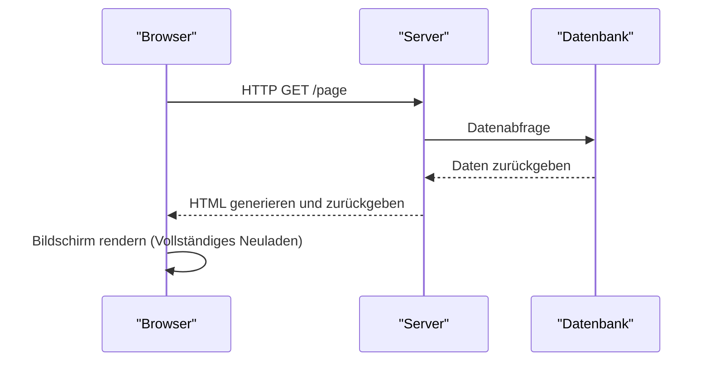
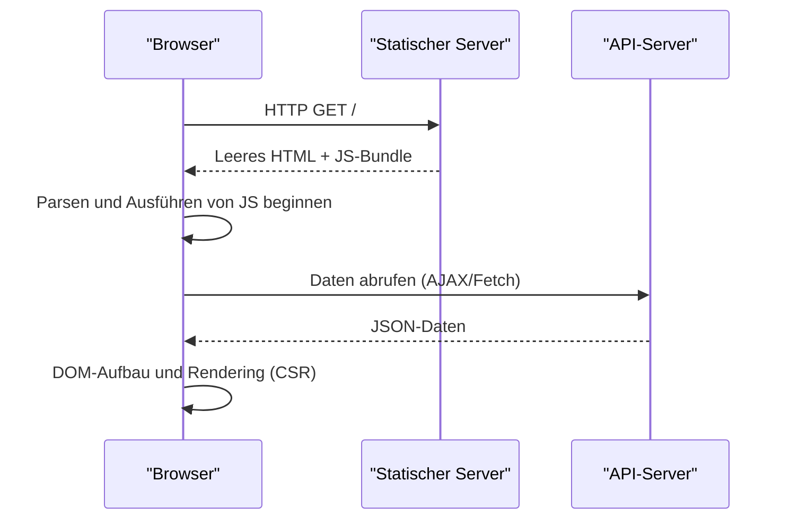
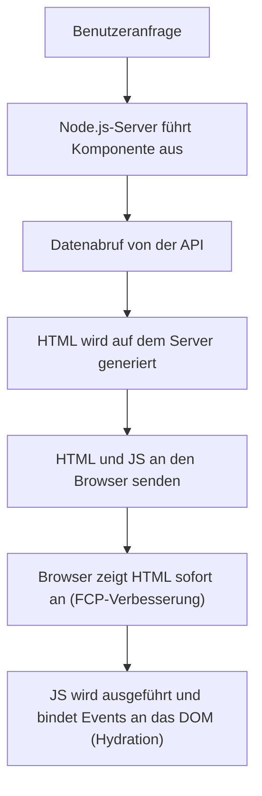
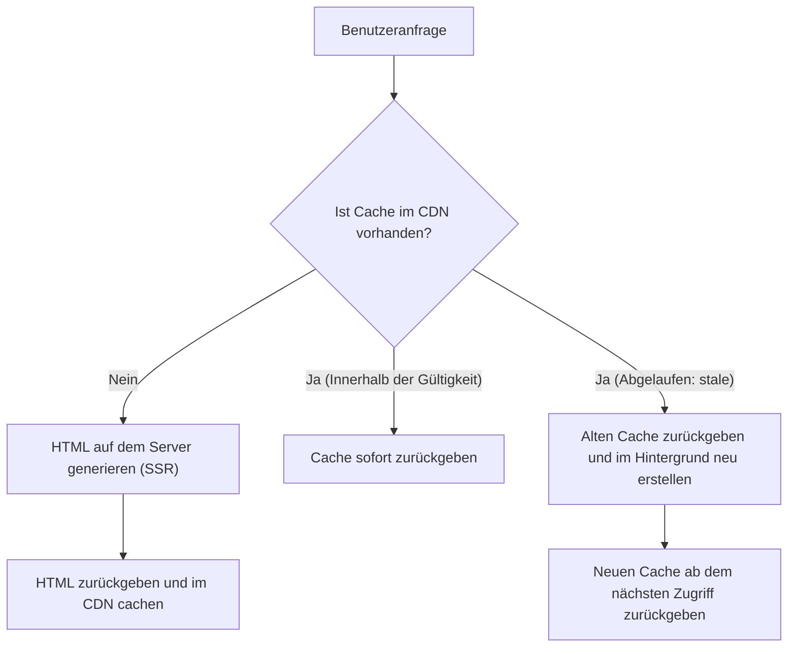

## 1. Einführung: Die Entwicklung des Frontend-Renderings

Die Geschichte der Webentwicklung ist auch die Geschichte eines Pendels, das zwischen der Serverseite und der Clientseite hin- und herschwingt und bestimmt, "wo" der Inhalt gerendert wird. Das frühe Web hatte eine einfache Struktur, bei der HTML auf dem Server generiert wurde und der Browser es nur anzeigte. Mit den steigenden Anforderungen an die Benutzererfahrung (User Experience, UX) wurden jedoch Single Page Applications (SPA) zum Mainstream, die JavaScript nutzen, um die Benutzeroberfläche dynamisch auf der Browserseite aufzubauen.

Heute, um die durch SPAs entstandenen Herausforderungen zu überwinden, entwickeln wir uns weiter zu neuen Ansätzen, die wieder die Leistungsfähigkeit des Servers nutzen, wie Server-Side Rendering (SSR) und Static Site Generation (SSG), sowie Incremental Static Regeneration (ISR) und React Server Components (RSC).

In diesem Artikel werden wir tief in die Notwendigkeit dieser Entwicklung der Frontend-Rendering-Technologien eintauchen und untersuchen, welche spezifischen Probleme jede dieser Technologien lösen sollte.

## 2. Die Ära des traditionellen SSR und jQuery

Von den 1990er bis in die 2000er Jahre wurden Webseiten serverseitig mit Backend-Technologien wie PHP, Ruby on Rails, Java und Perl dynamisch generiert. Wenn ein Benutzer auf eine URL zugreift, ruft der Server Informationen aus der Datenbank ab, erstellt vollständiges HTML und gibt es an den Browser zurück. Der Browser parst das empfangene HTML von oben nach unten und rendert es auf dem Bildschirm.

Dieser Ansatz war sehr stark für SEO (Suchmaschinenoptimierung). Crawler konnten das vollständige HTML sofort lesen. Da jedoch selbst die Aktualisierung eines Teils der Seite ein Neuladen des gesamten Bildschirms (Full Page Reload) erforderte, war die Benutzererfahrung keineswegs nahtlos.

Hier traten **jQuery** und AJAX (Asynchronous JavaScript and XML) auf den Plan. Sie machten es möglich, Daten asynchron vom Server mit JavaScript abzurufen und Teile des DOM direkt umzuschreiben, ohne die gesamte Seite neu laden zu müssen. Als die Anwendungen jedoch komplexer wurden, verringerte der Ansatz der direkten DOM-Manipulation die Wartbarkeit des Codes erheblich und wurde zu einem Nährboden für "Spaghetti-Code".

## 3. Der Wechsel zur Clientseite: Der Aufstieg der SPA

In den 2010er Jahren erforderten die Verbreitung von Smartphones und die steigenden Erwartungen der Benutzer ein reibungsloses Bediengefühl, ähnlich dem von nativen Apps, auch im Web. Als Antwort auf diese Forderung entstand die **SPA (Single Page Application)**.

Frameworks wie AngularJS, Backbone.js und später React und Vue.js haben die Rendering-Logik für Bildschirme vollständig vom Server auf den Client (Browser) übertragen.

Bei einer SPA werden beim ersten Zugriff "leeres HTML" und eine "riesige JavaScript-Datei (Bundle)" heruntergeladen. Danach wird das JavaScript im Browser ausgeführt, ruft notwendige Daten asynchron vom API-Server ab und baut das DOM dynamisch auf der Clientseite auf (Client-Side Rendering, CSR).
Bei Seitenübergängen steuert JavaScript das Routing und ruft nur die notwendigen Daten ab, um den Bildschirm neu zu zeichnen. Da kein vollständiges Neuladen stattfindet, wurde eine erstaunlich flüssige Benutzererfahrung erreicht.

## 4. Herausforderungen von SPAs: Anfängliche Ladezeit und SEO

SPAs boten eine großartige UX, brachten aber gleichzeitig neue Herausforderungen mit sich.

1. **Verzögerung der anfänglichen Ladezeit (Verschlechterung von TTFB und FCP)**:
   Wenn ein Benutzer zum ersten Mal auf eine Seite zugreift, dauert es lange, bis aussagekräftige Inhalte auf dem Bildschirm angezeigt werden (First Contentful Paint, FCP). Das liegt daran, dass der Browser erst das DOM aufbauen kann, nachdem er eine riesige JavaScript-Datei heruntergeladen, geparst und ausgeführt hat sowie Daten von der API abgerufen hat. Besonders in mobilen Umgebungen oder langsamen Netzwerken starrt der Benutzer lange auf einen weißen Bildschirm (Blank Screen).

2. **SEO (Suchmaschinenoptimierung) und OGP-Probleme**:
   Das von einer SPA bereitgestellte anfängliche HTML enthält nur leere Elemente wie `

`. Obwohl Googles Crawler heute JavaScript ausführen kann, dauert es seine Zeit, bis die Seite indexiert wird. Andere Suchmaschinen oder Social-Media-Crawler (wie Twitter oder Facebook für OGP) lesen nur das HTML, ohne JavaScript auszuführen, was zu dem ernsthaften Problem dass dynamisch generierte Inhalte nicht richtig erkannt werden können.

## 5. Modernes SSR und Hydration

Um die Probleme von SPAs zu lösen, entschied sich die Frontend-Community, wieder die Leistung der Serverseite zu nutzen. Dies war die Geburtsstunde des **modernen SSR (Server-Side Rendering)**. Meta-Frameworks wie Next.js und Nuxt.js haben diesen Ansatz vorangetrieben.

Beim modernen SSR wird auf die erste Anfrage hin eine React- oder Vue-Komponente auf dem Server (normalerweise eine Node.js-Umgebung) ausgeführt, vollständiges HTML einschließlich des Datenabrufs generiert und an den Browser zurückgegeben.

Da der Browser das empfangene HTML sofort rendern kann, wird der FCP drastisch verbessert und SEO- sowie OGP-Probleme werden vollständig gelöst. Die unmittelbar nach der Anzeige sichtbare Seite ist jedoch immer noch nur "statisches HTML" und reagiert nicht auf Aktionen wie Klicks.
Wenn JavaScript im Hintergrund heruntergeladen und ausgeführt wird, binden Frameworks wie React Event-Listener an bestehende DOM-Elemente und versetzen die Anwendung in einen "dynamischen" Zustand. Dieser Prozess wird als **Hydration** bezeichnet.

SSR war mächtig, schuf aber neue Herausforderungen: Da das Rendering bei jeder Anfrage auf dem Server erfolgt, ist die Serverlast hoch (TTFB-Verzögerung), was die Sicherstellung der Skalierbarkeit teuer macht.

## 6. Static Site Generation (SSG): Der Aufstieg des Jamstack

"Wenn es zu schwerfällig ist, HTML bei jeder Anfrage zu generieren, warum erstellen wir dann nicht das HTML für alle Seiten im Voraus während des Builds?"
Aus dieser Idee entstand die **SSG (Static Site Generation)**. Gatsby und Next.js machten diesen Ansatz populär, und er wurde zum Kern der Architektur, die als Jamstack (JavaScript, APIs, Markup) bekannt ist.

Daten werden während des Builds von einer API abgerufen und HTML wird generiert. Das generierte statische HTML wird auf einem CDN (Content Delivery Network) abgelegt und von Edge-Servern auf der ganzen Welt in rasender Geschwindigkeit ausgeliefert.
Da keine serverseitige Berechnung erforderlich ist, ist die Sicherheit hoch, die TTFB (Time to First Byte) am schnellsten und die Serverkosten bleiben extrem niedrig.

Allerdings hatte SSG auch eine entscheidende Schwäche: **"Datenaktualität" und "Build-Zeit"**.
Wenn man einen Blog mit 10.000 Seiten oder eine riesige E-Commerce-Seite hat, muss jedes Mal, wenn ein Inhalt aktualisiert wird, die gesamte Website neu erstellt werden. Builds können zehn Minuten bis zu mehreren Stunden dauern, was sie für Anwendungen, die Echtzeitfähigkeit erfordern, ungeeignet macht.

## 7. Die Innovation von ISR (Incremental Static Regeneration)

Um die Probleme von "langer Build-Zeit" und "Verzögerung der Datenaktualisierung" bei SSG zu lösen, führte Next.js eine bahnbrechende Lösung ein: **ISR (Incremental Static Regeneration)**.

Anstatt alle Seiten zur Build-Zeit zu generieren, wendet ISR SSG nur zunächst auf wichtige Seiten an. Die restlichen Seiten werden bei der ersten Benutzeranfrage ähnlich wie bei SSR generiert, und das Ergebnis wird gleichzeitig im CDN zwischengespeichert (als statische Datei gespeichert).
Darüber hinaus kann man eine Ablaufzeit namens `revalidate` festlegen (z.B. 60 Sekunden). Bei der ersten Anfrage nach Ablauf dieser Zeit wird der "alte Cache (stale)" zurückgegeben, während im Hintergrund (Background) ein erneutes Rendering durchgeführt wird, um den Cache mit dem neuen HTML zu aktualisieren (Stale-while-revalidate-Strategie).

Dadurch wurde das Beste aus beiden Welten erreicht: Man bietet dem Benutzer stets eine superschnelle Antwort (Vorteil von SSG) und hält gleichzeitig die Daten regelmäßig auf dem neuesten Stand (Vorteil von SSR). In jüngster Zeit hat sich zudem das **On-Demand ISR** durchgesetzt, bei dem Webhooks oder ähnliches verwendet werden, um den Cache zu einem beliebigen Zeitpunkt gezielt zu invalidieren und zu aktualisieren.

## 8. React Server Components (RSC) und App Router

Und jetzt entwickelt sich das Frontend-Pendel in eine weitere Dimension. Das sind die **React Server Components (RSC)**. Sie wurden mit dem App Router in Next.js 13 und später vollständig eingeführt.

Bei bisherigen SSR- oder SSG-Ansätzen wurde auf "Seitenebene" entschieden, ob auf dem Server oder dem Client gerendert wird. Mit RSC kann man Server und Client jedoch auf **"Komponentenebene"** trennen.

- **Server Components**: Sie werden ausschließlich auf dem Server ausgeführt und es wird überhaupt kein JavaScript-Code an den Client gesendet. Selbst wenn man direkt auf eine Datenbank zugreift oder schwere Bibliotheken verwendet, beeinträchtigt dies die Bundle-Größe des Clients nicht.
- **Client Components**: Sie werden nur in Bereichen angewandt, die Benutzerinteraktionen erfordern, wie Zustandsverwaltung (`useState`) oder Event-Listener (`onClick`), und werden wie zuvor auf der Clientseite hydratisiert.

Dadurch ist es möglich, die größte Schwäche der SPA - das "Herunterladen und Ausführen von riesigen JavaScript-Bundles" - drastisch zu reduzieren, während die flüssige Bedienbarkeit der SPA erhalten bleibt.

## 9. Fazit: Wohin schwingt das Pendel?

Das Pendel, das bei jQuery begann und mit SPAs weit zur Clientseite ausschlug, bewegt sich über SSR, SSG und ISR in Form von RSC auf eine "optimale Verschmelzung von Server und Client" zu.

Technologische Evolution ist niemals eine Leugnung der Vergangenheit. Gerade weil SPAs eine fortschrittliche UX auf der Clientseite bewiesen haben, gibt es die aktuelle Entwicklung von SSR/RSC, um diese noch schneller und sicherer bereitzustellen.
Auch in Zukunft wird dieses Pendel mit neuen Anforderungen und der Weiterentwicklung von Geräten weiter schwingen. Wichtig ist, nicht blindlings einer bestimmten Technologie zu vertrauen, sondern eine architektonische Perspektive einzunehmen, die Anforderungen jedes Projekts (Bedeutung von SEO, Häufigkeit der Datenaktualisierung, gefordertes Niveau der Benutzererfahrung usw.) zu bewerten und die geeignete Rendering-Strategie zu wählen.
