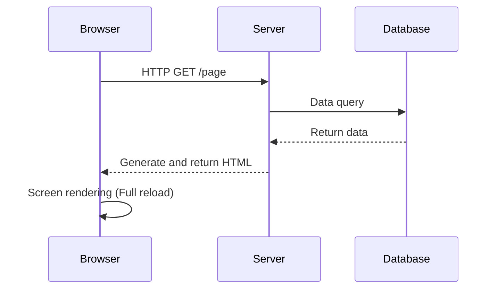
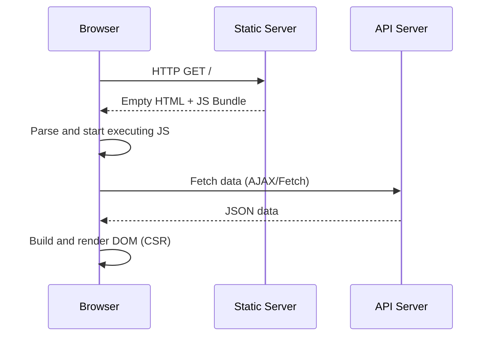
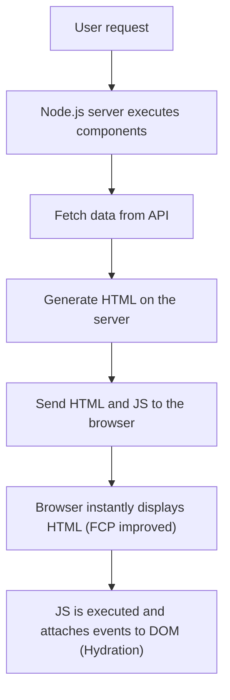
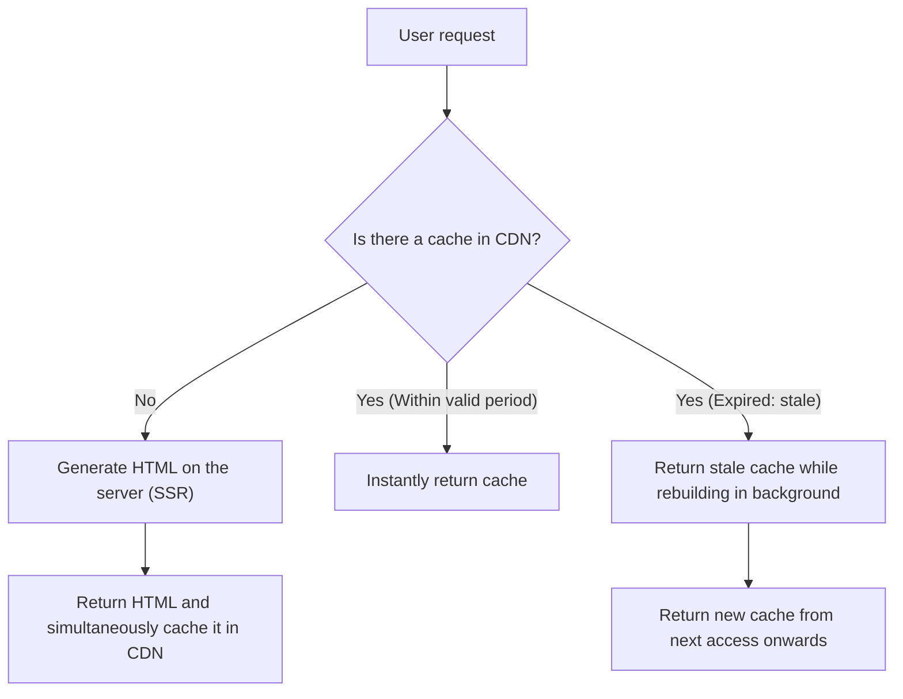

## 1. Introduction: The Evolution of Frontend Rendering

The history of web development is also the history of a pendulum swinging between the server-side and the client-side regarding "where" content is rendered. The early web had a simple structure where HTML was generated on the server and the browser simply displayed it. However, as demands for user experience (UX) increased, the Single Page Application (SPA), which dynamically builds the UI on the browser side making full use of JavaScript, became mainstream.

And now, to overcome the challenges brought about by SPAs, we have evolved into new approaches such as Server-Side Rendering (SSR) and Static Site Generation (SSG), which once again borrow the power of the server, and further into Incremental Static Regeneration (ISR) and React Server Components (RSC).

In this article, we will delve deep into the inevitability of this evolution in frontend rendering technologies and the kinds of problems each technology was born to solve.

## 2. The Era of Traditional SSR and jQuery

From the 1990s through the 2000s, web pages were dynamically generated on the server-side using backend technologies like PHP, Ruby on Rails, Java, and Perl. When a user accesses a URL, the server retrieves information from a database, constructs the complete HTML, and returns it to the browser. The browser parses the received HTML from top to bottom and renders it on the screen.

This approach was extremely powerful for SEO (Search Engine Optimization) because crawlers could immediately read the complete HTML. However, even if only a part of the page was updated, a full page reload occurred, so the user experience was by no means seamless.

This is where **jQuery** and AJAX (Asynchronous JavaScript and XML) came in. This made it possible to fetch data asynchronously from the server using JavaScript and directly rewrite a part of the DOM without reloading the entire page. However, as applications became more complex, the approach of directly manipulating the DOM significantly degraded code maintainability and became a hotbed for "spaghetti code."

## 3. Shift to the Client-Side: The Rise of SPA

Entering the 2010s, with the spread of smartphones and rising user expectations, the web was also required to have a smooth operational feel similar to native apps. **SPA (Single Page Application)** emerged in response to this demand.

Frameworks like AngularJS, Backbone.js, and later React and Vue.js completely delegated the rendering logic of the screen from the server to the client (browser).

In SPA, an "empty HTML" and a "huge JavaScript file (bundle)" are downloaded upon the first access. After that, JavaScript runs on the browser, asynchronously fetches the necessary data from the API server, and dynamically builds the DOM on the client-side (Client-Side Rendering, CSR).
During page transitions, JavaScript controls routing and fetches only the necessary data to rewrite the screen, so full reloads do not occur, realizing an astonishingly smooth user experience.

## 4. Challenges of SPA: Initial Load Time and SEO

While SPA provided wonderful UX, it also created new challenges at the same time.

1. **Delayed initial load time (Deterioration of TTFB and FCP)**:
   When a user first accesses a page, it takes a long time before meaningful content is displayed on the screen (First Contentful Paint, FCP). This is because the browser can only build the DOM after downloading the huge JavaScript file, parsing it, executing it, and furthermore fetching data from the API. Especially in mobile environments or slow networks, users end up staring at a blank screen for a long time.

2. **Issues with SEO (Search Engine Optimization) and OGP**:
   The initial HTML provided by SPA contains only empty elements like `

`. Although Google crawlers can execute JavaScript today, it takes time to be indexed. Other search engine or SNS crawlers (such as Twitter or Facebook's OGP unfurling) only read HTML without executing JavaScript, so there was a serious problem that they could not correctly recognize dynamically generated content.

## 5. Modern SSR and Hydration

To solve the challenges of SPA, the frontend community made the decision to once again borrow the power of the server-side. This is the birth of **modern SSR (Server-Side Rendering)**. Meta-frameworks like Next.js and Nuxt.js led this approach.

In modern SSR, for the first request, React or Vue components are executed on the server (usually a Node.js environment), and a complete HTML including data fetching is generated and returned to the browser.

Since the browser can instantly render the received HTML, FCP is dramatically improved, and SEO and OGP issues are completely resolved. However, the page right after being displayed is still just "static HTML" and does not react to operations like clicks.
When JavaScript is downloaded and executed in the background, frameworks like React attach event listeners to existing DOM elements, transforming the application into a "dynamic" state. This process is called **Hydration**.

SSR was powerful, but because it performs rendering processing on the server for every request, it created new challenges: high server load (delayed TTFB) and high costs to ensure scalability.

## 6. Static Site Generation (SSG): The Rise of Jamstack

"If generating HTML for every request is heavy, why not just build the HTML for all pages in advance at build time?"
**SSG (Static Site Generation)** was born from this idea. Gatsby and Next.js popularized this approach, and it became the core of an architecture called Jamstack (JavaScript, APIs, Markup).

Data is fetched from APIs at build time, and HTML is generated in advance. The generated static HTML is placed on a CDN (Content Delivery Network) and delivered at blazing speeds from edge servers around the world.
Since server-side computation is unnecessary, security is high, TTFB (Time to First Byte) is the fastest, and server costs can be kept extremely low.

However, SSG also had a decisive weakness: **"data freshness" and "build time."**
If there is a blog with 10,000 pages or a huge EC site, every time a single piece of content is updated, all pages need to be rebuilt. Builds began to take tens of minutes to hours, making it unsuitable for applications that require real-time updates.

## 7. The Innovation of ISR (Incremental Static Regeneration)

To solve SSG's "long build time" and "delayed data updates," Next.js introduced a groundbreaking solution: **ISR (Incremental Static Regeneration)**.

Instead of generating all pages at build time, ISR statically generates only the important pages first, and generates the rest of the pages upon the user's first request like SSR, simultaneously caching the result on the CDN (saving it as a static file).
Furthermore, by setting an expiration time (e.g., 60 seconds) called `revalidate`, it returns the "old cache (stale)" for the first request after expiration, while performing re-rendering in the background and updating the cache to new HTML (stale-while-revalidate strategy).

This achieved the best of both worlds: constantly providing users with ultra-fast responses (the merit of SSG) while periodically keeping data up-to-date (the merit of SSR). Furthermore, recently, **On-demand ISR**, which destroys and updates caches at any given timing triggered by Webhooks etc., has also become mainstream.

## 8. React Server Components (RSC) and App Router

And now, the frontend pendulum is evolving into a further dimension. That is **React Server Components (RSC)**. It was fully introduced with the App Router from Next.js 13 onwards.

In conventional SSR and SSG, "whether to render on the server or render on the client" was decided on a "per-page basis." However, in RSC, the server and client can be separated on a **"per-component basis."**

- **Server Components**: Executed only on the server, and no JavaScript code is sent to the client at all. Even if you access the database directly or use heavy libraries, it does not affect the client's bundle size.
- **Client Components**: Applied only to parts requiring user interaction, such as state management (`useState`) or event listeners (`onClick`), and are hydrated on the client-side just like before.

This made it possible to minimize the "downloading and execution of huge JavaScript bundles," which was SPA's greatest weakness, while maintaining the smooth operability of SPA.

## 9. Conclusion: Where is the Pendulum Heading?

The pendulum that started from jQuery and swung greatly to the client-side with SPA, has gone through SSR, SSG, and ISR, and is now heading towards the "optimal fusion of server and client" in the form of RSC.

Technological evolution is by no means a denial of the past. It is precisely because SPA proved advanced UX on the client-side that the current evolution of SSR/RSC exists on how to provide it quickly and safely.
Going forward, this pendulum will likely continue to swing with new requirements and the evolution of devices. What's important is not to blindly believe in a specific technology, but to have an architectural perspective that assesses the requirements of each project (the importance of SEO, frequency of data updates, required level of user experience, etc.) and selects an appropriate rendering strategy.
