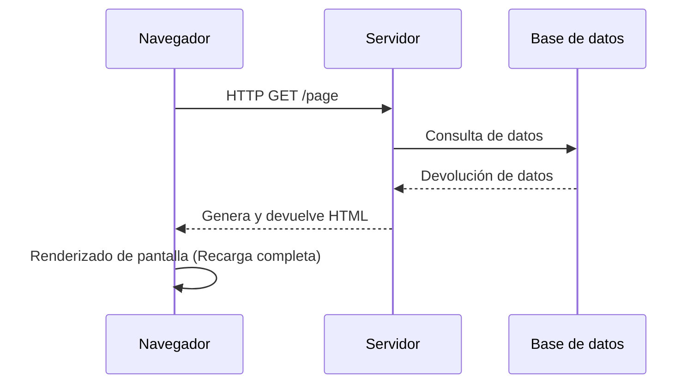
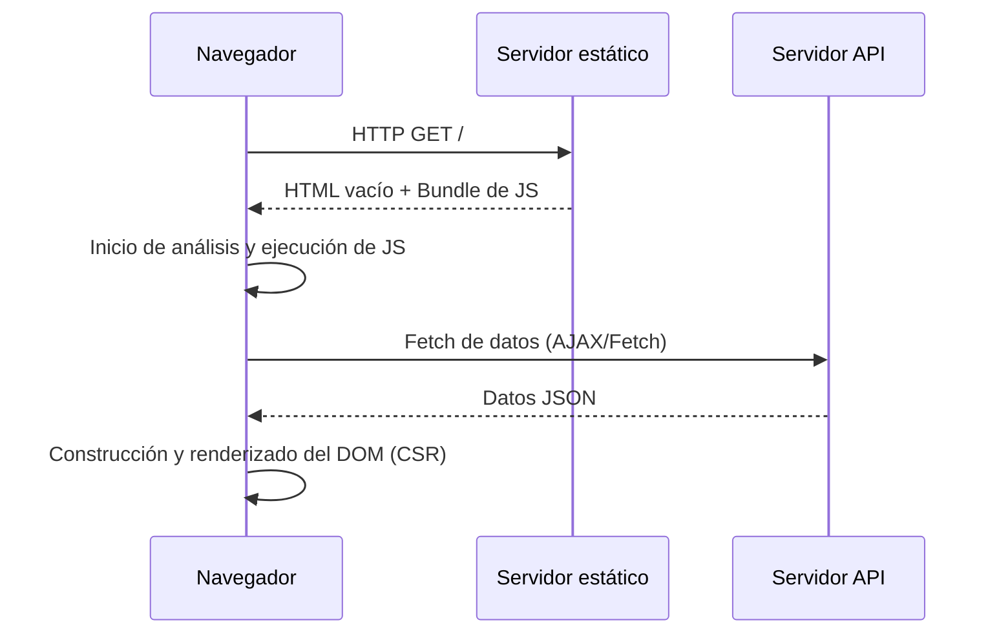
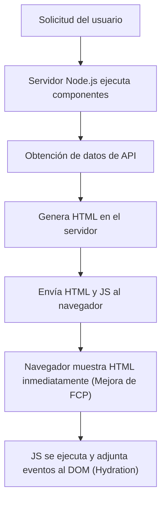
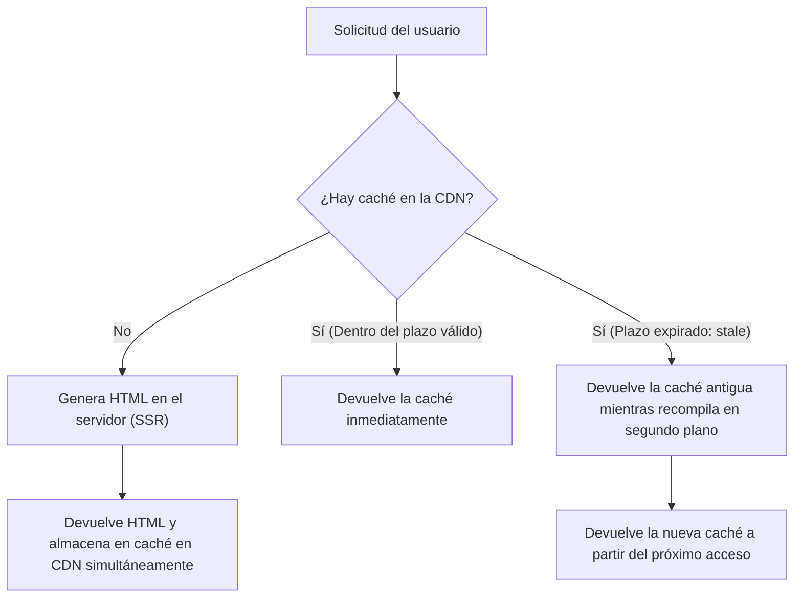

## 1. Introducción: La evolución del renderizado frontend

La historia del desarrollo web es también la historia de un péndulo que oscila entre el lado del servidor y el lado del cliente sobre "dónde" renderizar el contenido. La web primitiva tenía una estructura simple donde el HTML se generaba en el servidor y el navegador simplemente lo mostraba. Sin embargo, a medida que aumentaba la demanda de una mejor experiencia de usuario (UX), las Single Page Applications (SPA), que utilizan JavaScript de forma intensiva para construir dinámicamente la UI en el navegador, se convirtieron en la norma.

Y ahora, para superar los desafíos que trajeron las SPA, estamos evolucionando hacia nuevos enfoques que vuelven a aprovechar el poder del servidor, como Server-Side Rendering (SSR), Static Site Generation (SSG), e incluso Incremental Static Regeneration (ISR) y React Server Components (RSC).

En este artículo, profundizaremos en la inevitabilidad de la evolución de estas tecnologías de renderizado frontend y los desafíos específicos que cada tecnología fue creada para resolver.

## 2. La era del SSR tradicional y jQuery

Desde la década de 1990 hasta la de 2000, las páginas web se generaban dinámicamente en el lado del servidor utilizando tecnologías backend como PHP, Ruby on Rails, Java y Perl. Cuando un usuario accedía a una URL, el servidor obtenía información de la base de datos, construía el HTML completo y lo devolvía al navegador. El navegador analizaba el HTML recibido de arriba hacia abajo y lo renderizaba en la pantalla.

Este enfoque era muy poderoso para el SEO (Optimización para Motores de Búsqueda) porque los rastreadores podían leer el HTML completo de inmediato. Sin embargo, incluso para actualizar solo una parte de la página, se requería una recarga de la pantalla completa (full page reload), lo que significaba que la experiencia del usuario de ninguna manera era fluida.

Es entonces cuando aparecieron **jQuery** y AJAX (Asynchronous JavaScript and XML). Esto hizo posible obtener datos del servidor de forma asíncrona utilizando JavaScript y sobrescribir directamente partes del DOM sin recargar toda la página. Sin embargo, a medida que las aplicaciones se volvían más complejas, el enfoque de manipular directamente el DOM disminuía significativamente la mantenibilidad del código, convirtiéndose en un caldo de cultivo para el "código espagueti".

## 3. Transición al lado del cliente: El auge de las SPA

Al entrar en la década de 2010, con la popularización de los teléfonos inteligentes y el aumento de las expectativas de los usuarios, la web también requería una sensación de funcionamiento suave similar a la de las aplicaciones nativas. **SPA (Single Page Application)** apareció para satisfacer esta demanda.

Frameworks como AngularJS, Backbone.js, y más tarde React y Vue.js, delegaron completamente la lógica de renderizado de la pantalla del servidor al cliente (navegador).

En una SPA, durante el primer acceso se descarga un "HTML vacío" y un "archivo JavaScript enorme (bundle)". Luego, el JavaScript se ejecuta en el navegador, obtiene los datos necesarios de forma asíncrona desde un servidor API y construye dinámicamente el DOM en el lado del cliente (Client-Side Rendering, CSR).
Durante las transiciones de página, JavaScript controla el enrutamiento y obtiene solo los datos necesarios para reescribir la pantalla. Por lo tanto, no ocurren recargas completas, logrando una experiencia de usuario increíblemente fluida.

## 4. Los desafíos de las SPA: Tiempo de carga inicial y SEO

Aunque las SPA proporcionaban una excelente UX, también creaban nuevos desafíos.

1. **Retraso en el tiempo de carga inicial (Empeoramiento de TTFB y FCP)**:
   Cuando un usuario accede a la página por primera vez, toma mucho tiempo hasta que se muestra contenido significativo en la pantalla (First Contentful Paint, FCP). Esto se debe a que el navegador debe descargar el enorme archivo JavaScript, analizarlo, ejecutarlo y luego obtener datos de la API antes de poder construir el DOM. Especialmente en entornos móviles o redes lentas, los usuarios terminarán mirando una pantalla en blanco durante mucho tiempo.

2. **Problemas con SEO (Optimización para Motores de Búsqueda) y OGP**:
   El HTML inicial proporcionado por una SPA solo contiene un elemento vacío como `

`. Aunque los rastreadores de Google ahora pueden ejecutar JavaScript, puede tomar tiempo indexarlo, y otros motores de búsqueda y rastreadores de redes sociales (como las previsualizaciones OGP de Twitter o Facebook) solo leen el HTML sin ejecutar JavaScript. Hubo un problema grave en el que el contenido generado dinámicamente no podía ser reconocido correctamente.

## 5. SSR moderno e Hidratación (Hydration)

Para resolver los problemas de las SPA, la comunidad frontend tomó la decisión de volver a apoyarse en el poder del lado del servidor. Esto dio origen al **SSR (Server-Side Rendering) moderno**. Meta-frameworks como Next.js y Nuxt.js impulsaron este enfoque.

En el SSR moderno, para la primera solicitud, los componentes de React o Vue se ejecutan en el servidor (generalmente en un entorno Node.js) y se genera un HTML completo que incluye la obtención de datos para devolverlo al navegador.

Dado que el navegador puede renderizar inmediatamente el HTML recibido, el FCP mejora drásticamente, resolviendo por completo los problemas de SEO y OGP. Sin embargo, justo después de ser mostrada, la página sigue siendo solo "HTML estático" y no responde a acciones como clics.
Cuando el JavaScript se descarga y ejecuta en segundo plano, frameworks como React adjuntan detectores de eventos a los elementos del DOM existentes, transformando la aplicación a un estado "dinámico". A este proceso se le llama **Hidratación (Hydration)**.

Aunque el SSR era poderoso, introdujo un nuevo desafío: debido a que el procesamiento de renderizado se realiza en el servidor para cada solicitud, la carga del servidor es alta (retraso en TTFB) y asegurar la escalabilidad se vuelve costoso.

## 6. Generación de Sitios Estáticos (SSG): El auge de Jamstack

"Si es muy pesado generar el HTML para cada solicitud, ¿por qué no creamos todo el HTML de antemano durante el tiempo de compilación?"
De esta idea nació el **SSG (Static Site Generation)**. Gatsby y Next.js popularizaron este enfoque, convirtiéndolo en el núcleo de la arquitectura conocida como Jamstack (JavaScript, APIs, Markup).

Durante la compilación, se obtienen los datos de la API y se genera el HTML. El HTML estático generado se coloca en una CDN (Content Delivery Network) y se entrega a una velocidad vertiginosa desde servidores periféricos (edge servers) en todo el mundo.
Dado que no se requieren cálculos del lado del servidor, la seguridad es alta, el TTFB (Time to First Byte) es el más rápido, y los costos del servidor se mantienen extremadamente bajos.

Sin embargo, el SSG también tenía debilidades críticas: **"La frescura de los datos" y "el tiempo de compilación"**.
Si hay un blog con 10,000 páginas o un sitio masivo de comercio electrónico, cada vez que se actualiza una sola pieza de contenido, todas las páginas deben ser recompiladas. La compilación puede tardar de decenas de minutos a varias horas, lo que lo hace inadecuado para aplicaciones que requieren tiempo real.

## 7. La innovación del ISR (Incremental Static Regeneration)

Para resolver el "largo tiempo de compilación" y "retraso en la actualización de datos" del SSG, Next.js introdujo una solución revolucionaria: el **ISR (Incremental Static Regeneration)**.

El ISR no genera todas las páginas durante la compilación, sino que solo renderiza las páginas importantes con SSG primero, y el resto se genera como si fuera SSR en la primera solicitud del usuario, mientras almacena el resultado simultáneamente en la caché de la CDN (como un archivo estático).
Además, al configurar un tiempo de expiración `revalidate` (por ejemplo: 60 segundos), se devuelve la "caché antigua (stale)" para la primera solicitud después de que expira, mientras que el renderizado se vuelve a ejecutar en segundo plano para actualizar la caché con un nuevo HTML (estrategia stale-while-revalidate).

Como resultado, los usuarios siempre reciben respuestas ultrarrápidas (la ventaja de SSG) mientras que los datos se actualizan de forma regular (la ventaja de SSR), logrando lo mejor de ambos mundos. Más recientemente, el **On-demand ISR**, que descarta y actualiza la caché en momentos específicos activado por cosas como Webhooks, también se ha convertido en la norma.

## 8. React Server Components (RSC) y el App Router

Y en la actualidad, el péndulo del frontend ha evolucionado a otra dimensión. Se trata de **React Server Components (RSC)**, introducidos formalmente en el App Router a partir de Next.js 13.

En el SSR y SSG anteriores, "si se renderizaba en el servidor o en el cliente" se decidía a "nivel de página". Sin embargo, con RSC, es posible separar el servidor y el cliente a **"nivel de componente"**.

- **Server Components**: Se ejecutan solo en el servidor, y no se envía ningún código JavaScript al cliente en absoluto. Incluso si acceden directamente a una base de datos o usan bibliotecas pesadas, no afectarán el tamaño del bundle del cliente.
- **Client Components**: Se aplican solo a partes que requieren interacción con el usuario, como la gestión de estado (`useState`) o detectores de eventos (`onClick`), y se hidratan en el lado del cliente como de costumbre.

Esto ha hecho posible reducir de manera drástica "la descarga y ejecución de un enorme bundle de JavaScript", que era la mayor debilidad de las SPA, mientras se mantiene la fluida operabilidad de una SPA.

## 9. Conclusión: ¿Hacia dónde se dirige el péndulo?

El péndulo que comenzó con jQuery y osciló en gran medida hacia el lado del cliente con las SPA, ha pasado por el SSR, SSG e ISR, y ahora se dirige hacia una "fusión óptima de servidor y cliente" en forma de RSC.

La evolución de la tecnología no es en absoluto una negación del pasado. Precisamente porque las SPA demostraron el potencial para una UX avanzada en el lado del cliente, es que existe la evolución actual de SSR/RSC, centrada en cómo proporcionar eso de forma rápida y segura.
Con los nuevos requerimientos y la evolución de los dispositivos en el futuro, este péndulo seguirá oscilando. Lo importante no es creer a ciegas en una tecnología específica, sino tener una perspectiva arquitectónica para evaluar los requisitos de cada proyecto (la importancia del SEO, la frecuencia de las actualizaciones de datos, el nivel de exigencia de la experiencia del usuario, etc.) y elegir la estrategia de renderizado adecuada.
