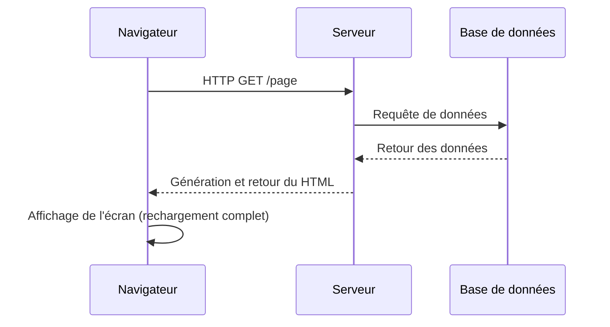
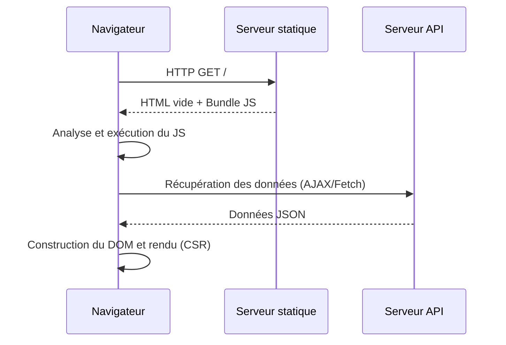
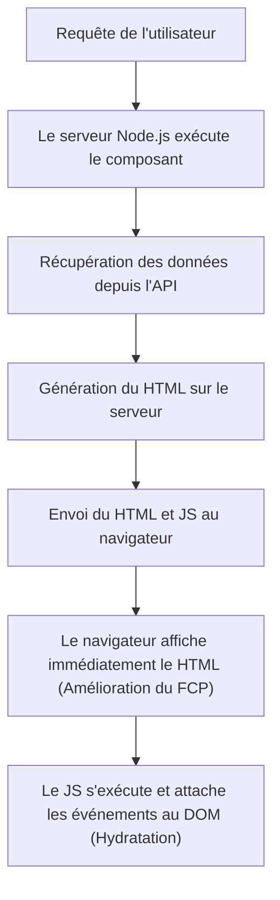
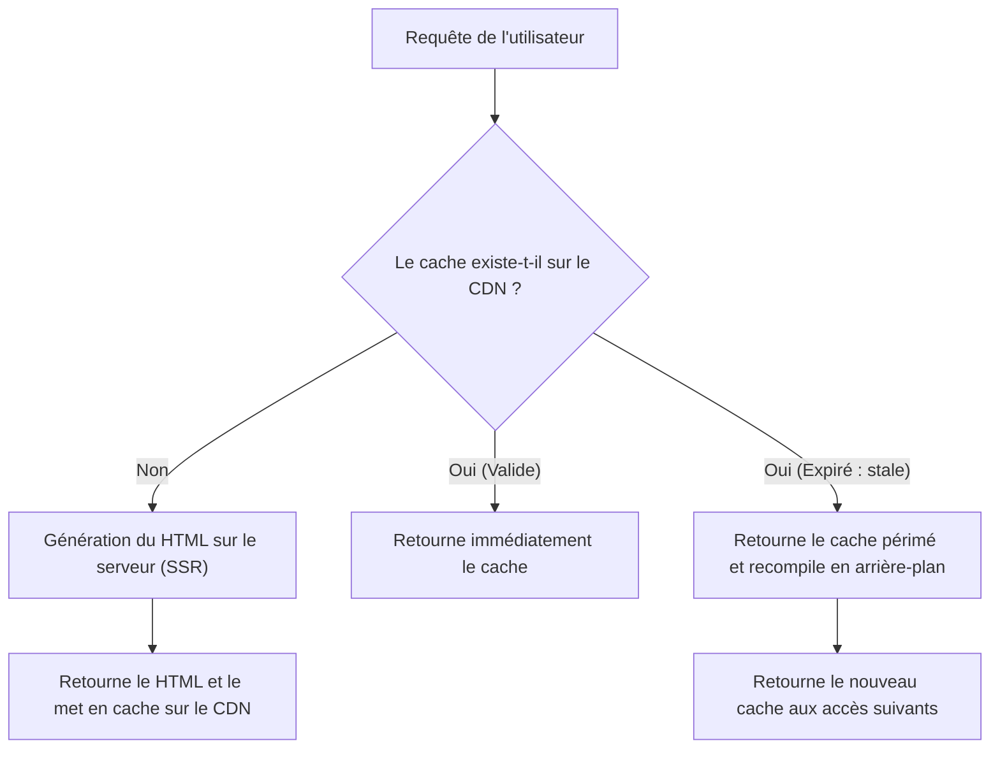

## 1. Introduction : L'évolution du rendu front-end

L'histoire du développement Web est aussi l'histoire d'un pendule qui oscille entre le côté serveur et le côté client pour déterminer « où » le contenu doit être rendu. Les premiers sites Web avaient une structure simple : le serveur générait du HTML et le navigateur se contentait de l'afficher. Cependant, à mesure que les exigences en matière d'expérience utilisateur (UX) augmentaient, les applications monopages (SPA - Single Page Application), qui utilisent JavaScript pour construire dynamiquement l'interface utilisateur côté navigateur, sont devenues la norme.

Aujourd'hui, pour surmonter les défis posés par les SPA, nous avons de nouveau recours à la puissance du serveur grâce à des approches évoluées telles que le rendu côté serveur (SSR - Server-Side Rendering), la génération de sites statiques (SSG - Static Site Generation), et même la régénération statique incrémentielle (ISR - Incremental Static Regeneration) ainsi que les composants serveur React (RSC - React Server Components).

Dans cet article, nous explorerons en profondeur l'inévitabilité de l'évolution de ces technologies de rendu front-end et les problèmes spécifiques que chacune d'elles a été conçue pour résoudre.

## 2. Le SSR traditionnel et l'ère de jQuery

Des années 1990 aux années 2000, les pages Web étaient générées dynamiquement côté serveur à l'aide de technologies back-end telles que PHP, Ruby on Rails, Java et Perl. Lorsqu'un utilisateur accédait à une URL, le serveur récupérait les informations de la base de données, construisait le HTML complet et le renvoyait au navigateur. Le navigateur analysait le HTML reçu de haut en bas et l'affichait à l'écran.

Cette approche était très performante pour le SEO (optimisation pour les moteurs de recherche). En effet, les robots d'indexation pouvaient lire instantanément le HTML complet. Cependant, la mise à jour d'une simple partie de la page entraînait le rechargement de l'écran entier (rechargement complet de la page), ce qui n'offrait pas une expérience utilisateur fluide.

C'est alors que **jQuery** et AJAX (Asynchronous JavaScript and XML) ont fait leur apparition. Ils ont permis de récupérer des données du serveur de manière asynchrone via JavaScript et de modifier directement une partie du DOM, sans avoir à recharger toute la page. Toutefois, à mesure que les applications devenaient plus complexes, la manipulation directe du DOM réduisait considérablement la maintenabilité du code, créant un terrain propice au « code spaghetti ».

## 3. La transition vers le côté client : L'essor des SPA

Au début des années 2010, avec la démocratisation des smartphones et l'augmentation des attentes des utilisateurs, le Web devait offrir une fluidité comparable à celle des applications natives. C'est pour répondre à cette demande que les **SPA (Single Page Application)** sont apparues.

Des frameworks comme AngularJS, Backbone.js, puis React et Vue.js, ont complètement transféré la logique de rendu de l'interface du serveur vers le client (le navigateur).

Dans une SPA, lors du premier accès, on télécharge un « HTML vide » et un « énorme fichier JavaScript (bundle) ». Ensuite, JavaScript s'exécute dans le navigateur, récupère de manière asynchrone les données nécessaires depuis le serveur API, et construit dynamiquement le DOM côté client (Client-Side Rendering, CSR).
Lors de la navigation entre les pages, JavaScript gère le routage et ne récupère que les données nécessaires pour mettre à jour l'écran. Il n'y a donc aucun rechargement complet, ce qui offre une expérience utilisateur incroyablement fluide.

## 4. Les défis des SPA : Temps de chargement initial et SEO

Bien que les SPA aient offert une excellente UX, elles ont également créé de nouveaux défis.

1. **Retard du temps de chargement initial (Dégradation du TTFB et du FCP)** :
   Lorsqu'un utilisateur accède à la page pour la première fois, l'affichage du premier contenu significatif (First Contentful Paint, FCP) prend beaucoup de temps. Cela s'explique par le fait que le navigateur doit télécharger, analyser et exécuter un énorme fichier JavaScript, puis récupérer les données de l'API avant de pouvoir enfin construire le DOM. Particulièrement sur les appareils mobiles ou les réseaux lents, l'utilisateur risque de fixer un écran blanc (blank screen) pendant un long moment.

2. **Problèmes de SEO (optimisation pour les moteurs de recherche) et OGP** :
   Le HTML initial fourni par une SPA ne contient souvent qu'un élément vide comme `

`. Bien que les robots d'indexation de Google puissent désormais exécuter JavaScript, l'indexation peut prendre du temps. De plus, les robots d'autres moteurs de recherche ou réseaux sociaux (comme la génération de cartes OGP pour Twitter ou Facebook) lisent souvent uniquement le HTML sans exécuter le JavaScript, ce qui pose un problème majeur : le contenu généré dynamiquement n'est pas reconnu correctement.

## 5. SSR moderne et Hydratation (Hydration)

Pour résoudre les problèmes des SPA, la communauté front-end a décidé de s'appuyer à nouveau sur la puissance du serveur. C'est ainsi qu'est né le **SSR moderne (Server-Side Rendering)**. Des méta-frameworks comme Next.js et Nuxt.js ont été les fers de lance de cette approche.

Dans le SSR moderne, lors de la requête initiale, les composants React ou Vue sont exécutés sur le serveur (généralement dans un environnement Node.js) pour générer un HTML complet, y compris la récupération des données, qui est ensuite renvoyé au navigateur.

Le navigateur peut rendre instantanément le HTML reçu, ce qui améliore considérablement le FCP et résout complètement les problèmes de SEO et d'OGP. Cependant, juste après son affichage, la page n'est encore qu'un « HTML statique » et ne réagit pas aux interactions comme les clics.
Une fois que le JavaScript est téléchargé et exécuté en arrière-plan, des frameworks comme React attachent des écouteurs d'événements aux éléments du DOM existants, faisant passer l'application à un état « dynamique ». Ce processus s'appelle **l'hydratation (Hydration)**.

Bien que le SSR soit puissant, il a engendré un nouveau défi : comme le rendu est effectué sur le serveur à chaque requête, la charge du serveur est élevée (retard du TTFB), ce qui entraîne des coûts importants pour assurer la scalabilité.

## 6. Génération de sites statiques (SSG) : L'essor de la Jamstack

« S'il est coûteux de générer du HTML à chaque requête, pourquoi ne pas pré-générer le HTML de toutes les pages lors du build ? »
C'est de cette idée qu'est née la **SSG (Static Site Generation)**. Gatsby et Next.js ont popularisé cette approche, qui est devenue le cœur de l'architecture appelée Jamstack (JavaScript, APIs, Markup).

Lors du build, les données sont récupérées via l'API et le HTML est généré. Le HTML statique ainsi produit est placé sur un CDN (Content Delivery Network) et distribué à une vitesse fulgurante depuis des serveurs Edge situés partout dans le monde.
Puisqu'aucun calcul côté serveur n'est nécessaire, la sécurité est élevée, le TTFB (Time to First Byte) est extrêmement rapide, et les coûts de serveur sont maintenus à un niveau très bas.

Cependant, la SSG présentait également une faiblesse majeure : **« la fraîcheur des données » et « le temps de build »**.
Pour un blog de 10 000 pages ou un grand site e-commerce, il fallait reconstruire l'intégralité du site chaque fois qu'un seul contenu était mis à jour. Le build pouvait prendre de plusieurs dizaines de minutes à plusieurs heures, ce qui le rendait inadapté aux applications nécessitant du temps réel.

## 7. L'innovation de l'ISR (Incremental Static Regeneration)

Pour résoudre les problèmes de « temps de build trop long » et de « retard de mise à jour des données » de la SSG, Next.js a proposé une solution révolutionnaire : **l'ISR (Incremental Static Regeneration : Régénération Statique Incrémentielle)**.

Avec l'ISR, au lieu de générer toutes les pages lors du build, seules les pages critiques sont générées via SSG. Les autres pages sont générées à la manière du SSR lors de la première requête d'un utilisateur, et le résultat est simultanément mis en cache sur le CDN (sauvegardé en tant que fichier statique).
De plus, en configurant une durée de validité `revalidate` (par exemple : 60 secondes), la première requête suivant l'expiration renverra le « cache périmé (stale) » tout en déclenchant un nouveau rendu en arrière-plan (background) pour mettre à jour le cache avec un nouveau HTML (stratégie stale-while-revalidate).

Cela permet de toujours fournir une réponse ultra-rapide aux utilisateurs (l'avantage de la SSG) tout en mettant à jour les données régulièrement (l'avantage du SSR), réunissant ainsi le meilleur des deux mondes. Récemment, l'**ISR à la demande (On-demand ISR)**, qui utilise des webhooks pour invalider et mettre à jour le cache à un moment précis, est également devenue courante.

## 8. React Server Components (RSC) et App Router

Aujourd'hui, le pendule du front-end évolue vers une toute nouvelle dimension avec les **React Server Components (RSC)**. Cette approche a été introduite de manière majeure avec l'App Router à partir de Next.js 13.

Jusqu'à présent, avec le SSR ou la SSG, la décision de « rendre sur le serveur ou sur le client » se prenait « par page ». Mais avec les RSC, il est possible de séparer le serveur et le client **« par composant »**.

- **Server Components** : S'exécutent uniquement sur le serveur, et aucun code JavaScript n'est envoyé au client. Même si vous accédez directement à la base de données ou utilisez des bibliothèques lourdes, cela n'affectera pas la taille du bundle côté client.
- **Client Components** : Ne s'appliquent qu'aux parties nécessitant une interaction avec l'utilisateur, comme la gestion d'état (`useState`) ou les écouteurs d'événements (`onClick`), et sont hydratés côté client comme auparavant.

Cela permet de réduire considérablement le « téléchargement et l'exécution d'énormes bundles JavaScript », la plus grande faiblesse des SPA, tout en conservant la fluidité d'utilisation de celles-ci.

## 9. Conclusion : Vers où va le pendule ?

En partant de jQuery, le pendule a d'abord fortement basculé du côté client avec les SPA, avant de passer par le SSR, la SSG et l'ISR pour se diriger aujourd'hui vers une « fusion optimale entre le serveur et le client » avec les RSC.

L'évolution technologique n'est en aucun cas un reniement du passé. C'est précisément parce que les SPA ont prouvé la valeur d'une UX avancée côté client que l'évolution actuelle du SSR/RSC cherche à offrir cette même expérience de manière plus rapide et plus sûre.
À l'avenir, avec l'apparition de nouvelles exigences et l'évolution des appareils, ce pendule continuera d'osciller. L'important n'est pas de suivre aveuglément une technologie spécifique, mais d'avoir une vision architecturale capable d'évaluer les exigences de chaque projet (importance du SEO, fréquence de mise à jour des données, niveau d'exigence de l'UX, etc.) pour choisir la stratégie de rendu la plus appropriée.
