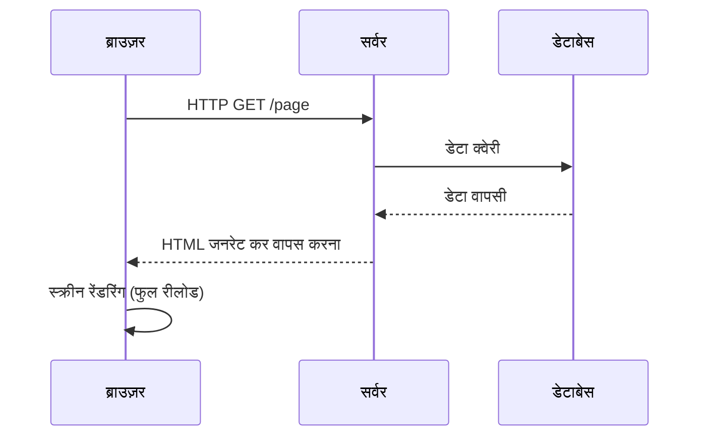
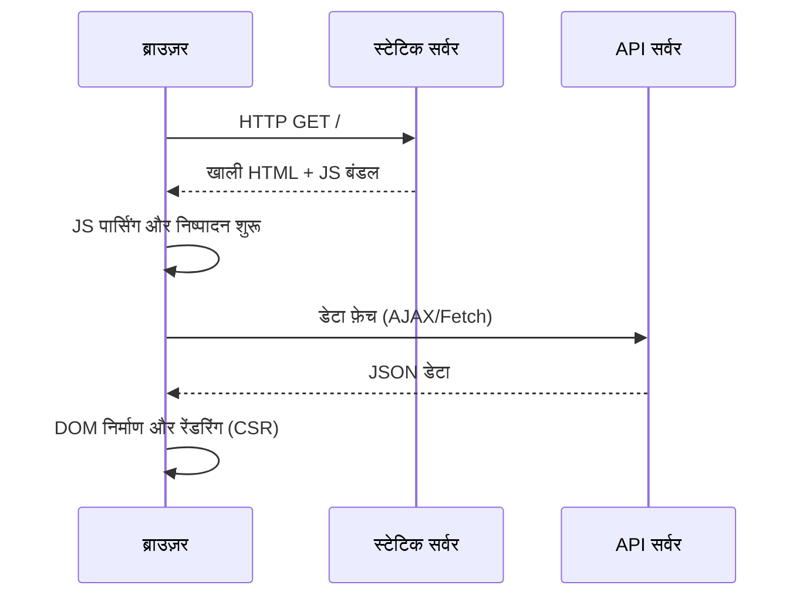
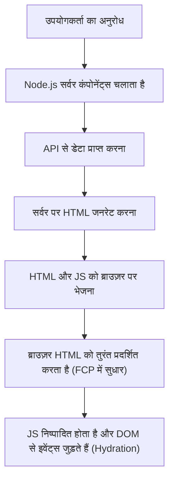
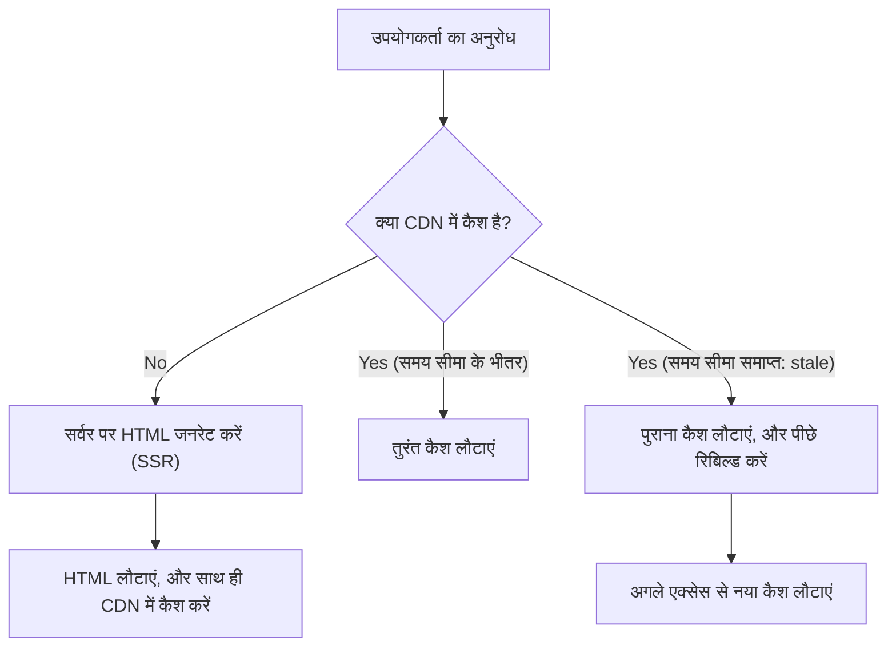

## 1. परिचय: फ्रंटएंड रेंडरिंग का विकास

वेब विकास का इतिहास इस बात का भी इतिहास है कि सामग्री को "कहाँ" रेंडर किया जाए, यानी सर्वर-साइड और क्लाइंट-साइड के बीच झूलते पेंडुलम का इतिहास। शुरुआती वेब की संरचना बहुत ही सरल थी, जहाँ सर्वर पर HTML जनरेट होता था और ब्राउज़र उसे सिर्फ प्रदर्शित करता था। हालाँकि, जैसे-जैसे उपयोगकर्ता अनुभव (UX) की माँगें बढ़ीं, Single Page Application (SPA) मुख्यधारा बन गए, जहाँ JavaScript का उपयोग करके ब्राउज़र पर UI को डायनामिक रूप से बनाया जाने लगा।

और अब, SPA द्वारा लाई गई चुनौतियों को दूर करने के लिए, हम फिर से सर्वर की शक्ति का उपयोग कर रहे हैं। Server-Side Rendering (SSR), Static Site Generation (SSG), Incremental Static Regeneration (ISR), और यहाँ तक कि React Server Components (RSC) जैसे नए दृष्टिकोणों की ओर हम विकसित हो रहे हैं।

इस लेख में, हम फ्रंटएंड रेंडरिंग तकनीक के विकास की अनिवार्यता को गहराई से समझेंगे और यह जानेंगे कि इनमें से प्रत्येक तकनीक किन समस्याओं को हल करने के लिए बनाई गई थी।

## 2. पारंपरिक SSR और jQuery का युग

1990 और 2000 के दशक में, वेब पेजों को PHP, Ruby on Rails, Java, और Perl जैसी बैकएंड तकनीकों का उपयोग करके सर्वर-साइड पर डायनामिक रूप से जनरेट किया जाता था। जब कोई उपयोगकर्ता किसी URL पर जाता था, तो सर्वर डेटाबेस से जानकारी प्राप्त करता था, एक संपूर्ण HTML बनाता था और उसे ब्राउज़र को लौटा देता था। ब्राउज़र प्राप्त HTML को ऊपर से नीचे तक पार्स करता था और उसे स्क्रीन पर रेंडर करता था।

यह दृष्टिकोण SEO (खोज इंजन अनुकूलन) के लिए बहुत शक्तिशाली था, क्योंकि क्रॉलर तुरंत संपूर्ण HTML पढ़ सकते थे। हालाँकि, पेज के एक छोटे से हिस्से को अपडेट करने पर भी पूरी स्क्रीन का रीलोड (फुल पेज रीलोड) होता था, जिससे उपयोगकर्ता अनुभव कभी भी सहज (seamless) नहीं था।

इसके बाद **jQuery** और AJAX (Asynchronous JavaScript and XML) का आगमन हुआ। इसने पूरे पेज को रीलोड किए बिना, JavaScript का उपयोग करके असिंक्रोनस रूप से सर्वर से डेटा प्राप्त करने और DOM के कुछ हिस्सों को सीधे अपडेट करने की अनुमति दी। लेकिन, जैसे-जैसे एप्लिकेशन जटिल होते गए, सीधे DOM में हेरफेर करने के दृष्टिकोण ने कोड की मेंटेनेबिलिटी को काफी कम कर दिया और यह "स्पेगेटी कोड" का कारण बन गया।

## 3. क्लाइंट-साइड की ओर बदलाव: SPA का उदय

2010 के दशक की शुरुआत में, स्मार्टफोन के प्रसार और उपयोगकर्ता की बढ़ती अपेक्षाओं के कारण, वेब पर भी नेटिव ऐप जैसे सुचारू उपयोगकर्ता अनुभव की मांग होने लगी। इस मांग को पूरा करने के लिए **SPA (Single Page Application)** का जन्म हुआ।

AngularJS, Backbone.js, और बाद में React और Vue.js जैसे फ्रेमवर्क्स ने स्क्रीन रेंडरिंग के लॉजिक को सर्वर से पूरी तरह हटाकर क्लाइंट (ब्राउज़र) को सौंप दिया।

SPA में, पहले एक्सेस पर एक "खाली HTML" और एक "विशाल JavaScript फ़ाइल (बंडल)" डाउनलोड की जाती है। इसके बाद, ब्राउज़र पर JavaScript चलती है, API सर्वर से आवश्यक डेटा को असिंक्रोनस रूप से लाती है, और क्लाइंट-साइड पर डायनामिक रूप से DOM का निर्माण करती है (Client-Side Rendering, CSR)।
पेज ट्रांज़िशन के दौरान, JavaScript रूटिंग को नियंत्रित करती है और केवल आवश्यक डेटा लाकर स्क्रीन को अपडेट करती है, जिससे कोई फुल रीलोड नहीं होता और यह आश्चर्यजनक रूप से सहज उपयोगकर्ता अनुभव प्रदान करता है।

## 4. SPA की चुनौतियां: इनिशियल लोड टाइम और SEO

SPA ने शानदार UX प्रदान किया, लेकिन साथ ही नई चुनौतियां भी पैदा कीं।

1. **इनिशियल लोड टाइम में देरी (TTFB और FCP का खराब होना)**:
   जब उपयोगकर्ता पहली बार पेज पर आता है, तो स्क्रीन पर अर्थपूर्ण सामग्री प्रदर्शित होने (First Contentful Paint, FCP) में लंबा समय लगता है। ऐसा इसलिए है क्योंकि ब्राउज़र को एक विशाल JavaScript फ़ाइल डाउनलोड करनी होती है, उसे पार्स करना होता है, निष्पादित (execute) करना होता है, और फिर API से डेटा प्राप्त करने के बाद ही DOM का निर्माण शुरू हो सकता है। विशेष रूप से मोबाइल परिवेश या धीमे नेटवर्क पर, उपयोगकर्ता लंबे समय तक एक सफेद स्क्रीन (ब्लैंक स्क्रीन) देखते रहते हैं।

2. **SEO (खोज इंजन अनुकूलन) और OGP की समस्याएं**:
   SPA द्वारा प्रदान किया गया प्रारंभिक HTML केवल `

` जैसे खाली एलिमेंट्स के साथ आता है। हालाँकि Google के क्रॉलर अब JavaScript को चला सकते हैं, लेकिन इंडेक्स होने में समय लगता है। अन्य सर्च इंजन और SNS क्रॉलर (जैसे Twitter और Facebook का OGP) JavaScript को चलाए बिना केवल HTML पढ़ते हैं, जिससे डायनामिक रूप से जनरेट की गई सामग्री को सही ढंग से पहचानने में गंभीर समस्या होती है।

## 5. मॉडर्न SSR और हाइड्रेशन (Hydration)

SPA की समस्याओं को हल करने के लिए, फ्रंटएंड समुदाय ने फिर से सर्वर-साइड की शक्ति का उपयोग करने का निर्णय लिया। यहीं से **मॉडर्न SSR (Server-Side Rendering)** का जन्म हुआ। Next.js और Nuxt.js जैसे मेटा-फ्रेमवर्क्स ने इस दृष्टिकोण का नेतृत्व किया।

मॉडर्न SSR में, पहले अनुरोध (request) पर, सर्वर (आमतौर पर Node.js वातावरण) पर React या Vue कंपोनेंट्स निष्पादित (execute) होते हैं, डेटा फ़ेचिंग सहित एक संपूर्ण HTML जनरेट किया जाता है, और फिर उसे ब्राउज़र को भेजा जाता है।

चूंकि ब्राउज़र प्राप्त HTML को तुरंत रेंडर कर सकता है, FCP में काफी सुधार होता है, और SEO या OGP की समस्याएं पूरी तरह से हल हो जाती हैं। हालाँकि, प्रदर्शित होने के तुरंत बाद पेज अभी भी "स्टेटिक HTML" ही होता है और क्लिक जैसी क्रियाओं पर प्रतिक्रिया नहीं करता है।
बैकग्राउंड में JavaScript के डाउनलोड और निष्पादित होने के बाद, React जैसे फ्रेमवर्क मौजूदा DOM एलिमेंट्स में इवेंट लिसनर्स को जोड़ते हैं, जिससे एप्लिकेशन एक "डायनामिक" स्थिति में बदल जाता है। इस प्रक्रिया को **हाइड्रेशन (Hydration)** कहा जाता है।

SSR शक्तिशाली था, लेकिन हर अनुरोध पर सर्वर पर रेंडरिंग प्रक्रिया करने के कारण सर्वर का लोड बढ़ गया (TTFB में देरी), और स्केलेबिलिटी सुनिश्चित करने की लागत भी बढ़ गई, जिससे एक नई चुनौती पैदा हुई।

## 6. स्टेटिक साइट जनरेशन (SSG): Jamstack का उदय

"अगर हर अनुरोध पर HTML बनाना भारी है, तो क्या हम बिल्ड के समय सभी पेजों का HTML पहले से ही नहीं बना सकते?"
इस विचार से **SSG (Static Site Generation)** का जन्म हुआ। Gatsby और Next.js ने इस दृष्टिकोण को लोकप्रिय बनाया और यह Jamstack (JavaScript, APIs, Markup) नामक आर्किटेक्चर का मूल बन गया।

बिल्ड के समय, API से डेटा प्राप्त किया जाता है और HTML जनरेट किया जाता है। जनरेट किए गए स्टेटिक HTML को CDN (Content Delivery Network) पर रखा जाता है और दुनिया भर के एज सर्वर (Edge Servers) से बहुत तेज़ी से डिलीवर किया जाता है।
चूंकि सर्वर-साइड पर कोई कंप्यूटेशन की आवश्यकता नहीं होती, इसलिए सुरक्षा अधिक होती है, TTFB (Time to First Byte) सबसे तेज़ होता है, और सर्वर लागत बहुत कम होती है।

हालाँकि, SSG की भी एक बड़ी कमज़ोरी थी: **"डेटा की ताज़गी (Freshness)" और "बिल्ड का समय (Build Time)"**।
यदि किसी ब्लॉग या विशाल ई-कॉमर्स साइट पर 10,000 पेज हैं, तो जब भी कोई एक सामग्री अपडेट होती है, तो सभी पेजों को फिर से बिल्ड करना पड़ता है। बिल्ड में दसियों मिनट से लेकर घंटों तक का समय लगने लगा, जो रीयल-टाइम डेटा की आवश्यकता वाले एप्लिकेशंस के लिए अनुपयुक्त था।

## 7. ISR (Incremental Static Regeneration) का नवाचार

SSG के "लंबे बिल्ड टाइम" और "डेटा अपडेट में देरी" को हल करने के लिए Next.js ने जो क्रांतिकारी समाधान पेश किया, वह है **ISR (Incremental Static Regeneration)**।

ISR में, बिल्ड के समय सभी पेजों को जनरेट करने के बजाय, केवल महत्वपूर्ण पेजों को पहले SSG किया जाता है। बाकी पेजों को उपयोगकर्ता के पहले अनुरोध पर SSR की तरह जनरेट किया जाता है, और साथ ही उस परिणाम को CDN में कैश (स्टेटिक फ़ाइल के रूप में सहेजा) किया जाता है।
इसके अलावा, `revalidate` नामक समय सीमा (उदा: 60 सेकंड) निर्धारित करके, समय सीमा समाप्त होने के बाद के पहले अनुरोध के लिए "पुराना कैश (stale)" लौटाया जाता है, जबकि बैकग्राउंड में फिर से रेंडरिंग की जाती है और कैश को नए HTML से अपडेट कर दिया जाता है (stale-while-revalidate रणनीति)।

इसके कारण, उपयोगकर्ताओं को हमेशा अत्यंत तेज़ रिस्पॉन्स (SSG का लाभ) प्रदान करते हुए नियमित रूप से नवीनतम डेटा (SSR का लाभ) भी दिया जाता है - दोनों का सबसे अच्छा फायदा मिलता है। हाल ही में, Webhook आदि को ट्रिगर करके मनचाहे समय पर कैश को नष्ट या अपडेट करने वाला **ऑन-डिमांड ISR (On-demand ISR)** भी मुख्यधारा बन गया है।

## 8. React Server Components (RSC) और App Router

और अब, फ्रंटएंड का पेंडुलम एक और आयाम की ओर विकसित हो रहा है। वह है **React Server Components (RSC)**, जिसे Next.js 13 और उसके बाद के App Router में पूरी तरह से पेश किया गया है।

पारंपरिक SSR और SSG में, "सर्वर पर रेंडर करना है या क्लाइंट पर" यह "पेज स्तर" पर तय किया जाता था। हालाँकि, RSC में सर्वर और क्लाइंट को **"कंपोनेंट स्तर"** पर अलग किया जा सकता है।

- **Server Components**: ये केवल सर्वर पर चलते हैं, और क्लाइंट को कोई JavaScript कोड नहीं भेजा जाता। यहां तक कि डेटाबेस को सीधे एक्सेस करने या भारी लाइब्रेरीज़ का उपयोग करने पर भी यह क्लाइंट के बंडल साइज को प्रभावित नहीं करता है।
- **Client Components**: ये केवल वहां लागू होते हैं जहां उपयोगकर्ता के साथ इंटरैक्शन की आवश्यकता होती है, जैसे स्टेट मैनेजमेंट (`useState`) और इवेंट लिसनर्स (`onClick`), और पारंपरिक रूप से क्लाइंट साइड पर हाइड्रेट होते हैं।

इसकी मदद से, SPA की सबसे बड़ी कमजोरी "विशाल JavaScript बंडल के डाउनलोड और निष्पादन" को काफी हद तक कम करते हुए, SPA के सुचारू संचालन को बनाए रखना संभव हो गया है।

## 9. निष्कर्ष: पेंडुलम कहाँ जा रहा है

jQuery से शुरू होकर, SPA के साथ क्लाइंट-साइड की ओर झुका पेंडुलम, SSR, SSG और ISR से गुज़रकर, अब RSC के रूप में "सर्वर और क्लाइंट के इष्टतम एकीकरण (optimal integration)" की ओर बढ़ रहा है।

तकनीक का विकास अतीत का खंडन नहीं है। क्योंकि SPA ने क्लाइंट-साइड पर उन्नत UX साबित किया था, इसलिए उसे कैसे तेज़ी से और सुरक्षित रूप से वितरित किया जाए, इसी से वर्तमान SSR/RSC का विकास हुआ है।
भविष्य में नई आवश्यकताओं और उपकरणों (devices) के विकास के साथ, यह पेंडुलम झूलता रहेगा। महत्वपूर्ण बात किसी विशेष तकनीक पर आँख बंद करके विश्वास करना नहीं है, बल्कि प्रत्येक प्रोजेक्ट की आवश्यकताओं (SEO का महत्व, डेटा अपडेट की आवृत्ति, उपयोगकर्ता अनुभव का आवश्यक स्तर आदि) को ध्यान से देखते हुए उपयुक्त रेंडरिंग रणनीति चुनने का आर्किटेक्चरल दृष्टिकोण रखना है।
