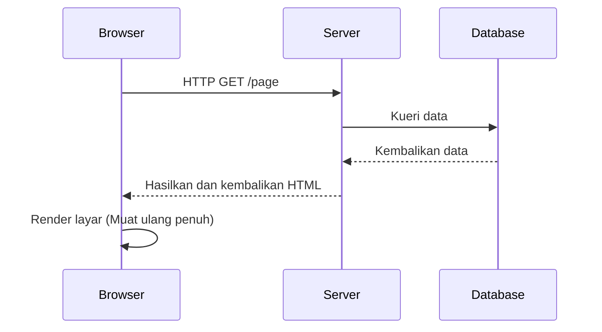
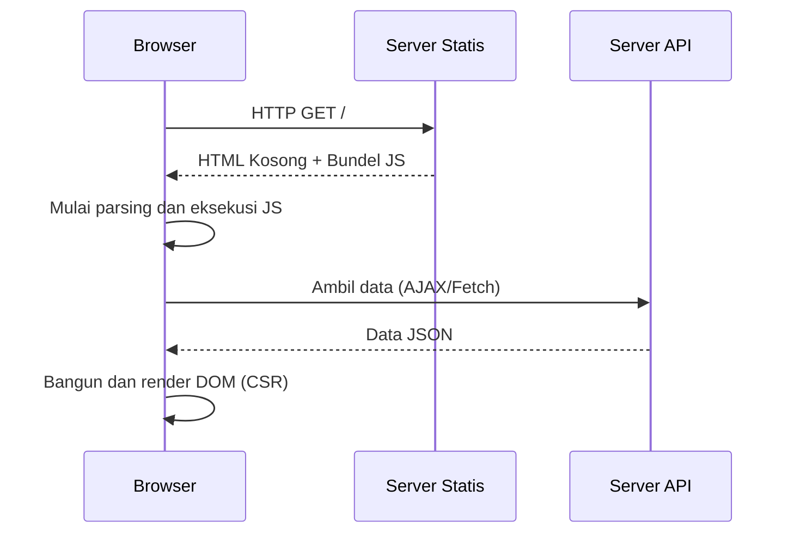
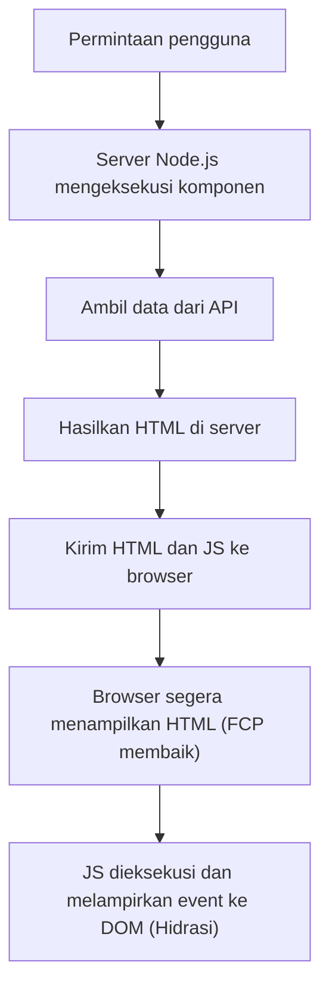
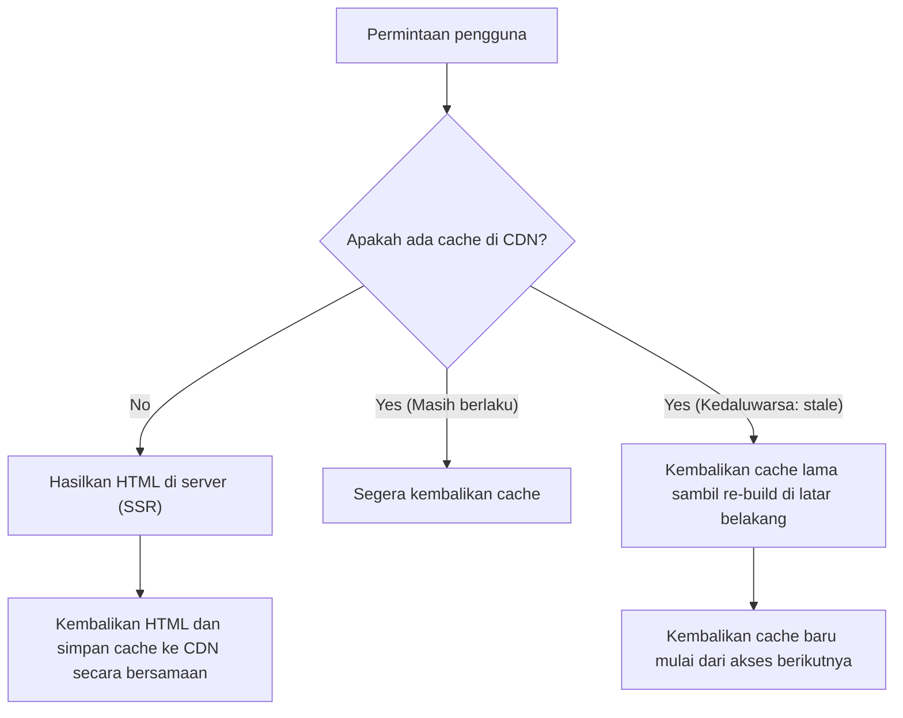

## 1. Pendahuluan: Evolusi Rendering Frontend

Sejarah pengembangan web juga merupakan sejarah pendulum yang berayun antara "di mana" konten dirender, yaitu antara server-side dan client-side. Web awal memiliki struktur sederhana di mana HTML dihasilkan di server, dan browser hanya menampilkannya. Namun, seiring dengan meningkatnya tuntutan untuk pengalaman pengguna (UX), Single Page Application (SPA), yang menggunakan JavaScript untuk membangun UI secara dinamis di sisi browser, menjadi arus utama.

Dan sekarang, untuk mengatasi tantangan yang ditimbulkan oleh SPA, kita berkembang menuju pendekatan baru yang kembali meminjam kekuatan server, seperti Server-Side Rendering (SSR) dan Static Site Generation (SSG), serta Incremental Static Regeneration (ISR), dan React Server Components (RSC).

Artikel ini akan menggali lebih dalam tentang keniscayaan evolusi teknologi rendering frontend ini dan masalah apa yang setiap teknologi coba selesaikan.

## 2. Era SSR Tradisional dan jQuery

Dari tahun 1990-an hingga 2000-an, halaman web dihasilkan secara dinamis di sisi server menggunakan teknologi backend seperti PHP, Ruby on Rails, Java, dan Perl. Ketika pengguna mengakses sebuah URL, server mengambil informasi dari database, membangun HTML yang lengkap, dan mengembalikannya ke browser. Browser mem-parsing HTML yang diterima dari atas ke bawah dan merendernya di layar.

Pendekatan ini sangat kuat dalam hal SEO (Search Engine Optimization). Hal ini karena crawler dapat langsung membaca HTML yang lengkap. Namun, memperbarui bahkan sebagian dari halaman memerlukan pemuatan ulang seluruh layar (full page reload), sehingga pengalaman pengguna sama sekali tidak mulus.

Saat itulah **jQuery** dan AJAX (Asynchronous JavaScript and XML) muncul. Hal ini memungkinkan pengambilan data secara asinkron dari server menggunakan JavaScript tanpa memuat ulang seluruh halaman, dan menulis ulang sebagian DOM secara langsung. Namun, seiring dengan semakin kompleksnya aplikasi, pendekatan memanipulasi DOM secara langsung sangat menurunkan rawatan (maintainability) kode, serta menjadi sarang "kode spageti".

## 3. Transisi ke Client-Side: Bangkitnya SPA

Memasuki tahun 2010-an, dengan penyebaran smartphone dan meningkatnya ekspektasi pengguna, web juga dituntut untuk memiliki nuansa pengoperasian yang mulus seperti aplikasi native. **SPA (Single Page Application)** muncul untuk menanggapi permintaan ini.

Framework seperti AngularJS, Backbone.js, dan kemudian React dan Vue.js, sepenuhnya mendelegasikan logika rendering layar dari server ke client (browser).

Dalam SPA, pada saat akses pertama, browser mengunduh "HTML kosong" dan "file JavaScript besar (bundel)". Setelah itu, JavaScript dijalankan di browser, mengambil data yang diperlukan dari server API secara asinkron, dan membangun DOM secara dinamis di client-side (Client-Side Rendering, CSR).
Saat berpindah halaman, JavaScript mengontrol perutean (routing), dan karena ia hanya mengambil data yang diperlukan untuk menulis ulang layar, tidak terjadi pemuatan ulang penuh, mewujudkan pengalaman pengguna yang luar biasa mulus.

## 4. Tantangan SPA: Waktu Muat Awal dan SEO

Meskipun SPA memberikan UX yang fantastis, pada saat yang sama hal itu juga menciptakan tantangan baru.

1. **Keterlambatan waktu muat awal (Pemburukan TTFB dan FCP)**:
   Ketika pengguna pertama kali mengakses sebuah halaman, butuh waktu lama hingga konten yang berarti ditampilkan di layar (First Contentful Paint, FCP). Hal ini karena browser harus mengunduh, mem-parsing, dan mengeksekusi file JavaScript yang besar, dan kemudian mengambil data dari API sebelum dapat membangun DOM. Khususnya pada lingkungan mobile atau jaringan yang lambat, pengguna akan menatap layar putih kosong (blank screen) untuk waktu yang lama.

2. **Masalah SEO (Optimasi Mesin Pencari) dan OGP**:
   HTML awal yang disediakan oleh SPA hanya berisi elemen kosong seperti `

`. Meskipun crawler Google saat ini dapat mengeksekusi JavaScript, butuh waktu lama untuk diindeks. Selain itu, crawler dari mesin pencari lain atau SNS (seperti ekspansi OGP di Twitter dan Facebook) hanya membaca HTML tanpa mengeksekusi JavaScript, sehingga terdapat masalah serius di mana mereka tidak dapat mengenali dengan benar konten yang dihasilkan secara dinamis.

## 5. SSR Modern dan Hidrasi (Hydration)

Untuk menyelesaikan masalah SPA, komunitas frontend memutuskan untuk kembali meminjam kekuatan server-side. Inilah awal mula **SSR Modern (Server-Side Rendering)**. Meta-framework seperti Next.js dan Nuxt.js memelopori pendekatan ini.

Dalam SSR Modern, untuk permintaan pertama, komponen React atau Vue dieksekusi di server (biasanya lingkungan Node.js), menghasilkan HTML yang lengkap termasuk pengambilan data, dan mengembalikannya ke browser.

Karena browser dapat langsung merender HTML yang diterima, FCP meningkat secara dramatis, dan masalah SEO serta OGP sepenuhnya terselesaikan. Namun, halaman sesaat setelah ditampilkan masih sekadar "HTML statis" dan tidak merespons terhadap operasi seperti klik.
Ketika JavaScript diunduh dan dieksekusi di latar belakang, framework seperti React melampirkan event listener ke elemen DOM yang ada, mengubah aplikasi ke status "dinamis". Proses ini disebut **Hidrasi (Hydration)**.

SSR sangat kuat, tetapi karena proses rendering dilakukan di server setiap kali ada permintaan, hal itu menimbulkan tantangan baru seperti beban server yang tinggi (keterlambatan TTFB) dan biaya tinggi untuk memastikan skalabilitas.

## 6. Static Site Generation (SSG): Kebangkitan Jamstack

"Jika menghasilkan HTML setiap kali ada permintaan itu berat, mengapa kita tidak membuat HTML untuk semua halaman terlebih dahulu pada saat proses build?"
Dari gagasan inilah lahir **SSG (Static Site Generation)**. Gatsby dan Next.js mempopulerkan pendekatan ini, yang menjadi inti dari arsitektur yang disebut Jamstack (JavaScript, APIs, Markup).

Saat proses build, data diambil dari API dan HTML dihasilkan sebelumnya. HTML statis yang dihasilkan ditempatkan pada CDN (Content Delivery Network), dan dikirimkan dengan kecepatan luar biasa dari edge server di seluruh dunia.
Karena tidak diperlukan komputasi di sisi server, keamanannya tinggi, TTFB (Time to First Byte) sangat cepat, dan biaya server dapat ditekan sangat rendah.

Namun, SSG juga memiliki kelemahan fatal. Yaitu **"Kesegaran data" dan "Waktu build"**.
Jika Anda memiliki blog dengan 10.000 halaman atau situs e-commerce raksasa, setiap kali satu konten diperbarui, seluruh halaman perlu di-build ulang. Waktu build akan memakan waktu dari beberapa puluh menit hingga beberapa jam, menjadikannya tidak cocok untuk aplikasi yang membutuhkan fitur real-time.

## 7. Inovasi ISR (Incremental Static Regeneration)

Untuk memecahkan masalah "lamanya waktu build" dan "penundaan pembaruan data" pada SSG, solusi inovatif yang dihadirkan oleh Next.js adalah **ISR (Incremental Static Regeneration)**.

Alih-alih menghasilkan semua halaman pada saat build, ISR melakukan SSG hanya pada halaman-halaman penting terlebih dahulu, lalu menghasilkan halaman sisanya seperti SSR pada saat permintaan awal pengguna, dan pada saat yang sama menyimpan hasilnya (sebagai file statis) di CDN sebagai cache.
Selanjutnya, dengan mengatur masa berlaku (misalnya: 60 detik) yang disebut `revalidate`, untuk permintaan pertama setelah kadaluwarsa, ia akan mengembalikan "cache lama (stale)" sambil merender ulang di latar belakang (background) dan memperbarui cache dengan HTML baru (strategi stale-while-revalidate).

Dengan cara ini, ini mewujudkan keunggulan keduanya: selalu memberikan respons super cepat kepada pengguna (keuntungan SSG) sambil memperbarui data secara teratur (keuntungan SSR). Selain itu, belakangan ini, **On-demand ISR**, yang membuang dan memperbarui cache pada waktu yang ditentukan secara sewenang-wenang dengan menggunakan Webhook sebagai pemicu, juga telah menjadi arus utama.

## 8. React Server Components (RSC) dan App Router

Dan saat ini, pendulum frontend berkembang menuju dimensi lebih lanjut. Itulah **React Server Components (RSC)**. Diperkenalkan secara penuh di App Router Next.js mulai versi 13 ke atas.

Dalam SSR atau SSG tradisional, keputusan "apakah merender di server atau di client" ditentukan pada "tingkat halaman". Namun, dengan RSC, kita dapat memisahkan server dan client pada **"tingkat komponen"**.

- **Server Components**: Dieksekusi secara eksklusif di server, dan tidak ada kode JavaScript yang dikirim ke client. Bahkan jika mereka mengakses database secara langsung atau menggunakan library yang berat, itu tidak akan mempengaruhi ukuran bundel client.
- **Client Components**: Diterapkan hanya pada bagian-bagian yang memerlukan interaksi pengguna, seperti manajemen state (`useState`) dan event listener (`onClick`), serta dihidrasi (hydration) di sisi client seperti sebelumnya.

Hal ini memungkinkan kita meminimalkan "pengunduhan dan pengeksekusian bundel JavaScript besar", yang merupakan kelemahan terbesar SPA, sembari tetap mempertahankan kemudahan pengoperasian SPA yang mulus.

## 9. Kesimpulan: Ke Mana Pendulum Akan Berayun?

Dimulai dari jQuery, kemudian berayun jauh ke sisi client bersama SPA, lalu melewati SSR, SSG, dan ISR, kini pendulum menuju pada "perpaduan optimal antara server dan client" dalam bentuk RSC.

Evolusi teknologi tidak pernah merupakan penolakan terhadap masa lalu. Justru karena SPA membuktikan tingkat UX yang tinggi di sisi client-lah, maka terdapat evolusi pada SSR/RSC saat ini mengenai bagaimana menyediakannya dengan cepat dan aman.
Ke depannya, dengan adanya persyaratan baru dan evolusi perangkat, pendulum ini akan terus berayun. Yang terpenting bukanlah mempercayai suatu teknologi tertentu secara membabi buta, melainkan memiliki perspektif arsitektur yang mengidentifikasi kebutuhan masing-masing proyek (pentingnya SEO, frekuensi pembaruan data, tingkat tuntutan UX, dll.) dan memilih strategi rendering yang tepat.
