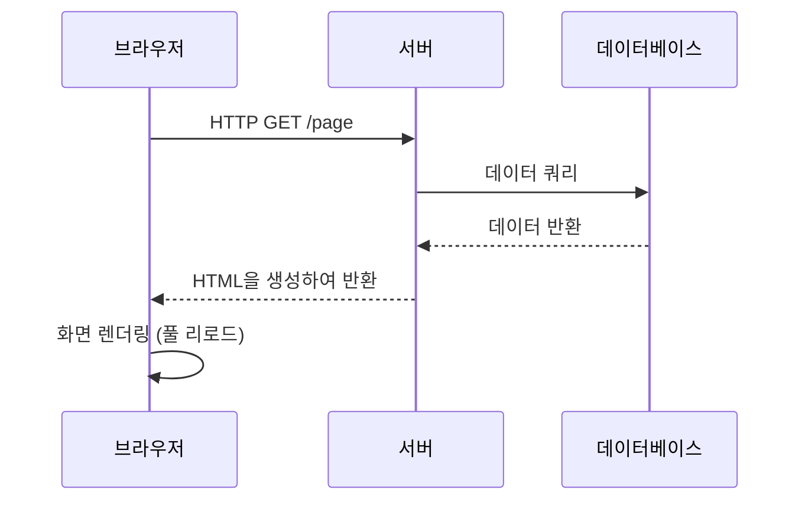
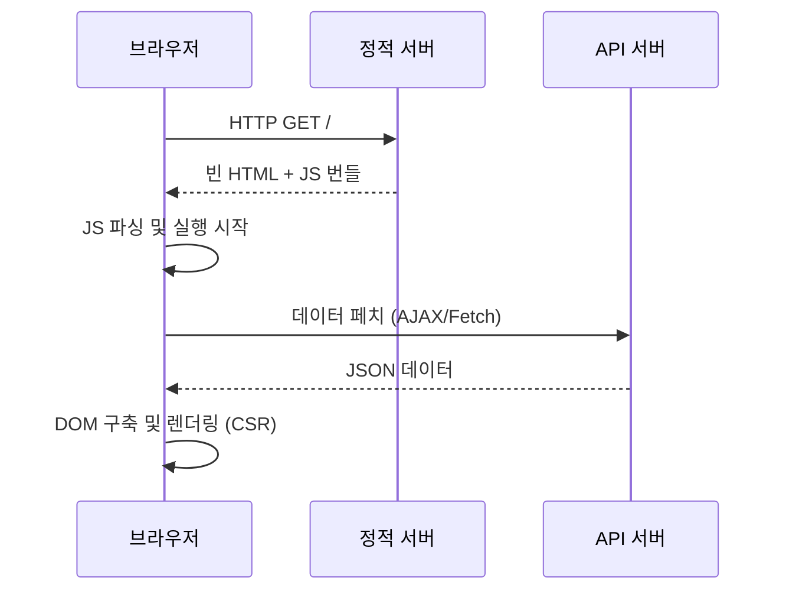
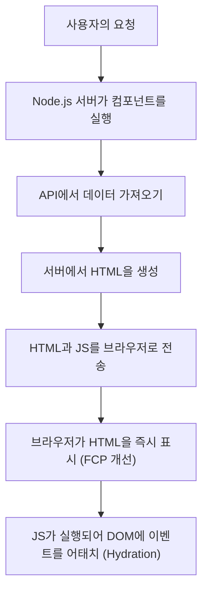
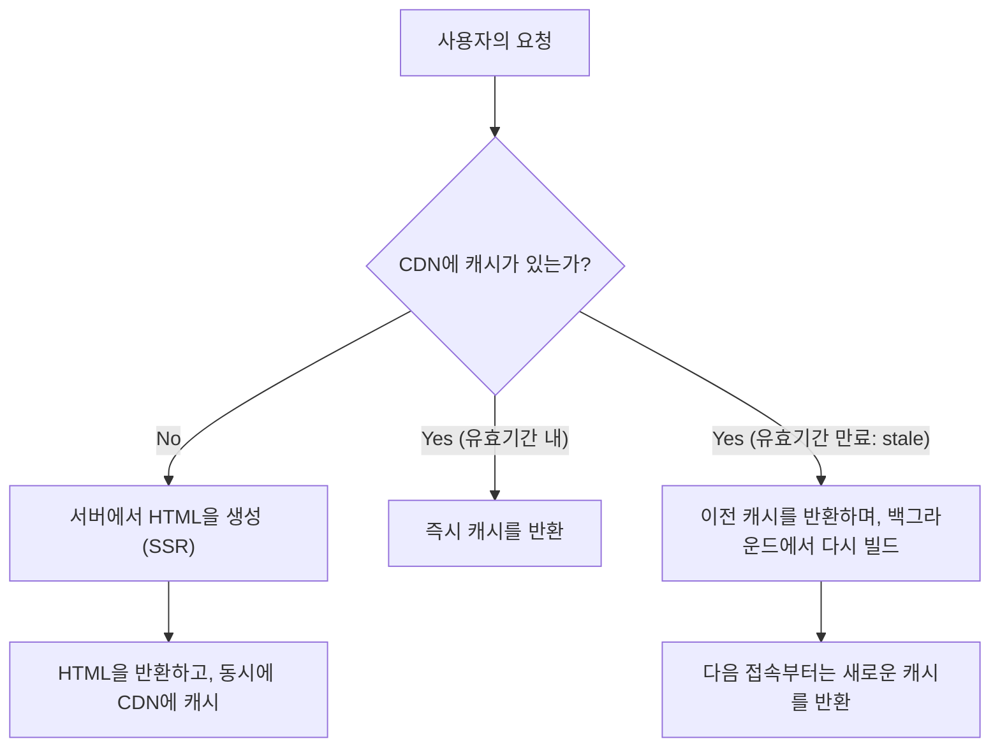

## 1. 시작하며: 프론트엔드 렌더링의 변천

웹 개발의 역사는 콘텐츠를 "어디서" 렌더링할 것인가, 즉 서버 사이드와 클라이언트 사이드 사이를 오가는 진자의 역사이기도 합니다. 초기의 웹은 서버에서 HTML을 생성하고 브라우저는 그것을 단순히 표시하기만 하는 단순한 구조였습니다. 하지만 사용자 경험(UX)에 대한 요구가 높아짐에 따라, JavaScript를 구사하여 브라우저 측에서 UI를 동적으로 구축하는 Single Page Application(SPA)이 주류가 되었습니다.

그리고 현재 우리는 SPA가 가져온 과제를 극복하기 위해, 다시 서버의 힘을 빌리는 Server-Side Rendering(SSR)이나 Static Site Generation(SSG), 나아가 Incremental Static Regeneration(ISR), 그리고 React Server Components(RSC)와 같은 새로운 접근 방식으로 진화를 이룩하고 있습니다.

본 기사에서는 이 프론트엔드 렌더링 기술의 진화의 필연성과 각각의 기술이 어떤 과제를 해결하기 위해 탄생했는지를 깊이 파헤쳐 보겠습니다.

## 2. 전통적 SSR과 jQuery의 시대

1990년대부터 2000년대에 걸쳐 웹 페이지는 PHP, Ruby on Rails, Java, Perl 등의 백엔드 기술을 사용하여 서버 사이드에서 동적으로 생성되었습니다. 사용자가 URL에 접속하면 서버는 데이터베이스에서 정보를 가져와 완전한 HTML을 구축하여 브라우저에 반환합니다. 브라우저는 전달받은 HTML을 위에서 아래로 파싱하여 화면에 렌더링합니다.

이 접근 방식은 SEO(검색 엔진 최적화)에 있어서 매우 강력했습니다. 크롤러가 완전한 HTML을 즉시 읽어 들일 수 있었기 때문입니다. 하지만 페이지의 일부만 업데이트하더라도 화면 전체를 다시 불러오는(풀 페이지 리로드) 현상이 발생하여 사용자 경험이 결코 매끄럽지는 않았습니다.

그래서 등장한 것이 **jQuery**나 AJAX(Asynchronous JavaScript and XML)입니다. 이로 인해 페이지 전체를 다시 불러오지 않고도 JavaScript를 사용하여 비동기적으로 서버에서 데이터를 가져와 DOM의 일부를 직접 수정하는 것이 가능해졌습니다. 하지만 애플리케이션이 복잡해질수록 DOM을 직접 조작하는 접근 방식은 코드의 유지 보수성을 현저히 떨어뜨려 "스파게티 코드"의 온상이 되었습니다.

## 3. 클라이언트 사이드로의 전환: SPA의 대두

2010년대에 들어서면서 스마트폰의 보급과 사용자의 기대치 상승으로 인해 네이티브 앱과 같은 매끄러운 조작감을 웹에서도 요구하게 되었습니다. 이러한 요구에 부응하는 형태로 등장한 것이 **SPA(Single Page Application)**입니다.

AngularJS, Backbone.js, 그리고 이후의 React나 Vue.js와 같은 프레임워크는 화면의 렌더링 로직을 서버에서 클라이언트(브라우저)로 완전히 이양했습니다.

SPA에서는 첫 접속 시 "빈 HTML"과 "거대한 JavaScript 파일(번들)"을 다운로드합니다. 그 후 브라우저 상에서 JavaScript가 실행되어 API 서버로부터 필요한 데이터를 비동기적으로 가져와 클라이언트 사이드에서 동적으로 DOM을 구축합니다(Client-Side Rendering, CSR).
페이지 전환 시에는 JavaScript가 라우팅을 제어하고 필요한 데이터만 페치하여 화면을 다시 그리기 때문에, 풀 리로드가 발생하지 않아 놀랍도록 매끄러운 사용자 경험을 실현했습니다.

## 4. SPA가 안고 있는 과제: 초기 로드 시간과 SEO

SPA는 훌륭한 UX를 제공했지만, 동시에 새로운 과제도 낳았습니다.

1. **초기 로드 시간의 지연 (TTFB와 FCP의 악화)**:
   사용자가 처음 페이지에 접속했을 때 화면에 의미 있는 콘텐츠가 표시되기까지(First Contentful Paint, FCP) 오랜 시간이 걸립니다. 왜냐하면 브라우저는 거대한 JavaScript 파일을 다운로드하고 파싱하고 실행하며, 나아가 API로부터 데이터를 가져와야 비로소 DOM을 구축할 수 있기 때문입니다. 특히 모바일 환경이나 저속 네트워크에서는 사용자가 하얀 화면(블랭크 스크린)을 오랫동안 바라보게 됩니다.

2. **SEO(검색 엔진 최적화)와 OGP의 문제**:
   SPA가 제공하는 초기 HTML은 `

`와 같은 빈 요소만 포함하고 있습니다. Google의 크롤러는 현재 JavaScript를 실행할 수 있지만 인덱싱 되기까지 시간이 걸리거나, 다른 검색 엔진이나 SNS의 크롤러(Twitter나 Facebook의 OGP 전개 등)는 JavaScript를 실행하지 않고 HTML만 읽어 들이기 때문에 동적으로 생성된 콘텐츠를 올바르게 인식하지 못하는 심각한 문제가 있었습니다.

## 5. 모던 SSR과 하이드레이션(Hydration)

SPA의 과제를 해결하기 위해 프론트엔드 업계는 다시 서버 사이드의 힘을 빌리기로 결정합니다. 이것이 **모던 SSR(Server-Side Rendering)**의 탄생입니다. Next.js나 Nuxt.js와 같은 메타 프레임워크가 이 접근 방식을 견인했습니다.

모던 SSR에서는 첫 요청에 대해 서버(보통 Node.js 환경) 상에서 React나 Vue의 컴포넌트를 실행하고, 데이터 페칭을 포함한 완전한 HTML을 생성하여 브라우저에 반환합니다.

브라우저는 전달받은 HTML을 즉시 렌더링할 수 있기 때문에 FCP가 극적으로 향상되고, SEO나 OGP 문제도 완전히 해결됩니다. 하지만 표시된 직후의 페이지는 아직 "정적인 HTML"에 불과하며 클릭 등의 조작에는 반응하지 않습니다.
백그라운드에서 JavaScript가 다운로드되어 실행되면, React 등의 프레임워크가 기존의 DOM 요소에 이벤트 리스너를 어태치하여 애플리케이션을 "동적"인 상태로 변화시킵니다. 이 과정을 **하이드레이션(Hydration: 수화)**이라고 부릅니다.

SSR은 강력했지만 요청할 때마다 서버에서 렌더링 처리를 수행하기 때문에 서버의 부하가 높고(TTFB의 지연), 확장성을 확보하는 데 비용이 많이 든다는 새로운 과제를 낳았습니다.

## 6. 정적 사이트 제너레이션(SSG): Jamstack의 융성

"요청할 때마다 HTML을 생성하는 것이 무겁다면, 빌드 시에 미리 모든 페이지의 HTML을 만들어 두면 되지 않을까?"
이러한 발상에서 탄생한 것이 **SSG(Static Site Generation)**입니다. Gatsby나 Next.js가 이 접근 방식을 보급시켰고, Jamstack(JavaScript, APIs, Markup)이라 불리는 아키텍처의 핵심이 되었습니다.

빌드 시 API에서 데이터를 가져와 HTML을 생성해 둡니다. 생성된 정적 HTML은 CDN(Content Delivery Network)에 배치되어 전 세계의 에지 서버에서 폭발적인 속도로 전송됩니다.
서버 사이드에서의 연산이 필요 없기 때문에 보안성이 높고 TTFB(Time to First Byte)가 가장 빠르며 서버 비용도 극히 낮게 억제됩니다.

하지만 SSG에도 결정적인 약점이 있었습니다. 바로 **"데이터의 신선도"와 "빌드 시간"**입니다.
1만 페이지의 블로그나 거대한 이커머스 사이트가 있을 경우, 콘텐츠가 하나 업데이트될 때마다 전체 페이지를 다시 빌드해야 합니다. 빌드에 수십 분에서 수 시간이 걸리게 되어 실시간성이 요구되는 애플리케이션에는 부적합했습니다.

## 7. ISR(Incremental Static Regeneration)의 혁신

SSG의 "빌드 시간의 길이"와 "데이터 업데이트 지연"을 해결하기 위해 Next.js가 내놓은 획기적인 솔루션이 **ISR(Incremental Static Regeneration: 점진적 정적 재생성)**입니다.

ISR은 빌드 시에 모든 페이지를 생성하는 것이 아니라 중요한 페이지만 먼저 SSG하고, 나머지 페이지는 사용자의 첫 요청 시 SSR처럼 생성하며, 동시에 그 결과를 CDN에 캐시(정적 파일로 저장)합니다.
또한, `revalidate`라는 유효기간(예: 60초)을 설정함으로써 기한 만료 후 첫 번째 요청에 대해서는 "이전 캐시(stale)"를 반환하면서, 이면(백그라운드)에서 다시 렌더링을 수행하여 캐시를 새로운 HTML로 업데이트합니다(stale-while-revalidate 전략).

이를 통해 사용자에게는 항상 초고속 응답(SSG의 장점)을 제공하면서 정기적으로 데이터가 최신화되는(SSR의 장점) 두 마리 토끼를 모두 잡았습니다. 더 나아가 최근에는 Webhook 등을 트리거로 삼아 임의의 시점에 캐시를 파기 및 갱신하는 **온디맨드 ISR**도 주류가 되고 있습니다.

## 8. React Server Components(RSC)와 App Router

그리고 현재 프론트엔드의 진자는 더 높은 차원으로 진화하고 있습니다. 그것이 바로 **React Server Components(RSC)**입니다. Next.js 13 이후의 App Router에서 본격적으로 도입되었습니다.

기존의 SSR이나 SSG에서는 "서버에서 렌더링할 것인가, 클라이언트에서 렌더링할 것인가"가 "페이지 단위"로 결정되었습니다. 하지만 RSC에서는 **"컴포넌트 단위"**로 서버와 클라이언트를 분리할 수 있습니다.

- **Server Components**: 서버 상에서만 실행되며 클라이언트에는 일절 JavaScript 코드가 전송되지 않습니다. 데이터베이스에 직접 접근하거나 무거운 라이브러리를 사용하더라도 클라이언트의 번들 크기에 영향을 주지 않습니다.
- **Client Components**: 상태 관리(`useState`)나 이벤트 리스너(`onClick`) 등 사용자와의 상호작용이 필요한 부분에만 적용되며, 기존처럼 클라이언트 측에서 하이드레이션됩니다.

이로 인해 SPA의 최대 약점이었던 "거대한 JavaScript 번들의 다운로드와 실행"을 극한까지 줄이면서 SPA의 매끄러운 조작성을 유지하는 것이 가능해졌습니다.

## 9. 결론: 진자는 어디로 향하는가

jQuery에서 시작되어 SPA를 향해 클라이언트 사이드로 크게 기울었던 진자는 SSR, SSG, ISR을 거쳐 RSC라는 형태로 "서버와 클라이언트의 최적의 융합"을 향해 나아가고 있습니다.

기술의 진화는 결코 과거의 부정이 아닙니다. SPA가 클라이언트 사이드에서의 고도화된 UX를 증명했기 때문에, 그것을 어떻게 빠르고 안전하게 제공할 것인가 하는 현재의 SSR/RSC의 진화가 있는 것입니다.
앞으로도 새로운 요건이나 기기의 진화에 따라 이 진자는 계속 흔들릴 것입니다. 중요한 것은 특정 기술을 맹신하는 것이 아니라 각 프로젝트의 요건(SEO의 중요성, 데이터 업데이트 빈도, 사용자 경험 요구 수준 등)을 파악하고 적절한 렌더링 전략을 선택하는 아키텍처 관점을 갖는 것입니다.
