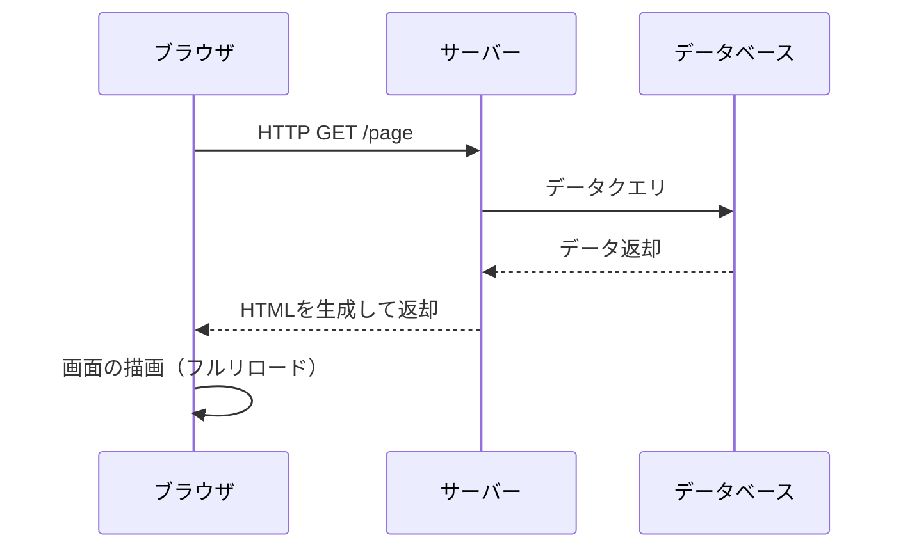
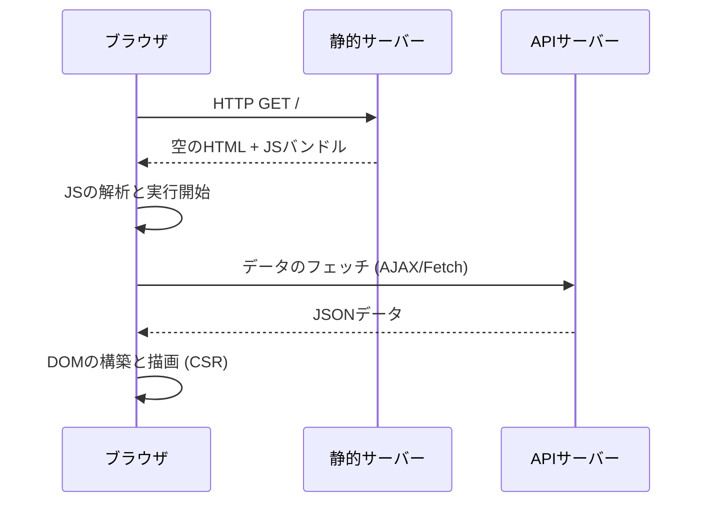
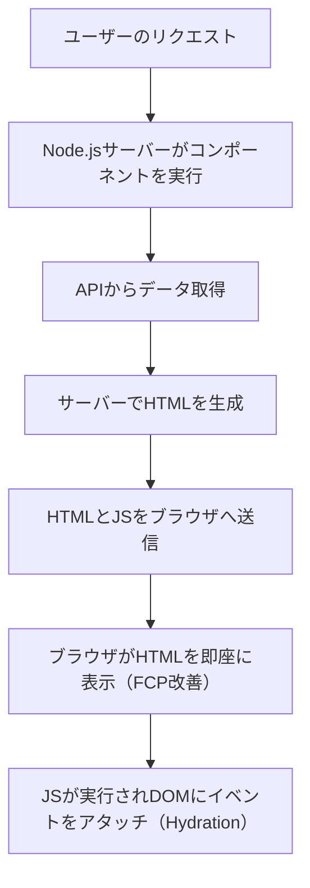
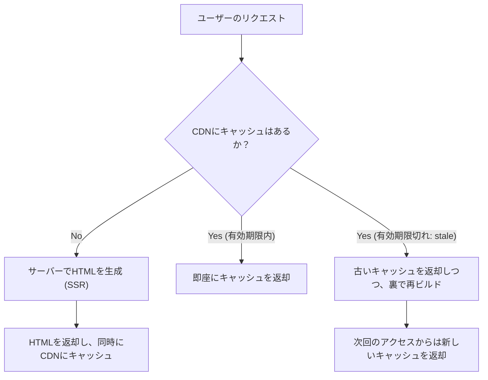

## 1. はじめに：フロントエンド・レンダリングの変遷

Web開発の歴史は、コンテンツを「どこで」描画するか、つまりサーバーサイドとクライアントサイドの間を揺れ動く振り子の歴史でもあります。初期のWebはサーバー上でHTMLを生成し、ブラウザはそれをただ表示するだけのシンプルな構造でした。しかし、ユーザー体験（UX）への要求が高まるにつれ、JavaScriptを駆使してブラウザ側でUIを動的に構築するSingle Page Application（SPA）が主流となりました。

そして現在、私たちはSPAがもたらした課題を克服するために、再びサーバーの力を借りるServer-Side Rendering（SSR）やStatic Site Generation（SSG）、さらにはIncremental Static Regeneration（ISR）、そしてReact Server Components（RSC）といった新しいアプローチへと進化を遂げています。

本記事では、このフロントエンド・レンダリング技術の進化の必然性と、それぞれの技術がどのような課題を解決するために生まれてきたのかを深く掘り下げていきます。

## 2. 伝統的SSRとjQueryの時代

1990年代から2000年代にかけて、WebページはPHP、Ruby on Rails、Java、Perlなどのバックエンド技術を用いてサーバーサイドで動的に生成されていました。ユーザーがURLにアクセスすると、サーバーはデータベースから情報を取得し、完全なHTMLを構築してブラウザに返却します。ブラウザは受け取ったHTMLを上から下へ解析し、画面に描画します。

このアプローチはSEO（検索エンジン最適化）において非常に強力でした。クローラーは完全なHTMLを即座に読み取ることができたからです。しかし、ページの一部を更新するだけでも、画面全体の再読み込み（フルページリロード）が発生するため、ユーザー体験は決してシームレスではありませんでした。

そこで登場したのが、**jQuery**やAJAX（Asynchronous JavaScript and XML）です。これにより、ページ全体を再読み込みすることなく、JavaScriptを用いて非同期にサーバーからデータを取得し、DOMの一部を直接書き換えることが可能になりました。しかし、アプリケーションが複雑になるにつれて、DOMを直接操作するアプローチはコードの保守性を著しく低下させ、「スパゲッティコード」の温床となりました。

## 3. クライアントサイドへの移行：SPAの台頭

2010年代に入ると、スマートフォンの普及とユーザーの期待値の上昇により、ネイティブアプリのような滑らかな操作感がWebにも求められるようになりました。この要求に応える形で登場したのが、**SPA（Single Page Application）**です。

AngularJS、Backbone.js、そして後のReactやVue.jsといったフレームワークは、画面の描画ロジックをサーバーからクライアント（ブラウザ）へと完全に移譲しました。

SPAでは、最初のアクセス時に「空のHTML」と「巨大なJavaScriptファイル（バンドル）」をダウンロードします。その後、JavaScriptがブラウザ上で実行され、APIサーバーから必要なデータを非同期で取得して、クライアントサイドで動的にDOMを構築します（Client-Side Rendering, CSR）。
ページ遷移時にはJavaScriptがルーティングを制御し、必要なデータだけをフェッチして画面を書き換えるため、フルリロードが発生せず、驚くほど滑らかなユーザー体験を実現しました。

## 4. SPAが抱える課題：初期ロード時間とSEO

SPAは素晴らしいUXを提供しましたが、同時に新たな課題も生み出しました。

1. **初期ロード時間の遅延（TTFBとFCPの悪化）**:
   ユーザーが最初にページにアクセスしたとき、画面に意味のあるコンテンツが表示される（First Contentful Paint, FCP）までに長い時間がかかります。なぜなら、ブラウザは巨大なJavaScriptファイルをダウンロードし、パースし、実行し、さらにAPIからデータを取得して初めてDOMを構築できるからです。特にモバイル環境や低速なネットワークでは、ユーザーは真っ白な画面（ブランクスクリーン）を長く見つめることになります。

2. **SEO（検索エンジン最適化）とOGPの問題**:
   SPAが提供する初期HTMLは `

` のような空の要素しか含まれていません。Googleのクローラーは現在JavaScriptを実行できますが、インデックスされるまでに時間がかかったり、他の検索エンジンやSNSのクローラー（TwitterやFacebookのOGP展開など）はJavaScriptを実行せずにHTMLだけを読み取るため、動的に生成されたコンテンツを正しく認識できないという深刻な問題がありました。

## 5. モダンSSRとハイドレーション（Hydration）

SPAの課題を解決するために、フロントエンド界隈は再びサーバーサイドの力を借りる決断を下します。これが**モダンSSR（Server-Side Rendering）**の誕生です。Next.jsやNuxt.jsといったメタフレームワークがこのアプローチを牽引しました。

モダンSSRでは、最初のリクエストに対して、サーバー（通常はNode.js環境）上でReactやVueのコンポーネントを実行し、データフェッチを含めた完全なHTMLを生成してブラウザに返却します。

ブラウザは受け取ったHTMLを即座にレンダリングできるため、FCPが劇的に向上し、SEOやOGPの問題も完全に解決されます。しかし、表示された直後のページはまだ「静的なHTML」に過ぎず、クリックなどの操作には反応しません。
バックグラウンドでJavaScriptがダウンロードされ、実行されると、Reactなどのフレームワークが既存のDOM要素にイベントリスナーをアタッチし、アプリケーションを「動的」な状態へと変化させます。このプロセスを**ハイドレーション（Hydration：水和）**と呼びます。

SSRは強力でしたが、リクエストのたびにサーバーでレンダリング処理を行うため、サーバーの負荷が高く（TTFBの遅延）、スケーラビリティの確保にコストがかかるという新たな課題を生みました。

## 6. 静的サイトジェネレーション（SSG）：Jamstackの隆盛

「リクエストのたびにHTMLを生成するのが重いなら、ビルド時にあらかじめすべてのページのHTMLを作っておけばいいのではないか？」
この発想から生まれたのが、**SSG（Static Site Generation）**です。GatsbyやNext.jsがこのアプローチを普及させ、Jamstack（JavaScript, APIs, Markup）と呼ばれるアーキテクチャの核となりました。

ビルド時にAPIからデータを取得し、HTMLを生成しておきます。生成された静的なHTMLはCDN（Content Delivery Network）に配置され、世界中のエッジサーバーから爆速で配信されます。
サーバーサイドでの演算が不要なため、セキュリティが高く、TTFB（Time to First Byte）は最速、サーバーコストも極めて低く抑えられます。

しかし、SSGにも決定的な弱点がありました。**「データの鮮度」と「ビルド時間」**です。
1万ページのブログや巨大なECサイトがある場合、コンテンツが1つ更新されるたびに全ページをビルドし直す必要があります。ビルドに数十分〜数時間かかるようになり、リアルタイム性が求められるアプリケーションには不向きでした。

## 7. ISR（Incremental Static Regeneration）の革新

SSGの「ビルド時間の長さ」と「データ更新の遅延」を解決するために、Next.jsが打ち出した画期的なソリューションが**ISR（Incremental Static Regeneration：インクリメンタル静的再生成）**です。

ISRは、ビルド時にすべてのページを生成するのではなく、重要なページだけを先にSSGし、残りのページはユーザーの最初のリクエスト時にSSRのように生成し、同時にその結果をCDNにキャッシュ（静的ファイルとして保存）します。
さらに、`revalidate` という有効期限（例：60秒）を設定することで、期限切れ後の最初のリクエストに対しては「古いキャッシュ（stale）」を返しつつ、裏側（バックグラウンド）で再レンダリングを行い、キャッシュを新しいHTMLに更新します（stale-while-revalidate戦略）。

これにより、ユーザーには常に超高速なレスポンス（SSGのメリット）を提供しつつ、定期的にデータが最新化される（SSRのメリット）という、両者のいいとこ取りを実現しました。さらに最近では、Webhookなどをトリガーにして任意のタイミングでキャッシュを破棄・更新する**オンデマンドISR**も主流となっています。

## 8. React Server Components（RSC）とApp Router

そして現在、フロントエンドの振り子はさらなる次元へと進化しています。それが**React Server Components（RSC）**です。Next.js 13以降のApp Routerで本格的に導入されました。

これまでのSSRやSSGでは、「サーバーでレンダリングするか、クライアントでレンダリングするか」は「ページ単位」で決定されていました。しかしRSCでは、**「コンポーネント単位」**でサーバーとクライアントを切り分けることができます。

- **Server Components**: サーバー上でのみ実行され、クライアントには一切JavaScriptのコードが送られません。データベースに直接アクセスしたり、重いライブラリを使用しても、クライアントのバンドルサイズに影響を与えません。
- **Client Components**: 状態管理（`useState`）やイベントリスナー（`onClick`）など、ユーザーとのインタラクションが必要な部分のみに適用され、従来通りクライアント側でハイドレーションされます。

これにより、SPAの最大の弱点であった「巨大なJavaScriptバンドルのダウンロードと実行」を極限まで削減しつつ、SPAの滑らかな操作性を維持することが可能になりました。

## 9. 結論：振り子はどこへ向かうのか

jQueryから始まり、SPAへと大きくクライアントサイドに振れた振り子は、SSR、SSG、ISRを経て、RSCという形で「サーバーとクライアントの最適解な融合」へと向かっています。

技術の進化は、決して過去の否定ではありません。SPAがクライアントサイドでの高度なUXを証明したからこそ、それをいかに高速かつ安全に提供するかという現在のSSR/RSCの進化があります。
今後も新しい要件やデバイスの進化に伴い、この振り子は揺れ続けるでしょう。重要なのは、特定の技術を盲信するのではなく、それぞれのプロジェクトの要件（SEOの重要性、データ更新の頻度、ユーザー体験の要求レベルなど）を見極め、適切なレンダリング戦略を選択するアーキテクチャの視点を持つことです。
