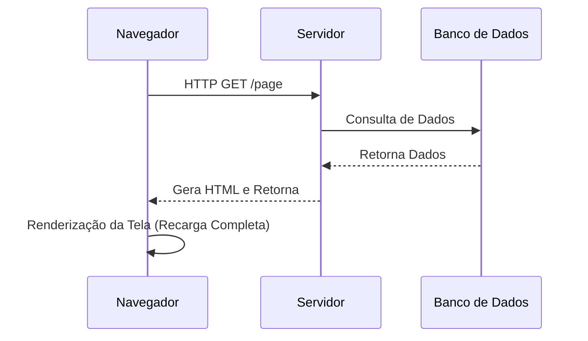
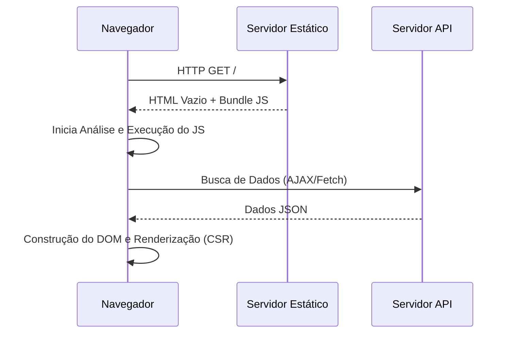
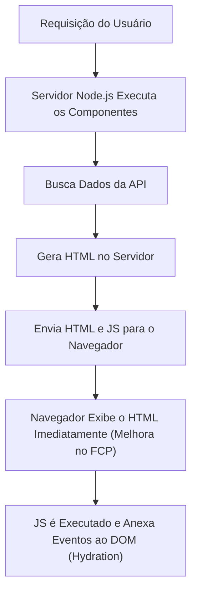
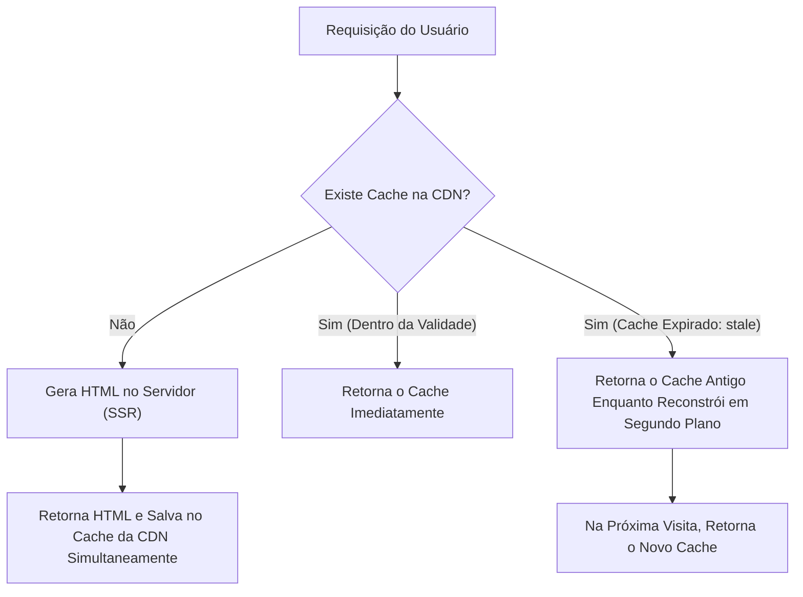

## 1. Introdução: A Evolução da Renderização Front-end

A história do desenvolvimento web também é a história de um pêndulo que oscila entre o "onde" o conteúdo deve ser renderizado: no lado do servidor (server-side) ou no lado do cliente (client-side). No início da Web, a estrutura era simples: os servidores geravam o HTML e os navegadores apenas o exibiam. No entanto, com o aumento da exigência por melhor experiência do usuário (UX), a Single Page Application (SPA), que constrói dinamicamente a UI no navegador utilizando JavaScript, tornou-se dominante.

Atualmente, para superar os desafios trazidos pelas SPAs, estamos evoluindo para novas abordagens que mais uma vez contam com o poder do servidor, como Server-Side Rendering (SSR), Static Site Generation (SSG), bem como Incremental Static Regeneration (ISR) e React Server Components (RSC).

Neste artigo, aprofundaremos na inevitabilidade dessa evolução das tecnologias de renderização front-end e em quais problemas específicos cada uma dessas tecnologias foi criada para resolver.

## 2. A Era do SSR Tradicional e do jQuery

Entre os anos 1990 e 2000, as páginas web eram geradas dinamicamente no lado do servidor usando tecnologias de back-end como PHP, Ruby on Rails, Java e Perl. Quando um usuário acessava uma URL, o servidor recuperava informações do banco de dados, construía o HTML completo e o retornava ao navegador. O navegador analisava o HTML recebido de cima para baixo e o renderizava na tela.

Essa abordagem era extremamente poderosa para SEO (Otimização para Mecanismos de Busca), porque os rastreadores (crawlers) podiam ler o HTML completo imediatamente. No entanto, mesmo para atualizar apenas uma parte da página, era necessário recarregar a tela inteira (full page reload), fazendo com que a experiência do usuário estivesse longe de ser contínua.

Para resolver isso, surgiram o **jQuery** e o AJAX (Asynchronous JavaScript and XML). Eles tornaram possível buscar dados do servidor de forma assíncrona utilizando JavaScript e reescrever diretamente partes do DOM, sem a necessidade de recarregar a página inteira. No entanto, à medida que as aplicações se tornavam mais complexas, a abordagem de manipulação direta do DOM reduzia drasticamente a manutenibilidade do código e tornava-se um terreno fértil para "código espaguete".

## 3. A Mudança para o Lado do Cliente: A Ascensão das SPAs

No início dos anos 2010, com a popularização dos smartphones e o aumento das expectativas dos usuários, exigiu-se da Web uma experiência de navegação suave e semelhante à dos aplicativos nativos. Para atender a essa demanda, surgiu a **SPA (Single Page Application)**.

Frameworks como AngularJS, Backbone.js, e mais tarde React e Vue.js, delegaram completamente a lógica de renderização da tela do servidor para o cliente (navegador).

Nas SPAs, durante o primeiro acesso, você faz o download de um "HTML vazio" e de um "arquivo JavaScript gigante (bundle)". Em seguida, o JavaScript é executado no navegador, busca os dados necessários de forma assíncrona de um servidor de API e constrói dinamicamente o DOM no lado do cliente (Client-Side Rendering, CSR).
Ao transitar de página, o JavaScript controla o roteamento, buscando apenas os dados necessários e reescrevendo a tela. Assim, não ocorre o recarregamento completo da página, proporcionando uma experiência de usuário surpreendentemente suave.

## 4. Os Desafios das SPAs: Tempo de Carregamento Inicial e SEO

Apesar das SPAs fornecerem uma excelente UX, elas também criaram novos desafios.

1. **Atraso no tempo de carregamento inicial (Piora no TTFB e FCP)**:
   Quando o usuário acessa a página pela primeira vez, leva muito tempo até que um conteúdo significativo apareça na tela (First Contentful Paint, FCP). Isso porque o navegador precisa baixar o gigante arquivo JavaScript, analisá-lo, executá-lo e buscar os dados da API antes de poder construir o DOM. Especialmente em ambientes móveis e redes lentas, os usuários ficam olhando para uma tela em branco (blank screen) por um longo tempo.

2. **Problemas com SEO (Otimização para Mecanismos de Busca) e OGP**:
   O HTML inicial fornecido por uma SPA contém apenas um elemento vazio como `

`. Embora os rastreadores do Google atualmente possam executar JavaScript, leva tempo para a página ser indexada. Além disso, rastreadores de outros motores de busca ou redes sociais (como a expansão OGP do Twitter ou Facebook) leem apenas o HTML sem executar o JavaScript, o que criava um problema sério onde o conteúdo gerado dinamicamente não podia ser reconhecido corretamente.

## 5. SSR Moderno e Hidratação (Hydration)

Para resolver os problemas das SPAs, a comunidade front-end decidiu voltar a utilizar o poder do servidor. Assim nasceu o **SSR (Server-Side Rendering) Moderno**. Meta-frameworks como Next.js e Nuxt.js impulsionaram essa abordagem.

No SSR moderno, para a solicitação inicial, os componentes React ou Vue são executados no servidor (geralmente num ambiente Node.js) para gerar um HTML completo, incluindo a busca de dados, que é então enviado ao navegador.

Como o navegador pode renderizar o HTML recebido imediatamente, o FCP melhora drasticamente, e os problemas de SEO e OGP são completamente resolvidos. No entanto, a página que acaba de ser exibida não passa de um "HTML estático" e ainda não reage a cliques ou interações.
Quando o JavaScript é baixado e executado em segundo plano, frameworks como o React anexam "event listeners" aos elementos do DOM existentes, transformando a aplicação num estado "dinâmico". Esse processo é chamado de **Hidratação (Hydration)**.

O SSR era poderoso, mas como o processo de renderização ocorre no servidor a cada solicitação, a carga no servidor era alta (atraso no TTFB) e garantir a escalabilidade tinha um custo elevado, criando novos desafios.

## 6. Geração de Site Estático (SSG): A Ascensão do Jamstack

"Se gerar HTML a cada solicitação é pesado, não seria melhor gerar os HTMLs de todas as páginas antecipadamente no momento da build?"
Dessa ideia nasceu o **SSG (Static Site Generation)**. Gatsby e Next.js popularizaram essa abordagem, que se tornou o núcleo da arquitetura chamada Jamstack (JavaScript, APIs, Markup).

Os dados são obtidos de APIs durante o processo de build para gerar o HTML. O HTML estático gerado é então colocado numa CDN (Content Delivery Network) e distribuído a uma velocidade incrível através de edge servers em todo o mundo.
Como não é necessária computação no lado do servidor, a segurança é alta, o TTFB (Time to First Byte) é o mais rápido possível e os custos de servidor são mantidos extremamente baixos.

No entanto, o SSG também tinha desvantagens cruciais: **"o frescor dos dados" e "o tempo de build"**.
Se você tem um blog com 10.000 páginas ou um enorme site de comércio eletrônico, sempre que uma parte do conteúdo é atualizada, você precisa reconstruir todas as páginas. As builds começaram a demorar dezenas de minutos a várias horas, tornando-as inadequadas para aplicações que exigem tempo real (real-time).

## 7. A Inovação do ISR (Incremental Static Regeneration)

Para resolver o "longo tempo de build" do SSG e "atraso na atualização dos dados", a solução inovadora lançada pelo Next.js foi o **ISR (Incremental Static Regeneration)**.

O ISR não gera todas as páginas no momento do build. Em vez disso, ele faz o SSG das páginas importantes primeiro e gera as demais sob demanda durante a primeira requisição do usuário, como o SSR, ao mesmo tempo em que armazena o resultado em cache na CDN (salvo como um arquivo estático).
Além disso, ao configurar um prazo de validade chamado `revalidate` (por exemplo, 60 segundos), para a primeira requisição após o prazo expirar, a aplicação retorna o "cache antigo" (stale) enquanto, nos bastidores (background), realiza a re-renderização e atualiza o cache para um novo HTML (estratégia stale-while-revalidate).

Com isso, fornece-se aos usuários respostas consistentemente super rápidas (benefício do SSG) enquanto atualiza os dados periodicamente (benefício do SSR), obtendo o melhor dos dois mundos. Mais recentemente, o **ISR sob Demanda (On-Demand ISR)**, onde o cache é descartado ou atualizado em momentos específicos acionados por eventos como Webhooks, também se tornou popular.

## 8. React Server Components (RSC) e App Router

Atualmente, o pêndulo do front-end está evoluindo para uma nova dimensão: os **React Server Components (RSC)**. Eles foram introduzidos de forma mais completa com o App Router a partir do Next.js 13.

No SSR e SSG tradicionais, a decisão de "renderizar no servidor ou no cliente" era feita "por página". No entanto, com RSCs, você pode dividir a execução entre servidor e cliente **"ao nível do componente"**.

- **Server Components (Componentes de Servidor)**: São executados exclusivamente no servidor e nenhum código JavaScript é enviado ao cliente. Você pode acessar diretamente um banco de dados ou utilizar bibliotecas pesadas sem afetar o tamanho do bundle do cliente.
- **Client Components (Componentes de Cliente)**: São aplicados apenas em partes que necessitam de interações com o usuário, como gestão de estado (`useState`) ou detectores de eventos (`onClick`), e são hidratados no lado do cliente de forma tradicional.

Isso tornou possível reduzir a maior desvantagem da SPA — o "download e a execução de gigantescos bundles JavaScript" — ao máximo absoluto, mantendo a operação suave das SPAs.

## 9. Conclusão: Para Onde Vai o Pêndulo

Começando com o jQuery e se movendo fortemente para o lado do cliente com as SPAs, o pêndulo, após passar por SSR, SSG e ISR, dirige-se agora para uma "mistura ideal de servidor e cliente" na forma de RSC.

A evolução tecnológica nunca é uma negação do passado. É precisamente porque as SPAs provaram que uma UX avançada no lado do cliente era possível que a evolução atual do SSR/RSC tenta entregar a mesma experiência de forma rápida e segura.
À medida que novos requisitos surgem e os dispositivos evoluem, o pêndulo continuará a oscilar. O importante não é acreditar cegamente numa tecnologia específica, mas sim possuir a perspectiva arquitetônica para avaliar os requisitos de cada projeto (a importância do SEO, a frequência de atualização dos dados, as demandas de nível da experiência do usuário, etc.) e escolher a estratégia de renderização apropriada.
