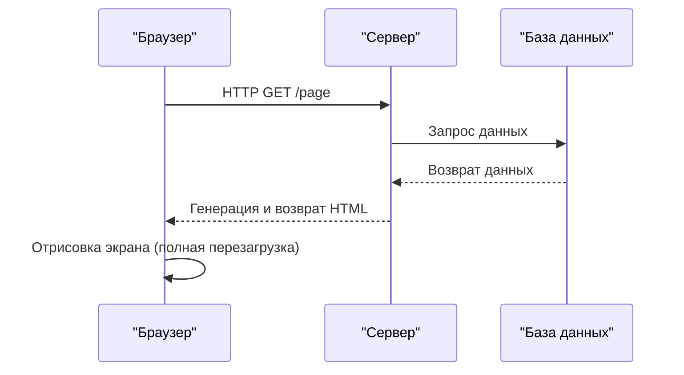
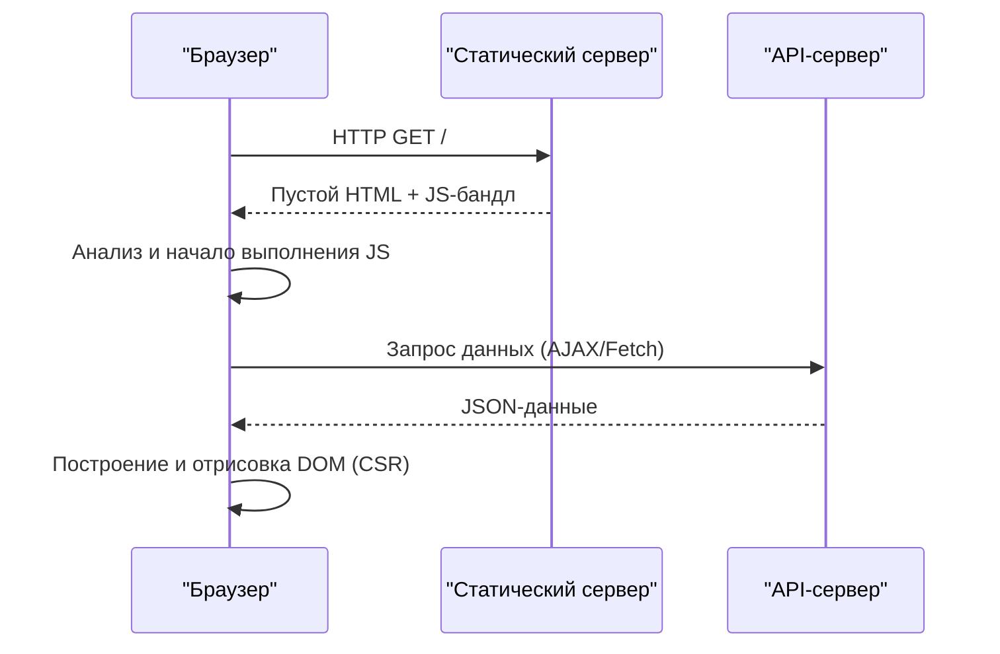
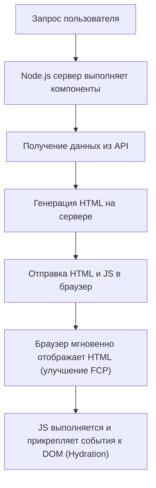
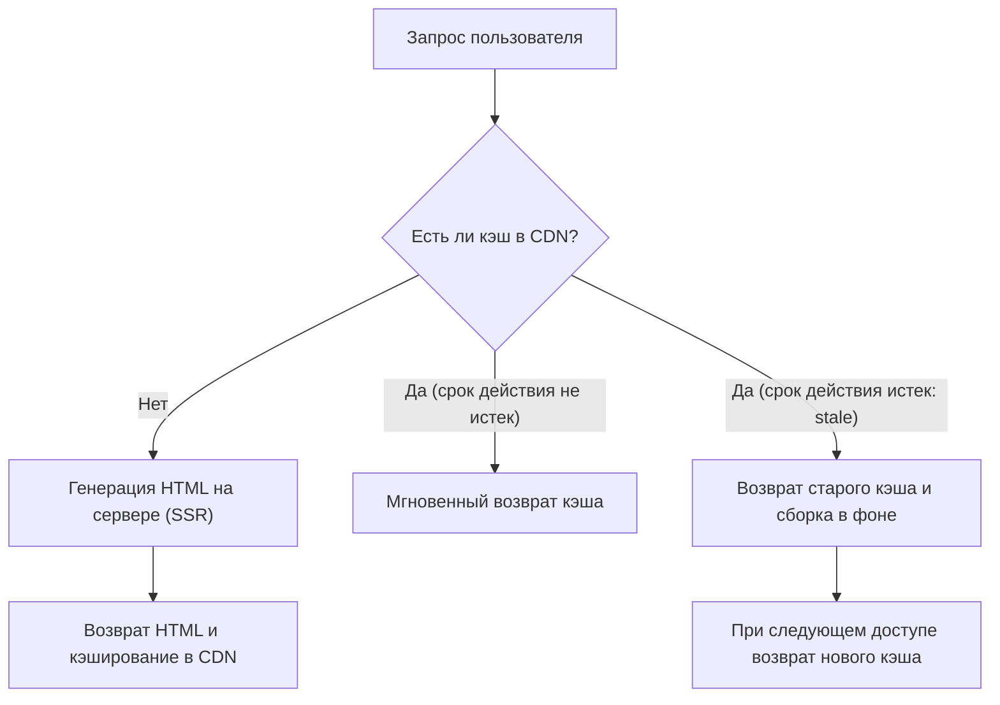

## 1. Введение: эволюция фронтенд-рендеринга

История веб-разработки — это также история маятника, колеблющегося между серверной и клиентской сторонами в вопросе того, «где» отрисовывать контент. Ранний веб представлял собой простую структуру, где сервер генерировал HTML, а браузер лишь отображал его. Однако, по мере роста требований к пользовательскому опыту (UX), на первый план вышли одностраничные приложения (Single Page Application, SPA), которые активно используют JavaScript для динамического построения UI на стороне браузера.

В настоящее время, чтобы преодолеть проблемы, вызванные SPA, мы снова прибегаем к помощи серверов, переходя к новым подходам, таким как рендеринг на стороне сервера (Server-Side Rendering, SSR), генерация статических сайтов (Static Site Generation, SSG), а также инкрементальная статическая регенерация (Incremental Static Regeneration, ISR) и серверные компоненты React (React Server Components, RSC).

В этой статье мы подробно рассмотрим неизбежность эволюции технологий фронтенд-рендеринга и проблемы, для решения которых была создана каждая из этих технологий.

## 2. Эпоха традиционного SSR и jQuery

В период с 1990-х по 2000-е годы веб-страницы динамически генерировались на стороне сервера с использованием таких бэкенд-технологий, как PHP, Ruby on Rails, Java и Perl. Когда пользователь переходил по URL, сервер извлекал информацию из базы данных, формировал полный HTML-код и возвращал его браузеру. Браузер анализировал полученный HTML сверху вниз и отрисовывал его на экране.

Этот подход был очень силен в SEO (поисковой оптимизации), поскольку поисковые роботы могли мгновенно считывать полный HTML-код. Однако, даже при обновлении части страницы, происходила перезагрузка всего экрана (полная перезагрузка страницы), поэтому пользовательский опыт был далеко не бесшовным.

Так появились **jQuery** и AJAX (Asynchronous JavaScript and XML). Это позволило асинхронно получать данные с сервера с помощью JavaScript и напрямую переписывать часть DOM без необходимости перезагрузки всей страницы. Тем не менее, по мере усложнения приложений, подход с прямым манипулированием DOM значительно снижал поддерживаемость кода и становился рассадником «спагетти-кода».

## 3. Переход на сторону клиента: расцвет SPA

С наступлением 2010-х годов, из-за широкого распространения смартфонов и возросших ожиданий пользователей, от веба стали требовать такой же плавности работы, как у нативных приложений. В ответ на это требование появились **SPA (Single Page Application)**.

Такие фреймворки, как AngularJS, Backbone.js, а позже React и Vue.js, полностью перенесли логику отрисовки экрана с сервера на клиент (в браузер).

В SPA при первом посещении загружается «пустой HTML» и «огромный JavaScript-файл (бандл)». После этого JavaScript выполняется в браузере, асинхронно получает необходимые данные с API-сервера и динамически строит DOM на стороне клиента (Client-Side Rendering, CSR).
При переходе между страницами JavaScript управляет маршрутизацией, извлекая только нужные данные и перерисовывая экран. Поскольку полная перезагрузка страницы не происходит, достигается удивительно плавный пользовательский опыт.

## 4. Проблемы SPA: время начальной загрузки и SEO

SPA обеспечили отличный UX, но в то же время породили новые проблемы.

1. **Задержка начального времени загрузки (ухудшение TTFB и FCP)**:
   Когда пользователь впервые заходит на страницу, проходит много времени, прежде чем на экране появляется осмысленный контент (First Contentful Paint, FCP). Это происходит потому, что браузер должен загрузить огромный файл JavaScript, распарсить его, выполнить, а затем получить данные из API, и только после этого он сможет построить DOM. Особенно в мобильных сетях или при медленном соединении пользователи будут долго смотреть на пустой (белый) экран.

2. **Проблемы с SEO (поисковой оптимизацией) и OGP**:
   Начальный HTML, предоставляемый SPA, содержит только пустой элемент, такой как `

`. Хотя краулеры Google сейчас могут выполнять JavaScript, их индексация занимает время. А другие поисковые системы и краулеры соцсетей (например, OGP-развертка в Twitter или Facebook) читают только HTML без выполнения JavaScript, из-за чего возникает серьезная проблема с правильным распознаванием динамически сгенерированного контента.

## 5. Современный SSR и гидратация (Hydration)

Чтобы решить проблемы SPA, фронтенд-сообщество решило снова воспользоваться мощью серверной стороны. Так родился **современный SSR (Server-Side Rendering)**. Этот подход возглавили мета-фреймворки, такие как Next.js и Nuxt.js.

В современном SSR на первый запрос сервер (обычно в среде Node.js) выполняет компоненты React или Vue, включая получение данных, и генерирует полный HTML-код, который возвращается браузеру.

Поскольку браузер может мгновенно отрендерить полученный HTML, FCP значительно улучшается, а проблемы с SEO и OGP полностью решаются. Однако страница сразу после отображения — это всего лишь «статический HTML», не реагирующий на такие действия, как клики.
Когда JavaScript скачивается и выполняется в фоновом режиме, фреймворки (например, React) прикрепляют слушатели событий к существующим элементам DOM, превращая приложение в «динамическое» состояние. Этот процесс называется **гидратацией (Hydration)**.

SSR был мощным решением, но он создал новую проблему: поскольку процесс рендеринга выполняется на сервере при каждом запросе, нагрузка на сервер высока (задержка TTFB), а обеспечение масштабируемости требует больших затрат.

## 6. Генерация статических сайтов (SSG): расцвет Jamstack

«Если генерировать HTML при каждом запросе тяжело, почему бы не создать HTML для всех страниц заранее, на этапе сборки?»
Из этой идеи возникла **SSG (Static Site Generation)**. Gatsby и Next.js популяризовали этот подход, и он стал ядром архитектуры, известной как Jamstack (JavaScript, APIs, Markup).

Во время сборки данные извлекаются из API, и генерируется HTML. Сгенерированные статические HTML-файлы размещаются в CDN (Content Delivery Network) и доставляются с максимальной скоростью с граничных серверов (edge servers) по всему миру.
Поскольку вычисления на стороне сервера не требуются, обеспечивается высокая безопасность, TTFB (Time to First Byte) является самым быстрым, а затраты на сервер сводятся к минимуму.

Однако у SSG был один критический недостаток: **«свежесть данных» и «время сборки»**.
Если у вас есть блог на 10 000 страниц или огромный сайт электронной коммерции, каждый раз при обновлении одного фрагмента контента необходимо пересобирать все страницы. Сборка стала занимать от десятков минут до нескольких часов, что делало подход непригодным для приложений, требующих работы в реальном времени.

## 7. Инновация ISR (Incremental Static Regeneration)

Чтобы решить проблемы «долгого времени сборки» и «задержки обновления данных» в SSG, Next.js представил революционное решение — **ISR (Incremental Static Regeneration, инкрементальная статическая регенерация)**.

Вместо того чтобы генерировать все страницы во время сборки, ISR сначала генерирует (SSG) только важные страницы, а остальные страницы генерирует подобно SSR при первом запросе пользователя, одновременно кэшируя результат в CDN (сохраняя как статический файл).
Кроме того, путем установки срока действия (например, 60 секунд) через параметр `revalidate`, на первый запрос после истечения срока действия возвращается «старый кэш» (stale), в то время как в фоновом режиме происходит повторный рендеринг, и кэш обновляется новым HTML (стратегия stale-while-revalidate).

Это позволяет предоставлять пользователям сверхбыстрый отклик (преимущество SSG) и одновременно регулярно обновлять данные (преимущество SSR), тем самым сочетая в себе лучшее от обоих миров. Более того, в последнее время стал популярным **ISR по требованию (On-Demand ISR)**, который позволяет инвалидировать и обновлять кэш в любой момент, используя вебхуки и т.п. в качестве триггера.

## 8. React Server Components (RSC) и App Router

В настоящее время маятник фронтенда переходит в новое измерение. Это **React Server Components (RSC)**, которые были полноценно внедрены начиная с Next.js 13 в App Router.

В традиционных SSR и SSG решение о том, «рендерить на сервере или на клиенте», принималось «на уровне страницы». Однако в RSC можно разделить серверную и клиентскую части **«на уровне компонентов»**.

- **Server Components (Серверные компоненты)**: Выполняются только на сервере, и клиенту вообще не отправляется код JavaScript. Даже если вы напрямую обращаетесь к базе данных или используете тяжелые библиотеки, это не повлияет на размер клиентского бандла.
- **Client Components (Клиентские компоненты)**: Применяются только к тем частям, где требуется взаимодействие с пользователем, таким как управление состоянием (`useState`) или слушатели событий (`onClick`), и, как и раньше, гидратируются на стороне клиента.

Это позволяет максимально сократить самую слабую сторону SPA — «загрузку и выполнение огромных JavaScript-бандлов», сохраняя при этом плавность работы, характерную для SPA.

## 9. Заключение: куда движется маятник

Маятник, который сильно отклонился в сторону клиента, начиная с jQuery и заканчивая SPA, прошел через SSR, SSG и ISR, и теперь движется к «оптимальному слиянию сервера и клиента» в виде RSC.

Эволюция технологий — это ни в коем случае не отрицание прошлого. Именно потому, что SPA доказали возможность высокоуровневого UX на стороне клиента, текущая эволюция SSR/RSC направлена на то, чтобы предоставить этот опыт максимально быстро и безопасно.
В будущем этот маятник продолжит колебаться по мере появления новых требований и эволюции устройств. Важно не слепо верить в какую-то одну технологию, а понимать требования каждого проекта (важность SEO, частота обновления данных, требуемый уровень пользовательского опыта и т. д.) и иметь архитектурное видение для выбора подходящей стратегии рендеринга.
