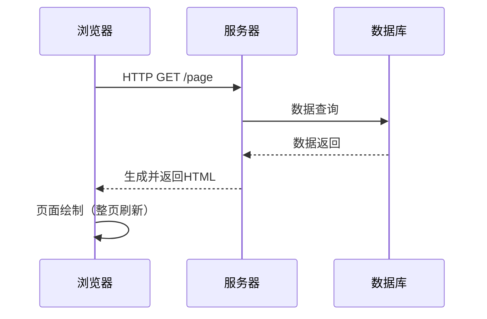
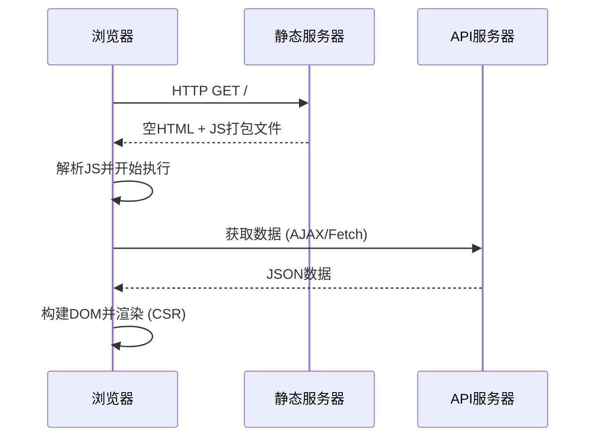
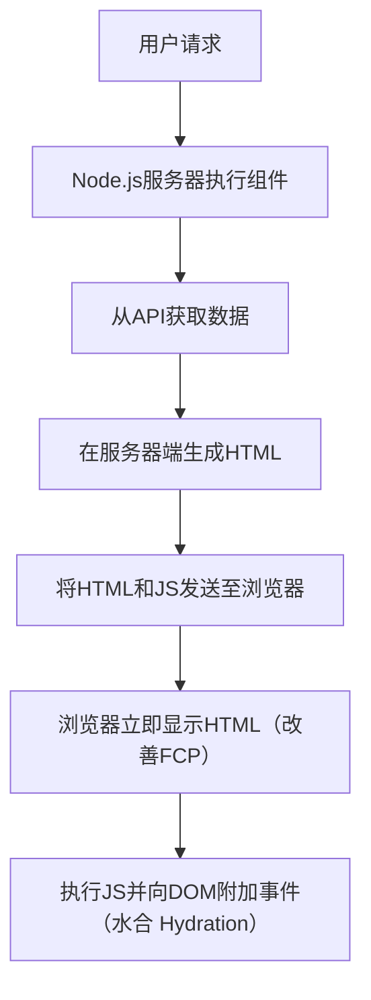
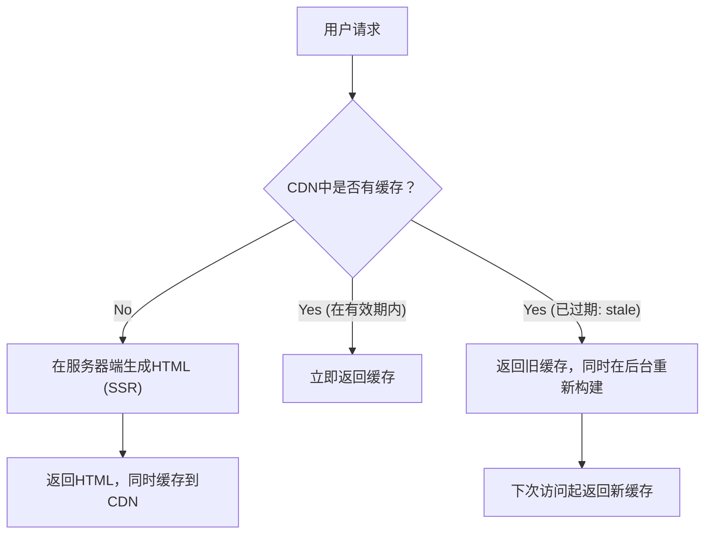

## 1. 引言：前端渲染的变迁

Web开发的历史，也是关于内容“在哪里”渲染，即在服务端和客户端之间摇摆的钟摆历史。早期的Web在服务器上生成HTML，浏览器只负责简单的结构显示。然而，随着对用户体验（UX）的要求越来越高，利用JavaScript在浏览器端动态构建UI的单页应用（SPA）成为了主流。

而现在，为了克服SPA带来的挑战，我们又演进出了新的方法，再次借助服务器的力量，如服务端渲染（SSR）、静态站点生成（SSG），甚至是增量静态再生成（ISR）以及React Server Components（RSC）。

本文将深入探讨前端渲染技术演进的必然性，以及每种技术是为了解决什么挑战而诞生的。

## 2. 传统SSR与jQuery时代

在1990年代到2000年代，网页主要通过PHP、Ruby on Rails、Java、Perl等后端技术在服务器端动态生成。当用户访问URL时，服务器从数据库中获取信息，构建完整的HTML并返回给浏览器。浏览器接收到HTML后，从上到下解析并绘制到屏幕上。

这种方法在SEO（搜索引擎优化）方面非常强大，因为爬虫可以立即读取完整的HTML。然而，即使只更新页面的一部分，也会导致整个页面的重新加载（整页刷新），因此用户体验绝不流畅。

于是，**jQuery**和AJAX（Asynchronous JavaScript and XML）应运而生。它们允许在不重新加载整个页面的情况下，使用JavaScript异步从服务器获取数据，并直接修改DOM的一部分。但是，随着应用程序变得复杂，直接操作DOM的方法极大地降低了代码的可维护性，成为了“面条代码”（Spaghetti Code）的温床。

## 3. 向客户端转移：SPA的崛起

进入2010年代，随着智能手机的普及和用户期望的提高，Web也开始需要像原生应用一样流畅的操作感。为了满足这一需求，**SPA（Single Page Application，单页应用）**应运而生。

AngularJS、Backbone.js以及后来的React和Vue.js等框架，将页面的渲染逻辑从服务器完全转移到了客户端（浏览器）。

在SPA中，首次访问时会下载一个“空HTML”和一个“巨大的JavaScript文件（bundle）”。之后，JavaScript在浏览器上执行，从API服务器异步获取所需的数据，并在客户端动态构建DOM（客户端渲染，CSR）。
页面跳转时，JavaScript控制路由，只获取必要的数据并重写页面，因此不会发生整页刷新，实现了极其流畅的用户体验。

## 4. SPA面临的挑战：初始加载时间与SEO

SPA提供了出色的用户体验，但同时也带来了新的挑战。

1. **初始加载时间延迟（TTFB和FCP恶化）**:
   当用户首次访问页面时，屏幕上显示出有意义的内容（First Contentful Paint，FCP）需要很长时间。因为浏览器必须下载巨大的JavaScript文件、解析、执行，然后再从API获取数据，最后才能构建DOM。特别是在移动环境或慢速网络下，用户会长时间面对白屏。

2. **SEO（搜索引擎优化）与OGP问题**:
   SPA提供的初始HTML只包含像 `

` 这样的空元素。虽然Google的爬虫现在可以执行JavaScript，但被索引可能需要时间，而其他搜索引擎或社交媒体的爬虫（如Twitter或Facebook的OGP解析）在不执行JavaScript的情况下只读取HTML，因此存在无法正确识别动态生成内容的严重问题。

## 5. 现代SSR与水合（Hydration）

为了解决SPA的挑战，前端界决定再次借用服务端的支持。这就是**现代SSR（Server-Side Rendering，服务端渲染）**的诞生。Next.js和Nuxt.js等元框架引领了这种方法。

在现代SSR中，对于首次请求，在服务器（通常是Node.js环境）上执行React或Vue组件，生成包含数据获取在内的完整HTML并返回给浏览器。

由于浏览器可以立即渲染接收到的HTML，FCP得到了显著提升，SEO和OGP的问题也得到了彻底解决。然而，刚显示出来的页面还只是“静态HTML”，对点击等操作没有反应。
当后台下载并执行JavaScript后，React等框架会将事件监听器附加到现有的DOM元素上，使应用程序转变为“动态”状态。这个过程被称为**水合（Hydration）**。

SSR虽然强大，但每次请求都需要在服务器上进行渲染处理，导致服务器负载较高（TTFB延迟），并带来了难以确保可扩展性且成本高昂的新挑战。

## 6. 静态站点生成（SSG）：Jamstack的兴起

“如果每次请求都生成HTML太重的话，那为什么不在构建时提前生成所有页面的HTML呢？”
基于这个想法，诞生了**SSG（Static Site Generation，静态站点生成）**。Gatsby和Next.js普及了这种方法，成为了Jamstack（JavaScript, APIs, Markup）架构的核心。

在构建时从API获取数据，并预先生成HTML。生成的静态HTML被部署到CDN（内容分发网络）上，由全球的边缘服务器以极快的速度分发。
由于不需要服务端的计算，安全性高，TTFB（Time to First Byte）最快，且服务器成本可以控制在极低的水平。

然而，SSG也有致命的弱点：**“数据的新鲜度”和“构建时间”**。
如果有一个拥有1万篇文章的博客或大型电商网站，每当一个内容更新时，都需要重新构建所有页面。构建可能需要几十分钟甚至几个小时，因此不适合需要实时性的应用程序。

## 7. ISR（Incremental Static Regeneration）的革新

为了解决SSG的“构建时间长”和“数据更新延迟”问题，Next.js提出了一项革命性的解决方案：**ISR（Incremental Static Regeneration，增量静态再生成）**。

ISR不是在构建时生成所有页面，而是优先SSG重要的页面，其余页面在用户首次请求时像SSR一样生成，同时将结果缓存（保存为静态文件）到CDN上。
此外，通过设置 `revalidate` 有效期（例如：60秒），对于过期后的首次请求，系统会返回“旧缓存（stale）”，同时在后台（background）重新渲染，并用新的HTML更新缓存（stale-while-revalidate 策略）。

由此，在始终为用户提供超高速响应（SSG的优势）的同时，实现了数据的定期更新（SSR的优势），可谓取两者之精华。而且最近，以Webhook等为触发器在任意时间点作废并更新缓存的**按需ISR（On-demand ISR）**也成为了主流。

## 8. React Server Components（RSC）与App Router

时至今日，前端的钟摆正在向更高维度进化。这就是**React Server Components（RSC）**。它在Next.js 13及以后的App Router中被全面引入。

在以往的SSR和SSG中，“在服务器端渲染还是在客户端渲染”是以“页面级别”决定的。而在RSC中，可以在**“组件级别”**区分服务器和客户端。

- **Server Components (服务端组件)**: 仅在服务器上执行，完全不会向客户端发送任何JavaScript代码。即使直接访问数据库或使用大型库，也不会影响客户端的包（bundle）大小。
- **Client Components (客户端组件)**: 仅应用于需要与用户交互的部分，如状态管理（`useState`）或事件监听器（`onClick`），并像往常一样在客户端进行水合。

这使得可以极大地减少SPA最大的弱点——“下载和执行巨大的JavaScript包”，同时维持SPA流畅的操作性。

## 9. 结论：钟摆将摆向何方

从jQuery开始，大幅度向客户端摆动的SPA钟摆，经过SSR、SSG、ISR，最终以RSC的形式走向“服务端与客户端的最佳融合”。

技术的演进绝不是对过去的否定。正是因为SPA证明了客户端的高级用户体验，才有了现在SSR/RSC关于如何快速且安全地提供这种体验的演进。
未来，随着新需求和设备的不断进化，这个钟摆将继续摇摆。重要的是，不要盲目迷信某一种特定技术，而是要具备架构师的视角：看清各个项目的需求（SEO的重要性、数据更新的频率、用户体验的要求水平等），并选择合适的渲染策略。
