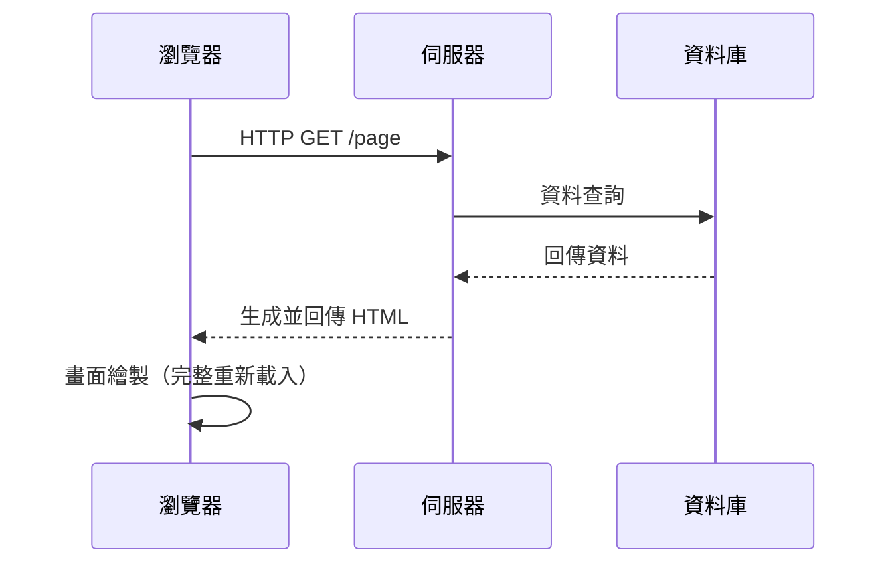
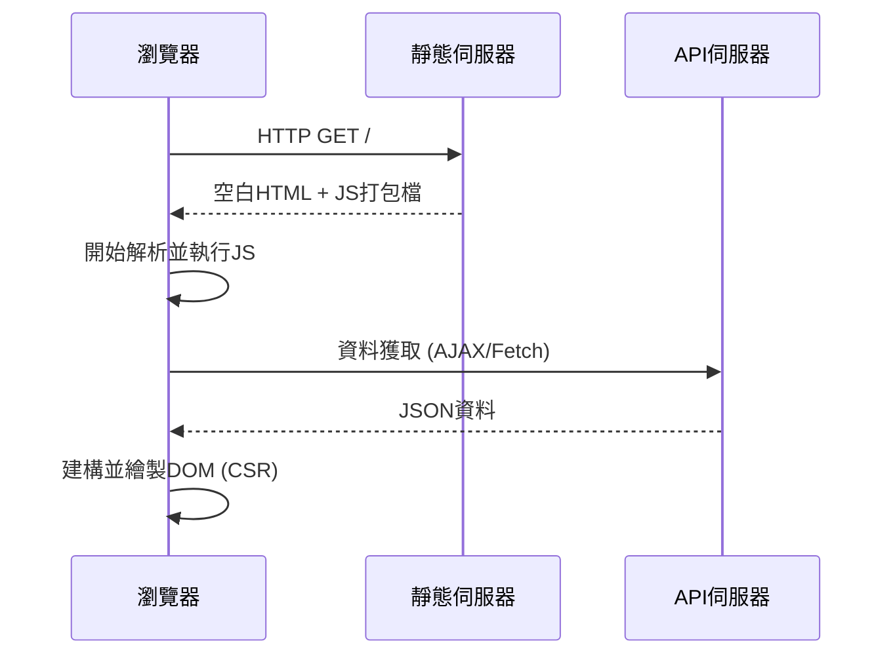
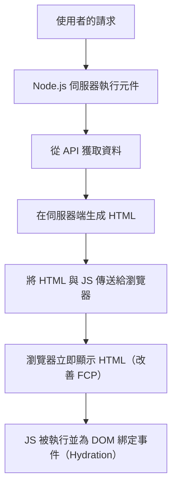
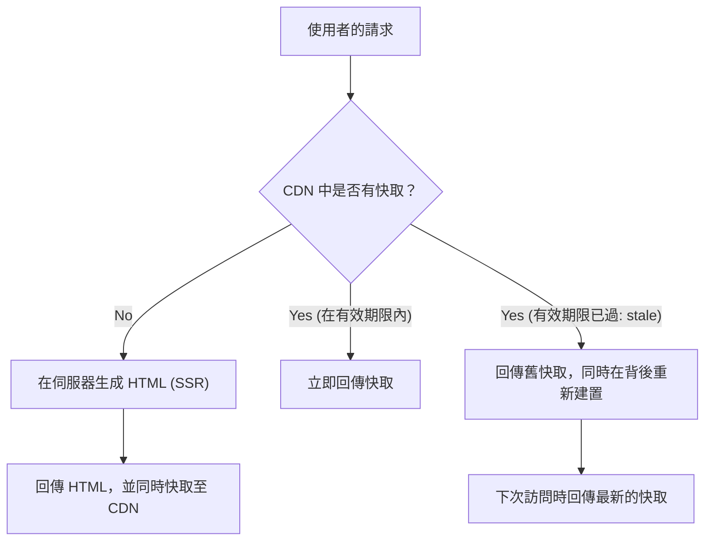

## 1. 簡介：前端渲染的演變

Web 開發的歷史，也是一段關於內容「在哪裡」渲染，即在伺服器端與客戶端之間來回擺盪的鐘擺歷史。早期的 Web 結構簡單，由伺服器生成 HTML，瀏覽器僅負責顯示。然而，隨著對使用者體驗（UX）的要求不斷提高，利用 JavaScript 在瀏覽器端動態建構 UI 的單頁應用程式（Single Page Application, SPA）成為了主流。

而現在，為了克服 SPA 帶來的挑戰，我們再次藉助伺服器的力量，演進出伺服器端渲染（Server-Side Rendering, SSR）、靜態網站生成（Static Site Generation, SSG），甚至增量靜態再生成（Incremental Static Regeneration, ISR）以及 React 伺服器元件（React Server Components, RSC）等全新方法。

本文將深入探討前端渲染技術演進的必然性，以及每種技術是為了解決什麼樣的挑戰而誕生的。

## 2. 傳統 SSR 與 jQuery 時代

在 1990 年代到 2000 年代期間，Web 頁面通常使用 PHP、Ruby on Rails、Java、Perl 等後端技術在伺服器端動態生成。當使用者訪問 URL 時，伺服器會從資料庫中取得資訊，建構出完整的 HTML 並回傳給瀏覽器。瀏覽器接收到 HTML 後，從上到下進行解析並繪製到畫面上。

這種方法在 SEO（搜尋引擎最佳化）方面非常強大，因為爬蟲可以立即讀取完整的 HTML。然而，即使只是更新頁面的一部分，也會導致整個畫面重新載入（Full Page Reload），這使得使用者體驗絕對稱不上是無縫的。

於是，**jQuery** 與 AJAX（Asynchronous JavaScript and XML）應運而生。這使得我們無需重新載入整個頁面，即可使用 JavaScript 非同步地從伺服器取得資料，並直接修改 DOM 的一部分。不過，隨著應用程式變得越來越複雜，直接操作 DOM 的做法大幅降低了程式碼的可維護性，成為了「義大利麵條式程式碼（Spaghetti code）」的溫床。

## 3. 向客戶端轉移：SPA 的崛起

進入 2010 年代，隨著智慧型手機的普及與使用者期望值的提升，Web 也開始被要求具備如同原生應用程式般流暢的操作感。為了回應這項需求，**SPA（單頁應用程式）** 應運而生。

AngularJS、Backbone.js，以及後來的 React 與 Vue.js 等框架，將畫面繪製邏輯從伺服器完全轉交給了客戶端（瀏覽器）。

在 SPA 中，首次訪問時會下載「空白的 HTML」與「巨大的 JavaScript 檔案（Bundle）」。之後，JavaScript 在瀏覽器上執行，非同步從 API 伺服器取得所需的資料，並在客戶端動態建構 DOM（Client-Side Rendering, CSR）。
在頁面跳轉時，JavaScript 會控制路由，僅獲取所需的資料來更新畫面，因此不會發生完整重新載入，實現了令人驚豔的流暢使用者體驗。

## 4. SPA 面臨的挑戰：初始載入時間與 SEO

SPA 提供了出色的 UX，但同時也衍生出了新的挑戰。

1. **初始載入時間的延遲（TTFB 與 FCP 惡化）**:
   當使用者首次訪問頁面時，畫面顯示出有意義的內容（First Contentful Paint, FCP）需要花費很長的時間。這是因為瀏覽器必須下載巨大的 JavaScript 檔案、解析、執行，並從 API 獲取資料後，才能夠建構 DOM。特別是在行動裝置或低速網路環境下，使用者會長時間看著一片空白的畫面（Blank Screen）。

2. **SEO（搜尋引擎最佳化）與 OGP 的問題**:
   SPA 提供的初始 HTML 僅包含如 `

` 的空白元素。雖然目前 Google 的爬蟲能夠執行 JavaScript，但被索引可能需要較長的時間；且其他搜尋引擎或社群媒體的爬蟲（例如 Twitter 或 Facebook 的 OGP 展開）往往不執行 JavaScript，僅讀取 HTML，導致無法正確識別動態生成的內容，這是一個相當嚴重的問題。

## 5. 現代 SSR 與水合（Hydration）

為了解決 SPA 的挑戰，前端社群決定再次藉助伺服器端的力量。這就是**現代 SSR（伺服器端渲染）**的誕生。Next.js 與 Nuxt.js 等元框架（Meta-framework）帶領了這個方法的發展。

在現代 SSR 中，針對最初的請求，會在伺服器（通常是 Node.js 環境）上執行 React 或 Vue 的元件，生成包含資料獲取的完整 HTML，並回傳給瀏覽器。

因為瀏覽器能立即渲染接收到的 HTML，所以 FCP 大幅提升，同時也完美解決了 SEO 與 OGP 的問題。然而，剛顯示出來的頁面還只是「靜態的 HTML」，對於點擊等操作並不會有反應。
當背景完成 JavaScript 的下載與執行後，React 等框架會將事件監聽器綁定到現有的 DOM 元素上，使應用程式轉變為「動態」的狀態。這個過程被稱為**水合（Hydration）**。

雖然 SSR 非常強大，但因為每次請求都需要在伺服器進行渲染處理，導致伺服器負載較高（TTFB 延遲），並衍生了要確保可擴展性需要較高成本的新挑戰。

## 6. 靜態網站生成（SSG）：Jamstack 的興起

「如果每次請求都生成 HTML 負擔太重的話，那是不是可以在建置時，預先將所有頁面的 HTML 都生成好呢？」
基於這個想法而誕生的就是 **SSG（靜態網站生成）**。Gatsby 與 Next.js 普及了這個方法，並成為被稱為 Jamstack（JavaScript, APIs, Markup）架構的核心。

在建置時從 API 獲取資料，並事先生成 HTML。生成好的靜態 HTML 會被部署到 CDN（內容傳遞網路），由世界各地的邊緣伺服器以極快的速度進行分發。
由於不需要在伺服器端進行運算，因此安全性高、TTFB（Time to First Byte）最快，同時也能將伺服器成本壓到最低。

不過，SSG 也有致命的弱點，那就是**「資料的新鮮度」與「建置時間」**。
如果有一個擁有 1 萬個頁面的部落格或巨大的電商網站，每當更新 1 個內容，就需要重新建置所有的頁面。這會使建置時間長達數十分鐘甚至數小時，因此並不適合需要即時性的應用程式。

## 7. ISR（Incremental Static Regeneration）的創新

為了解決 SSG 的「建置時間過長」與「資料更新延遲」問題，Next.js 推出了一項革命性的解決方案，這就是 **ISR（增量靜態再生成）**。

ISR 不會在建置時生成所有的頁面，而是先僅對重要的頁面進行 SSG，剩餘的頁面則在使用者首次發出請求時像 SSR 那樣生成，同時將結果快取至 CDN 中（保存為靜態檔案）。
此外，透過設定名為 `revalidate` 的有效期限（例如：60 秒），當期限過後收到首次請求時，會先回傳「舊的快取（stale）」，同時在背後進行重新渲染，將快取更新為最新的 HTML（stale-while-revalidate 策略）。

這樣一來，既能持續為使用者提供超高速的回應（SSG 的優點），又能定期確保資料處於最新狀態（SSR 的優點），實現了結合兩者長處的目標。近年來，透過 Webhook 等觸發器在任意時間點清除並更新快取的**隨選 ISR（On-demand ISR）**也成為了主流。

## 8. React Server Components（RSC）與 App Router

到了現在，前端的鐘擺已經進化到了更高的層次。這就是 **React 伺服器元件（React Server Components, RSC）**。這項技術在 Next.js 13 以後的 App Router 中被正式導入。

在以往的 SSR 或 SSG 中，「要在伺服器渲染還是客戶端渲染」是由「頁面層級」決定的。然而在 RSC 中，則是可以透過**「元件層級」**來切分伺服器與客戶端。

- **Server Components**: 僅在伺服器上執行，不會傳送任何 JavaScript 程式碼給客戶端。即使直接存取資料庫或使用較為龐大的函式庫，也不會影響客戶端的 Bundle Size。
- **Client Components**: 僅應用於狀態管理（`useState`）或事件監聽（`onClick`）等需要與使用者互動的部分，並一如既往地在客戶端進行水合。

這使得我們能夠極大化減少 SPA 最大的弱點——「下載並執行龐大 JavaScript 檔案」，同時維持 SPA 的流暢操作性。

## 9. 結論：鐘擺將擺向何方

從 jQuery 開始，並往客戶端大幅擺動到 SPA 的鐘擺，經歷了 SSR、SSG、ISR，正以 RSC 的形式邁向「伺服器與客戶端最佳化融合」的未來。

技術的演進絕不是對過去的否定。正是因為 SPA 證明了在客戶端能實現高度的 UX，才會有如今 SSR/RSC 去思考如何更高速、安全地提供這些體驗的發展。
未來，隨著新需求與裝置的演進，這座鐘擺想必還會繼續擺盪。最重要的是，不要盲目迷信特定技術，而是要具備架構的觀點，仔細審視各個專案的需求（例如：SEO 的重要性、資料更新頻率、使用者體驗的要求水平等），選擇最合適的渲染策略。
