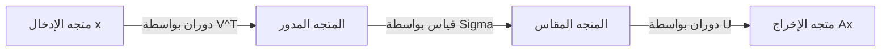
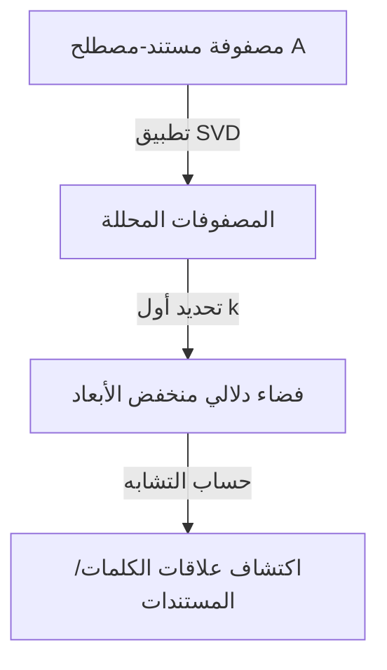

واحدة من أهم وأقوى الأدوات في الجبر الخطي هي **تحليل القيمة المفردة** (SVD). هذه التقنية، التي يمكنها تحليل أي مصفوفة إلى عمليات أساسية، تدعم جوهر التقنيات الحديثة مثل علوم البيانات، وتعلم الآلة، ومعالجة الصور.

في هذه المقالة، سنشرح SVD بالتفصيل، بدءًا من تعريفها الرياضي إلى معناها الهندسي، وأخيرًا تطبيقاتها العملية في ضغط البيانات والذكاء الاصطناعي.

## 1. التعريف الرياضي لـ SVD

يمكن تحليل أي مصفوفة حقيقية $m \times n$، يُشار إليها بالرمز $A$، إلى حاصل ضرب ثلاث مصفوفات على النحو التالي:

$$A = U \Sigma V^T \quad (\text{تحليل القيمة المفردة للمصفوفة})$$

هنا، كل مصفوفة لها الخصائص التالية:

- $U$ هي مصفوفة متعامدة $m \times m$. تُسمى متجهات أعمدتها **المتجهات المفردة اليسرى** .
- $\Sigma$ هي مصفوفة قطرية $m \times n$. تُسمى العناصر القطرية $\sigma_i$ **القيم المفردة** ، وتُرتَّب عادةً ترتيبًا تنازليًا $\sigma_1 \ge \sigma_2 \ge \dots \ge 0$.
- $V^T$ هو منقول المصفوفة المتعامدة $V$ بحجم $n \times n$. تُسمى متجهات أعمدة $V$ **المتجهات المفردة اليمنى** .

كخاصية للمصفوفات المتعامدة، يتحقق $U^T U = I$ و $V^T V = I$. هذه هي أكبر نقطة قوة لـ SVD، حيث تسمح بتحليل مصفوفة معقدة $A$ إلى مصفوفات متعامدة وقطرية يسهل التعامل معها رياضيًا.

## 2. الفرق عن تحليل القيمة الذاتية

بالنسبة للمصفوفات المربعة، يُعرف تحليل القيمة الذاتية $A = P \[Lambda](https://kenji.blog/ar/p/serverless-architecture-aws-lambda-cold-start/) P^{-1}$ جيدًا. ومع ذلك، فإن هذا التحليل له القيود التالية:
- لا يمكن تطبيقه إلا على المصفوفات المربعة ($n \times n$).
- حتى لو كانت مصفوفة مربعة، فهي ليست قابلة للتحويل القطري دائمًا.

من ناحية أخرى، يوجد **تحليل القيمة المفردة** دائمًا لأي مصفوفة $m \times n$ تعسفية، حتى لو لم تكن مربعة. وهذا أحد أسباب كون SVD مفيدة للغاية في تحليل البيانات.

## 3. الحدس الهندسي: الدوران والقياس

أحد أجمل جوانب SVD هو تفسيرها الهندسي. وهو يعني أن أي تحويل خطي $A$ يمكن تحليله إلى الخطوات الثلاث البسيطة التالية.



1. **دوران بواسطة $V^T$** : يقوم بتدوير المتجه باستخدام تحويل متعامد.
2. **قياس بواسطة $\Sigma$** : يقوم بتمديد أو تقليص المتجه على طول كل محور إحداثي بمعامل القيمة المفردة $\sigma_i$.
3. **دوران بواسطة $U$** : أخيرًا، يقوم بتدوير المتجه مرة أخرى في الفضاء المُحوَّل.

بمعنى آخر، بغض النظر عن مدى تعقيد التحويل، يمكن في الأساس اختزاله إلى عملية "دوران، قياس، ودوران مرة أخرى".

## 4. تقريب الرتبة المنخفضة (مبرهنة إيكارت-يونغ-ميرسكي)

التطبيق الأكبر لـ SVD هو **تقريب الرتبة المنخفضة** . نظرًا لأن القيم المفردة للمصفوفة $A$ مرتبة تنازليًا، يمكن اعتبار القيم المفردة الصغيرة على أنها تمثل ضوضاء أو معلومات غير مهمة.

من خلال استخراج أول $k$ قيم مفردة والمتجهات المفردة المقابلة لها فقط، يمكننا إنشاء مصفوفة من الرتبة $k$، $A_k$، والتي تُقرّب المصفوفة الأصلية $A$.

$$A \approx A_k = U_k \Sigma_k V_k^T \quad (\text{التقريب الأمثل من الرتبة } k)$$

وفقًا لمبرهنة إيكارت-يونغ-ميرسكي، فإن هذه $A_k$ هي مصفوفة التقريب المثلى التي تقلل الخطأ مع المصفوفة الأصلية $A$.

## 5. مثال تطبيق 1 في Python: ضغط الصور

يمكن تمثيل الصورة كمصفوفة من قيم البكسل. من خلال إجراء تقريب الرتبة المنخفضة باستخدام SVD، يمكننا تقليل حجم البيانات بشكل كبير مع الحفاظ على الجودة البصرية.

```python
import numpy as np
import matplotlib.pyplot as plt
from skimage import data
from skimage.color import rgb2gray

# تحميل الصورة وتحويلها إلى تدرج رمادي
image = rgb2gray(data.astronaut())

# إجراء تحليل القيمة المفردة
U, S, VT = np.linalg.svd(image, full_matrices=False)

# ضغط الصورة باستخدام أول k قيم مفردة
k = 50
compressed_image = np.dot(U[:, :k], np.dot(np.diag(S[:k]), VT[:k, :]))

# عرض الصورة الأصلية والمضغوطة
plt.figure(figsize=(10, 5))
plt.subplot(1, 2, 1)
plt.title("Original Image")
plt.imshow(image, cmap='gray')

plt.subplot(1, 2, 2)
plt.title(f"Compressed Image (k={k})")
plt.imshow(compressed_image, cmap='gray')
plt.show()
```

في هذا الكود، نستخدم 50 فقط من أصل آلاف القيم المفردة الأصلية، ولكن يتم الحفاظ على الميزات الرئيسية للصورة بشكل قوي.

## 6. مثال تطبيق 2: التحليل الدلالي الكامن (LSA)

تُستخدم SVD أيضًا في مجال معالجة اللغات الطبيعية (NLP) كـ **تحليل دلالي كامن** (LSA).



هنا، يتم تطبيق SVD على مصفوفة تمثل فيها الصفوف الكلمات والأعمدة المستندات. هذا يسمح لنا بالتقاط "الموضوعات الكامنة" وراء الكلمات، بدلاً من مجرد التطابقات السطحية.

## 7. شبه المعكوس لمور-بينروز

تكون SVD نشطة أيضًا عند البحث عن حل لنظام من المعادلات الخطية. حتى لو لم تكن المصفوفة $A$ مربعة، يمكننا الحصول على حل المربعات الصغرى عن طريق حساب **شبه المعكوس لمور-بينروز** $A^+$.

$$A^+ = V \Sigma^+ U^T \quad (\text{حساب شبه المعكوس})$$

يجعل هذا من الممكن إيجاد حلول للانحدار الخطي بشكل مستقر في تعلم الآلة.

## 8. الخاتمة

**تحليل القيمة المفردة** (SVD) تقنية قوية تحلل أي مصفوفة إلى ثلاثة عناصر بسيطة: "دوران"، "قياس"، و"دوران". فهم الخلفية الرياضية لـ SVD سيكون الخطوة الأولى لفهم خوارزميات تعلم الآلة بعمق.
