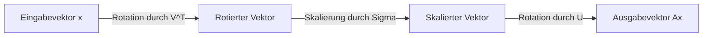
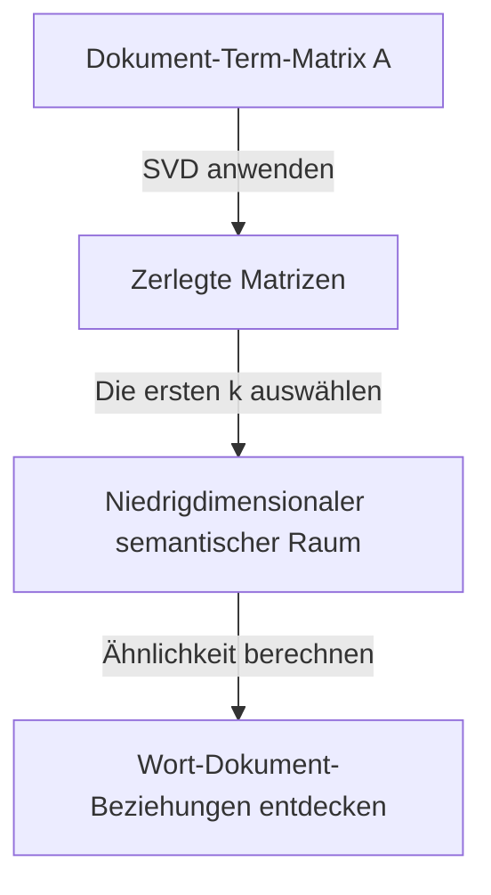

Eines der wichtigsten und leistungsfähigsten Werkzeuge der linearen Algebra ist die **Singulärwertzerlegung** (SVD). Diese Technik, die jede Matrix in grundlegende Operationen zerlegen kann, bildet den Kern moderner Technologien wie Data Science, maschinelles Lernen und Bildverarbeitung.

In diesem Artikel werden wir die SVD ausführlich erklären, angefangen bei ihrer mathematischen Definition über ihre geometrische Bedeutung bis hin zu praktischen Anwendungen in der Datenkompression und KI.

## 1. Mathematische Definition der SVD

Jede reelle $m \times n$-Matrix $A$ kann wie folgt in das Produkt von drei Matrizen zerlegt werden:

$$A = U \Sigma V^T \quad (\text{Singulärwertzerlegung der Matrix})$$

Hierbei hat jede Matrix die folgenden Eigenschaften:

- $U$ ist eine orthogonale $m \times m$-Matrix. Ihre Spaltenvektoren werden als **linke Singulärvektoren** bezeichnet.
- $\Sigma$ ist eine $m \times n$-Diagonalmatrix. Die Diagonalelemente $\sigma_i$ werden als **Singulärwerte** bezeichnet und sind normalerweise in absteigender Reihenfolge sortiert $\sigma_1 \ge \sigma_2 \ge \dots \ge 0$.
- $V^T$ ist die Transponierte einer orthogonalen $n \times n$-Matrix $V$. Die Spaltenvektoren von $V$ werden als **rechte Singulärvektoren** bezeichnet.

Als Eigenschaft orthogonaler Matrizen gilt $U^T U = I$ und $V^T V = I$. Dies ist die größte Stärke der SVD, da sie es ermöglicht, eine komplexe Matrix $A$ in mathematisch handhabbare orthogonale und diagonale Matrizen zu zerlegen.

## 2. Unterschied zur Eigenwertzerlegung

Für quadratische Matrizen ist die Eigenwertzerlegung $A = P \[Lambda](https://kenji.blog/de/p/serverless-architecture-aws-lambda-cold-start/) P^{-1}$ bekannt. Diese Zerlegung hat jedoch die folgenden Einschränkungen:
- Sie kann nur auf quadratische Matrizen ($n \times n$) angewendet werden.
- Auch wenn es sich um eine quadratische Matrix handelt, ist sie nicht immer diagonalisierbar.

Andererseits existiert die **Singulärwertzerlegung** immer für jede beliebige $m \times n$-Matrix, auch wenn sie nicht quadratisch ist. Dies ist einer der Gründe, warum die SVD in der Datenanalyse äußerst nützlich ist.

## 3. Geometrische Intuition: Rotation und Skalierung

Einer der schönsten Aspekte der SVD ist ihre geometrische Interpretation. Sie impliziert, dass jede lineare Transformation $A$ in die folgenden drei einfachen Schritte zerlegt werden kann.



1. **Rotation durch $V^T$** : Rotiert den Vektor mit Hilfe einer orthogonalen Transformation.
2. **Skalierung durch $\Sigma$** : Streckt oder staucht den Vektor entlang jeder Koordinatenachse um den Faktor des Singulärwertes $\sigma_i$.
3. **Rotation durch $U$** : Rotiert den Vektor schließlich im transformierten Raum erneut.

Mit anderen Worten, egal wie komplex eine Transformation erscheinen mag, sie kann im Grunde auf einen Prozess aus „Rotieren, Skalieren und erneutes Rotieren“ reduziert werden.

## 4. Niedrigrang-Approximation (Eckart-Young-Mirsky-Theorem)

Die wichtigste Anwendung der SVD ist die **Niedrigrang-Approximation** . Da die Singulärwerte einer Matrix $A$ in absteigender Reihenfolge sortiert sind, können kleine Singulärwerte als Rauschen oder unwichtige Informationen betrachtet werden.

Indem wir nur die ersten $k$ Singulärwerte und die entsprechenden Singulärvektoren extrahieren, können wir eine Rang-$k$-Matrix $A_k$ erstellen, die die ursprüngliche Matrix $A$ approximiert.

$$A \approx A_k = U_k \Sigma_k V_k^T \quad (\text{Optimale Approximation vom Rang } k)$$

Gemäß dem Eckart-Young-Mirsky-Theorem ist diese $A_k$ die optimale Approximationsmatrix, die den Fehler zur ursprünglichen Matrix $A$ minimiert.

## 5. Anwendungsbeispiel 1 in Python: Bildkompression

Ein Bild kann als Matrix von Pixelwerten dargestellt werden. Durch die Durchführung einer Niedrigrang-Approximation mittels SVD können wir die Datengröße bei gleichbleibender visueller Qualität deutlich reduzieren.

```python
import numpy as np
import matplotlib.pyplot as plt
from skimage import data
from skimage.color import rgb2gray

# Bild laden und in Graustufen umwandeln
image = rgb2gray(data.astronaut())

# Singulärwertzerlegung ausführen
U, S, VT = np.linalg.svd(image, full_matrices=False)

# Bild mit den ersten k Singulärwerten komprimieren
k = 50
compressed_image = np.dot(U[:, :k], np.dot(np.diag(S[:k]), VT[:k, :]))

# Originalbild und komprimiertes Bild anzeigen
plt.figure(figsize=(10, 5))
plt.subplot(1, 2, 1)
plt.title("Original Image")
plt.imshow(image, cmap='gray')

plt.subplot(1, 2, 2)
plt.title(f"Compressed Image (k={k})")
plt.imshow(compressed_image, cmap='gray')
plt.show()
```

In diesem Code verwenden wir nur 50 von Tausenden von ursprünglichen Singulärwerten, aber die Hauptmerkmale des Bildes bleiben fest erhalten.

## 6. Anwendungsbeispiel 2: Latent Semantic Analysis (LSA)

Die SVD wird auch im Bereich der Verarbeitung natürlicher Sprache (NLP) als **Latent Semantic Analysis** (LSA) verwendet.



Hierbei wird die SVD auf eine Matrix angewendet, in der die Zeilen Wörter und die Spalten Dokumente darstellen. Dadurch können wir die „latenten Themen“ hinter den Wörtern erfassen und nicht nur oberflächliche Übereinstimmungen.

## 7. Moore-Penrose-Pseudoinverse

Die SVD ist auch bei der Lösungsfindung für ein System linearer Gleichungen hilfreich. Auch wenn die Matrix $A$ keine quadratische Matrix ist, können wir die Lösung der kleinsten Quadrate erhalten, indem wir die **Moore-Penrose-Pseudoinverse** $A^+$ berechnen.

$$A^+ = V \Sigma^+ U^T \quad (\text{Berechnung der Pseudoinversen})$$

Dies ermöglicht es, beim maschinellen Lernen stabil Lösungen für die lineare Regression zu finden.

## 8. Fazit

Die **Singulärwertzerlegung** (SVD) ist eine leistungsstarke Technik, die jede Matrix in drei einfache Elemente zerlegt: „Rotation“, „Skalierung“ und „Rotation“. Das Verständnis des mathematischen Hintergrunds der SVD ist der erste Schritt zu einem tieferen Verständnis von Algorithmen des maschinellen Lernens.
