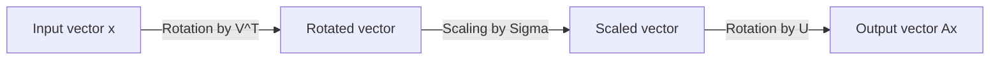
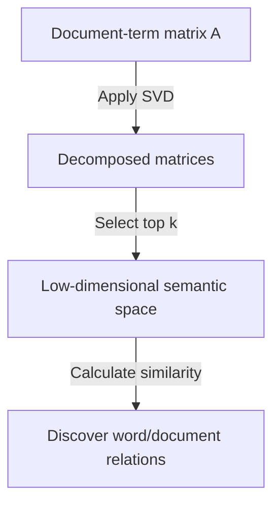

One of the most important and powerful tools in linear algebra is **Singular Value Decomposition** (SVD). This technique, which can decompose any matrix into fundamental operations, underpins the core of modern technologies such as data science, machine learning, and image processing.

In this article, we will thoroughly explain SVD, starting from its mathematical definition to its geometric meaning, and finally its practical applications in data compression and AI.

## 1. Mathematical Definition of SVD

Any $m \times n$ real matrix $A$ can be decomposed into the product of three matrices as follows:

$$A = U \Sigma V^T \quad (\text{Singular Value Decomposition of a Matrix})$$

Here, each matrix has the following properties:

- $U$ is an $m \times m$ orthogonal matrix. Its column vectors are called **left singular vectors** .
- $\Sigma$ is an $m \times n$ diagonal matrix. The diagonal elements $\sigma_i$ are called **singular values** , usually sorted in descending order $\sigma_1 \ge \sigma_2 \ge \dots \ge 0$.
- $V^T$ is the transpose of an $n \times n$ orthogonal matrix $V$. The column vectors of $V$ are called **right singular vectors** .

As a property of orthogonal matrices, $U^T U = I$ and $V^T V = I$ hold. This is the greatest strength of SVD, as it allows a complex matrix $A$ to be decomposed into mathematically manageable orthogonal and diagonal matrices.

## 2. Difference from Eigendecomposition

For square matrices, eigendecomposition $A = P \[Lambda](https://kenji.blog/en/p/serverless-architecture-aws-lambda-cold-start/) P^{-1}$ is well known. However, eigendecomposition has the following limitations:
- It can only be applied to square matrices ($n \times n$).
- Even if it is a square matrix, it is not always diagonalizable.

On the other hand, **Singular Value Decomposition** always exists for any arbitrary $m \times n$ matrix, even if it is not square. This is one of the reasons why SVD is extremely useful in data analysis.

## 3. Geometric Intuition: Rotation and Scaling

One of the most beautiful aspects of SVD is its geometric interpretation. It implies that any linear transformation $A$ can be decomposed into the following three simple steps.



1. **Rotation by $V^T$** : Rotates the vector using an orthogonal transformation.
2. **Scaling by $\Sigma$** : Stretches or shrinks the vector along each coordinate axis by the factor of the singular value $\sigma_i$.
3. **Rotation by $U$** : Finally, rotates the vector again in the transformed space.

In other words, no matter how complex a transformation may seem, it can basically be reduced to a process of "rotate, scale, and rotate again."

## 4. Low-Rank Approximation (Eckart-Young-Mirsky Theorem)

The biggest application of SVD is **low-rank approximation** . Since the singular values of a matrix $A$ are sorted in descending order, small singular values can be considered as representing noise or unimportant information.

By extracting only the top $k$ singular values and their corresponding singular vectors, we can create a rank-$k$ matrix $A_k$ that approximates the original matrix $A$.

$$A \approx A_k = U_k \Sigma_k V_k^T \quad (\text{Optimal approximation of rank } k)$$

According to the Eckart-Young-Mirsky theorem, this $A_k$ is the optimal approximation matrix that minimizes the error with the original matrix $A$.

## 5. Application Example 1 in Python: Image Compression

An image can be represented as a matrix of pixel values. By performing low-rank approximation using SVD, we can significantly reduce the data size while maintaining visual quality.

```python
import numpy as np
import matplotlib.pyplot as plt
from skimage import data
from skimage.color import rgb2gray

# Load image and convert to grayscale
image = rgb2gray(data.astronaut())

# Perform singular value decomposition
U, S, VT = np.linalg.svd(image, full_matrices=False)

# Compress the image using the top k singular values
k = 50
compressed_image = np.dot(U[:, :k], np.dot(np.diag(S[:k]), VT[:k, :]))

# Display the original and compressed images side by side
plt.figure(figsize=(10, 5))
plt.subplot(1, 2, 1)
plt.title("Original Image")
plt.imshow(image, cmap='gray')

plt.subplot(1, 2, 2)
plt.title(f"Compressed Image (k={k})")
plt.imshow(compressed_image, cmap='gray')
plt.show()
```

In this code, we use only 50 out of thousands of original singular values, but the main features of the image are firmly preserved.

## 6. Application Example 2: Latent Semantic Analysis (LSA) in NLP

SVD is also used in the field of Natural Language Processing (NLP) as **Latent Semantic Analysis** (LSA).



Here, SVD is applied to a matrix where rows represent words and columns represent documents. This allows us to capture the "latent topics" behind the words, rather than just superficial matches.

## 7. Moore-Penrose Pseudoinverse

SVD is also active when finding the solution to a system of linear equations. Even if the matrix $A$ is not a square matrix, we can obtain the least squares solution by calculating the **Moore-Penrose pseudoinverse** $A^+$.

$$A^+ = V \Sigma^+ U^T \quad (\text{Calculation of the pseudoinverse})$$

This makes it possible to stably find solutions for linear regression in machine learning.

## 8. Conclusion

**Singular Value Decomposition** (SVD) is a powerful technique that decomposes any matrix into three simple elements: "rotation", "scaling", and "rotation". Understanding the mathematical background of SVD will be the first step to deeply understanding machine learning algorithms.
