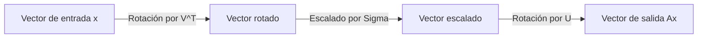
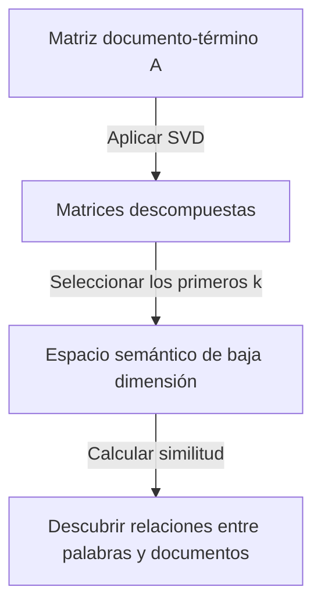

Una de las herramientas más importantes y poderosas en el álgebra lineal es la **Descomposición en Valores Singulares** (SVD por sus siglas en inglés). Esta técnica, capaz de descomponer cualquier matriz en operaciones fundamentales, sustenta el núcleo de tecnologías modernas como la ciencia de datos, el machine learning y el procesamiento de imágenes.

En este artículo, explicaremos detalladamente la SVD, comenzando por su definición matemática, su significado geométrico y, finalmente, sus aplicaciones prácticas en la compresión de datos y la IA.

## 1. Definición Matemática de SVD

Cualquier matriz real $m \times n$, denotada como $A$, puede descomponerse en el producto de tres matrices de la siguiente manera:

$$A = U \Sigma V^T \quad (\text{Descomposición en Valores Singulares de la matriz})$$

Aquí, cada matriz tiene las siguientes propiedades:

- $U$ es una matriz ortogonal de $m \times m$. Sus vectores columna se denominan **vectores singulares izquierdos** .
- $\Sigma$ es una matriz diagonal de $m \times n$. Los elementos diagonales $\sigma_i$ se llaman **valores singulares** , y generalmente se ordenan de forma descendente $\sigma_1 \ge \sigma_2 \ge \dots \ge 0$.
- $V^T$ es la transpuesta de una matriz ortogonal $V$ de $n \times n$. Los vectores columna de $V$ se denominan **vectores singulares derechos** .

Como propiedad de las matrices ortogonales, se cumple que $U^T U = I$ y $V^T V = I$. Esta es la mayor fortaleza de SVD, ya que permite que una matriz compleja $A$ se descomponga en matrices ortogonales y diagonales que son matemáticamente fáciles de manejar.

## 2. Diferencia con la Descomposición de Valores Propios

Para matrices cuadradas, la descomposición de valores propios $A = P \[Lambda](https://kenji.blog/es/p/serverless-architecture-aws-lambda-cold-start/) P^{-1}$ es bien conocida. Sin embargo, esta descomposición tiene las siguientes limitaciones:
- Solo se puede aplicar a matrices cuadradas ($n \times n$).
- Incluso si es una matriz cuadrada, no siempre es diagonalizable.

Por otro lado, la **Descomposición en Valores Singulares** siempre existe para cualquier matriz $m \times n$, incluso si no es cuadrada. Esta es una de las razones por las que la SVD es extremadamente útil en el análisis de datos.

## 3. Intuición Geométrica: Rotación y Escalado

Uno de los aspectos más hermosos de la SVD es su interpretación geométrica. Implica que cualquier transformación lineal $A$ se puede descomponer en los siguientes tres pasos simples.



1. **Rotación por $V^T$** : Rota el vector usando una transformación ortogonal.
2. **Escalado por $\Sigma$** : Estira o encoge el vector a lo largo de cada eje de coordenadas por el factor del valor singular $\sigma_i$.
3. **Rotación por $U$** : Finalmente, rota el vector de nuevo en el espacio transformado.

En otras palabras, no importa cuán compleja pueda parecer una transformación, básicamente se puede reducir a un proceso de "rotar, escalar y rotar de nuevo".

## 4. Aproximación de Rango Bajo (Teorema de Eckart-Young-Mirsky)

La mayor aplicación de la SVD es la **aproximación de rango bajo** . Dado que los valores singulares de una matriz $A$ están ordenados de forma descendente, los valores singulares pequeños pueden considerarse como representación de ruido o información poco importante.

Al extraer solo los primeros $k$ valores singulares y sus vectores singulares correspondientes, podemos crear una matriz de rango $k$, $A_k$, que aproxima la matriz original $A$.

$$A \approx A_k = U_k \Sigma_k V_k^T \quad (\text{Aproximación óptima de rango } k)$$

Según el teorema de Eckart-Young-Mirsky, esta $A_k$ es la matriz de aproximación óptima que minimiza el error con la matriz original $A$.

## 5. Ejemplo de Aplicación 1 en Python: Compresión de Imágenes

Una imagen puede representarse como una matriz de valores de píxeles. Al realizar una aproximación de rango bajo utilizando SVD, podemos reducir significativamente el tamaño de los datos manteniendo la calidad visual.

```python
import numpy as np
import matplotlib.pyplot as plt
from skimage import data
from skimage.color import rgb2gray

# Cargar imagen y convertir a escala de grises
image = rgb2gray(data.astronaut())

# Ejecutar la descomposición en valores singulares
U, S, VT = np.linalg.svd(image, full_matrices=False)

# Comprimir la imagen usando los primeros k valores singulares
k = 50
compressed_image = np.dot(U[:, :k], np.dot(np.diag(S[:k]), VT[:k, :]))

# Mostrar la imagen original y la comprimida
plt.figure(figsize=(10, 5))
plt.subplot(1, 2, 1)
plt.title("Original Image")
plt.imshow(image, cmap='gray')

plt.subplot(1, 2, 2)
plt.title(f"Compressed Image (k={k})")
plt.imshow(compressed_image, cmap='gray')
plt.show()
```

En este código, usamos solo 50 de los miles de valores singulares originales, pero las características principales de la imagen se conservan firmemente.

## 6. Ejemplo de Aplicación 2: Análisis Semántico Latente (LSA)

La SVD también se utiliza en el campo del Procesamiento del Lenguaje Natural (NLP) como **Análisis Semántico Latente** (LSA).



Aquí, la SVD se aplica a una matriz donde las filas representan palabras y las columnas representan documentos. Esto nos permite capturar los "temas latentes" detrás de las palabras, en lugar de solo coincidencias superficiales.

## 7. Pseudoinversa de Moore-Penrose

La SVD también es útil al buscar la solución a un sistema de ecuaciones lineales. Incluso si la matriz $A$ no es una matriz cuadrada, podemos obtener la solución de mínimos cuadrados calculando la **pseudoinversa de Moore-Penrose** $A^+$.

$$A^+ = V \Sigma^+ U^T \quad (\text{Cálculo de la pseudoinversa})$$

Esto hace posible encontrar de manera estable soluciones para la regresión lineal en el machine learning.

## 8. Conclusión

La **Descomposición en Valores Singulares** (SVD) es una técnica poderosa que descompone cualquier matriz en tres elementos simples: "rotación", "escalado" y "rotación". Comprender el fondo matemático de la SVD será el primer paso para entender profundamente los algoritmos de machine learning.
