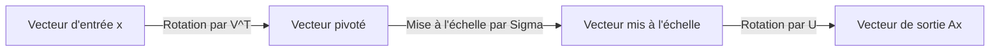
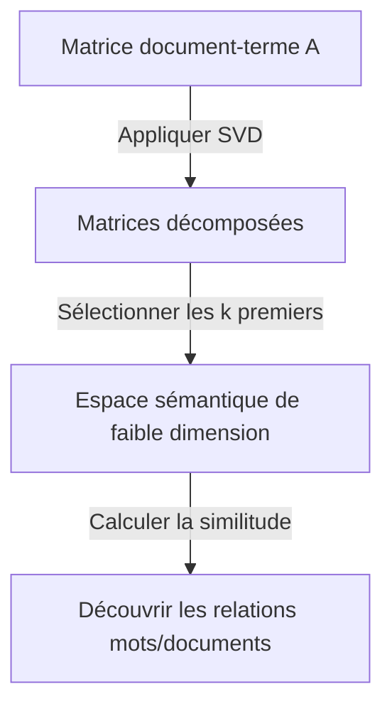

L'un des outils les plus importants et les plus puissants en algèbre linéaire est la **Décomposition en Valeurs Singulières** (SVD). Cette technique, capable de décomposer n'importe quelle matrice en opérations fondamentales, sous-tend le cœur des technologies modernes telles que la science des données, le machine learning et le traitement d'images.

Dans cet article, nous expliquerons en détail la SVD, en commençant par sa définition mathématique, sa signification géométrique, et enfin ses applications pratiques dans la compression de données et l'IA.

## 1. Définition Mathématique de la SVD

Toute matrice réelle $m \times n$, notée $A$, peut être décomposée en un produit de trois matrices comme suit :

$$A = U \Sigma V^T \quad (\text{Décomposition en Valeurs Singulières de la matrice})$$

Ici, chaque matrice possède les propriétés suivantes :

- $U$ est une matrice orthogonale $m \times m$. Ses vecteurs colonnes sont appelés **vecteurs singuliers gauches** .
- $\Sigma$ est une matrice diagonale $m \times n$. Les éléments diagonaux $\sigma_i$ sont appelés **valeurs singulières** , généralement triées par ordre décroissant $\sigma_1 \ge \sigma_2 \ge \dots \ge 0$.
- $V^T$ est la transposée d'une matrice orthogonale $V$ de $n \times n$. Les vecteurs colonnes de $V$ sont appelés **vecteurs singuliers droits** .

En tant que propriété des matrices orthogonales, on a $U^T U = I$ et $V^T V = I$. C'est la plus grande force de la SVD, car elle permet à une matrice complexe $A$ d'être décomposée en matrices orthogonales et diagonales mathématiquement faciles à manipuler.

## 2. Différence avec la Décomposition en Valeurs Propres

Pour les matrices carrées, la décomposition en valeurs propres $A = P \Lambda P^{-1}$ est bien connue. Cependant, cette décomposition a les limitations suivantes :
- Elle ne peut être appliquée qu'aux matrices carrées ($n \times n$).
- Même si c'est une matrice carrée, elle n'est pas toujours diagonalisable.

D'autre part, la **Décomposition en Valeurs Singulières** existe toujours pour toute matrice $m \times n$, même si elle n'est pas carrée. C'est l'une des raisons pour lesquelles la SVD est extrêmement utile dans l'analyse de données.

## 3. Intuition Géométrique : Rotation et Mise à l'Échelle

L'un des plus beaux aspects de la SVD est son interprétation géométrique. Elle implique que toute transformation linéaire $A$ peut être décomposée en les trois étapes simples suivantes.



1. **Rotation par $V^T$** : Fait pivoter le vecteur à l'aide d'une transformation orthogonale.
2. **Mise à l'échelle par $\Sigma$** : Étire ou rétrécit le vecteur le long de chaque axe de coordonnées par le facteur de la valeur singulière $\sigma_i$.
3. **Rotation par $U$** : Enfin, fait à nouveau pivoter le vecteur dans l'espace transformé.

En d'autres termes, peu importe la complexité apparente d'une transformation, elle peut essentiellement se réduire à un processus de "rotation, mise à l'échelle et nouvelle rotation".

## 4. Approximation de Rang Faible (Théorème d'Eckart-Young-Mirsky)

La plus grande application de la SVD est l' **approximation de rang faible** . Étant donné que les valeurs singulières d'une matrice $A$ sont triées par ordre décroissant, les petites valeurs singulières peuvent être considérées comme représentant du bruit ou des informations peu importantes.

En extrayant uniquement les $k$ premières valeurs singulières et leurs vecteurs singuliers correspondants, nous pouvons créer une matrice de rang $k$, $A_k$, qui approche la matrice d'origine $A$.

$$A \approx A_k = U_k \Sigma_k V_k^T \quad (\text{Approximation optimale de rang } k)$$

Selon le théorème d'Eckart-Young-Mirsky, cette matrice $A_k$ est la matrice d'approximation optimale qui minimise l'erreur avec la matrice d'origine $A$.

## 5. Exemple d'Application 1 en Python : Compression d'Images

Une image peut être représentée comme une matrice de valeurs de pixels. En effectuant une approximation de rang faible à l'aide de la SVD, nous pouvons réduire considérablement la taille des données tout en maintenant la qualité visuelle.

```python
import numpy as np
import matplotlib.pyplot as plt
from skimage import data
from skimage.color import rgb2gray

# Charger l'image et la convertir en niveaux de gris
image = rgb2gray(data.astronaut())

# Exécuter la décomposition en valeurs singulières
U, S, VT = np.linalg.svd(image, full_matrices=False)

# Compresser l'image en utilisant les k premières valeurs singulières
k = 50
compressed_image = np.dot(U[:, :k], np.dot(np.diag(S[:k]), VT[:k, :]))

# Afficher l'image d'origine et l'image compressée
plt.figure(figsize=(10, 5))
plt.subplot(1, 2, 1)
plt.title("Original Image")
plt.imshow(image, cmap='gray')

plt.subplot(1, 2, 2)
plt.title(f"Compressed Image (k={k})")
plt.imshow(compressed_image, cmap='gray')
plt.show()
```

Dans ce code, nous n'utilisons que 50 des milliers de valeurs singulières d'origine, mais les caractéristiques principales de l'image sont fermement préservées.

## 6. Exemple d'Application 2 : Analyse Sémantique Latente (LSA)

La SVD est également utilisée dans le domaine du Traitement du Langage Naturel (NLP) sous le nom d' **Analyse Sémantique Latente** (LSA).



Ici, la SVD est appliquée à une matrice où les lignes représentent des mots et les colonnes représentent des documents. Cela nous permet de capturer les "sujets latents" derrière les mots, plutôt que de simples correspondances superficielles.

## 7. Pseudo-inverse de Moore-Penrose

La SVD est également active lors de la recherche de la solution d'un système d'équations linéaires. Même si la matrice $A$ n'est pas carrée, nous pouvons obtenir la solution des moindres carrés en calculant la **pseudo-inverse de Moore-Penrose** $A^+$.

$$A^+ = V \Sigma^+ U^T \quad (\text{Calcul de la pseudo-inverse})$$

Cela permet de trouver de manière stable des solutions pour la régression linéaire dans le machine learning.

## 8. Conclusion

La **Décomposition en Valeurs Singulières** (SVD) est une technique puissante qui décompose n'importe quelle matrice en trois éléments simples : "rotation", "mise à l'échelle" et "rotation". Comprendre le contexte mathématique de la SVD sera la première étape pour comprendre en profondeur les algorithmes de machine learning.
