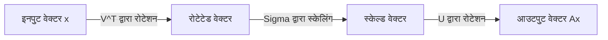
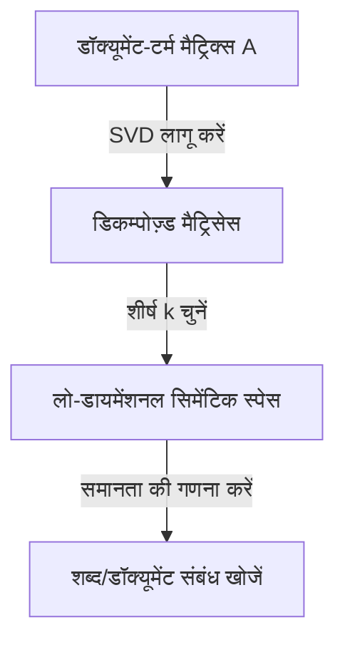

रैखिक बीजगणित में सबसे महत्वपूर्ण और शक्तिशाली उपकरणों में से एक **सिंगुलर वैल्यू डिकम्पोज़िशन** (SVD) है। यह तकनीक, जो किसी भी मैट्रिक्स को मूलभूत ऑपरेशनों में तोड़ सकती है, आधुनिक तकनीकों जैसे कि डेटा साइंस, मशीन लर्निंग और इमेज प्रोसेसिंग के मूल में है।

इस लेख में, हम SVD को इसके गणितीय परिभाषा से लेकर इसके ज्यामितीय अर्थ, और अंत में डेटा कम्प्रेशन और AI में इसके व्यावहारिक अनुप्रयोगों तक विस्तार से समझाएंगे।

## 1. SVD की गणितीय परिभाषा

किसी भी $m \times n$ वास्तविक मैट्रिक्स $A$ को निम्नलिखित तीन मैट्रिसेस के गुणनफल में तोड़ा जा सकता है:

$$A = U \Sigma V^T \quad (\text{मैट्रिक्स का सिंगुलर वैल्यू डिकम्पोज़िशन})$$

यहाँ, प्रत्येक मैट्रिक्स के निम्नलिखित गुण हैं:

- $U$ एक $m \times m$ ऑर्थोगोनल मैट्रिक्स है। इसके कॉलम वेक्टर्स को **लेफ्ट सिंगुलर वेक्टर्स** कहा जाता है।
- $\Sigma$ एक $m \times n$ विकर्ण मैट्रिक्स (diagonal matrix) है। विकर्ण तत्वों $\sigma_i$ को **सिंगुलर वैल्यूज़** कहा जाता है, जिन्हें आमतौर पर अवरोही क्रम $\sigma_1 \ge \sigma_2 \ge \dots \ge 0$ में व्यवस्थित किया जाता है।
- $V^T$, $n \times n$ ऑर्थोगोनल मैट्रिक्स $V$ का ट्रांसपोज़ है। $V$ के कॉलम वेक्टर्स को **राइट सिंगुलर वेक्टर्स** कहा जाता है।

ऑर्थोगोनल मैट्रिसेस के गुण के रूप में, $U^T U = I$ और $V^T V = I$ लागू होता है। यह SVD की सबसे बड़ी ताकत है, क्योंकि यह एक जटिल मैट्रिक्स $A$ को गणितीय रूप से प्रबंधनीय ऑर्थोगोनल और विकर्ण मैट्रिसेस में तोड़ने की अनुमति देता है।

## 2. ईजेनडिकम्पोज़िशन से अंतर

वर्गाकार मैट्रिसेस (square matrices) के लिए, ईजेनडिकम्पोज़िशन $A = P \[Lambda](https://kenji.blog/hi/p/serverless-architecture-aws-lambda-cold-start/) P^{-1}$ सर्वविदित है। हालाँकि, इस डिकम्पोज़िशन की निम्नलिखित सीमाएँ हैं:
- इसे केवल वर्गाकार मैट्रिसेस ($n \times n$) पर लागू किया जा सकता है।
- भले ही यह एक वर्गाकार मैट्रिक्स हो, इसे हमेशा डायगोनलाइज़ नहीं किया जा सकता है।

दूसरी ओर, **सिंगुलर वैल्यू डिकम्पोज़िशन** किसी भी मनमाने $m \times n$ मैट्रिक्स के लिए हमेशा मौजूद होता है, भले ही वह वर्गाकार न हो। यही एक कारण है कि डेटा विश्लेषण में SVD अत्यंत उपयोगी है।

## 3. ज्यामितीय अंतर्ज्ञान: रोटेशन और स्केलिंग

SVD के सबसे सुंदर पहलुओं में से ক্যাম ज्यामितीय व्याख्या है। इसका अर्थ है कि किसी भी रैखिक परिवर्तन $A$ को निम्नलिखित तीन सरल चरणों में तोड़ा जा सकता है।



1. **$V^T$ द्वारा रोटेशन** : ऑर्थोगोनल ट्रांसफॉर्मेशन का उपयोग करके वेक्टर को रोटेट करता है।
2. **$\Sigma$ द्वारा स्केलिंग** : सिंगुलर वैल्यू $\sigma_i$ के फैक्टर द्वारा प्रत्येक कोऑर्डिनेट अक्ष के साथ वेक्टर को खींचता या सिकोड़ता है।
3. **$U$ द्वारा रोटेशन** : अंत में, ट्रांसफॉर्म किए गए स्थान में वेक्टर को फिर से रोटेट करता है।

दूसरे शब्दों में, कोई ट्रांसफॉर्मेशन कितना भी जटिल क्यों न लगे, इसे मूल रूप से "रोटेट, स्केल, और फिर से रोटेट" की प्रक्रिया में घटाया जा सकता है।

## 4. लो-रैंक एप्रोक्सिमेशन (एकर्ट-यंग-मिर्स्की प्रमेय)

SVD का सबसे बड़ा अनुप्रयोग **लो-रैंक एप्रोक्सिमेशन** है। चूँकि मैट्रिक्स $A$ के सिंगुलर वैल्यूज़ अवरोही क्रम में व्यवस्थित होते हैं, छोटे सिंगुलर वैल्यूज़ को शोर या महत्वहीन जानकारी का प्रतिनिधित्व करने वाला माना जा सकता है।

केवल शीर्ष $k$ सिंगुलर वैल्यूज़ और उनके संबंधित सिंगुलर वेक्टर्स को निकालकर, हम रैंक-$k$ का मैट्रिक्स $A_k$ बना सकते हैं जो मूल मैट्रिक्स $A$ का अनुमान लगाता है।

$$A \approx A_k = U_k \Sigma_k V_k^T \quad (\text{रैंक } k \text{ का इष्टतम एप्रोक्सिमेशन})$$

एकर्ट-यंग-मिर्स्की प्रमेय के अनुसार, यह $A_k$ इष्टतम एप्रोक्सिमेशन मैट्रिक्स है जो मूल मैट्रिक्स $A$ के साथ त्रुटि को कम करता है।

## 5. पायथन में अनुप्रयोग उदाहरण 1: इमेज कम्प्रेशन

एक छवि को पिक्सेल मानों के मैट्रिक्स के रूप में दर्शाया जा सकता है। SVD का उपयोग करके लो-रैंक एप्रोक्सिमेशन निष्पादित करके, हम दृश्य गुणवत्ता बनाए रखते हुए डेटा आकार को काफी कम कर सकते हैं।

```python
import numpy as np
import matplotlib.pyplot as plt
from skimage import data
from skimage.color import rgb2gray

# छवि लोड करें और ग्रेस्केल में बदलें
image = rgb2gray(data.astronaut())

# सिंगुलर वैल्यू डिकम्पोज़िशन करें
U, S, VT = np.linalg.svd(image, full_matrices=False)

# शीर्ष k सिंगुलर वैल्यूज़ का उपयोग करके छवि को संपीड़ित करें
k = 50
compressed_image = np.dot(U[:, :k], np.dot(np.diag(S[:k]), VT[:k, :]))

# मूल और संपीड़ित छवि प्रदर्शित करें
plt.figure(figsize=(10, 5))
plt.subplot(1, 2, 1)
plt.title("Original Image")
plt.imshow(image, cmap='gray')

plt.subplot(1, 2, 2)
plt.title(f"Compressed Image (k={k})")
plt.imshow(compressed_image, cmap='gray')
plt.show()
```

इस कोड में, हम मूल हजारों सिंगुलर वैल्यूज़ में से केवल 50 का उपयोग करते हैं, लेकिन छवि की मुख्य विशेषताएं दृढ़ता से संरक्षित रहती हैं।

## 6. अनुप्रयोग उदाहरण 2: लेटेंट सिमेंटिक एनालिसिस (LSA)

SVD का उपयोग नेचुरल लैंग्वेज प्रोसेसिंग (NLP) के क्षेत्र में **लेटेंट सिमेंटिक एनालिसिस** (LSA) के रूप में भी किया जाता है।



यहाँ, SVD को एक मैट्रिक्स पर लागू किया जाता है जहाँ पंक्तियाँ शब्दों का और कॉलम डॉक्यूमेंट्स का प्रतिनिधित्व करते हैं। यह हमें केवल सतही मिलानों के बजाय शब्दों के पीछे "छिपे विषयों" (latent topics) को पकड़ने की अनुमति देता है।

## 7. मूर-पेनरोज़ स्यूडोइन्वर्स

रैखिक समीकरणों की प्रणाली का समाधान ढूंढते समय SVD भी सक्रिय होता है। भले ही मैट्रिक्स $A$ वर्गाकार मैट्रिक्स न हो, हम **मूर-पेनरोज़ स्यूडोइन्वर्स** $A^+$ की गणना करके लीस्ट स्क्वायर्स समाधान प्राप्त कर सकते हैं।

$$A^+ = V \Sigma^+ U^T \quad (\text{स्यूडोइन्वर्स की गणना})$$

यह मशीन लर्निंग में लीनियर रिग्रेशन के लिए स्थिर रूप से समाधान खोजने को संभव बनाता है।

## 8. निष्कर्ष

**सिंगुलर वैल्यू डिकम्पोज़िशन** (SVD) एक शक्तिशाली तकनीक है जो किसी भी मैट्रिक्स को तीन सरल तत्वों: "रोटेशन", "स्केलिंग" और "रोटेशन" में तोड़ देती है। SVD की गणितीय पृष्ठभूमि को समझना मशीन लर्निंग एल्गोरिदम को गहराई से समझने की दिशा में पहला कदम होगा।
