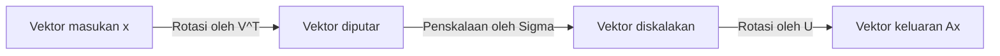
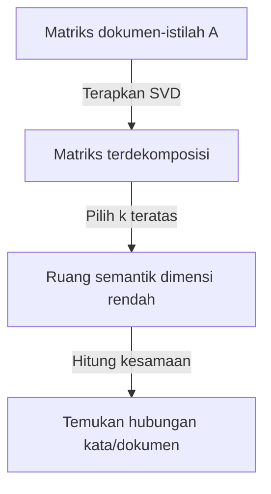

Salah satu alat paling penting dan kuat dalam aljabar linear adalah **Dekomposisi Nilai Singular** (SVD). Teknik ini, yang mampu menguraikan matriks apa pun menjadi operasi fundamental, mendasari inti teknologi modern seperti ilmu data, machine learning, dan pemrosesan gambar.

Dalam artikel ini, kami akan menjelaskan SVD secara menyeluruh, mulai dari definisi matematikanya hingga makna geometrisnya, dan terakhir aplikasi praktisnya dalam kompresi data dan AI.

## 1. Definisi Matematika SVD

Setiap matriks real $m \times n$, dilambangkan sebagai $A$, dapat diuraikan menjadi hasil kali tiga matriks sebagai berikut:

$$A = U \Sigma V^T \quad (\text{Dekomposisi Nilai Singular dari sebuah Matriks})$$

Di sini, setiap matriks memiliki properti berikut:

- $U$ adalah matriks ortogonal $m \times m$. Vektor kolomnya disebut **vektor singular kiri** .
- $\Sigma$ adalah matriks diagonal $m \times n$. Elemen diagonalnya $\sigma_i$ disebut **nilai singular** , yang biasanya diurutkan secara menurun $\sigma_1 \ge \sigma_2 \ge \dots \ge 0$.
- $V^T$ adalah transpos dari matriks ortogonal $V$ berukuran $n \times n$. Vektor kolom dari $V$ disebut **vektor singular kanan** .

Sebagai properti dari matriks ortogonal, berlaku $U^T U = I$ dan $V^T V = I$. Ini adalah kekuatan terbesar dari SVD, karena memungkinkan matriks kompleks $A$ diuraikan menjadi matriks ortogonal dan diagonal yang mudah ditangani secara matematika.

## 2. Perbedaan dari Dekomposisi Nilai Eigen

Untuk matriks persegi, dekomposisi nilai eigen $A = P \[Lambda](https://kenji.blog/id/p/serverless-architecture-aws-lambda-cold-start/) P^{-1}$ sangat dikenal. Namun, dekomposisi ini memiliki keterbatasan sebagai berikut:
- Hanya dapat diterapkan pada matriks persegi ($n \times n$).
- Sekalipun merupakan matriks persegi, belum tentu selalu dapat didiagonalisasi.

Di sisi lain, **Dekomposisi Nilai Singular** selalu ada untuk matriks $m \times n$ arbitrer apa pun, meskipun bukan persegi. Ini adalah salah satu alasan mengapa SVD sangat berguna dalam analisis data.

## 3. Intuisi Geometris: Rotasi dan Penskalaan

Salah satu aspek terindah dari SVD adalah interpretasi geometrisnya. SVD menyiratkan bahwa setiap transformasi linear $A$ dapat diuraikan menjadi tiga langkah sederhana berikut.



1. **Rotasi oleh $V^T$** : Memutar vektor menggunakan transformasi ortogonal.
2. **Penskalaan oleh $\Sigma$** : Meregangkan atau menyusutkan vektor di sepanjang setiap sumbu koordinat berdasarkan faktor dari nilai singular $\sigma_i$.
3. **Rotasi oleh $U$** : Terakhir, memutar vektor sekali lagi di ruang yang telah ditransformasi.

Dengan kata lain, tidak peduli seberapa kompleks sebuah transformasi terlihat, pada dasarnya ia dapat disederhanakan menjadi proses "putar, skalakan, dan putar lagi".

## 4. Aproksimasi Peringkat Rendah (Teorema Eckart-Young-Mirsky)

Aplikasi terbesar dari SVD adalah **aproksimasi peringkat rendah** . Karena nilai singular matriks $A$ diurutkan secara menurun, nilai singular yang kecil dapat dianggap sebagai representasi dari noise atau informasi yang tidak penting.

Dengan hanya mengekstrak $k$ nilai singular teratas dan vektor singular yang sesuai, kita dapat membuat matriks peringkat $k$, $A_k$, yang mendekati matriks aslinya $A$.

$$A \approx A_k = U_k \Sigma_k V_k^T \quad (\text{Aproksimasi optimal peringkat } k)$$

Menurut teorema Eckart-Young-Mirsky, $A_k$ ini adalah matriks aproksimasi optimal yang meminimalkan kesalahan dengan matriks asli $A$.

## 5. Contoh Aplikasi 1 di Python: Kompresi Gambar

Sebuah gambar dapat direpresentasikan sebagai matriks nilai piksel. Dengan melakukan aproksimasi peringkat rendah menggunakan SVD, kita dapat mengurangi ukuran data secara signifikan dengan tetap mempertahankan kualitas visual.

```python
import numpy as np
import matplotlib.pyplot as plt
from skimage import data
from skimage.color import rgb2gray

# Muat gambar dan ubah ke grayscale
image = rgb2gray(data.astronaut())

# Lakukan dekomposisi nilai singular
U, S, VT = np.linalg.svd(image, full_matrices=False)

# Kompres gambar menggunakan k nilai singular teratas
k = 50
compressed_image = np.dot(U[:, :k], np.dot(np.diag(S[:k]), VT[:k, :]))

# Tampilkan gambar asli dan terkompresi
plt.figure(figsize=(10, 5))
plt.subplot(1, 2, 1)
plt.title("Original Image")
plt.imshow(image, cmap='gray')

plt.subplot(1, 2, 2)
plt.title(f"Compressed Image (k={k})")
plt.imshow(compressed_image, cmap='gray')
plt.show()
```

Dalam kode ini, kita hanya menggunakan 50 dari ribuan nilai singular asli, namun fitur-fitur utama gambar tetap dipertahankan dengan baik.

## 6. Contoh Aplikasi 2: Analisis Semantik Laten (LSA)

SVD juga digunakan di bidang Pemrosesan Bahasa Alami (NLP) sebagai **Analisis Semantik Laten** (LSA).



Di sini, SVD diterapkan pada matriks di mana baris mewakili kata dan kolom mewakili dokumen. Ini memungkinkan kita menangkap "topik laten" di balik kata-kata, bukan sekadar kecocokan di permukaan.

## 7. Invers Semu Moore-Penrose

SVD juga aktif ketika mencari solusi dari sistem persamaan linear. Sekalipun matriks $A$ bukanlah matriks persegi, kita bisa mendapatkan solusi kuadrat terkecil dengan menghitung **invers semu Moore-Penrose** $A^+$.

$$A^+ = V \Sigma^+ U^T \quad (\text{Perhitungan invers semu})$$

Ini memungkinkan untuk menemukan solusi secara stabil bagi regresi linear dalam machine learning.

## 8. Kesimpulan

**Dekomposisi Nilai Singular** (SVD) adalah teknik kuat yang menguraikan matriks apa pun menjadi tiga elemen sederhana: "rotasi", "penskalaan", dan "rotasi". Memahami latar belakang matematika dari SVD akan menjadi langkah pertama untuk memahami algoritma machine learning secara mendalam.
