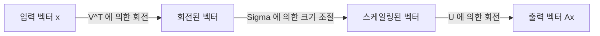
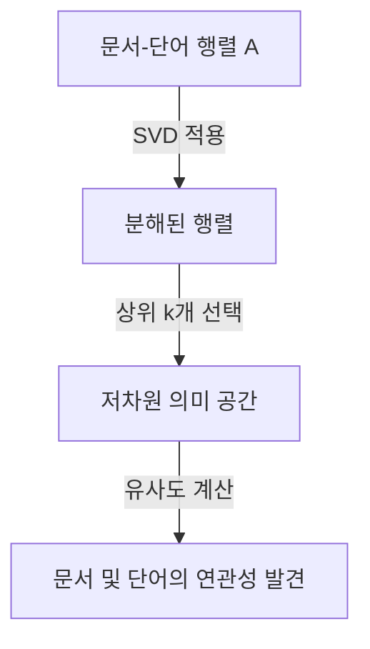

선형대수학에서 가장 중요하고 강력한 도구 중 하나는 **특이값 분해** (Singular Value Decomposition, 줄여서 SVD)입니다. 임의의 행렬을 기본적인 조작으로 분해할 수 있는 이 기법은 데이터 과학, 머신러닝, 이미지 처리 등 현대 기술의 핵심을 뒷받침합니다.

본 기사에서는 SVD의 수학적 정의부터 시작하여 기하학적 의미, 그리고 실제 데이터 압축 및 AI로의 응용 사례까지 자세히 설명합니다.

## 1. 특이값 분해(SVD)의 수학적 정의

임의의 $m \times n$ 실수 행렬 $A$는 다음과 같이 세 행렬의 곱으로 분해될 수 있습니다.

$$A = U \Sigma V^T \quad (\text{행렬의 특이값 분해})$$

여기서 각 행렬은 다음과 같은 성질을 갖습니다.

- $U$는 $m \times m$의 직교행렬입니다. 그 열벡터는 **좌특이벡터** 라고 불립니다.
- $\Sigma$는 $m \times n$의 대각행렬입니다. 대각성분 $\sigma_i$는 **특이값** 이라 불리며, 일반적으로 $\sigma_1 \ge \sigma_2 \ge \dots \ge 0$과 같이 내림차순으로 정렬됩니다.
- $V^T$는 $n \times n$ 직교행렬 $V$의 전치행렬입니다. $V$의 열벡터는 **우특이벡터** 라고 불립니다.

직교행렬의 성질에 따라 $U^T U = I$ 및 $V^T V = I$가 성립합니다. 이것이 SVD의 가장 큰 장점인데, 복잡한 행렬 $A$를 수학적으로 다루기 쉬운 직교행렬과 대각행렬로 분해할 수 있기 때문입니다.

## 2. 고유값 분해와의 차이점

정방행렬에 대해서는 고유값 분해 $A = P \Lambda P^{-1}$가 잘 알려져 있습니다. 하지만 고유값 분해는 다음과 같은 한계가 있습니다.
- 행렬이 정방행렬($n \times n$)이어야만 적용할 수 있습니다.
- 정방행렬이라 할지라도 항상 대각화가 가능한 것은 아닙니다.

반면, **특이값 분해** 는 정방행렬이 아닌 $m \times n$의 임의의 행렬에 대해서도 항상 존재합니다. 이것이 데이터 분석에서 SVD가 매우 유용한 이유 중 하나입니다.

## 3. 기하학적 직관: 회전과 크기 조절

SVD의 가장 아름다운 측면 중 하나는 그 기하학적 해석입니다. 임의의 선형 변환 $A$는 다음의 세 가지 간단한 단계로 분해될 수 있음을 의미합니다.



1. **$V^T$에 의한 회전** : 벡터를 직교 변환을 통해 회전시킵니다.
2. **$\Sigma$에 의한 크기 조절** : 각 좌표축을 따라 특이값 $\sigma_i$의 배율만큼 벡터를 늘리거나 줄입니다.
3. **$U$에 의한 회전** : 마지막으로, 변환된 공간에서 다시 벡터를 회전시킵니다.

즉, 아무리 복잡해 보이는 변환이라 할지라도 기본적으로 "회전하고, 늘리고, 다시 회전하는" 과정으로 환원될 수 있는 것입니다.

## 4. 저랭크 근사 (Eckart-Young-Mirsky 정리)

SVD의 가장 큰 응용 사례는 **저랭크 근사** 입니다. 행렬 $A$의 특이값은 내림차순으로 정렬되어 있으므로, 작은 특이값은 노이즈나 중요하지 않은 정보를 나타낸다고 볼 수 있습니다.

상위 $k$개의 특이값과 그에 대응하는 특이벡터만을 추출함으로써, 원래 행렬 $A$를 근사하는 랭크 $k$의 행렬 $A_k$를 만들 수 있습니다.

$$A \approx A_k = U_k \Sigma_k V_k^T \quad (\text{랭크 } k \text{ 의 최적 근사})$$

Eckart-Young-Mirsky 정리에 따르면, 이 $A_k$는 원래 행렬 $A$와의 오차를 최소화하는 최적의 근사 행렬이 됩니다.

## 5. Python 응용 사례 1: 이미지 압축

이미지는 픽셀 값들이 나열된 행렬로 표현할 수 있습니다. SVD를 사용해 저랭크 근사를 수행하면, 시각적인 품질을 유지하면서 데이터 크기를 대폭 압축할 수 있습니다.

```python
import numpy as np
import matplotlib.pyplot as plt
from skimage import data
from skimage.color import rgb2gray

# 이미지 불러오기 및 그레이스케일 변환
image = rgb2gray(data.astronaut())

# 특이값 분해 실행
U, S, VT = np.linalg.svd(image, full_matrices=False)

# 상위 k개의 특이값을 사용하여 이미지 압축
k = 50
compressed_image = np.dot(U[:, :k], np.dot(np.diag(S[:k]), VT[:k, :]))

# 원본 이미지와 압축된 이미지를 비교하여 표시
plt.figure(figsize=(10, 5))
plt.subplot(1, 2, 1)
plt.title("Original Image")
plt.imshow(image, cmap='gray')

plt.subplot(1, 2, 2)
plt.title(f"Compressed Image (k={k})")
plt.imshow(compressed_image, cmap='gray')
plt.show()
```

이 코드에서는 원래 수천 개의 특이값 중 불과 50개만을 사용했지만, 이미지의 주요 특징은 확실하게 유지되고 있습니다.

## 6. 응용 사례 2: 자연어 처리에서의 잠재 의미 분석 (LSA)

SVD는 자연어 처리 분야에서도 **잠재 의미 분석** (Latent Semantic Analysis, 줄여서 LSA)으로 사용됩니다.



여기서는 행이 단어, 열이 문서를 나타내는 행렬에 대해 SVD를 적용합니다. 이를 통해 단어의 표면적인 일치뿐만 아니라 배후에 있는 "잠재적인 주제"를 포착할 수 있습니다.

## 7. 무어-펜로즈 유사역행렬

SVD는 연립일차방정식의 해를 구할 때도 활약합니다. 행렬 $A$가 정방행렬이 아닌 경우에도, **무어-펜로즈 유사역행렬** $A^+$를 계산함으로써 최소제곱해를 얻을 수 있습니다.

$$A^+ = V \Sigma^+ U^T \quad (\text{유사역행렬의 계산})$$

이를 통해 머신러닝에서의 선형 회귀 해를 안정적으로 구하는 것이 가능해집니다.

## 8. 요약

**특이값 분해** (SVD)는 임의의 행렬을 "회전", "크기 조절", "회전"이라는 3가지 단순한 요소로 분해하는 강력한 기법입니다. SVD의 수학적 배경을 이해하는 것은 머신러닝 알고리즘을 깊이 이해하기 위한 첫걸음이 될 것입니다.
