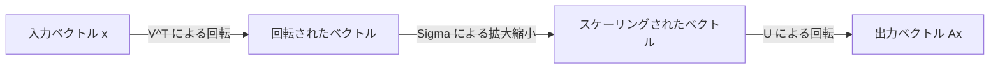
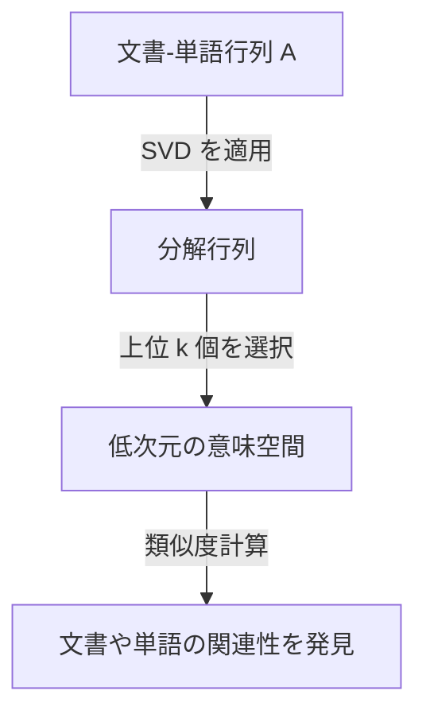

線形代数において、最も重要で強力なツールの1つが **特異値分解** (Singular Value Decomposition, 略して SVD) です。あらゆる行列を基本的な操作に分解できるこの手法は、データサイエンス、機械学習、画像処理など、現代の技術の根幹を支えています。

本記事では、SVD の数学的な定義から始まり、その幾何学的な意味、そして実際の[データ圧縮](https://kenji.blog/p/information-theory-shannon-entropy/)やAIへの応用例まで、詳細に解説します。

## 1. [特異値分解 (SVD)](https://kenji.blog/p/singular-value-decomposition/) の数学的定義

任意の $m \times n$ の実行列 $A$ は、次のように3つの行列の積に分解することができます。

$$A = U \Sigma V^T \quad (\text{行列の特異値分解})$$

ここで、それぞれの行列は以下の性質を持っています。

- $U$ は $m \times m$ の直交行列です。その列ベクトルは **左特異ベクトル** と呼ばれます。
- $\Sigma$ は $m \times n$ の対角行列です。対角成分 $\sigma_i$ は **特異値** と呼ばれ、通常 $\sigma_1 \ge \sigma_2 \ge \dots \ge 0$ と降順に並べられます。
- $V^T$ は $n \times n$ の直交行列 $V$ の転置行列です。$V$ の列ベクトルは **右特異ベクトル** と呼ばれます。

直交行列の性質として、$U^T U = I$ および $V^T V = I$ が成り立ちます。これにより、複雑な行列 $A$ を、数学的に扱いやすい直交行列と対角行列に分解できるのが SVD の最大の強みです。

## 2. 固有値分解との違い

正方行列に対しては、固有値分解 $A = P \[Lambda](https://kenji.blog/p/serverless-architecture-aws-lambda-cold-start/) P^{-1}$ がよく知られています。しかし、固有値分解は以下の制限があります。
- 行列が正方行列（$n \times n$）でなければ適用できない。
- 正方行列であっても、常に対角化できるとは限らない。

一方で、 **特異値分解** は、正方行列でない $m \times n$ の任意の行列に対しても常に存在します。これが、データ分析において SVD が極めて有用である理由の1つです。

## 3. 幾何学的な直感：回転と拡大縮小

SVD の最も美しい側面の1つは、その幾何学的な解釈です。任意の線形変換 $A$ は、次の3つの単純なステップに分解できることを意味しています。



1. **$V^T$ による回転** ：ベクトルを直交変換により回転させます。
2. **$\Sigma$ による拡大縮小** ：各座標軸に沿って、特異値 $\sigma_i$ の倍率で引き伸ばし、または縮小します。
3. **$U$ による回転** ：最後に、変換された空間で再びベクトルを回転させます。

つまり、どんなに複雑に見える変換であっても、基本的には「回転して、引き伸ばして、もう一度回転する」というプロセスに還元できるのです。

## 4. 低ランク近似 (Eckart-Young-Mirskyの定理)

SVD の最大の応用例は **低ランク近似** です。行列 $A$ の特異値は降順に並んでいるため、小さな特異値はノイズや重要でない情報を表していると考えることができます。

上位 $k$ 個の特異値と、それに対応する特異ベクトルだけを取り出すことで、元の行列 $A$ を近似するランク $k$ の行列 $A_k$ を作ることができます。

$$A \approx A_k = U_k \Sigma_k V_k^T \quad (\text{ランク} k \text{の最適近似})$$

Eckart-Young-Mirsky の定理によれば、この $A_k$ は、元の行列 $A$ との誤差を最小にする最適な近似行列となります。

## 5. Pythonによる応用例1：画像圧縮

画像はピクセルの値が並んだ行列として表現できます。SVD を使って低ランク近似を行うことで、視覚的な品質を保ちながらデータサイズを大幅に圧縮できます。

```python
import numpy as np
import matplotlib.pyplot as plt
from skimage import data
from skimage.color import rgb2gray

# 画像の読み込みとグレースケール化
image = rgb2gray(data.astronaut())

# 特異値分解の実行
U, S, VT = np.linalg.svd(image, full_matrices=False)

# 上位 k 個の特異値を使用して画像を圧縮
k = 50
compressed_image = np.dot(U[:, :k], np.dot(np.diag(S[:k]), VT[:k, :]))

# 元の画像と圧縮された画像を比較して表示
plt.figure(figsize=(10, 5))
plt.subplot(1, 2, 1)
plt.title("Original Image")
plt.imshow(image, cmap='gray')

plt.subplot(1, 2, 2)
plt.title(f"Compressed Image (k={k})")
plt.imshow(compressed_image, cmap='gray')
plt.show()
```

このコードでは、元の数千の特異値のうち、わずか 50 個しか使用していませんが、画像の主要な特徴はしっかりと保持されています。

## 6. 応用例2：自然言語処理における潜在的意味解析 (LSA)

SVD は、自然言語処理の分野でも **潜在的意味解析** (Latent Semantic Analysis, 略して LSA) として使われます。



ここでは、行が単語、列が文書を表す行列に対して SVD を適用します。これにより、単語の表面的な一致だけでなく、背後にある「潜在的なトピック」を捉えることができます。

## 7. ムーア・ペンローズの擬似逆行列

SVD は、連立一次方程式の解を求める際にも活躍します。行列 $A$ が正方行列でない場合でも、 **ムーア・ペンローズの擬似逆行列** $A^+$ を計算することで、最小二乗解を得ることができます。

$$A^+ = V \Sigma^+ U^T \quad (\text{擬似逆行列の計算})$$

これにより、機械学習における線形回帰の解を安定して求めることが可能になります。

## 8. まとめ

**特異値分解** (SVD) は、あらゆる行列を「回転」「拡大縮小」「回転」の 3 つのシンプルな要素に分解する強力な手法です。SVD の数学的背景を理解することは、機械学習アルゴリズムを深く理解するための第一歩となるでしょう。
