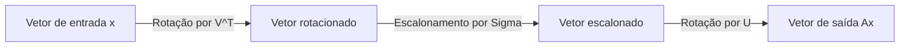
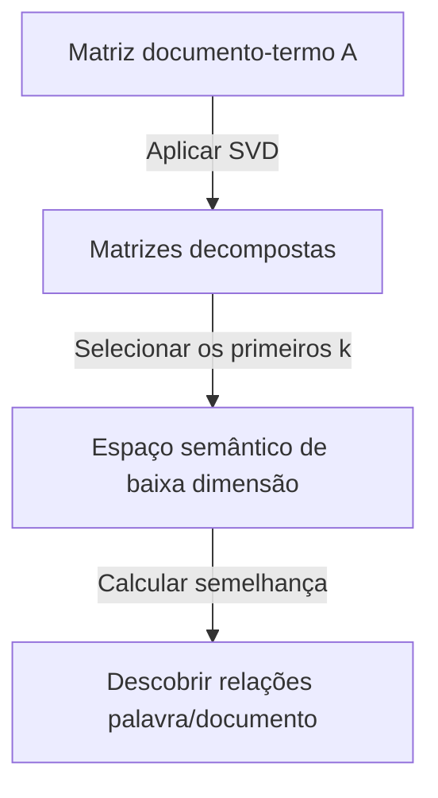

Uma das ferramentas mais importantes e poderosas na álgebra linear é a **Decomposição em Valores Singulares** (SVD). Essa técnica, que pode decompor qualquer matriz em operações fundamentais, sustenta o núcleo das tecnologias modernas, como ciência de dados, machine learning e processamento de imagens.

Neste artigo, explicaremos a SVD em detalhes, começando por sua definição matemática até seu significado geométrico e, finalmente, suas aplicações práticas na compressão de dados e IA.

## 1. Definição Matemática da SVD

Qualquer matriz real $m \times n$, denotada como $A$, pode ser decomposta no produto de três matrizes da seguinte forma:

$$A = U \Sigma V^T \quad (\text{Decomposição em Valores Singulares da matriz})$$

Aqui, cada matriz tem as seguintes propriedades:

- $U$ é uma matriz ortogonal $m \times m$. Seus vetores coluna são chamados de **vetores singulares esquerdos** .
- $\Sigma$ é uma matriz diagonal $m \times n$. Os elementos diagonais $\sigma_i$ são chamados de **valores singulares** , geralmente classificados em ordem decrescente $\sigma_1 \ge \sigma_2 \ge \dots \ge 0$.
- $V^T$ é a transposta de uma matriz ortogonal $V$ de $n \times n$. Os vetores coluna de $V$ são chamados de **vetores singulares direitos** .

Como propriedade de matrizes ortogonais, $U^T U = I$ e $V^T V = I$ se mantêm. Essa é a maior força da SVD, pois permite que uma matriz complexa $A$ seja decomposta em matrizes ortogonais e diagonais que são matematicamente fáceis de manusear.

## 2. Diferença para a Decomposição de Autovalores

Para matrizes quadradas, a decomposição de autovalores $A = P \[Lambda](https://kenji.blog/pt/p/serverless-architecture-aws-lambda-cold-start/) P^{-1}$ é bem conhecida. No entanto, essa decomposição tem as seguintes limitações:
- Ela só pode ser aplicada a matrizes quadradas ($n \times n$).
- Mesmo que seja uma matriz quadrada, nem sempre é diagonalizável.

Por outro lado, a **Decomposição em Valores Singulares** sempre existe para qualquer matriz $m \times n$, mesmo que não seja quadrada. Essa é uma das razões pelas quais a SVD é extremamente útil na análise de dados.

## 3. Intuição Geométrica: Rotação e Escalonamento

Um dos aspectos mais bonitos da SVD é sua interpretação geométrica. Ela implica que qualquer transformação linear $A$ pode ser decomposta nas três etapas simples a seguir.



1. **Rotação por $V^T$** : Rotaciona o vetor usando uma transformação ortogonal.
2. **Escalonamento por $\Sigma$** : Estica ou encolhe o vetor ao longo de cada eixo de coordenada pelo fator do valor singular $\sigma_i$.
3. **Rotação por $U$** : Por fim, rotaciona o vetor novamente no espaço transformado.

Em outras palavras, por mais complexa que pareça uma transformação, ela basicamente pode ser reduzida a um processo de "rotacionar, escalonar e rotacionar novamente".

## 4. Aproximação de Baixo Posto (Teorema de Eckart-Young-Mirsky)

A maior aplicação da SVD é a **aproximação de baixo posto** . Como os valores singulares de uma matriz $A$ são classificados em ordem decrescente, os valores singulares pequenos podem ser considerados como representantes de ruído ou de informações sem importância.

Ao extrair apenas os primeiros $k$ valores singulares e seus vetores singulares correspondentes, podemos criar uma matriz de posto $k$, $A_k$, que aproxima a matriz original $A$.

$$A \approx A_k = U_k \Sigma_k V_k^T \quad (\text{Aproximação ideal de posto } k)$$

De acordo com o teorema de Eckart-Young-Mirsky, essa $A_k$ é a matriz de aproximação ideal que minimiza o erro com a matriz original $A$.

## 5. Exemplo de Aplicação 1 em Python: Compressão de Imagens

Uma imagem pode ser representada como uma matriz de valores de pixels. Ao realizar a aproximação de baixo posto usando SVD, podemos reduzir significativamente o tamanho dos dados, mantendo a qualidade visual.

```python
import numpy as np
import matplotlib.pyplot as plt
from skimage import data
from skimage.color import rgb2gray

# Carregar imagem e converter para tons de cinza
image = rgb2gray(data.astronaut())

# Executar a decomposição em valores singulares
U, S, VT = np.linalg.svd(image, full_matrices=False)

# Comprimir a imagem usando os primeiros k valores singulares
k = 50
compressed_image = np.dot(U[:, :k], np.dot(np.diag(S[:k]), VT[:k, :]))

# Exibir a imagem original e a comprimida
plt.figure(figsize=(10, 5))
plt.subplot(1, 2, 1)
plt.title("Original Image")
plt.imshow(image, cmap='gray')

plt.subplot(1, 2, 2)
plt.title(f"Compressed Image (k={k})")
plt.imshow(compressed_image, cmap='gray')
plt.show()
```

Neste código, usamos apenas 50 de milhares de valores singulares originais, mas as principais características da imagem são firmemente preservadas.

## 6. Exemplo de Aplicação 2: Análise Semântica Latente (LSA)

A SVD também é usada no campo do Processamento de Linguagem Natural (NLP) como **Análise Semântica Latente** (LSA).



Aqui, a SVD é aplicada a uma matriz em que as linhas representam palavras e as colunas representam documentos. Isso nos permite capturar os "tópicos latentes" por trás das palavras, e não apenas correspondências superficiais.

## 7. Pseudoinversa de Moore-Penrose

A SVD também é útil ao encontrar a solução para um sistema de equações lineares. Mesmo que a matriz $A$ não seja uma matriz quadrada, podemos obter a solução dos mínimos quadrados calculando a **pseudoinversa de Moore-Penrose** $A^+$.

$$A^+ = V \Sigma^+ U^T \quad (\text{Cálculo da pseudoinversa})$$

Isso torna possível encontrar soluções de forma estável para regressão linear em machine learning.

## 8. Conclusão

A **Decomposição em Valores Singulares** (SVD) é uma técnica poderosa que decompõe qualquer matriz em três elementos simples: "rotação", "escalonamento" e "rotação". Compreender o contexto matemático da SVD será o primeiro passo para compreender profundamente os algoritmos de machine learning.
