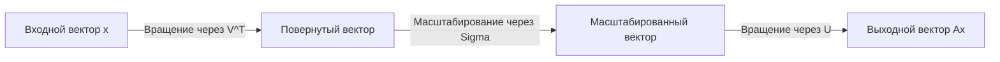
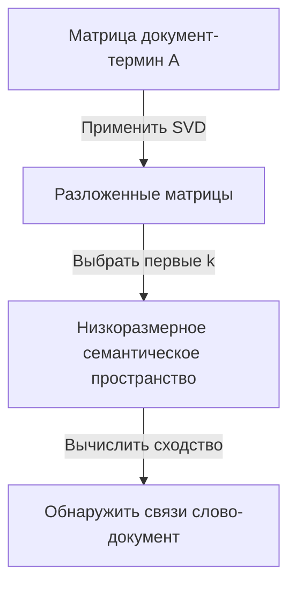

Одним из важнейших и мощнейших инструментов линейной алгебры является **Сингулярное разложение** (SVD). Этот метод, позволяющий разложить любую матрицу на базовые операции, лежит в основе таких современных технологий, как наука о данных, машинное обучение и обработка изображений.

В этой статье мы подробно объясним SVD, начиная с его математического определения, геометрического смысла и, наконец, заканчивая практическим применением в сжатии данных и ИИ.

## 1. Математическое определение SVD

Любую вещественную матрицу $m \times n$, обозначаемую как $A$, можно разложить в произведение трех матриц следующим образом:

$$A = U \Sigma V^T \quad (\text{Сингулярное разложение матрицы})$$

Здесь каждая матрица обладает следующими свойствами:

- $U$ — ортогональная матрица $m \times m$. Ее векторы-столбцы называются **левыми сингулярными векторами** .
- $\Sigma$ — диагональная матрица $m \times n$. Диагональные элементы $\sigma_i$ называются **сингулярными значениями** , которые обычно отсортированы по убыванию $\sigma_1 \ge \sigma_2 \ge \dots \ge 0$.
- $V^T$ — транспонированная ортогональная матрица $V$ размера $n \times n$. Векторы-столбцы матрицы $V$ называются **правыми сингулярными векторами** .

Как свойство ортогональных матриц выполняется $U^T U = I$ и $V^T V = I$. В этом заключается главная сила SVD: метод позволяет разложить сложную матрицу $A$ на математически управляемые ортогональные и диагональные матрицы.

## 2. Отличие от спектрального разложения

Для квадратных матриц хорошо известно разложение по собственным значениям $A = P \[Lambda](https://kenji.blog/ru/p/serverless-architecture-aws-lambda-cold-start/) P^{-1}$. Однако это разложение имеет следующие ограничения:
- Его можно применять только к квадратным матрицам ($n \times n$).
- Даже если это квадратная матрица, она не всегда диагонализируема.

С другой стороны, **Сингулярное разложение** всегда существует для любой произвольной матрицы $m \times n$, даже если она не является квадратной. Это одна из причин, почему SVD чрезвычайно полезно в анализе данных.

## 3. Геометрическая интуиция: вращение и масштабирование

Один из самых красивых аспектов SVD — его геометрическая интерпретация. Она означает, что любое линейное преобразование $A$ можно разложить на следующие три простых шага.



1. **Вращение через $V^T$** : Поворачивает вектор с использованием ортогонального преобразования.
2. **Масштабирование через $\Sigma$** : Растягивает или сжимает вектор вдоль каждой координатной оси на коэффициент сингулярного значения $\sigma_i$.
3. **Вращение через $U$** : Наконец, вектор снова поворачивается в преобразованном пространстве.

Другими словами, каким бы сложным ни казалось преобразование, в основе его можно свести к процессу «повернуть, масштабировать и снова повернуть».

## 4. Низкоранговая аппроксимация (Теорема Эккарта-Янга-Мирского)

Главное применение SVD — **низкоранговая аппроксимация** . Поскольку сингулярные значения матрицы $A$ отсортированы по убыванию, малые сингулярные значения можно рассматривать как шум или неважную информацию.

Извлекая только первые $k$ сингулярных значений и соответствующие им сингулярные векторы, мы можем создать матрицу ранга $k$, $A_k$, которая аппроксимирует исходную матрицу $A$.

$$A \approx A_k = U_k \Sigma_k V_k^T \quad (\text{Оптимальная аппроксимация ранга } k)$$

Согласно теореме Эккарта-Янга-Мирского, эта матрица $A_k$ является оптимальной матрицей аппроксимации, которая минимизирует ошибку с исходной матрицей $A$.

## 5. Пример применения 1 на Python: сжатие изображений

Изображение можно представить в виде матрицы значений пикселей. Выполняя низкоранговую аппроксимацию с помощью SVD, мы можем значительно уменьшить размер данных при сохранении визуального качества.

```python
import numpy as np
import matplotlib.pyplot as plt
from skimage import data
from skimage.color import rgb2gray

# Загрузить изображение и перевести в градации серого
image = rgb2gray(data.astronaut())

# Выполнить сингулярное разложение
U, S, VT = np.linalg.svd(image, full_matrices=False)

# Сжать изображение, используя первые k сингулярных значений
k = 50
compressed_image = np.dot(U[:, :k], np.dot(np.diag(S[:k]), VT[:k, :]))

# Показать исходное и сжатое изображения
plt.figure(figsize=(10, 5))
plt.subplot(1, 2, 1)
plt.title("Original Image")
plt.imshow(image, cmap='gray')

plt.subplot(1, 2, 2)
plt.title(f"Compressed Image (k={k})")
plt.imshow(compressed_image, cmap='gray')
plt.show()
```

В этом коде мы используем только 50 из тысяч исходных сингулярных значений, но основные особенности изображения надежно сохраняются.

## 6. Пример применения 2: Латентно-семантический анализ (LSA)

SVD также используется в области обработки естественного языка (NLP) как **Латентно-семантический анализ** (LSA).



Здесь SVD применяется к матрице, в которой строки представляют слова, а столбцы — документы. Это позволяет нам уловить «скрытые темы» за словами, а не только поверхностные совпадения.

## 7. Псевдообратная матрица Мура-Пенроуза

SVD также полезен при поиске решения системы линейных уравнений. Даже если матрица $A$ не является квадратной, мы можем получить решение методом наименьших квадратов, вычислив **псевдообратную матрицу Мура-Пенроуза** $A^+$.

$$A^+ = V \Sigma^+ U^T \quad (\text{Вычисление псевдообратной матрицы})$$

Это позволяет стабильно находить решения для линейной регрессии в машинном обучении.

## 8. Заключение

**Сингулярное разложение** (SVD) — это мощный метод, который раскладывает любую матрицу на три простых элемента: «вращение», «масштабирование» и «вращение». Понимание математических основ SVD станет первым шагом к глубокому пониманию алгоритмов машинного обучения.
