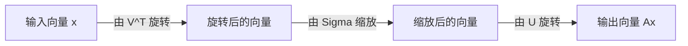
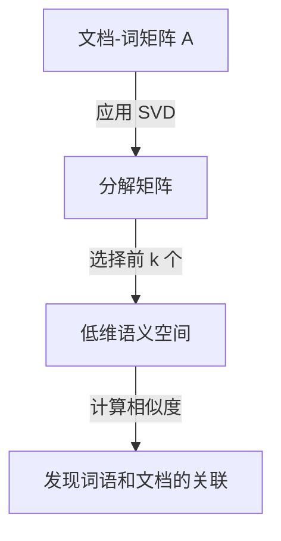

在线性代数中，最重要且最强大的工具之一就是 **奇异值分解** (Singular Value Decomposition，简称 SVD)。这项技术能够将任何矩阵分解为基本操作，支撑着数据科学、机器学习和图像处理等现代技术的核心。

本文将深入解析 SVD，从数学定义到几何意义，再到数据压缩和AI中的实际应用。

## 1. SVD的数学定义

任意 $m \times n$ 的实矩阵 $A$ 都可以分解为以下三个矩阵的乘积：

$$A = U \Sigma V^T \quad (\text{矩阵的奇异值分解})$$

这里，每个矩阵具有以下性质：

- $U$ 是 $m \times m$ 的正交矩阵。它的列向量被称为 **左奇异向量** 。
- $\Sigma$ 是 $m \times n$ 的对角矩阵。对角线上的元素 $\sigma_i$ 被称为 **奇异值** ，通常按降序排列 $\sigma_1 \ge \sigma_2 \ge \dots \ge 0$。
- $V^T$ 是 $n \times n$ 正交矩阵 $V$ 的转置。$V$ 的列向量被称为 **右奇异向量** 。

正交矩阵的性质满足 $U^T U = I$ 和 $V^T V = I$。这是 SVD 最大的优势，它能将复杂的矩阵 $A$ 分解为在数学上易于处理的正交矩阵和对角矩阵。

## 2. 与特征值分解的区别

对于方阵，特征值分解 $A = P \[Lambda](https://kenji.blog/zh-cn/p/serverless-architecture-aws-lambda-cold-start/) P^{-1}$ 广为人知。然而，特征值分解有以下局限性：
- 只能应用于方阵（$n \times n$）。
- 即使是方阵，也不总是可对角化的。

另一方面， **奇异值分解** 始终存在于任何 $m \times n$ 矩阵中，即使它不是方阵。这也是 SVD 在数据分析中极为有用的原因之一。

## 3. 几何直观：旋转与缩放

SVD 最优美的方面之一是其几何解释。它意味着任何线性变换 $A$ 都可以分解为以下三个简单的步骤。



1. **由 $V^T$ 旋转** ：通过正交变换旋转向量。
2. **由 $\Sigma$ 缩放** ：沿着各个坐标轴，以奇异值 $\sigma_i$ 为倍数拉伸或压缩向量。
3. **由 $U$ 旋转** ：最后，在变换后的空间中再次旋转向量。

换句话说，无论变换看起来多么复杂，它基本上都可以还原为“旋转、缩放、再旋转”的过程。

## 4. 低秩近似 (Eckart-Young-Mirsky 定理)

SVD 最大的应用是 **低秩近似** 。由于矩阵 $A$ 的奇异值是按降序排列的，较小的奇异值可以被视为代表噪声或不重要的信息。

通过仅提取前 $k$ 个奇异值及其对应的奇异向量，我们可以创建一个秩为 $k$ 的矩阵 $A_k$ 来近似原始矩阵 $A$。

$$A \approx A_k = U_k \Sigma_k V_k^T \quad (\text{秩为 } k \text{ 的最优近似})$$

根据 Eckart-Young-Mirsky 定理，这个 $A_k$ 是使与原矩阵 $A$ 误差最小的最优近似矩阵。

## 5. Python应用示例1：图像压缩

图像可以表示为像素值的矩阵。通过使用 SVD 进行低秩近似，我们可以在保持视觉质量的同时显著减少数据大小。

```python
import numpy as np
import matplotlib.pyplot as plt
from skimage import data
from skimage.color import rgb2gray

# 加载图像并转换为灰度图
image = rgb2gray(data.astronaut())

# 执行奇异值分解
U, S, VT = np.linalg.svd(image, full_matrices=False)

# 使用前 k 个奇异值压缩图像
k = 50
compressed_image = np.dot(U[:, :k], np.dot(np.diag(S[:k]), VT[:k, :]))

# 对比显示原始图像和压缩图像
plt.figure(figsize=(10, 5))
plt.subplot(1, 2, 1)
plt.title("Original Image")
plt.imshow(image, cmap='gray')

plt.subplot(1, 2, 2)
plt.title(f"Compressed Image (k={k})")
plt.imshow(compressed_image, cmap='gray')
plt.show()
```

在这段代码中，我们仅使用了成千上万个原始奇异值中的 50 个，但图像的主要特征却得到了很好的保留。

## 6. 应用示例2：自然语言处理中的潜在语义分析 (LSA)

SVD 也在自然语言处理领域中作为 **潜在语义分析** (LSA) 被广泛应用。



在这里，SVD 应用于行代表单词、列代表文档的矩阵中。这使我们能够捕捉单词背后的“潜在主题”，而不仅仅是表面的匹配。

## 7. 摩尔-彭若斯伪逆矩阵

在求解线性方程组时，SVD 也发挥着重要作用。即使矩阵 $A$ 不是方阵，我们也可以通过计算 **摩尔-彭若斯伪逆矩阵** $A^+$ 来获得最小二乘解。

$$A^+ = V \Sigma^+ U^T \quad (\text{伪逆矩阵的计算})$$

这使得在机器学习中稳定地寻找线性回归的解成为可能。

## 8. 总结

**奇异值分解** (SVD) 是一种强大的技术，它将任何矩阵分解为“旋转”、“缩放”和“旋转”三个简单元素。理解 SVD 的数学背景将是深入理解机器学习算法的第一步。
