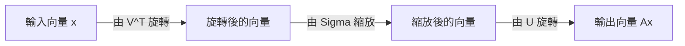
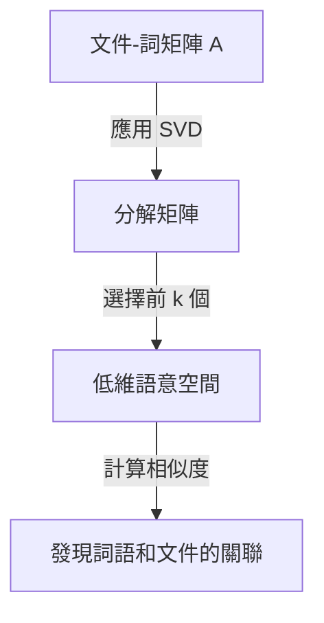

在線性代數中，最重要且最強大的工具之一就是 **奇異值分解** (Singular Value Decomposition，簡稱 SVD)。這項技術能夠將任何矩陣分解為基本操作，支撐著資料科學、機器學習和影像處理等現代技術的核心。

本文將深入解析 SVD，從數學定義到幾何意義，再到資料壓縮和AI中的實際應用。

## 1. SVD的數學定義

任意 $m \times n$ 的實矩陣 $A$ 都可以分解為以下三個矩陣的乘積：

$$A = U \Sigma V^T \quad (\text{矩陣的奇異值分解})$$

這裡，每個矩陣具有以下性質：

- $U$ 是 $m \times m$ 的正交矩陣。它的行向量被稱為 **左奇異向量** 。
- $\Sigma$ 是 $m \times n$ 的對角矩陣。對角線上的元素 $\sigma_i$ 被稱為 **奇異值** ，通常按降序排列 $\sigma_1 \ge \sigma_2 \ge \dots \ge 0$。
- $V^T$ 是 $n \times n$ 正交矩陣 $V$ 的轉置。$V$ 的行向量被稱為 **右奇異向量** 。

正交矩陣的性質滿足 $U^T U = I$ 和 $V^T V = I$。這是 SVD 最大的優勢，它能將複雜的矩陣 $A$ 分解為在數學上易於處理的正交矩陣和對角矩陣。

## 2. 與特徵值分解的區別

對於方陣，特徵值分解 $A = P \[Lambda](https://kenji.blog/zh-tw/p/serverless-architecture-aws-lambda-cold-start/) P^{-1}$ 廣為人知。然而，特徵值分解有以下侷限性：
- 只能應用於方陣（$n \times n$）。
- 即使是方陣，也不總是可對角化的。

另一方面， **奇異值分解** 始終存在於任何 $m \times n$ 矩陣中，即使它不是方陣。這也是 SVD 在資料分析中極為有用的原因之一。

## 3. 幾何直觀：旋轉與縮放

SVD 最優美的方面之一是其幾何解釋。它意味著任何線性轉換 $A$ 都可以分解為以下三個簡單的步驟。



1. **由 $V^T$ 旋轉** ：透過正交轉換旋轉向量。
2. **由 $\Sigma$ 縮放** ：沿著各個座標軸，以奇異值 $\sigma_i$ 為倍數拉伸或壓縮向量。
3. **由 $U$ 旋轉** ：最後，在轉換後的空間中再次旋轉向量。

換句話說，無論轉換看起來多麼複雜，它基本上都可以還原為「旋轉、縮放、再旋轉」的過程。

## 4. 低秩近似 (Eckart-Young-Mirsky 定理)

SVD 最大的應用是 **低秩近似** 。由於矩陣 $A$ 的奇異值是按降序排列的，較小的奇異值可以被視為代表雜訊或不重要的資訊。

透過僅提取前 $k$ 個奇異值及其對應的奇異向量，我們可以建立一個秩為 $k$ 的矩陣 $A_k$ 來近似原始矩陣 $A$。

$$A \approx A_k = U_k \Sigma_k V_k^T \quad (\text{秩為 } k \text{ 的最佳近似})$$

根據 Eckart-Young-Mirsky 定理，這個 $A_k$ 是使與原矩陣 $A$ 誤差最小的最佳近似矩陣。

## 5. Python應用範例1：影像壓縮

影像可以表示為像素值的矩陣。透過使用 SVD 進行低秩近似，我們可以在保持視覺品質的同時顯著減少資料大小。

```python
import numpy as np
import matplotlib.pyplot as plt
from skimage import data
from skimage.color import rgb2gray

# 載入影像並轉換為灰階圖
image = rgb2gray(data.astronaut())

# 執行奇異值分解
U, S, VT = np.linalg.svd(image, full_matrices=False)

# 使用前 k 個奇異值壓縮影像
k = 50
compressed_image = np.dot(U[:, :k], np.dot(np.diag(S[:k]), VT[:k, :]))

# 對比顯示原始影像和壓縮影像
plt.figure(figsize=(10, 5))
plt.subplot(1, 2, 1)
plt.title("Original Image")
plt.imshow(image, cmap='gray')

plt.subplot(1, 2, 2)
plt.title(f"Compressed Image (k={k})")
plt.imshow(compressed_image, cmap='gray')
plt.show()
```

在這段程式碼中，我們僅使用了成千上萬個原始奇異值中的 50 個，但影像的主要特徵卻得到了很好的保留。

## 6. 應用範例2：自然語言處理中的潛在語意分析 (LSA)

SVD 也在自然語言處理領域中作為 **潛在語意分析** (LSA) 被廣泛應用。



在這裡，SVD 應用於行代表單字、列代表文件的矩陣中。這使我們能夠捕捉單字背後的「潛在主題」，而不僅僅是表面的匹配。

## 7. 摩爾-彭若斯偽逆矩陣

在求解線性方程式組時，SVD 也發揮著重要作用。即使矩陣 $A$ 不是方陣，我們也可以透過計算 **摩爾-彭若斯偽逆矩陣** $A^+$ 來獲得最小平方解。

$$A^+ = V \Sigma^+ U^T \quad (\text{偽逆矩陣的計算})$$

這使得在機器學習中穩定地尋找線性迴歸的解成為可能。

## 8. 總結

**奇異值分解** (SVD) 是一種強大的技術，它將任何矩陣分解為「旋轉」、「縮放」和「旋轉」三個簡單元素。理解 SVD 的數學背景將是深入理解機器學習演算法的第一步。
