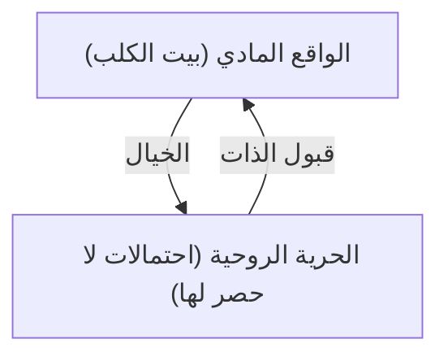

## 1. مقدمة: عمق بيناتس

القصة المصورة "بيناتس" لتشارلز م. شولز ليست مجرد قصة مصورة للأطفال. إنها تعبر ببراعة عن قلق حقبة الحرب الباردة، وعزلة المجتمع الأمريكي خلال النمو الاقتصادي السريع، والأسئلة الوجودية من خلال الحياة اليومية لكلب وأطفال. تحتوي كلمات سنوبي وتشارلي براون على فلسفة يجب أن نعود إليها عندما نواجه صعوبات في الحياة.

## 2. فلسفة سنوبي: قبول الذات والخيال

> "أنت تلعب بالبطاقات التي وُزعت لك... مهما كان معنى ذلك."

هذا أحد أشهر اقتباسات سنوبي. إنه ليس استسلامًا حتميًا، بل إعلانًا عن "قبول الذات" أقرب إلى الفلسفة الرواقية. في حين أنه يقبل كونه كلبًا، فإنه يستخدم خياله ليتحول إلى طيار بطل في الحرب العالمية الأولى أو روائي. إن موقفه المتمثل في الاستمتاع بالحرية الروحية (السماء اللانهائية) بينما تقيده قيود جسدية (فوق بيت الكلب الخاص به) يرسل رسالة قوية لنا نحن الذين نعيش في العالم الحديث.

## 3. تشارلي براون و"جماليات الهزيمة"

يخسر تشارلي براون دائمًا؛ تأكل الشجرة الآكلة للطائرات الورقية طائراته، ويخسر فريق البيسبول الخاص به باستمرار. ومع ذلك، فإنه لا يستسلم أبدًا. يذكرنا هذا الشكل بالتمرد ضد العبث في "أسطورة سيزيف" لألبير كامو. إن موقفه المتمثل في إيجاد معنى في فعل الاستمرار في المحاولة، بغض النظر عن النتائج، يشكك بهدوء في تعريف "النجاح" في مجتمع تنافسي.

## 4. الطب النفسي عند لوسي وبطانية الأمان عند لينوس

"مساعدة نفسية 5 سنتات". يبدو أن كشك لوسي للطب النفسي يسخر من طبيعة الرعاية في الرأسمالية الحديثة. من ناحية أخرى، تعد "بطانية الأمان" الخاصة بلينوس تصويرًا مثاليًا للكائن الانتقالي في علم النفس. لاحظ شولز بدفء سيكولوجية الأشخاص الذين يرغبون في التشبث بشيء ما في عصر التغييرات السريعة.

## 5. الخاتمة: الحقيقة العالمية التي تركها شولز

السبب وراء استمرار حب الناس لـ "بيناتس" لأكثر من نصف قرن هو أنه يؤكد "النقص البشري". لا يوجد بشر مثاليون؛ فالجميع يقلقون ويفشلون، ومع ذلك يستمرون في العيش. تمنحنا فلسفة سنوبي الشجاعة لقبول أنفسنا "كما نحن" والحكمة للتنقل في الحياة بروح الدعابة.
