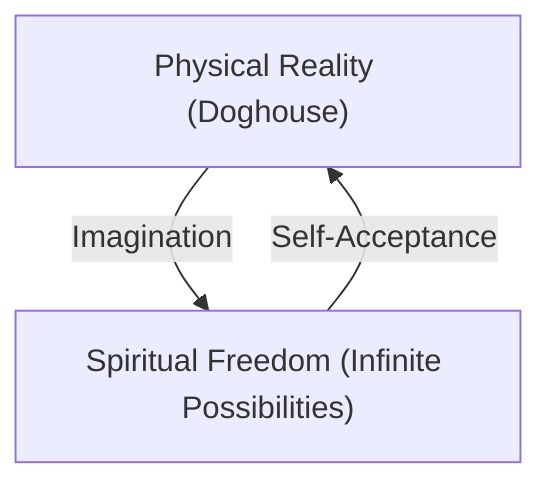

## 1. Introduction: The Depth of Peanuts

Charles M. Schulz's "Peanuts" is not just a comic strip for children. It masterfully expresses the anxieties of the Cold War era, the loneliness of American society during rapid economic growth, and existential questions through the daily lives of a dog and children. The words of Snoopy and Charlie Brown contain a philosophy we should return to when facing life's difficulties.

## 2. Snoopy's Philosophy: Self-Acceptance and Imagination

> "You play with the cards you're dealt... whatever that means."

This is one of Snoopy's most famous quotes. It is not a deterministic resignation, but a declaration of "self-acceptance" akin to Stoic philosophy. While accepting that he is a dog, he uses his imagination to transform into a WWI Flying Ace or a novelist. His attitude of enjoying spiritual freedom (the infinite sky) while bound by physical constraints (on top of his doghouse) throws a powerful message to us living in the modern world.

## 3. Charlie Brown and the "Aesthetics of Defeat"

Charlie Brown always loses; his kites are eaten by the Kite-Eating Tree, and his baseball team constantly loses. Yet, he never gives up. This figure is reminiscent of the rebellion against the absurd in Albert Camus's "The Myth of Sisyphus." His attitude of finding meaning in the act of continuing to try, regardless of the results, quietly questions the definition of "success" in a competitive society.

## 4. Lucy's Psychiatry and Linus's Security Blanket

"Psychiatric Help 5 Cents." Lucy's psychiatric booth seems to satirize the nature of care in modern capitalism. On the other hand, Linus's "security blanket" is a perfect depiction of a transitional object in psychology. Schulz warmly observed the psychology of people wanting to cling to something in an era of rapid change.

## 5. Conclusion: The Universal Truth Left by Schulz

The reason "Peanuts" has been loved for over half a century is that it affirms "human imperfection." There are no perfect humans; everyone worries, fails, and yet continues to live. Snoopy's philosophy gives us the courage to accept ourselves "as we are" and the wisdom to navigate life with humor.
