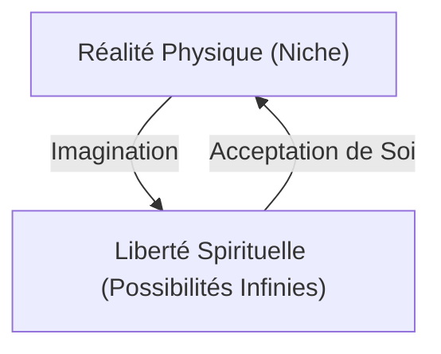

## 1. Introduction : La Profondeur de Peanuts

"Peanuts" de Charles M. Schulz n'est pas seulement une bande dessinée pour enfants. Elle exprime magistralement les angoisses de la guerre froide, la solitude de la société américaine lors de la croissance économique rapide et les questions existentielles à travers la vie quotidienne d'un chien et d'enfants. Les mots de Snoopy et Charlie Brown contiennent une philosophie à laquelle nous devrions revenir face aux difficultés de la vie.

## 2. La Philosophie de Snoopy : Acceptation de Soi et Imagination

> "On joue avec les cartes qu'on nous donne... quoi que ça veuille dire."

C'est l'une des citations les plus célèbres de Snoopy. Ce n'est pas une résignation déterministe, mais une déclaration d'"acceptation de soi" proche de la philosophie stoïcienne. Tout en acceptant qu'il est un chien, il utilise son imagination pour se transformer en as de l'aviation de la Première Guerre mondiale ou en romancier. Son attitude qui consiste à profiter de la liberté spirituelle (le ciel infini) tout en étant lié par des contraintes physiques (sur le toit de sa niche) lance un message puissant à nous qui vivons dans le monde moderne.

## 3. Charlie Brown et l'"Esthétique de la Défaite"

Charlie Brown perd toujours ; ses cerfs-volants sont mangés par l'Arbre Mangeur de Cerfs-volants, et son équipe de baseball perd constamment. Pourtant, il n'abandonne jamais. Cette figure rappelle la rébellion contre l'absurde dans "Le Mythe de Sisyphe" d'Albert Camus. Son attitude qui consiste à trouver un sens dans l'acte de continuer à essayer, quels que soient les résultats, remet doucement en question la définition du "succès" dans une société compétitive.

## 4. La Psychiatrie de Lucy et la Couverture de Sécurité de Linus

"Aide Psychiatrique 5 Cents." Le stand psychiatrique de Lucy semble faire la satire de la nature des soins dans le capitalisme moderne. D'autre part, la "couverture de sécurité" de Linus est une représentation parfaite d'un objet transitionnel en psychologie. Schulz a observé avec chaleur la psychologie des personnes voulant s'accrocher à quelque chose dans une époque de changements rapides.

## 5. Conclusion : La Vérité Universelle Laissée par Schulz

La raison pour laquelle "Peanuts" est aimé depuis plus d'un demi-siècle est qu'il affirme l'"imperfection humaine". Il n'y a pas d'humains parfaits ; tout le monde s'inquiète, échoue, et pourtant continue de vivre. La philosophie de Snoopy nous donne le courage de nous accepter "tels que nous sommes" et la sagesse de naviguer dans la vie avec humour.
