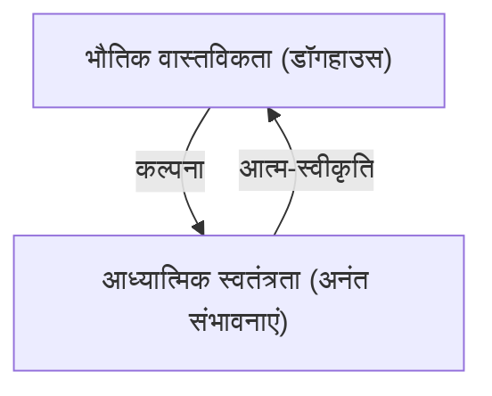

## 1. परिचय: पीनट्स की गहराई

चार्ल्स एम. शुल्ज़ का "पीनट्स" केवल बच्चों के लिए एक कॉमिक स्ट्रिप नहीं है। यह शीत युद्ध युग की चिंताओं, तीव्र आर्थिक विकास के दौरान अमेरिकी समाज के अकेलेपन और एक कुत्ते और बच्चों के दैनिक जीवन के माध्यम से अस्तित्व संबंधी प्रश्नों को शानदार ढंग से व्यक्त करता है। स्नूपी और चार्ली ब्राउन के शब्दों में एक ऐसा दर्शन है जिसे जीवन की कठिनाइयों का सामना करते समय हमें याद करना चाहिए।

## 2. स्नूपी का दर्शन: आत्म-स्वीकृति और कल्पना

> "आपको जो पत्ते बांटे गए हैं, उन्हीं के साथ खेलना होता है... इसका जो भी मतलब हो।"

यह स्नूपी के सबसे प्रसिद्ध उद्धरणों में से एक है। यह कोई नियतात्मक इस्तीफा नहीं है, बल्कि स्टोइक दर्शन के समान "आत्म-स्वीकृति" की घोषणा है। यह स्वीकार करते हुए कि वह एक कुत्ता है, वह अपनी कल्पना का उपयोग प्रथम विश्व युद्ध के फ्लाइंग ऐस या एक उपन्यासकार में बदलने के लिए करता है। भौतिक बाधाओं (अपने डॉगहाउस के ऊपर) से बंधे हुए आध्यात्मिक स्वतंत्रता (अनंत आकाश) का आनंद लेने का उनका रवैया आधुनिक दुनिया में रहने वाले हमारे लिए एक शक्तिशाली संदेश देता है।

## 3. चार्ली ब्राउन और "हार का सौंदर्यशास्त्र"

चार्ली ब्राउन हमेशा हारता है; उसकी पतंगें पतंग खाने वाले पेड़ द्वारा खा ली जाती हैं, और उसकी बेसबॉल टीम लगातार हारती है। फिर भी, वह कभी हार नहीं मानता। यह आकृति अल्बर्ट कैमस के "द मिथ ऑफ सिसिफस" में बेतुकेपन के खिलाफ विद्रोह की याद दिलाती है। परिणामों की परवाह किए बिना, प्रयास जारी रखने के कार्य में अर्थ खोजने का उनका रवैया, प्रतिस्पर्धी समाज में "सफलता" की परिभाषा पर चुपचाप सवाल उठाता है।

## 4. लुसी की मनोरोग चिकित्सा और लिनस का सुरक्षा कंबल

"मनोरोग सहायता 5 सेंट।" लुसी का मनोरोग बूथ आधुनिक पूंजीवाद में देखभाल की प्रकृति पर व्यंग्य करता प्रतीत होता है। दूसरी ओर, लिनस का "सुरक्षा कंबल" मनोविज्ञान में एक संक्रमणकालीन वस्तु का एक आदर्श चित्रण है। शुल्ज़ ने तेजी से बदलाव के युग में किसी चीज़ से चिपके रहने की चाह रखने वाले लोगों के मनोविज्ञान को गर्मजोशी से देखा।

## 5. निष्कर्ष: शुल्ज़ द्वारा छोड़ा गया सार्वभौमिक सत्य

"पीनट्स" को आधी सदी से भी अधिक समय तक प्यार किए जाने का कारण यह है कि यह "मानवीय अपूर्णता" की पुष्टि करता है। कोई भी पूर्ण इंसान नहीं है; हर कोई चिंता करता है, असफल होता है, और फिर भी जीना जारी रखता है। स्नूपी का दर्शन हमें "हम जैसे हैं" खुद को स्वीकार करने का साहस देता है और हास्य के साथ जीवन को आगे बढ़ाने की बुद्धि देता है।
