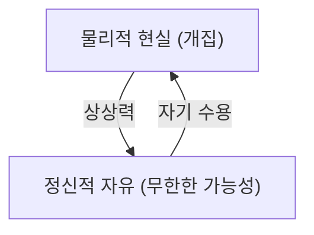

## 1. 시작하며: 단순한 코믹이 아닌 『피너츠』의 깊이

찰스 M. 슐츠가 그린 『피너츠』는 단순한 어린이용 코믹 스트립이 아닙니다. 냉전 시대의 불안이나, 고도 경제 성장기의 그늘에서 생긴 미국 사회의 고독, 그리고 실존주의적인 질문이 개와 아이들의 일상을 통해 멋지게 표현되어 있습니다. 스누피와 찰리 브라운의 말에는 우리가 인생의 어려움에 직면했을 때 되돌아봐야 할 철학이 담겨 있습니다.

## 2. 스누피의 철학: 자기 수용과 상상력

> "주어진 패로 승부할 수밖에 없어, 그게 무슨 의미이든 간에."

스누피의 가장 유명한 명언 중 하나입니다. 이것은 결정론적인 체념이 아니라, 스토아 철학에 통하는 '자기 수용'의 선언입니다. 그는 자신이 개라는 것을 받아들이면서도 상상력을 이용하여 제1차 세계대전의 격추왕이나 소설가로 변신합니다. 물리적인 제약(개집 위)에 얽매이면서도 정신적인 자유(무한한 하늘)를 구가하는 그의 자세는, 현대를 살아가는 우리에게 강력한 메시지를 던집니다.

## 3. 찰리 브라운과 '패배의 미학'

찰리 브라운은 항상 패배하고, 연은 연 먹는 나무에 먹히며, 야구에서는 계속 집니다. 하지만 그는 결코 포기하지 않습니다. 이 모습은 알베르 카뮈의 『시지프 신화』에 나오는 부조리에 대한 반항을 연상시킵니다. 결과가 어떻든, 계속 행동하는 것 자체에 의미를 찾는 그의 자세는 경쟁 사회에서의 '성공'의 정의를 조용히 되묻고 있습니다.

## 4. 루시의 정신 분석과 라이너스의 안심 담요

"마음 상담 5센트". 루시의 정신 분석 스탠드는 현대 자본주의에서의 돌봄의 형태를 풍자하는 것 같기도 합니다. 한편, 라이너스의 '안심 담요'는 심리학에서의 이행 대상(Transitional Object)에 대한 완벽한 묘사입니다. 변화가 격렬한 시대에 사람들이 무언가에 매달리고 싶어하는 심리를 슐츠는 따뜻한 눈으로 지켜보았습니다.

## 5. 맺음말: 슐츠가 남긴 보편적 진리

『피너츠』가 반세기 이상에 걸쳐 계속 사랑받는 이유는 그것이 '인간의 불완전함'을 긍정하고 있기 때문입니다. 완벽한 인간 따위는 존재하지 않으며, 누구나 고민하고, 실패하고, 그럼에도 살아갑니다. 스누피의 철학은 우리에게 '있는 그대로의 나'를 받아들이는 용기와 인생을 유머로 극복하는 지혜를 줍니다.
