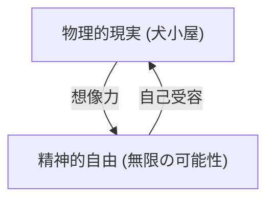

## 1. はじめに：ただのコミックではない『ピーナッツ』の奥深さ

チャールズ・M・シュルツによって描かれた『ピーナッツ』は、単なる子ども向けのコミックストリップではありません。冷戦期の不安や、高度経済成長期の陰で生じたアメリカ社会の孤独、そして実存主義的な問いが、犬と子どもたちの日常を通じて見事に表現されています。スヌーピーやチャーリー・ブラウンの言葉には、私たちが人生の困難に直面したときに立ち返るべき哲学が詰まっています。

## 2. スヌーピーの哲学：自己受容と想像力

> "配られたカードで勝負するしかないのさ、それがどういう意味であれ。"

スヌーピーの最も有名な名言の一つです。これは決定論的な諦めではなく、ストア派の哲学に通じる「自己受容」の宣言です。彼は自分が犬であることを受け入れつつも、想像力を用いて第一次世界大戦の撃墜王や小説家へと変身します。物理的な制約（犬小屋の上）に縛られながらも、精神的な自由（無限の空）を謳歌する彼の姿勢は、現代を生きる私たちに強力なメッセージを投げかけます。

## 3. チャーリー・ブラウンと「敗北の美学」

チャーリー・ブラウンは常に敗北し、凧の木に凧を食われ、野球では負け続けます。しかし、彼は決して諦めません。この姿は、アルベール・カミュの『シーシュポスの神話』における不条理への反抗を彷彿とさせます。結果がどうであれ、行動し続けること自体に意味を見出す彼の姿勢は、競争社会における「成功」の定義を静かに問い直しています。

## 4. ルーシーの精神分析とライナスの安心毛布

「心の相談5セント」。ルーシーの精神分析スタンドは、現代の資本主義におけるケアのあり方を風刺しているようでもあります。一方で、ライナスの「安心毛布」は、心理学における移行対象（Transitional Object）の完璧な描写です。変化の激しい時代において、人々が何かにすがりたくなる心理を、シュルツは温かい目で見守りました。

## 5. まとめ：シュルツが残した普遍的真理

『ピーナッツ』が半世紀以上にわたって愛され続ける理由は、それが「人間の不完全さ」を肯定しているからです。完璧な人間など存在せず、誰もが悩み、失敗し、それでも生きていく。スヌーピーの哲学は、私たちに「ありのままの自分」を受け入れる勇気と、人生をユーモアで乗り切る知恵を与えてくれます。
