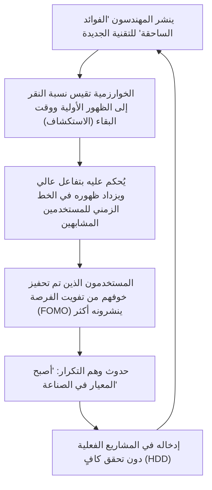
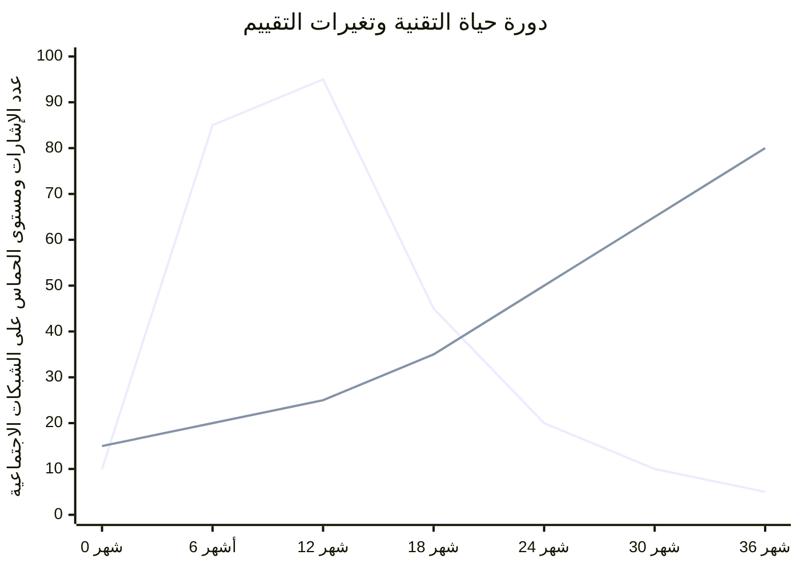

## 1. مقدمة: ديمقراطية المعلومات التقنية وظهور الخوارزميات

في هندسة البرمجيات الحديثة، الكثير من المعلومات التقنية التي نستهلكها يوميًا تمر عبر خدمات الشبكات الاجتماعية (SNS) ومجمعي الأخبار مثل X (تويتر سابقًا) وHacker News وReddit وLinkedIn. كان هناك وقت كنا نجمع فيه المعلومات بشكل مستقل وترتيب زمني من خلال القوائم البريدية، والمدونات التي يديرها خبراء محددون، أو عبر قوارئ RSS. ومع ذلك، مع الزيادة الهائلة في أطر العمل والأدوات التي يتم إنشاؤها كل يوم، أصبح من الشائع تفويض تصفية المعلومات إلى "خوارزميات التوصية (Recommendation Algorithms)" التي توفرها المنصات لتحسين مواردنا المعرفية المحدودة (الوقت المتاح والانتباه).

أحدث هذا التحول النموذجي فوائد هائلة، حيث أتاح اكتشاف المقالات التقنية المفيدة ومشاريع المصدر المفتوح الرائدة بكفاءة. ولكن من ناحية أخرى، تسبب أيضًا في آثار جانبية خطيرة للغاية. وهي حقيقة أن **"الاتجاهات التقنية وأفضل الممارسات التي نراها لا يتم تشكيلها من خلال التفوق التقني البحت أو التقييم الموضوعي، بل يتم تشويهها بواسطة 'دالة تحسين التفاعل' للخوارزميات"**.

في هذا المقال، سنكشف رياضيًا وهيكليًا كيف تشكل خوارزميات التعلم الآلي المتقدمة التي تعمل في خلفية الشبكات الاجتماعية إدراكنا وتؤثر على صنع القرار في اختيار التقنيات. بالإضافة إلى ذلك، سنبحث بعمق في مخاطر "التطوير المدفوع بالضجة (Hype Driven Development: HDD)" الذي ننجرف إليه بسبب الحماس الذي تخلقه الخوارزميات، والنهج الملموسة للابتعاد عن ذلك وإجراء اختيارات تقنية موضوعية وقوية.

---

## 2. تطور وآلية خوارزميات التوصية

عندما نفتح شبكة اجتماعية، فإن المحتوى المعروض على خطنا الزمني (الخلاصة) ليس عشوائيًا. هناك نماذج تعلم آلي تم ضبطها بدقة لزيادة وقت بقاء المستخدم وتحسين عائدات الإعلانات. دعونا نلقي نظرة أولاً على التقنيات الأساسية وراء ذلك.

### 2.1 التصفية التعاونية (Collaborative Filtering) وتحليل المصفوفات

منذ الأيام الأولى لأنظمة التوصية وحتى الوقت الحاضر، ظلت "التصفية التعاونية" تعمل كخط أساس قوي. على وجه الخصوص، يُستخدم على نطاق واسع "تحليل المصفوفات (Matrix Factorization)" الذي يعبر عن التفاعل بين المستخدمين والعناصر (المنشورات أو المقالات) كمصفوفة ويقوم بتعيينها في مساحة ميزات كامنة.

بافتراض أن مصفوفة التقييم لعدد المستخدمين $M$ وعدد العناصر $N$ هي $R \in \mathbb{R}^{M \times N}$، فإن تحليل المصفوفات يقرب هذه المصفوفة الضخمة والمتناثرة (sparse) إلى حاصل ضرب مصفوفة الميزات الكامنة منخفضة الأبعاد $U \in \mathbb{R}^{M \times K}$ (ميزات المستخدم) و $V \in \mathbb{R}^{N \times K}$ (ميزات العنصر) حيث ($K \ll M, N$).

$$
R \approx U \times V^T
$$

يتم حساب درجة التنبؤ (احتمالية التفاعل) $\hat{r}_{ij}$ لعنصر معين $j$ بالنسبة لمستخدم معين $i$ كحاصل ضرب داخلي لمتجهات الميزات الكامنة الخاصة بهما.

$$
\hat{r}_{ij} = \mathbf{u}_i \cdot \mathbf{v}_j
$$

يتم تدريب هذا النموذج لتقليل دالة الخسارة التالية ($\lambda$ هو مصطلح التنظيم لمنع الإفراط في الملاءمة).

$$
\mathcal{L} = \sum_{(i,j) \in \Omega} (r_{ij} - \mathbf{u}_i \cdot \mathbf{v}_j)^2 + \lambda (\|\mathbf{u}_i\|^2 + \|\mathbf{v}_j\|^2)
$$

**التأثير على اختيار التقنيات:**
تقوم هذه الخوارزمية بتقريب "الشخص أ المهتم بـ Rust" و "الشخص ب المهتم بـ Rust" في المساحة الكامنة. إذا أعجب الشخص أ بمنشور حول إطار عمل الويب الناشئ، فهناك احتمال كبير أن يظهر المنشور الخاص بإطار العمل هذا في الخط الزمني للشخص ب. نتيجة لذلك، تحدث ظاهرة حيث تصبح تقنية معينة شائعة محليًا داخل مجموعة من المهندسين الذين يفضلون مجموعة تقنية معينة.

### 2.2 نماذج التوصية باستخدام التعلم العميق (DLRM)

في السنوات الأخيرة، أصبحت البنى القائمة على التعلم العميق الممثلة في Deep Learning Recommendation Model (DLRM) شائعة، خاصة حول Meta (فيسبوك سابقًا). تأخذ DLRM مجموعة متنوعة من الميزات كمدخلات، مثل سجل سلوك المستخدم السابق والبيانات الوصفية للعنصر، وتتنبأ بنسبة النقر إلى الظهور (CTR: Click-Through Rate) وما إلى ذلك.

ميزة DLRM هي أنها تحول الميزات الفئوية المتناثرة (مثل: معرف المستخدم، الهاشتاج المتبع) إلى متجهات كثيفة (Dense Vector) من خلال "جدول التضمين (Embedding Table)"، وتدمجها مع ميزات كثيفة ذات قيمة مستمرة (مثل: عدد الأيام منذ فتح الحساب، متوسط وقت البقاء السابق).

$$
\mathbf{e}_{\text{sparse}} = \text{EmbeddingLookup}(\mathbf{x}_{\text{sparse}})
$$
$$
\mathbf{h}_{\text{dense}} = \text{BottomMLP}(\mathbf{x}_{\text{dense}})
$$

بعد دمج (Concatenate) أو تفاعل هذه الميزات من خلال الضرب الداخلي (Feature Interaction)، يتم إدخالها إلى شبكة متعددة الطبقات علوية (Top MLP)، ويتم إخراج الاحتمالية النهائية مثل CTR باستخدام دالة سيجمويد $\sigma$.

$$
\hat{y} = \sigma(\text{TopMLP}(\text{Interact}(\mathbf{e}_{\text{sparse}}, \mathbf{h}_{\text{dense}})))
$$

**التأثير على اختيار التقنيات:**
تلتقط النماذج الضخمة مثل DLRM إشارات دقيقة للغاية (على سبيل المثال، زيادة طفيفة في وقت البقاء لـ "المنشورات التي تحتوي على مقاطع فيديو" أو "المنشورات التي تحتوي على كلمات طنانة معينة") وتعكسها في درجة التنبؤ. نتيجة لذلك، من المرجح أن يتم تفضيل المعلومات التقنية التي تحتوي على "عناوين متطرفة (مثل: 'React أصبحت قديمة'، 'نهاية الخدمات المصغرة')" أو "عروض مرئية مبهرجة" من الناحية الخوارزمية.

### 2.3 التعلم المعزز ومشكلة قطاع الطرق متعددي الأذرع (Multi-Armed Bandits)

تحتاج أنظمة التوصية دائمًا إلى استكشاف أحدث تفضيلات المستخدم. وهنا تبرز "مشكلة قطاع الطرق متعددي الأذرع". فهي تعمل على تحسين المقايضة بين "الاستغلال (Exploitation)" الذي يقدم محتوى موثوقًا بناءً على التفضيلات الحالية، و "الاستكشاف (Exploration)" لاكتشاف اتجاهات جديدة.

في الخوارزمية التمثيلية UCB (Upper Confidence Bound)، في الوقت $t$، يتم حساب درجة اختيار الذراع (مجموعة المحتوى) $a$ على النحو التالي.

$$
a_t = \arg\max_{a} \left( \hat{\mu}_a + c \sqrt{\frac{\ln t}{N_a(t)}} \right)
$$

هنا، $\hat{\mu}_a$ هو متوسط المكافأة (معدل التفاعل) للذراع $a$ حتى الآن، و $N_a(t)$ هو عدد مرات اختياره، و $c$ هو معلمة لضبط درجة الاستكشاف.

**التأثير على اختيار التقنيات:**
تمنح الخوارزمية بشكل مؤقت مكافأة استكشاف للمنشورات حول أطر العمل والمكتبات التي ظهرت حديثًا (حيث يكون عدد التجارب $N_a(t)$ صغيرًا) وتعرضها لمجموعات مستخدمين عشوائية. في مرحلة "الاستكشاف" الأولية هذه، إذا كان رد فعل المؤثرين وما إلى ذلك جيدًا، يرتفع $\hat{\mu}_a$ بسرعة ويتطور فجأة إلى ضجة (فيروسية). هذه هي الآلية التي "يتحدث فيها الجميع فجأة عن تلك التقنية".

---

## 3. رياضيات غرف الصدى وفقاعات التصفية

مع تقدم تحسين الخوارزمية، أصبح المستخدمون محاطين فقط بـ "المعلومات التي يشعرون بالراحة معها، أو المعلومات التي تعزز معتقداتهم الحالية". هذه هي **ظاهرة غرفة الصدى (Echo Chamber)** و **فقاعة التصفية (Filter Bubble)**.

في نظرية الشبكات، تُسمى خاصية الأشخاص المتشابهين في الاتصال ببعضهم البعض بسهولة أكبر بـ "التجانس (Homophily)". في الرسم البياني $G=(V, E)$، كلما زاد تشابه السمات، زادت احتمالية تشكل حواف (علاقات المتابعة أو انتشار المعلومات) بين العقد (المستخدمين).

تسرع خوارزميات التوصية في الشبكات الاجتماعية هذا التجانس بشكل مصطنع. على سبيل المثال، لنفترض أن هناك مجتمعًا من المهندسين الذين يروجون لـ "بنية بدون خادم (Serverless)" ومجتمعًا يدعم "المعدن العاري في الموقع (On-premise Bare Metal)". تتعلم الخوارزمية لتقليل وزن الحواف بين المجتمعات المختلفة (Cross-cutting ties) وتقوية الحواف داخل نفس المجتمع (لأن الآراء المتعارضة غالبًا ما تؤدي إلى الانقطاع وتزيد من خطر تقليل التفاعل. أو على العكس من ذلك، قد تسبب غضبًا شديدًا يؤدي إلى التفاعل، ولكن في المجال التقني يميل الاتجاه الأول إلى أن يكون أكثر شيوعًا).

نتيجة لذلك، سيبدو في خطك الزمني أن "الشركات في جميع أنحاء العالم تنتقل إلى البنية بدون خادم"، بينما في الخط الزمني لشخص آخر سيبدو أن "الانسحاب من السحابة (Cloud Repatriation) هو الاتجاه العالمي"، مما يخلق واقعًا تقنيًا منقسمًا تمامًا.

---

## 4. التطوير المدفوع بالضجة (HDD) الناجم عن الخوارزميات

مزيج من غرف الصدى ونماذج التوصية القوية يؤدي إلى واحدة من أكبر الأنماط المضادة في صناعة الهندسة، وهي **التطوير المدفوع بالضجة (Hype Driven Development)**. HDD هي ظاهرة يتم فيها تبني تقنية جديدة لمجرد "أنها موضوع ساخن على الشبكات الاجتماعية" أو "لأنها أحدث اتجاه" دون التفكير بعمق في الفوائد والمفاضلات الفعلية للتقنية وملاءمتها لمتطلبات أعمال الشركة.

يوضح رسم Mermaid التالي كيف تعمل خوارزميات الشبكات الاجتماعية على تدوير حلقة التغذية الراجعة لـ HDD.

ما هو مرعب في هذه الحلقة هو أن **"وهم التكرار (Baader-Meinhof phenomenon)"** يتم تحفيزه عن قصد بواسطة الخوارزمية. بمجرد أن ترى اسم مكتبة إدارة حالة جديدة مرة واحدة، تلتقط الخوارزمية ذلك كإشارة وتملأ خلاصتك بالحديث عن تلك المكتبة في اليوم التالي. الدماغ البشري يخطئ في فهم هذا على أنه "وباء عالمي".

يوضح الرسم البياني التالي الفرق في دورة الحياة بين التقنيات المبالغ فيها على الشبكات الاجتماعية (Hype) والتقنيات العادية والمملة ولكنها قوية (Boring Technology).

*(ملاحظة: في الرسم البياني أعلاه، يمثل الخط الذي يرتفع وينخفض بحدة "التقنية المبالغ فيها"، ويمثل الخط الذي يرتفع ببطء وثبات "التقنية المملة")*

التقنيات المبالغ فيها تواجه مشاكل واقعية مثل "نقص التوثيق"، "أخطاء خطيرة في الحالات الطرفية (Edge Cases)"، و "إرهاق المشرفين (Burnout)" بعد 6 إلى 12 شهرًا من الإدخال، وتختفي بسرعة من الشبكات الاجتماعية. ومع ذلك، فإن تكلفة إزالة الديون التقنية المدمجة في النظام هائلة.

---

## 5. استراتيجية "الخروج من الخوارزميات" في اختيار التقنيات

إذن، كيف يمكننا إجراء اختيارات تقنية موضوعية وهادئة تحت سيطرة هذه الخوارزمية؟ بدلاً من اختراق الخوارزمية، سنقدم بعض الاستراتيجيات الملموسة لـ "النزول" من الخوارزمية.

### 5.1 العودة إلى المصادر الأولية: الكود المصدري و RFC

آلية الدفاع الأكثر تأكيدًا هي تحويل مصادر المعلومات من التجميع عبر الشبكات الاجتماعية إلى **المصادر الأولية (Primary Sources)**.

1. **قراءة الكود المصدري:** بدلاً من تصديق منشورات الشبكات الاجتماعية التي تقول "هذه المكتبة سريعة جدًا"، افتح GitHub فعليًا وتحقق من تعقيد الحوسبة للمنطق الأساسي وآلية تخصيص الذاكرة.
2. **تتبع RFC (Request for Comments):** تتبنى العديد من المشاريع الناضجة مفتوحة المصدر (React, Rust, Python, وما إلى ذلك) عملية RFC عند تقديم ميزات جديدة. في RFC، تتم كتابة "لماذا هذه الميزة ضرورية؟"، "ما هي المفاضلات في التصميم؟"، و "ما هي البدائل؟" بشكل منطقي وموضوعي دون القلق بشأن تفاعل الخوارزمية. هنا تكمن القيمة التقنية الحقيقية.

### 5.2 القراءة المتأنية للأوراق البحثية (Academic Papers) والأوراق البيضاء

فيما يتعلق باختيار التقنيات الأساسية مثل الأنظمة الموزعة وقواعد البيانات وبنيات نماذج التعلم الآلي، يجب عليك قراءة الأوراق البحثية المنشورة في ACM أو IEEE أو arXiv، أو الأوراق البيضاء التفصيلية التي تنشرها الشركات (مثل ورقة Google Spanner أو ورقة Amazon Dynamo) مباشرة، بدلاً من ملخص من بضعة أسطر على الشبكات الاجتماعية.

تم تحسين منشورات الشبكات الاجتماعية لـ "جذب انتباه (Attention) القراء"، في حين تم تحسين الأوراق البحثية الخاضعة لمراجعة النظراء لـ "دقة الحقائق وقابليتها للتكرار". دالة التقييم مختلفة تمامًا.

### 5.3 بناء إطار عمل لصنع القرار داخل المنظمة

لمنع HDD على مستوى الفريق أو المنظمة، من الضروري وجود عملية تزيل الحدس الشخصي أو أسباب مثل "رأيته على تويتر". المثال النموذجي على ذلك هو إدخال **ADR (Architecture Decision Records)**.

عند إدخال تقنية جديدة، قم دائمًا بتوثيق العناصر التالية وتلقي المراجعات.
* **السياق (Context):** لماذا نحتاج إلى هذه التقنية الجديدة؟ ما هي المشكلة الحالية؟
* **القرار (Decision):** ماذا سنعتمد؟
* **العواقب (Consequences):** ما هي المفاضلات؟ (ماذا نضحي مقابل ماذا نحصل)

من خلال فرض هذه العملية، يمكن تحويل "الضجة (Hype)" إلى "هندسة (Engineering)".

### 5.4 فلسفة نادي التقنية المملة (Boring Technology Club)

هناك تعويذة شهيرة في مجتمع التكنولوجيا تقول **"اختر التقنية المملة (Choose Boring Technology)"**. هذا يعلمنا ألا نهدر رموز الابتكار (الموارد المحدودة التي يمكن للمنظمة إنفاقها على تقنيات جديدة غير معروفة) في اختيار البنية التحتية أو أطر العمل التي لا ترتبط ارتباطًا مباشرًا بالقيمة الأساسية للعمل.

تفضل خوارزميات الشبكات الاجتماعية "الحداثة". ومع ذلك، لبناء نظام قوي يمكنه تحمل العمليات الفعلية، فإن ما نحتاجه هو تقنيات "مملة" (PostgreSQL، Redis، واجهة برمجة تطبيقات REST قياسية، إلخ) لديها سجل حافل لأكثر من 10 سنوات وتظهر ملايين النتائج في بحث Google لإجراءات التعافي من الكوارث.

---

## 6. الخلاصة: كيف ينبغي لنا أن نتعامل مع التقنية

تعد خوارزميات التوصية عبر الشبكات الاجتماعية أداة قوية لتوسيع منظورنا التقني وتوفير فرص للقاء مجتمعات رائعة. ومع ذلك، طالما أن بنيتها الداخلية (تحليل المصفوفات، DLRM، قطاع الطرق متعددي الأذرع) تضع "تعظيم التفاعل" كأولوية قصوى، فإن المعلومات الناتجة ستكون متحيزة حتمًا.

نحن بحاجة إلى تطوير المعرفة للتعامل مع المعلومات المتدفقة على خطنا الزمني ليس على أنها "حقائق" أو "اتجاهات مطلقة"، ولكن كمجرد "إشارة" واحدة.

اخرج من غرفة الصدى، واقرأ الكود المصدري بيديك، وتتبع مناقشات RFC، وفك رموز المعادلات في الأوراق البحثية، وواجه التحديات الحقيقية في مجال عملك. هذا هو الطريق الوحيد لممارسة هندسة البرمجيات الحقيقية دون أن تبتلعك موجة الخوارزميات.

