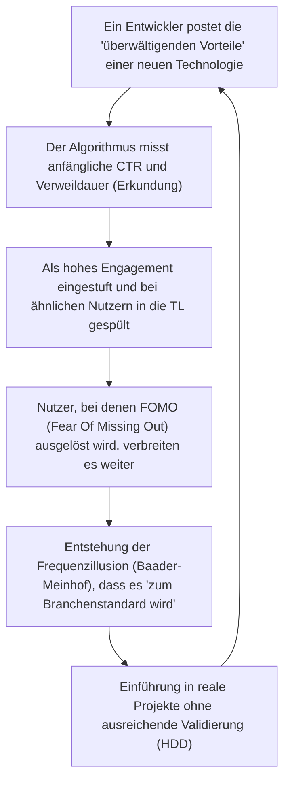
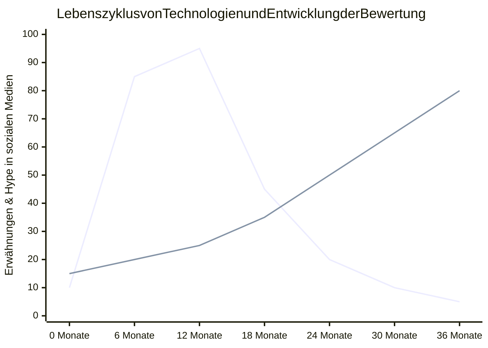

## 1. Einleitung: Demokratisierung technischer Informationen und der Aufstieg von Algorithmen

In der modernen Softwareentwicklung gelangen viele der technischen Informationen, die wir täglich konsumieren, über soziale Netzwerke (SNS) wie X (ehemals Twitter), Hacker News, Reddit, LinkedIn oder News-Aggregatoren zu uns. Es gab eine Zeit, in der wir Informationen autonom und in chronologischer Reihenfolge über Mailinglisten, Blogs bestimmter Experten oder RSS-Reader sammelten. Aufgrund der explosionsartigen Zunahme von täglich neu erscheinenden Frameworks und Tools ist es jedoch üblich geworden, die Informationsauswahl den von den Plattformen bereitgestellten "Empfehlungsalgorithmen (Recommendation Algorithms)" zu überlassen, um unsere begrenzten kognitiven Ressourcen (verfügbare Zeit und Aufmerksamkeit) zu optimieren.

Dieser Paradigmenwechsel hat den enormen Vorteil gebracht, dass nützliche technische Artikel und bahnbrechende Open-Source-Projekte effizient entdeckt werden können. Gleichzeitig hat er jedoch auch eine sehr schwerwiegende Nebenwirkung hervorgerufen. Nämlich die Tatsache, dass **"die Technologietrends und Best Practices, die wir sehen, nicht durch reine technische Überlegenheit oder objektive Bewertung, sondern durch die 'Engagement-Optimierungsfunktion' der Algorithmen verzerrt werden"**.

In diesem Artikel werden wir mathematisch und strukturell klären, wie die hoch entwickelten maschinellen Lernalgorithmen, die im Hintergrund von Social Media laufen, unsere Wahrnehmung formen und unsere Entscheidungen bei der Technologieauswahl beeinflussen. Darüber hinaus werden wir tiefgehend über die Gefahren des "Hype Driven Development (HDD)" nachdenken, bei dem man sich von der durch Algorithmen erzeugten Begeisterung mitreißen lässt, und konkrete Ansätze betrachten, um sich davon zu lösen und eine objektive sowie robuste Technologieauswahl zu treffen.

---

## 2. Evolution und Mechanismen von Empfehlungsalgorithmen

Wenn wir ein soziales Netzwerk öffnen, sind die Inhalte, die in unserer Timeline (Feed) angezeigt werden, nicht zufällig. Dahinter stehen maschinelle Lernmodelle, die stark daraufhin optimiert wurden, die Verweildauer der Nutzer zu maximieren und die Werbeeinnahmen zu steigern. Lassen Sie uns zunächst einen Blick auf die grundlegenden Technologien werfen, die dies ermöglichen.

### 2.1 Collaborative Filtering und Matrixfaktorisierung

"Collaborative Filtering" dient seit den Anfängen der Empfehlungssysteme bis heute als starke Baseline. Insbesondere die "Matrixfaktorisierung (Matrix Factorization)", die die Interaktion zwischen Nutzern und Elementen (Posts oder Artikel) als Matrix darstellt und in einen latenten Merkmalsraum abbildet, ist weit verbreitet.

Wenn wir eine Bewertungsmatrix $R \in \mathbb{R}^{M \times N}$ für eine Nutzerzahl $M$ und eine Artikelzahl $N$ annehmen, nähert die Matrixfaktorisierung diese riesige und spärliche (sparse) Matrix an das Produkt einer niedrigdimensionalen latenten Merkmalsmatrix $U \in \mathbb{R}^{M \times K}$ (Nutzermerkmale) und $V \in \mathbb{R}^{N \times K}$ (Artikelmerkmale) an ($K \ll M, N$).

$$
R \approx U \times V^T
$$

Der vorhergesagte Score (die Wahrscheinlichkeit des Engagements) $\hat{r}_{ij}$ für einen bestimmten Nutzer $i$ in Bezug auf einen Artikel $j$ wird als Skalarprodukt ihrer jeweiligen latenten Merkmalsvektoren berechnet.

$$
\hat{r}_{ij} = \mathbf{u}_i \cdot \mathbf{v}_j
$$

Dieses Modell wird trainiert, um die folgende Verlustfunktion zu minimieren (wobei $\lambda$ ein Regularisierungsterm ist, um Overfitting zu verhindern).

$$
\mathcal{L} = \sum_{(i,j) \in \Omega} (r_{ij} - \mathbf{u}_i \cdot \mathbf{v}_j)^2 + \lambda (\|\mathbf{u}_i\|^2 + \|\mathbf{v}_j\|^2)
$$

**Auswirkungen auf die Technologieauswahl:**
Dieser Algorithmus rückt "Person A, die sich für [Rust](https://kenji.blog/de/p/webassembly-wasm-current-future/) interessiert" und "Person B, die sich für Rust interessiert" im latenten Raum näher zusammen. Wenn Person A einen Beitrag über ein aufstrebendes Web-Framework "likt", wird der Beitrag über dieses Framework mit hoher Wahrscheinlichkeit auch in der Timeline von Person B angezeigt. Dies führt zu dem Phänomen, dass eine bestimmte Technologie innerhalb einer Gruppe von Entwicklern, die einen bestimmten Technologie-Stack bevorzugen, lokal extrem populär wird.

### 2.2 Deep Learning basierte Empfehlungsmodelle (DLRM)

In den letzten Jahren haben sich Deep-Learning-basierte Architekturen, vertreten durch das Deep Learning Recommendation Model (DLRM), insbesondere bei Unternehmen wie Meta (ehemals Facebook) verbreitet. DLRM nimmt eine Vielzahl von Merkmalen (Features) wie die vergangene Historie des Nutzers und Metadaten der Artikel als Eingabe entgegen und prognostiziert die Klickrate (CTR: Click-Through Rate) oder ähnliche Metriken.

Das Merkmal von DLRM besteht darin, spärliche kategorische Merkmale (z.B. Nutzer-ID, verfolgte Hashtags) durch eine "Embedding Table" in dichte Vektoren (Dense Vectors) umzuwandeln und sie mit kontinuierlichen, dichten Merkmalen (z.B. Tage seit Kontoerstellung, durchschnittliche Verweildauer in der Vergangenheit) zu kombinieren.

$$
\mathbf{e}_{\text{sparse}} = \text{EmbeddingLookup}(\mathbf{x}_{\text{sparse}})
$$
$$
\mathbf{h}_{\text{dense}} = \text{BottomMLP}(\mathbf{x}_{\text{dense}})
$$

Nachdem diese durch Konkatenation oder Skalarprodukte interagiert haben (Feature Interaction), werden sie in das obere Multi-Layer-Perzeptron (Top MLP) eingespeist und die endgültige Wahrscheinlichkeit für CTR etc. mit einer Sigmoid-Funktion $\sigma$ ausgegeben.

$$
\hat{y} = \sigma(\text{TopMLP}(\text{Interact}(\mathbf{e}_{\text{sparse}}, \mathbf{h}_{\text{dense}})))
$$

**Auswirkungen auf die Technologieauswahl:**
Riesige Modelle wie DLRM erfassen extrem feine Signale (z. B. einen leichten Anstieg der Verweildauer bei "Beiträgen mit Videos" oder "Beiträgen mit bestimmten Buzzwords") und spiegeln sie im Vorhersagescore wider. Infolgedessen werden technische Informationen mit "radikalen Titeln (z.B. 'React ist veraltet', 'Das Ende von Microservices')" oder "visuell auffälligen Demos" vom Algorithmus systematisch bevorzugt.

### 2.3 Reinforcement Learning und das Multi-Armed-Bandit-Problem (Multi-Armed Bandits)

Empfehlungssysteme müssen ständig die neuesten Präferenzen der Nutzer erkunden. Hier kommt das "Multi-Armed-Bandit-Problem" ins Spiel. Es optimiert den Kompromiss zwischen "Exploitation" (Ausbeutung), d.h. der Präsentation sicherer Inhalte basierend auf bestehenden Vorlieben, und "Exploration" (Erkundung), um neue Trends zu entdecken.

Beim repräsentativen Algorithmus UCB (Upper Confidence Bound) wird der Score für die Auswahl eines Arms (Content-Gruppe) $a$ zum Zeitpunkt $t$ wie folgt berechnet:

$$
a_t = \arg\max_{a} \left( \hat{\mu}_a + c \sqrt{\frac{\ln t}{N_a(t)}} \right)
$$

Hierbei ist $\hat{\mu}_a$ die bisherige durchschnittliche Belohnung (Engagement-Rate) von Arm $a$, $N_a(t)$ ist die Anzahl der Auswahlvorgänge, und $c$ ist ein Parameter, der den Grad der Erkundung anpasst.

**Auswirkungen auf die Technologieauswahl:**
Der Algorithmus gewährt Beiträgen über neu erschienene Frameworks und Bibliotheken (solche mit einer geringen Anzahl an Versuchen $N_a(t)$) vorübergehend einen Erkundungsbonus und präsentiert sie einer zufälligen Nutzergruppe. Wenn die Reaktionen von Influencern oder anderen in dieser anfänglichen "Erkundungsphase" positiv sind, steigt $\hat{\mu}_a$ steil an und entwickelt sich sofort zu einem Buzz (viraler Hit). Dies ist der Mechanismus, durch den "plötzlich jeder über diese Technologie spricht".

---

## 3. Die Mathematik von Echokammern und Filterblasen

Wenn die algorithmische Optimierung fortschreitet, sind die Nutzer nur noch von "Informationen, die sie angenehm finden, oder Informationen, die ihre bestehenden Überzeugungen verstärken" umgeben. Dies wird als **Echokammer-Phänomen (Echo Chamber)** und **Filterblase (Filter Bubble)** bezeichnet.

In der Netzwerktheorie nennt man die Tendenz, dass ähnliche Entitäten sich verbinden, "Homophilie (Homophily)". In einem Graphen $G=(V, E)$ bilden sich Kanten (Folgebeziehungen oder Informationsverbreitung) zwischen Knoten (Nutzern) umso leichter, je höher die Ähnlichkeit der Attribute ist.

Empfehlungsalgorithmen in sozialen Netzwerken beschleunigen diese Homophilie künstlich. Angenommen, es gibt eine Community von Entwicklern, die "[Serverless](https://kenji.blog/de/p/serverless-architecture-aws-lambda-cold-start/)-Architekturen" fördern, und eine andere Community, die "On-Premises Bare-Metal" unterstützt. Der Algorithmus lernt, das Gewicht der Kanten zwischen den verschiedenen Communities (Cross-cutting ties) zu verringern und die Kanten innerhalb derselben Community zu stärken (denn gegensätzliche Meinungen führen oft zur Abwanderung und bergen das Risiko eines geringeren Engagements. Umgekehrt können sie manchmal Engagement durch extreme Wut auslösen, aber in der Tech-Community ist Ersteres tendenziell häufiger der Fall).

Als Ergebnis entsteht eine völlig gespaltene technologische Realität, in der es in Ihrer Timeline so aussieht, als ob "Unternehmen weltweit zu Serverless migrieren", während es in der Timeline einer anderen Person so aussieht, als sei "die Rückkehr aus der Cloud (Cloud Repatriation) der globale Trend".

---

## 4. Hype Driven Development (HDD), hervorgebracht durch Algorithmen

Die Kombination von Echokammern und leistungsstarken Empfehlungsmodellen führt zu einem der größten Anti-Patterns in der Engineering-Branche: **Hype Driven Development (HDD)**. HDD ist das Phänomen, bei dem neue Technologien nur deshalb übernommen werden, weil "sie in den sozialen Medien im Trend liegen" oder "sie der neueste Trend sind", ohne die tatsächlichen Vorteile, Kompromisse und die Übereinstimmung mit den geschäftlichen Anforderungen des eigenen Unternehmens tiefgehend zu prüfen.

Das folgende Mermaid-Diagramm zeigt, wie die Social-Media-Algorithmen die Feedbackschleife der HDD am Laufen halten.

Das Erschreckende an dieser Schleife ist, dass die **"Frequenzillusion (Baader-Meinhof-Phänomen)"** von Algorithmen absichtlich hervorgerufen wird. Wenn Sie den Namen einer neuen Zustandsverwaltungs-Bibliothek einmal sehen, wertet der Algorithmus dies als Signal und füllt Ihren Feed am nächsten Tag mit Themen zu dieser Bibliothek. Das menschliche Gehirn interpretiert dies fälschlicherweise als "weltweite Epidemie".

Das folgende Diagramm zeigt den Unterschied im Lebenszyklus zwischen stark gehypten Technologien in den sozialen Medien und unscheinbaren, langweiligen, aber robusten Technologien (Boring Technology).

*(Hinweis: In der obigen Grafik stellt die steil ansteigende und dann stark abfallende Linie die "gehypte Technologie" dar, während die langsam und stetig ansteigende Linie die "Boring Technology" repräsentiert)*

Gehypte Technologien verschwinden schnell wieder aus den sozialen Netzwerken und stehen 6 bis 12 Monate nach ihrer Einführung vor realen Problemen wie "mangelnder Dokumentation", "schwerwiegenden Bugs in Edge-Cases" und "Burnout der Maintainer". Sobald sie jedoch in ein System integriert wurden, sind die Kosten für die Beseitigung dieser technischen Schulden enorm.

---

## 5. Strategien zur "Befreiung von Algorithmen" bei der Technologieauswahl

Wie also sollen wir unter der Herrschaft dieser Algorithmen eine objektive und kühle Technologieauswahl treffen? Anstatt die Algorithmen zu hacken, stellen wir einige konkrete Strategien vor, um von den Algorithmen "abzusteigen".

### 5.1 Rückkehr zu Primärquellen: Quellcode und RFCs

Die sicherste Verteidigungsstrategie ist, die Informationsquellen von der Social-Media-Aggregation auf **Primärquellen (Primary Sources)** zu verlagern.

1. **Den Quellcode lesen:** Anstatt dem Social-Media-Beitrag "Diese Bibliothek ist rasend schnell" zu glauben, sollten Sie GitHub öffnen und die zeitliche Komplexität der Kernlogik und die Mechanismen der Speicherallokation überprüfen.
2. **RFCs (Request for Comments) verfolgen:** Viele ausgereifte Open-Source-Projekte (React, [Rust](https://kenji.blog/de/p/webassembly-wasm-current-future/), Python usw.) nutzen den RFC-Prozess zur Einführung neuer Funktionen. In RFCs wird logisch und sachlich dargelegt, "warum diese Funktion benötigt wird", "welche Design-Kompromisse es gibt" und "was die Alternativen sind", ohne Rücksicht auf algorithmisches Engagement nehmen zu müssen. Genau hier liegt der wahre technische Wert verborgen.

### 5.2 Sorgfältiges Lesen von wissenschaftlichen Publikationen (Academic Papers) und Whitepapern

Bei der Auswahl grundlegender Technologien wie verteilten Systemen, Datenbanken und Architekturen für maschinelles Lernen sollten Sie nicht wenige Zeilen Zusammenfassungen in sozialen Netzwerken lesen, sondern direkt auf die bei ACM, IEEE oder arXiv veröffentlichten Arbeiten oder detaillierte Whitepaper der Unternehmen zurückgreifen (z. B. Googles Spanner-Paper, Amazons Dynamo-Paper).

Posts in sozialen Netzwerken sind darauf optimiert, "die Aufmerksamkeit (Attention) der Leser zu fesseln", während peer-reviewte wissenschaftliche Arbeiten auf "Faktengenauigkeit und Reproduzierbarkeit" hin optimiert sind. Die Evaluierungsfunktionen sind völlig unterschiedlich.

### 5.3 Aufbau eines Entscheidungsrahmens innerhalb der Organisation

Um HDD auf Team- oder Organisationsebene zu verhindern, bedarf es eines Prozesses, der persönliche Intuitionen und Begründungen wie "Ich habe es auf Twitter gesehen" ausschließt. Ein Paradebeispiel hierfür ist die Einführung von **ADR (Architecture Decision Records)**.

Bei der Einführung einer neuen Technologie müssen die folgenden Punkte stets dokumentiert und überprüft werden:
* **Context (Hintergrund):** Warum wird die neue Technologie benötigt? Was ist die aktuelle Herausforderung?
* **Decision (Entscheidung):** Was soll eingesetzt werden?
* **Consequences (Konsequenzen):** Was sind die Kompromisse? (Was geben wir auf und was gewinnen wir?)

Durch die Durchsetzung dieses Prozesses kann "Hype" (Begeisterung) in "Engineering" (Ingenieurskunst) umgewandelt werden.

### 5.4 Die Philosophie des Boring Technology Club

In der Technikwelt gibt es das berühmte Mantra **"Choose Boring Technology" (Wähle langweilige Technologie)**. Es lehrt, dass Innovations-Token (begrenzte Ressourcen, die ein Unternehmen für neue und unbekannte Technologien aufwenden kann) nicht für die Auswahl von Infrastrukturen oder Frameworks verschwendet werden sollten, die nicht direkt mit dem Kernwert des Geschäfts zusammenhängen.

Social-Media-Algorithmen bevorzugen "Neuheit". Um jedoch ein robustes System aufzubauen, das dem produktiven Einsatz standhält, benötigen wir "langweilige" Technologien mit mehr als 10 Jahren Betriebserfahrung, deren Fehlerbehebungsverfahren Millionen von Treffern auf Google liefern (wie PostgreSQL, Redis, Standard-REST-APIs usw.).

---

## 6. Fazit: Wie wir mit Technologie umgehen sollten

Empfehlungsalgorithmen in sozialen Netzwerken sind leistungsstarke Werkzeuge, die unseren technologischen Horizont erweitern und uns die Begegnung mit großartigen Communities ermöglichen. Da jedoch ihre interne Struktur (Matrixfaktorisierung, DLRM, Multi-Armed Bandits) als oberstes Ziel die "Maximierung des Engagements" verfolgt, sind die ausgegebenen Informationen unweigerlich verzerrt.

Wir müssen uns die Kompetenz aneignen, die Informationen, die in unsere Timeline fließen, nicht als "Fakten" oder "absolute Trends" zu akzeptieren, sondern sie lediglich als ein "Signal" zu behandeln.

Treten Sie aus der Echokammer heraus, lesen Sie den Quellcode selbst, verfolgen Sie RFC-Diskussionen, entschlüsseln Sie mathematische Formeln in wissenschaftlichen Arbeiten und befassen Sie sich mit den wahren Herausforderungen Ihrer eigenen Geschäftsdomäne. Nur so lässt sich echtes Software-Engineering praktizieren, ohne von der Welle der Algorithmen verschluckt zu werden.

