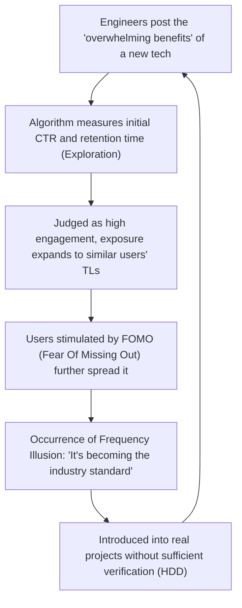
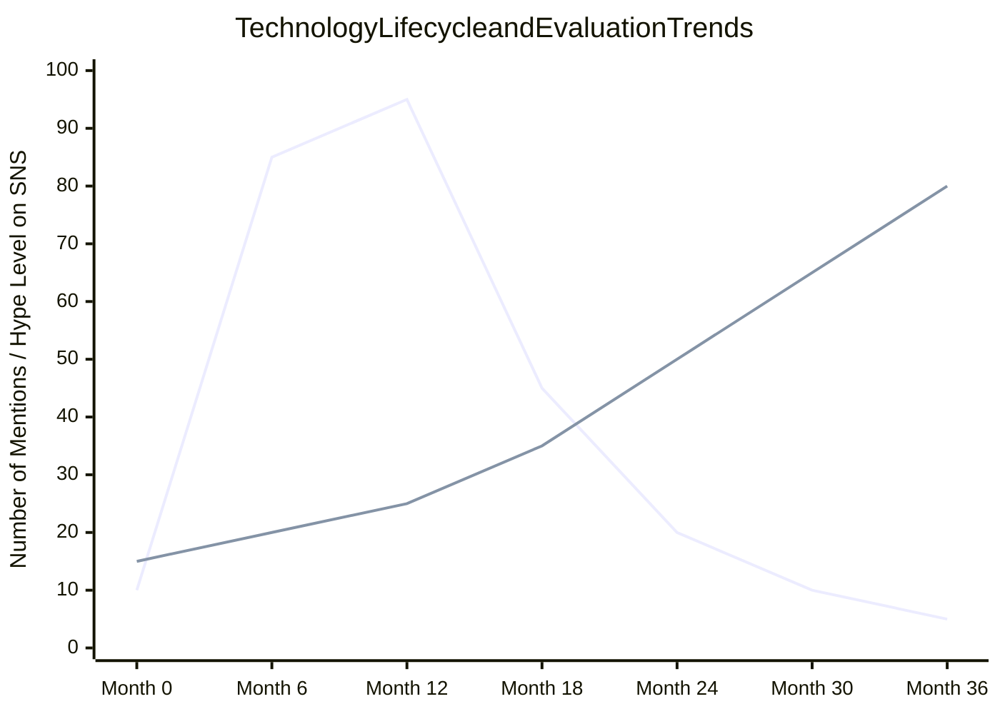

## 1. Introduction: Democratization of Tech Information and the Rise of Algorithms

In modern software engineering, much of the technical information we consume daily passes through Social Networking Services (SNS) like X (formerly Twitter), Hacker News, Reddit, and LinkedIn, or news aggregators. There was once an era where we gathered information autonomously and chronologically through mailing lists, expert-run blogs, or RSS readers. However, with the explosive increase in frameworks and tools created every day, it has become common practice to entrust information curation to "Recommendation Algorithms" provided by platforms in order to optimize our limited cognitive resources (disposable time and attention).

This paradigm shift has brought the immense benefit of efficiently discovering valuable technical articles and groundbreaking open-source projects. On the other hand, it has also caused a highly critical side effect. That is the fact that **"the technical trends and best practices we see are distorted not by pure technical superiority or objective evaluation, but by the algorithm's 'engagement optimization function'."**

In this article, we mathematically and structurally unravel how the advanced machine learning algorithms running behind the scenes of SNS shape our cognition and influence decision-making in tech selection. Furthermore, we deeply consider the dangers of "Hype Driven Development (HDD)," where one is swept away by the hype created by algorithms, and concrete approaches to break free from it and make objective, robust tech selections.

---

## 2. Evolution and Mechanism of Recommendation Algorithms

When we open an SNS, the content displayed on our timeline (feed) is not random. There are machine learning models highly tuned to maximize user retention time and improve ad revenue. First, let's look at the foundational technologies behind these.

### 2.1 Collaborative Filtering and Matrix Factorization

"Collaborative Filtering" has served as a powerful baseline from the dawn of recommendation systems to the present. In particular, "Matrix Factorization," which represents the interaction between users and items (posts or articles) as a matrix and maps them into a latent feature space, is widely used.

Given an evaluation matrix $R \in \mathbb{R}^{M \times N}$ with $M$ users and $N$ items, matrix factorization approximates this large, sparse matrix as the product of a low-dimensional latent feature matrix $U \in \mathbb{R}^{M \times K}$ (user features) and $V \in \mathbb{R}^{N \times K}$ (item features) ($K \ll M, N$).

$$
R \approx U \times V^T
$$

The predicted score (probability of engagement) $\hat{r}_{ij}$ of item $j$ for a specific user $i$ is calculated as the inner product of their respective latent feature vectors.

$$
\hat{r}_{ij} = \mathbf{u}_i \cdot \mathbf{v}_j
$$

This model is trained to minimize the following loss function ($\lambda$ is a regularization term to prevent overfitting).

$$
\mathcal{L} = \sum_{(i,j) \in \Omega} (r_{ij} - \mathbf{u}_i \cdot \mathbf{v}_j)^2 + \lambda (\|\mathbf{u}_i\|^2 + \|\mathbf{v}_j\|^2)
$$

**Impact on Tech Selection:**
This algorithm brings "Person A who is interested in Rust" and "Person B who is interested in Rust" closer together in the latent space. If Person A "likes" a post about an emerging Web framework, posts about that framework will appear on Person B's timeline with a high probability. Because of this, a phenomenon occurs where specific technologies become locally popular within engineer groups that prefer certain tech stacks.

### 2.2 Deep Learning Recommendation Model (DLRM)

In recent years, deep learning-based architectures, represented by the Deep Learning Recommendation Model (DLRM), have become widespread, centered around companies like Meta (formerly Facebook). DLRM receives a wide variety of features as input, such as the user's past behavior history and item metadata, and predicts the Click-Through Rate (CTR) and the like.

The characteristic of DLRM lies in converting sparse categorical features (e.g., User ID, followed hashtags) into dense vectors through an "Embedding Table," and combining them with continuous dense features (e.g., days since account creation, past average retention time).

$$
\mathbf{e}_{\text{sparse}} = \text{EmbeddingLookup}(\mathbf{x}_{\text{sparse}})
$$
$$
\mathbf{h}_{\text{dense}} = \text{BottomMLP}(\mathbf{x}_{\text{dense}})
$$

After combining these through concatenation or interactions like inner products (Feature Interaction), they are input into a Top Multilayer Perceptron (Top MLP) to output the final probability of CTR, etc., using a sigmoid function $\sigma$.

$$
\hat{y} = \sigma(\text{TopMLP}(\text{Interact}(\mathbf{e}_{\text{sparse}}, \mathbf{h}_{\text{dense}})))
$$

**Impact on Tech Selection:**
Giant models like DLRM capture even extremely subtle signals (for example, a slight increase in retention time for "posts with videos" or "posts containing specific buzzwords") and reflect them in the prediction score. As a result, technical information that includes "radical titles (e.g., 'React is dead', 'The End of Microservices')" or "visually flashy demos" tends to be algorithmically favored.

### 2.3 Reinforcement Learning and Multi-Armed Bandits

Recommendation systems must constantly explore the user's latest preferences. Here is where the "Multi-Armed Bandit problem" comes in. It optimizes the trade-off between "Exploitation" (presenting reliable content based on existing preferences) and "Exploration" (discovering new trends).

In UCB (Upper Confidence Bound), a representative algorithm, the score for selecting arm (content group) $a$ at time $t$ is calculated as follows.

$$
a_t = \arg\max_{a} \left( \hat{\mu}_a + c \sqrt{\frac{\ln t}{N_a(t)}} \right)
$$

Here, $\hat{\mu}_a$ is the average reward (engagement rate) of arm $a$ so far, $N_a(t)$ is the number of times it has been selected, and $c$ is a parameter that adjusts the degree of exploration.

**Impact on Tech Selection:**
The algorithm temporarily gives an exploration bonus to posts about newly introduced frameworks or libraries (those with a low number of trials $N_a(t)$) and exposes them to a random group of users. In this initial "exploration phase," if the reaction from influencers and others is good, $\hat{\mu}_a$ sharply rises, rapidly developing into a buzz (viral). This is the mechanism of "suddenly everyone starts talking about that technology."

---

## 3. The Mathematics of Echo Chambers and Filter Bubbles

As algorithms become more optimized, users find themselves surrounded only by "information they find comfortable or information that reinforces their existing beliefs." This is the **Echo Chamber** phenomenon and the **Filter Bubble**.

In network theory, the tendency for similar individuals to connect is called "Homophily." In a graph $G=(V, E)$, edges (follow relationships and information propagation) between nodes (users) are more likely to form the higher the similarity of attributes.

SNS recommendation algorithms artificially accelerate this homophily. For example, suppose there is a community of engineers promoting "Serverless Architecture" and another supporting "On-Premises Bare Metal." The algorithm learns to lower the weight of cross-cutting ties between different communities and strengthen edges within the same community (because opposing opinions often cause user churn and carry the risk of lowering engagement. Or conversely, it might trigger engagement through extreme anger, but the former tends to be more common in tech circles).

As a result, a completely divided technological reality is created, where on your timeline it looks like "companies all over the world are migrating to serverless," while on someone else's timeline it looks like "Cloud Repatriation is a global trend."

---

## 4. Hype Driven Development (HDD) Created by Algorithms

The combination of echo chambers and powerful recommendation models triggers one of the biggest anti-patterns in the engineering industry: **Hype Driven Development (HDD)**. HDD is the phenomenon of adopting new technologies simply because "they are trending on SNS" or "they are the latest trend," without deeply considering the actual merits, trade-offs, or compatibility with one's own business requirements.

The Mermaid diagram below shows how SNS algorithms spin the feedback loop of HDD.

What is terrifying about this loop is that the **"Baader-Meinhof phenomenon (Frequency Illusion)"** is intentionally triggered by the algorithm. Once you see the name of a new state management library, the algorithm captures it as a signal and fills your feed with topics about that library from the next day. The human brain misidentifies this as a "global pandemic."

The chart below illustrates the difference in lifecycle between technologies overly hyped on SNS and "Boring Technology" that is plain and dull but robust.

*(Note: In the graph above, the line that sharply rises and falls indicates the "Hyped Technology," while the line that slowly and steadily rises indicates "Boring Technology")*

Hyped technologies face realistic problems such as "lack of documentation," "critical bugs in edge cases," and "maintainer burnout" 6 to 12 months after introduction, and rapidly disappear from SNS. However, once technical debt is embedded into a system, removing it costs an enormous amount.

---

## 5. "Escaping the Algorithm" Strategies in Tech Selection

So, how should we make objective and calm tech selections under the dominance of these algorithms? Here are some concrete strategies not to hack the algorithm, but to "step off" from it.

### 5.1 Returning to Primary Information: Source Code and RFCs

The most reliable defense is to shift your information sources from SNS aggregations to **Primary Sources**.

1. **Read the Source Code:** Instead of believing SNS posts saying "This library is blazingly fast," actually open GitHub and check the core logic's time complexity and memory allocation mechanisms.
2. **Follow RFCs (Request for Comments):** Many mature open-source projects (React, Rust, Python, etc.) adopt the RFC process when introducing new features. RFCs objectively and logically describe "Why this feature is necessary," "What the design trade-offs are," and "What the alternatives are," without worrying about algorithm engagement. This is where true technical value lies.

### 5.2 Close Reading of Academic Papers and Whitepapers

When it comes to foundational tech selections like distributed systems, databases, or machine learning model architectures, you should directly read papers published in ACM, IEEE, or arXiv, or detailed whitepapers published by companies (e.g., Google's Spanner paper, Amazon's Dynamo paper), rather than a few lines of summary on SNS.

SNS posts are optimized to "steal readers' attention," whereas peer-reviewed papers are optimized for "factual accuracy and reproducibility." The evaluation functions are entirely different.

### 5.3 Building an In-House Decision-Making Framework

To prevent HDD at the team or organizational level, a process is needed to eliminate personal intuition or reasons like "because I saw it on Twitter." A prime example of this is the introduction of **ADR (Architecture Decision Records)**.

When introducing a new technology, you must always document the following items and undergo a review:
* **Context:** Why is the new technology necessary? What are the current issues?
* **Decision:** What will be adopted?
* **Consequences:** What are the trade-offs? (What is gained at the expense of what?)

By enforcing this process, "Hype" can be transformed into "Engineering."

### 5.4 The Philosophy of the Boring Technology Club

There is a famous mantra in the tech community: **"Choose Boring Technology."** This is a teaching that Innovation Tokens (the limited resources an organization can spend on new, unknown technologies) should not be wasted on selecting infrastructure or frameworks that are not directly tied to the core value of the business.

SNS algorithms prefer "novelty." However, to build a robust system that can withstand real-world operations, what is needed is "boring" technology (like PostgreSQL, Redis, or standard REST APIs) that has over 10 years of operational track record and yields millions of Google search hits for disaster recovery procedures.

---

## 6. Conclusion: How We Should Face Technology

SNS recommendation algorithms are powerful tools that broaden our technical horizons and provide encounters with wonderful communities. However, as long as their internal structures (Matrix Factorization, DLRM, Multi-Armed Bandits) have "engagement maximization" as their supreme imperative, the information output is inevitably biased.

We need to acquire the literacy to treat the information flowing into our timelines not as "facts" or "absolute trends," but merely as a single "signal."

Stepping out of the echo chamber, reading source code with our own hands, following RFC discussions, deciphering the math in papers, and facing the true challenges of our business domains. That alone is the only path to practicing true software engineering without being swallowed by the waves of algorithms.

