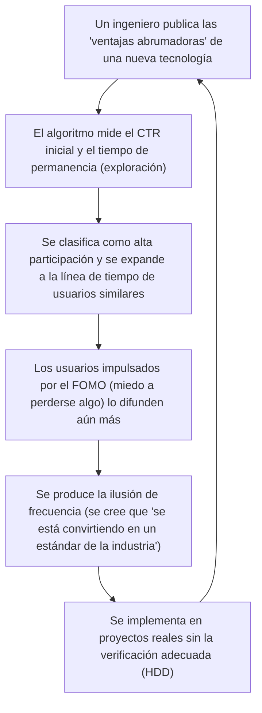

## 1. Introducción: La democratización de la información tecnológica y el ascenso de los algoritmos

En la ingeniería de software moderna, gran parte de la información tecnológica que consumimos a diario proviene de servicios de redes sociales (SNS) como X (anteriormente Twitter), Hacker News, Reddit, LinkedIn y agregadores de noticias. Hubo una época en la que recopilábamos información de forma autónoma y cronológica a través de listas de correo, blogs administrados por expertos específicos o lectores de RSS. Sin embargo, con el aumento explosivo de los marcos de trabajo (frameworks) y herramientas que se crean cada día, para optimizar nuestros limitados recursos cognitivos (tiempo disponible y capacidad de atención), se ha vuelto común delegar la selección de información a los "algoritmos de recomendación (Recommendation Algorithms)" proporcionados por las plataformas.

Este cambio de paradigma ha traído consigo enormes beneficios, al permitirnos descubrir eficientemente artículos técnicos valiosos y proyectos innovadores de código abierto. Pero por otro lado, también ha provocado un efecto secundario extremadamente grave. Se trata del hecho de que **"las tendencias tecnológicas y mejores prácticas que vemos no están determinadas por su superioridad técnica pura o evaluación objetiva, sino que son distorsionadas por la 'función de optimización de la participación (engagement)' del algoritmo"**.

En este artículo, desentrañaremos matemática y estructuralmente cómo los avanzados algoritmos de aprendizaje automático que operan detrás de las redes sociales dan forma a nuestra cognición e influyen en nuestra toma de decisiones en la selección de tecnologías. Además, examinaremos en profundidad los peligros del "Hype Driven Development (HDD: Desarrollo impulsado por el hype/la exageración)", que nos hace dejarnos llevar por el fervor generado por los algoritmos, y los enfoques específicos para escapar de esto y realizar una selección tecnológica objetiva y robusta.

---

## 2. Evolución y mecanismos de los algoritmos de recomendación

Cuando abrimos una red social, el contenido que se muestra en nuestra línea de tiempo (feed) no es aleatorio. Existen modelos de aprendizaje automático altamente ajustados para maximizar el tiempo de permanencia del usuario y mejorar los ingresos publicitarios. En primer lugar, veamos las tecnologías fundamentales que componen esto.

### 2.1 Filtrado Colaborativo (Collaborative Filtering) y Factorización de Matrices

Una tecnología que ha funcionado como una poderosa línea base desde los albores de los sistemas de recomendación hasta la actualidad es el "filtrado colaborativo". En particular, se utiliza ampliamente la "Factorización de Matrices (Matrix Factorization)", que representa las interacciones entre usuarios y artículos (publicaciones o artículos) como una matriz y las mapea en un espacio de características latentes.

Dado un número de usuarios $M$ y un número de artículos $N$ con una matriz de calificaciones $R \in \mathbb{R}^{M \times N}$, la factorización de matrices aproxima esta enorme y escasa (sparse) matriz al producto de una matriz de características latentes de baja dimensión $U \in \mathbb{R}^{M \times K}$ (características del usuario) y $V \in \mathbb{R}^{N \times K}$ (características del artículo) (con $K \ll M, N$).

$$
R \approx U \times V^T
$$

La puntuación predicha (probabilidad de interacción) $\hat{r}_{ij}$ de un usuario específico $i$ para un artículo $j$ se calcula como el producto escalar de sus respectivos vectores de características latentes.

$$
\hat{r}_{ij} = \mathbf{u}_i \cdot \mathbf{v}_j
$$

Este modelo se entrena para minimizar la siguiente función de pérdida ($\lambda$ es un término de regularización para prevenir el sobreajuste).

$$
\mathcal{L} = \sum_{(i,j) \in \Omega} (r_{ij} - \mathbf{u}_i \cdot \mathbf{v}_j)^2 + \lambda (\|\mathbf{u}_i\|^2 + \|\mathbf{v}_j\|^2)
$$

**Impacto en la selección tecnológica:**
Este algoritmo acerca en el espacio latente a la "Persona A, interesada en [Rust](https://kenji.blog/es/p/webassembly-wasm-current-future/)" y a la "Persona B, interesada en Rust". Si la Persona A da "Me gusta" a una publicación sobre un nuevo framework web, es muy probable que la publicación de ese framework también aparezca en la línea de tiempo de la Persona B. Como resultado, ocurre el fenómeno en el que una tecnología específica se vuelve localmente muy popular dentro de un grupo de ingenieros que prefieren una pila tecnológica particular.

### 2.2 Modelos de recomendación usando Aprendizaje Profundo (DLRM)

En los últimos años, arquitecturas basadas en aprendizaje profundo, representadas por el Deep Learning Recommendation Model (DLRM), se han popularizado, impulsadas principalmente por empresas como Meta (anteriormente Facebook). El DLRM recibe una amplia variedad de características (Features) como entrada, tales como el historial de comportamiento del usuario y los metadatos del artículo, para predecir la tasa de clics (CTR: Click-Through Rate) y similares.

La característica del DLRM radica en convertir características categóricas dispersas (ej.: ID de usuario, hashtags seguidos) en vectores densos (Dense Vector) a través de "tablas de incrustación (Embedding Table)", y combinarlas con características densas de valores continuos (ej.: días desde la apertura de la cuenta, tiempo de permanencia promedio pasado).

$$
\mathbf{e}_{\text{sparse}} = \text{EmbeddingLookup}(\mathbf{x}_{\text{sparse}})
$$
$$
\mathbf{h}_{\text{dense}} = \text{BottomMLP}(\mathbf{x}_{\text{dense}})
$$

Después de combinarlas (Concatenate) o interactuar entre ellas mediante productos escalares (Feature Interaction), se introducen en un Perceptrón Multicapa superior (Top MLP), y finalmente se emite la probabilidad final como el CTR mediante la función sigmoide $\sigma$.

$$
\hat{y} = \sigma(\text{TopMLP}(\text{Interact}(\mathbf{e}_{\text{sparse}}, \mathbf{h}_{\text{dense}})))
$$

**Impacto en la selección tecnológica:**
Estos enormes modelos como DLRM capturan incluso las señales más mínimas (por ejemplo, un ligero aumento en el tiempo de permanencia en "publicaciones con videos" o "publicaciones que contienen una palabra de moda específica") y las reflejan en la puntuación de predicción. Como resultado, la información tecnológica que incluye "títulos provocativos (ej.: 'React es obsoleto', 'El fin de los microservicios')" o "demostraciones visualmente llamativas" tiende a ser favorecida algorítmicamente.

### 2.3 Aprendizaje por Refuerzo y el Problema del Tragamonedas de Múltiples Brazos (Multi-Armed Bandits)

Los sistemas de recomendación deben explorar constantemente las preferencias más recientes de los usuarios. Aquí es donde entra en juego el "problema del tragamonedas de múltiples brazos (Multi-Armed Bandit)". Optimiza el equilibrio entre la "Explotación (Exploitation)", que presenta contenido seguro basado en las preferencias existentes, y la "Exploración (Exploration)" para descubrir nuevas tendencias.

En el algoritmo representativo UCB (Upper Confidence Bound), la puntuación al seleccionar un brazo (grupo de contenidos) $a$ en el tiempo $t$ se calcula de la siguiente manera:

$$
a_t = \arg\max_{a} \left( \hat{\mu}_a + c \sqrt{\frac{\ln t}{N_a(t)}} \right)
$$

Donde $\hat{\mu}_a$ es la recompensa promedio (tasa de participación) del brazo $a$ hasta ahora, $N_a(t)$ es el número de veces que ha sido seleccionado, y $c$ es un parámetro que ajusta el grado de exploración.

**Impacto en la selección tecnológica:**
El algoritmo otorga temporalmente una bonificación de exploración a publicaciones sobre nuevos frameworks o bibliotecas (aquellas con un número de intentos $N_a(t)$ bajo) y las expone a grupos de usuarios aleatorios. Si la reacción de los influencers es positiva en esta "fase de exploración" inicial, $\hat{\mu}_a$ aumenta drásticamente y se convierte rápidamente en viral (buzz). Este es el mecanismo de "de repente, todos empiezan a hablar sobre esa tecnología".

---

## 3. Las matemáticas de las cámaras de eco y las burbujas de filtro

A medida que avanza la optimización de los algoritmos, los usuarios se ven rodeados únicamente de "información con la que se sienten cómodos o que refuerza sus creencias existentes". Este es el fenómeno de la **Cámara de Eco (Echo Chamber)** y la **Burbuja de Filtro (Filter Bubble)**.

En la teoría de redes, la tendencia de individuos similares a conectarse entre sí se llama "Homofilia (Homophily)". En un grafo $G=(V, E)$, las aristas (relaciones de seguimiento o propagación de información) entre los nodos (usuarios) tienen más probabilidades de formarse cuanto mayor sea la similitud de sus atributos.

Los algoritmos de recomendación de las redes sociales aceleran artificialmente esta homofilia. Por ejemplo, supongamos que hay una comunidad de ingenieros que promueven la "arquitectura sin servidor ([Serverless](https://kenji.blog/es/p/serverless-architecture-aws-lambda-cold-start/))" y una comunidad que apoya el "bare metal on-premise". El algoritmo aprenderá a reducir el peso de las aristas entre diferentes comunidades (Cross-cutting ties) y fortalecer las aristas dentro de la misma comunidad (porque las opiniones opuestas a menudo provocan abandono y corren el riesgo de reducir el nivel de participación. O por el contrario, a veces provocan participación a través de una ira extrema, pero en la comunidad técnica, prevalece la primera tendencia).

Como resultado, se crea una realidad tecnológica completamente fragmentada, donde en tu línea de tiempo parece que "las empresas de todo el mundo están migrando a serverless", mientras que en la línea de tiempo de otra persona parece que "el abandono de la nube (Cloud Repatriation) es la tendencia global".

---

## 4. Desarrollo Impulsado por el Hype (HDD) creado por algoritmos

La combinación de cámaras de eco y poderosos modelos de recomendación provoca uno de los mayores antipatrones en la industria de la ingeniería: el **Desarrollo Impulsado por el Hype (Hype Driven Development)**. El HDD es el fenómeno de adoptar nuevas tecnologías simplemente porque "son populares en las redes sociales" o "son la última tendencia", sin considerar profundamente los méritos reales, los compromisos técnicos o su adecuación a los requisitos comerciales de la empresa.

El siguiente diagrama de Mermaid muestra cómo el algoritmo de las redes sociales impulsa el ciclo de retroalimentación del HDD.



Lo aterrador de este ciclo es que el **"Fenómeno de Baader-Meinhof (ilusión de frecuencia)"** es provocado intencionalmente por el algoritmo. Una vez que ves el nombre de una nueva biblioteca de gestión de estado, el algoritmo lo toma como una señal y, a partir del día siguiente, inunda tu feed de noticias con discusiones sobre esa biblioteca. El cerebro humano percibe erróneamente esto como una "tendencia mundial masiva".

El siguiente gráfico muestra la diferencia en el ciclo de vida entre una tecnología excesivamente promocionada (hypeada) en las redes sociales y una tecnología robusta pero sobria y aburrida (Boring Technology).

```mermaid
xychart-beta
    title Ciclo de vida de la tecnología y evolución de su evaluación
    x-axis ["0 meses", "6 meses", "12 meses", "18 meses", "24 meses", "30 meses", "36 meses"]
    y-axis "Menciones / Nivel de entusiasmo en RRSS" 0 --> 100
    line [10, 85, 95, 45, 20, 10, 5]
    line [15, 20, 25, 35, 50, 65, 80]
```
*(Nota: En el gráfico anterior, la línea que sube y baja bruscamente representa la "Tecnología Hypeada", mientras que la línea que sube lenta pero constantemente representa la "Boring Technology" o tecnología aburrida).*

La tecnología hypeada enfrenta problemas reales como "falta de documentación", "errores graves en casos extremos" y "agotamiento (burnout) de los mantenedores" de 6 a 12 meses después de su adopción, desapareciendo rápidamente de las redes sociales. Sin embargo, el costo de eliminar la deuda técnica de una tecnología una vez incorporada en el sistema es enorme.

---

## 5. Estrategias para "escapar del algoritmo" en la selección tecnológica

Entonces, ¿cómo podemos realizar selecciones tecnológicas objetivas y racionales bajo el dominio de estos algoritmos? Aquí presentamos algunas estrategias específicas no para hackear el algoritmo, sino para "bajarse" de él.

### 5.1 Regreso a las fuentes de información primarias: Código fuente y RFC

La defensa más segura es cambiar nuestras fuentes de información, pasando de la agregación de las redes sociales a la **información primaria (Primary Sources)**.

1. **Leer el código fuente:** En lugar de creer en una publicación de redes sociales que dice que "esta biblioteca es extremadamente rápida", abre su repositorio en GitHub y verifica la complejidad computacional de la lógica central y sus mecanismos de asignación de memoria.
2. **Seguir los RFC (Request for Comments):** Muchos proyectos maduros de código abierto (React, [Rust](https://kenji.blog/es/p/webassembly-wasm-current-future/), Python, etc.) adoptan el proceso de RFC al introducir nuevas características. En el RFC se documentan aspectos lógicos de manera desapasionada sin importar la participación algorítmica: "¿Por qué es necesaria esta característica?", "¿Cuáles son los compromisos técnicos en el diseño?" y "¿Cuáles son las alternativas?". Aquí es donde reside el verdadero valor técnico.

### 5.2 Lectura cuidadosa de artículos académicos (Academic Papers) y Whitepapers

Para selecciones tecnológicas fundamentales como sistemas distribuidos, bases de datos o la arquitectura de modelos de aprendizaje automático, no se deben leer resúmenes de unas pocas líneas en redes sociales, sino los artículos publicados en ACM, IEEE o arXiv, o los informes detallados (Whitepapers) publicados por empresas (ej.: el artículo de Spanner de Google, el artículo de Dynamo de Amazon).

Las publicaciones en redes sociales están optimizadas para "captar la atención del lector", mientras que los artículos académicos revisados por pares están optimizados para "la precisión y reproducibilidad de los hechos". Sus funciones de evaluación son completamente diferentes.

### 5.3 Construcción de un marco para la toma de decisiones dentro de la organización

Para evitar el HDD a nivel de equipo y de organización, se necesita un proceso que elimine las intuiciones personales y razones como "porque lo vi en Twitter". El mejor ejemplo de esto es la adopción del **ADR (Architecture Decision Records)**.

Al introducir una nueva tecnología, los siguientes puntos deben documentarse obligatoriamente y ser revisados:
* **Context (Contexto):** ¿Por qué se necesita una nueva tecnología? ¿Cuáles son los desafíos actuales?
* **Decision (Decisión):** ¿Qué se adoptará?
* **Consequences (Consecuencias):** ¿Cuáles son los compromisos técnicos? (¿Qué se sacrifica para obtener qué?)

Forzar este proceso permite transformar el "Hype (entusiasmo)" en "Engineering (ingeniería)".

### 5.4 La filosofía del Club de la Tecnología Aburrida (Boring Technology Club)

Existe un famoso mantra en la comunidad técnica: **"Choose Boring Technology" (Elige la tecnología aburrida)**. Esta es una enseñanza de que no se deben desperdiciar las fichas de innovación (innovation tokens, los recursos limitados que una organización puede gastar en tecnología nueva y desconocida) en la elección de infraestructuras o frameworks que no están directamente vinculados con el valor fundamental del negocio.

El algoritmo de las redes sociales prefiere la "novedad". Sin embargo, lo que se necesita para construir sistemas robustos que puedan soportar la operación real son tecnologías "aburridas" (como PostgreSQL, Redis, APIs REST estándar, etc.) que tienen más de 10 años de experiencia operativa y cuyos procedimientos de recuperación en caso de fallos arrojan millones de resultados en búsquedas en Google.

---

## 6. Conclusión: Cómo debemos relacionarnos con la tecnología

Los algoritmos de recomendación de las redes sociales son herramientas poderosas que amplían nuestras perspectivas técnicas y nos permiten conocer a excelentes comunidades. Sin embargo, dado que su estructura interna (factorización de matrices, DLRM, tragamonedas de múltiples brazos) tiene la misión suprema de "maximizar la participación", la información producida tendrá un sesgo inevitable.

Necesitamos desarrollar una alfabetización (literacy) que nos permita tratar la información que fluye en nuestras líneas de tiempo no como "hechos" o "tendencias absolutas", sino como una "señal" más.

Salir de la cámara de eco, leer el código fuente con nuestras propias manos, seguir los debates de RFC, decodificar las fórmulas en artículos académicos y enfrentar los verdaderos desafíos de nuestro propio dominio empresarial. Ese es el único camino para practicar una verdadera ingeniería de software sin ser devorado por la ola de los algoritmos.


